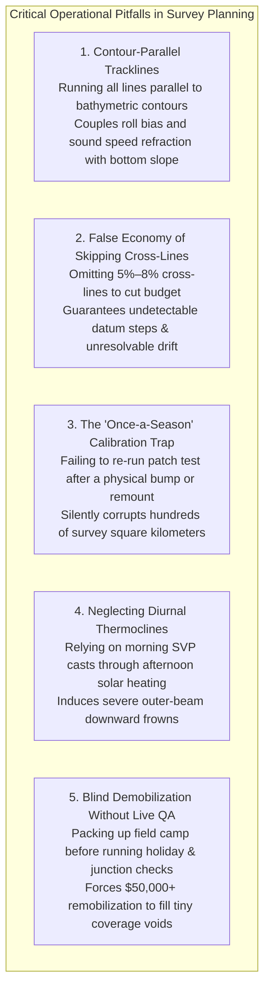

# Chapter 13: Survey Planning for Calibration, Error Reduction, and Monitoring

*How to design data acquisition in the field so systematic biases become mathematically observable, separable, and self-correcting.*

---

## 13.7 Common Pitfalls and Key Takeaways

Survey planning is the first and most critical filter in the elevation modeling pipeline. Flaws introduced during acquisition cannot be fixed with software filters. Understanding real-world operational pitfalls ensures that surveys are designed for mathematical observability, environmental compliance, and cost efficiency.

---

### 13.7.1 Common Pitfalls in Survey Planning and Execution

#### 1. Running Survey Lines Parallel to Bathymetric Contours
Surveying along depth contours (e.g., following the $100\text{-m}$ depth contour along a continental slope) seems intuitive for maintaining constant swath width. However, this creates a catastrophic mathematical pitfall:
* When a vessel sails parallel to a steep slope, the upslope outer beams consistently measure shallower water while the downslope beams measure deeper water.
* Any uncalibrated platform **roll misalignment** ($\Delta \phi$) tilts the swath across the slope, mimicking a steeper or gentler gradient.
* Worse, sound speed refraction errors (smiles and frowns) become asymmetric across the slope.
* Hydrographers must orient primary survey tracks **perpendicular (orthogonal) to the bathymetric depth contours** whenever possible, ensuring that both the port and starboard swaths experience symmetric depth variations.

#### 2. The False Economy of Skipping Cross-Lines
Under tight field schedules or budget constraints, project managers often attempt to save $5\text{–}8\%$ of vessel time or flight fuel by omitting cross-lines. This is one of the most expensive mistakes in geospatial surveying:
* Without cross-lines, parallel production swaths share common environmental and sensor drifts.
* If a base station antenna height was misentered by $0.30\text{ m}$, or if an unmodeled tidal phase lag occurred between two survey days, the resulting vertical offset between adjacent lines cannot be diagnosed.
* Skipping cross-lines saves a trivial fraction of acquisition cost but risks the complete rejection of multi-million-dollar datasets by commissioning agencies (e.g., NOAA, USGS, USACE).

#### 3. The "Once-a-Season" Patch Test Trap
Assuming that a boresight alignment or multibeam patch test conducted at the start of a six-month field season remains valid indefinitely is a pervasive operational failure:
* Vessel hull flexure, thermal cycling, grounding on a sandbar, rough seas, or equipment maintenance (e.g., unbolting an IMU or replacing a laser scanner head) alters angular alignments by hundredths or tenths of a degree.
* Standard procedures mandate an immediate patch test **whenever any component of the positioning, attitude, or acoustic/optical sensor chain is touched, adjusted, or subjected to mechanical shock**, as well as periodic mid-season verification.

#### 4. Neglecting Afternoon Solar Thermocline Shifts
Conducting a single sound speed profile at 08:00 and relying on it for the remainder of the day is a classic rookie error:
* By 14:00, intense solar radiation heats the upper $2\text{–}5\text{ m}$ of the ocean or lake surface, increasing surface sound speed by $5\text{–}10\text{ m/s}$.
* Acoustic rays steered into this warm surface layer refract sharply downward, causing the outer edges of the bathymetric swath to curve downward into deep, artificial trenches ("frowns").
* Failure to deploy regular SVP casts or monitor surface sound speed sensors guarantees severe outer-beam striping in the final DEM.

#### 5. Demobilizing Before Completing Full In-Situ QA
Packing up aircraft, shipping survey vessels, and releasing field crews before running automated holiday-finding and cross-line junction statistics on the raw data is a recipe for disaster:
* Small navigation deviations, cloud shadows, or acoustic dropouts inevitably leave narrow gaps ("holidays") between swaths.
* Discovering a $10\text{-meter}$ wide holiday in an office cubicle 3,000 miles from the field site leaves only two choices: leave an embarrassing void in a public product, or spend tens of thousands of dollars to remobilize aircraft and crew.

---

### 13.7.2 Key Takeaways for Survey Planners

1. **Geometry Controls Physics:** Systematic sensor biases (roll, pitch, yaw, latency) can only be isolated and solved if the flight or vessel trajectory forces their residual signatures into opposite directions. Plan your maneuvers to satisfy the mathematical rank requirements of the normal equations.
2. **Cross-Lines Are Essential Insurance:** Cross-lines representing $5\text{–}10\%$ of total mileage provide the only objective mechanism for decoupling temporal environmental drift from true geographic topography.
3. **Align Data Acquisition with Environmental Windows:** Respect space weather (PDOP, scintillation), solar illumination ($30^\circ\text{–}45^\circ$ windows), tidal phases (synchronizing boat and LiDAR data across the intertidal zone), and thermal water stratification.
4. **Audit in Real Time:** Use live Total Propagated Uncertainty (TPU) heatmaps and automated holiday detectors during acquisition. Never leave a field site until every junction discrepancy is verified and every data gap is closed.
