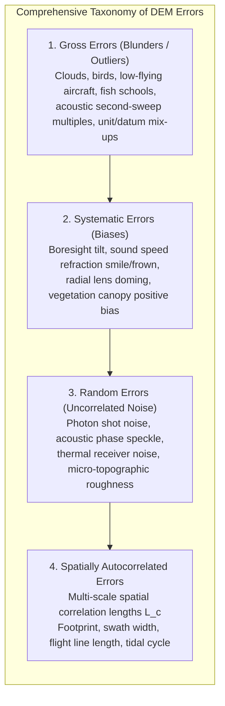
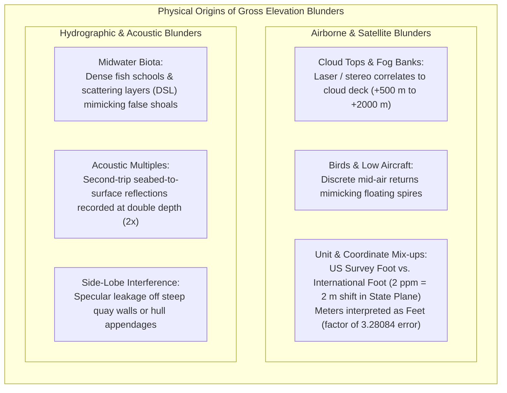
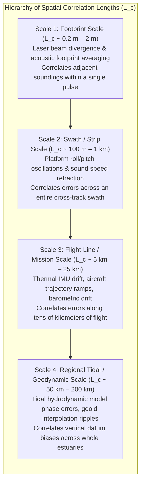
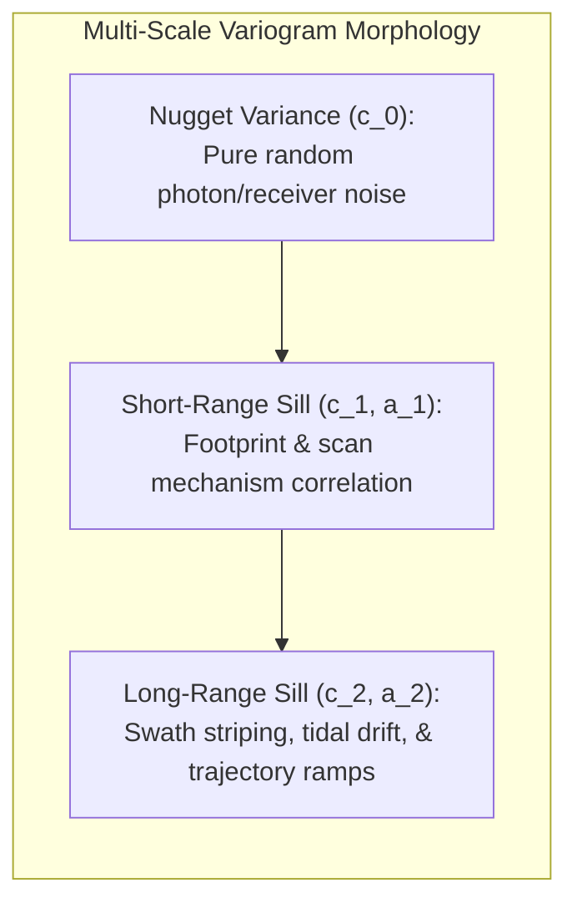

# Chapter 14: Error Theory, Total Propagated Uncertainty (TPU), and Forensic Evaluation of Third-Party DEMs

*Quantifying what we know, what we don't know, and how to audit someone else's DEM when you don't have the raw data or metadata.*

Every digital elevation model is an imperfect numerical approximation of continuous physical topography. Whether produced by orbital radar, airborne laser scanning, drone photogrammetry, or multibeam sonar, all elevation datasets contain a complex superposition of measurement uncertainties. Understanding the statistical and spatial architecture of these errors—and mastering forensic techniques to audit third-party data when raw sensor telemetry is absent—is essential for engineering design, scientific research, and hazard mitigation.

---

## 14.1 Taxonomy of DEM Errors

In classical error theory, spatial measurement errors are partitioned into three distinct classes: **gross errors (blunders)**, **systematic errors (biases)**, and **random errors (noise)**. However, in digital elevation and bathymetric modeling, an indispensable fourth category must be recognized: **spatially autocorrelated errors**.

---

### 14.1.1 Gross Errors (Blunders / Outliers)

Gross errors are non-stochastic, extreme anomalies caused by transient physical obstructions, detector failures, or operator blunders:

* **Transient Atmospheric and Marine Obscurations:** In airborne LiDAR and photogrammetry, low-lying cloud decks, smoke, and migrating bird flocks reflect optical energy, creating false elevated surfaces. In hydrography, dense pelagic fish schools, deep scattering layers (DSL), and marine mammals reflect acoustic pings, generating dangerous false shoals.
* **Acoustic Multiples:** Sound energy bouncing from the seabed to the water surface and back to the seabed before returning to the transducer creates a "second-trip" echo. If not rejected, it creates an artificial, phantom seabed at exactly twice ($2\times$) the true water depth.
* **Human and Algorithmic Blunders:** Mixing vertical or horizontal units is a notorious blunder: interpreting a DEM in U.S. Survey Feet as International Feet creates an immediate horizontal shift of several meters in State Plane coordinates, while confusing ellipsoidal height ($h$) with orthometric height ($H$) produces vertical errors of $20\text{–}50\text{ m}$.

---

### 14.1.2 Systematic Errors (Biases)

Systematic errors follow predictable physical laws and geometric relationships. If the physical sensor model is known, systematic errors can be modeled and eliminated; if uncalibrated, they warp the geometry of the entire elevation model.

| Systematic Bias Type | Physical / Sensor Mechanism | Resulting Surface Artifact in DEM | Diagnostic Signature |
| :--- | :--- | :--- | :--- |
| **Boresight Roll ($\Delta \phi$)** | Angular mounting tilt between IMU and scanner head | Adjacent swaths scissor vertically; cross-track step seams | Sawtooth profiles across overlapping flight/vessel tracks |
| **Boresight Pitch ($\Delta \omega$)** | Longitudinal angular mounting misalignment | Displaces apparent terrain along-track ($\Delta y = H \tan\Delta\omega$) | Double-imaging of ridges, buildings, and shipwrecks |
| **Sound Speed Smile / Frown** | Mismatch between surface sound speed and water column | Outer beams curve upward (smile) or downward (frown) | Transverse parabolic corrugations along swath margins |
| **Radial Lens Doming** | Uncompensated radial camera lens distortion ($k_1, k_2$) | Flat terrain bows upward into a dome or downward into a bowl | Concentric circular elevation contours centered on image block |
| **Vegetation Canopy Bias** | Laser pulses or stereo rays fail to reach bare mineral soil | DEM elevated by $0.2\text{–}1.5\text{ m}$ above true ground level | Positive elevation offset correlating with canopy cover |
| **Datum Separation Bias** | Missing or incorrect geoid/separation model ($N$) | Uniform vertical offset across entire project boundary | Constant offset when compared against ellipsoidal GNSS |

---

### 14.1.3 Random Errors (Uncorrelated Noise)

Random errors arise from fundamental physical fluctuations in the sensing apparatus and the environment:
* **Photon Shot Noise and Laser Speckle:** In optical and LiDAR sensors, the Poisson arrival statistics of individual photons at the avalanche photodiode (APD) detector introduce high-frequency range jitter ($1\text{–}3\text{ cm}$).
* **Acoustic Phase Interference:** In multibeam interferometric and phase-detection systems, overlapping echoes from multiple acoustic scatterers within the bottom footprint induce Rayleigh phase noise.
* **Micro-Topographic Surface Roughness:** Natural gravel, cobbles, and micro-vegetation create high-frequency surface height variations that cannot be decoupled from pure sensor noise at the single-sounding scale.

Random errors have a mean of zero ($\mathbb{E}[\epsilon] = 0$) and can be suppressed by spatial binning, moving-average filters, or least-squares gridding ($\sigma_{\text{mean}} = \sigma / \sqrt{N}$).

---

### 14.1.4 Spatially Autocorrelated Multi-Scale Errors

The most dangerous assumption in spatial analysis is treating DEM errors as **independent and identically distributed (i.i.d.) Gaussian white noise**:

$$\epsilon(\mathbf{x}) \sim \mathcal{N}(0, \sigma^2) \quad \text{with } \operatorname{Cov}(\epsilon(\mathbf{x}_i), \epsilon(\mathbf{x}_j)) = 0 \quad \text{for } i \neq j \quad \text{(FALSE!)}$$

In real-world elevation models, errors are **spatially autocorrelated across multiple physical scales**:

#### The Spatial Semivariogram of DEM Error
The spatial structure of DEM error is characterized by the empirical semivariogram $\gamma(h)$:

$$\gamma(h) = \frac{1}{2 N(h)} \sum_{i=1}^{N(h)} \left( e(\mathbf{x}_i + h) - e(\mathbf{x}_i) \right)^2$$

where $e(\mathbf{x}) = z_{\text{DEM}}(\mathbf{x}) - z_{\text{true}}(\mathbf{x})$ is the elevation error and $h$ is spatial lag distance.

#### Why Spatial Autocorrelation Matters for Terrain Derivatives
If elevation errors were truly uncorrelated white noise, computing the spatial derivative (slope $\|\nabla z\|$ or curvature $\nabla^2 z$) over a grid spacing $\Delta x$ would cause errors to cancel out over distance. 

However, because errors are autocorrelated over long distances, systematic elevation ramps produce persistent, biased slope errors across entire watersheds. Furthermore, when computing volumetric cut-and-fill balances over an area $A = M \times \Delta x^2$, the standard error of total volume $V = \sum \Delta z_i \Delta x^2$ does not diminish as $1/\sqrt{M}$. Instead, it is governed by the double spatial integral of the covariance function $C(h)$:

$$\sigma_V^2 = \iint_A \iint_A C(\|\mathbf{x}_1 - \mathbf{x}_2\|) \, d\mathbf{x}_1 \, d\mathbf{x}_2$$

Ignoring spatial autocorrelation understates the uncertainty of hydrologic watershed models, coastal flood simulations, and earthwork volume estimates by orders of magnitude.
