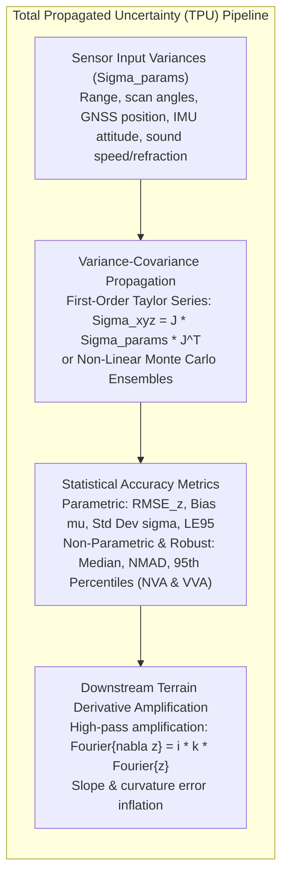
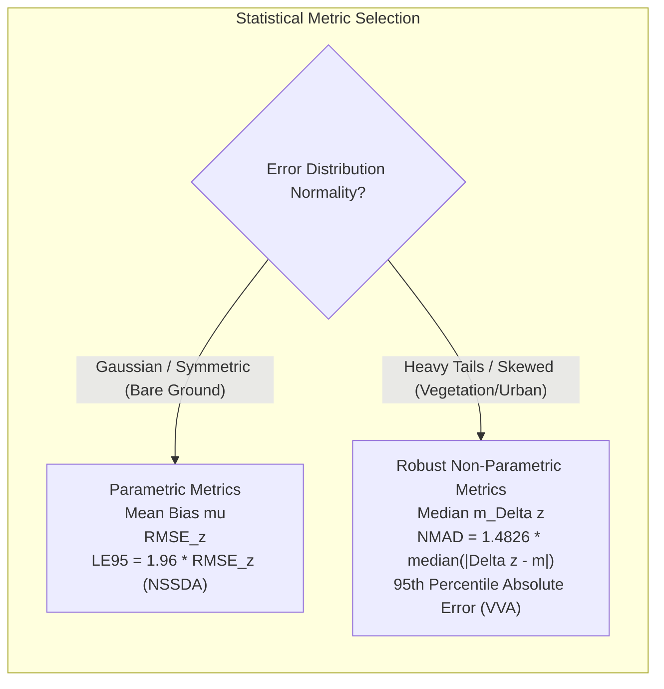
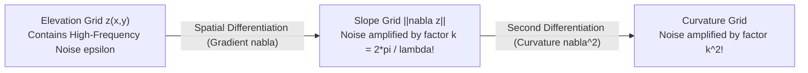

# Chapter 14: Error Theory, Total Propagated Uncertainty (TPU), and Forensic Evaluation of Third-Party DEMs

*Quantifying what we know, what we don't know, and how to audit someone else's DEM when you don't have the raw data or metadata.*

---

## 14.2 Total Propagated Uncertainty (TPU): Horizontal and Vertical Metrics

Quantifying elevation error requires moving beyond qualitative descriptions of accuracy to rigorous mathematical propagation of observation variances through the full geometric sensor model. The resulting error bounds define the **Total Propagated Uncertainty (TPU)**, partitioned into **Total Horizontal Uncertainty (THU)** and **Total Vertical Uncertainty (TVU)**.

---

### 14.2.1 Analytical Covariance Propagation via the Jacobian

The direct georeferencing model maps an input vector of raw physical observations $\mathbf{l} \in \mathbb{R}^n$ (e.g., laser travel times, beam angles, trajectory coordinates, roll, pitch, heading, atmospheric delays) into a 3D ground target coordinate $\mathbf{r} = [X, Y, Z]^T \in \mathbb{R}^3$:

$$\mathbf{r} = \mathbf{f}(\mathbf{l})$$

Let $\boldsymbol{\Sigma}_l$ denote the $n \times n$ variance-covariance matrix of the observation parameters:

$$\boldsymbol{\Sigma}_l = \begin{bmatrix} \sigma_{l_1}^2 & \sigma_{l_1 l_2} & \dots & \sigma_{l_1 l_n} \\ \sigma_{l_2 l_1} & \sigma_{l_2}^2 & \dots & \sigma_{l_2 l_n} \\ \vdots & \vdots & \ddots & \vdots \\ \sigma_{l_n l_1} & \sigma_{l_n l_2} & \dots & \sigma_{l_n}^2 \end{bmatrix}$$

#### The First-Order Taylor Series Propagation
Under the standard law of error propagation (first-order Taylor series approximation), the $3 \times 3$ variance-covariance matrix of the resulting 3D target coordinates $\boldsymbol{\Sigma}_{xyz}$ is:

$$\boldsymbol{\Sigma}_{xyz} = \mathbf{J} \, \boldsymbol{\Sigma}_l \, \mathbf{J}^T$$

where $\mathbf{J}$ is the $3 \times n$ Jacobian matrix of partial derivatives evaluated at the observed parameter values:

$$\mathbf{J} = \frac{\partial \mathbf{f}}{\partial \mathbf{l}} = \begin{bmatrix} \frac{\partial X}{\partial l_1} & \frac{\partial X}{\partial l_2} & \dots & \frac{\partial X}{\partial l_n} \\ \frac{\partial Y}{\partial l_1} & \frac{\partial Y}{\partial l_2} & \dots & \frac{\partial Y}{\partial l_n} \\ \frac{\partial Z}{\partial l_1} & \frac{\partial Z}{\partial l_2} & \dots & \frac{\partial Z}{\partial l_n} \end{bmatrix}$$

From $\boldsymbol{\Sigma}_{xyz}$:
* **Total Vertical Uncertainty (TVU, $1\sigma$):**
  $$\sigma_{\text{vert}} = \sqrt{\boldsymbol{\Sigma}_{xyz}(3, 3)} = \sigma_z$$
* **Total Horizontal Uncertainty (THU, $1\sigma$):**
  $$\sigma_{\text{horiz}} = \sqrt{\boldsymbol{\Sigma}_{xyz}(1, 1) + \boldsymbol{\Sigma}_{xyz}(2, 2)} = \sqrt{\sigma_x^2 + \sigma_y^2}$$

#### Non-Linear Regimes: Monte Carlo and Unscented Transforms
When observing at extreme grazing angles or traversing turbulent water columns with strong acoustic ray refraction, the mapping function $\mathbf{f}(\mathbf{l})$ becomes highly non-linear, causing first-order Taylor expansions to break down. Modern hydrographic and photogrammetric systems deploy:
1. **Unscented Transform (UT):** Propagates a deterministic set of $2n + 1$ "sigma points" through the exact non-linear function, capturing posterior mean and covariance accurately to the third order of the Taylor series without calculating analytic derivatives.
2. **Monte Carlo Realization Ensembles:** Draws thousands of random perturbations from the joint probability density function $p(\mathbf{l})$, evaluating the full ray-tracing and transformation model to construct the empirical empirical error distribution.

---

### 14.2.2 Standardized Accuracy Metrics: Parametric vs. Robust Non-Parametric

Let $\Delta z_i = z_{\text{DEM}, i} - z_{\text{ref}, i}$ denote the vertical error observed at $N$ independent check points.

#### Classical Parametric Metrics
1. **Mean Bias ($\mu_{\Delta z}$):**
   $$\mu_{\Delta z} = \frac{1}{N} \sum_{i=1}^N \Delta z_i$$
2. **Standard Deviation ($\sigma_{\Delta z}$):**
   $$\sigma_{\Delta z} = \sqrt{\frac{1}{N - 1} \sum_{i=1}^N (\Delta z_i - \mu_{\Delta z})^2}$$
3. **Root Mean Square Error ($\text{RMSE}_z$):**
   $$\text{RMSE}_z = \sqrt{\frac{1}{N} \sum_{i=1}^N (\Delta z_i)^2} = \sqrt{\mu_{\Delta z}^2 + \frac{N-1}{N}\sigma_{\Delta z}^2}$$
4. **95% Linear Error (LE95, FGDC NSSDA):** Assuming errors follow an unbiased, zero-mean normal distribution ($\Delta z \sim \mathcal{N}(0, \sigma^2)$):
   $$\text{LE95} = 1.9600 \cdot \text{RMSE}_z$$

#### Robust Non-Parametric Metrics (Höhle & Höhle, 2009)
In real-world elevation models—particularly beneath vegetative canopies or over rugged terrain—elevation errors exhibit heavy, asymmetric tails, large blunders, and multimodal distributions where the Gaussian assumption is violated. 

In these environments, parametric RMSE is heavily corrupted by a few extreme outliers. ASPRS and international standards mandate robust estimators:
1. **Median Error ($m_{\Delta z}$):** A robust estimator of systematic vertical datum bias that is completely immune to up to $50\%$ outlier contamination:
   $$m_{\Delta z} = \operatorname{median}(\{\Delta z_i\})$$
2. **Normalized Median Absolute Deviation (NMAD):** A robust estimator of scale (spread) that is proportional to the median of absolute deviations from the median:
   $$\text{NMAD} = 1.4826 \cdot \operatorname{median}_i \left( \left| \Delta z_i - m_{\Delta z} \right| \right)$$
   *The constant factor $1.4826$ ensures that if the underlying distribution is indeed Gaussian, NMAD equals the standard deviation ($\text{NMAD} = \sigma$). If outliers are present, NMAD remains stable while classical standard deviation explodes.*
3. **Non-Vegetated Vertical Accuracy (NVA) vs. Vegetated Vertical Accuracy (VVA):**
   $$\text{NVA}_{95\%} = 1.9600 \cdot \text{RMSE}_z \quad (\text{parametric, bare ground})$$
   $$\text{VVA}_{95\%} = \operatorname{Percentile}_{95}(\{|\Delta z_i|\}) \quad (\text{non-parametric empirical 95th quantile})$$

---

### 14.2.3 Noise Amplification in Terrain Derivatives

Elevation models are rarely consumed solely as raw heights; they are differentiated to compute fundamental geomorphic and engineering derivatives:
* **Slope (Gradient):** $\nabla z = \left[ \frac{\partial z}{\partial x}, \frac{\partial z}{\partial y} \right]^T$
* **Aspect (Direction):** $\psi = \arctan2\left( -\frac{\partial z}{\partial x}, -\frac{\partial z}{\partial y} \right)$
* **Profile and Planform Curvature:** Second derivatives $\frac{\partial^2 z}{\partial x^2}, \frac{\partial^2 z}{\partial y^2}, \frac{\partial^2 z}{\partial x \partial y}$

#### The High-Pass Nature of Numerical Differentiation
In the spatial frequency domain (Fourier space), the spatial derivative operator corresponds to multiplication by the imaginary wavevector $i \mathbf{k} = i [k_x, k_y]^T$:

$$\mathcal{F}\left\{ \frac{\partial z}{\partial x} \right\} = i k_x \, \mathcal{F}\{z\}(\mathbf{k})$$

where spatial frequency (wavenumber) is $k_x = \frac{2\pi}{\lambda_x}$. 

Because multiplication by $k_x$ scales linearly with spatial frequency:
1. **Low frequencies (broad valleys, regional plains):** $k \approx 0 \implies$ derivative noise is negligible.
2. **High frequencies (grid-scale noise, laser jitter, acoustic speckle):** $k \to k_{\text{Nyquist}} = \frac{\pi}{\Delta x} \implies$ derivative noise is multiplied by $\frac{\pi}{\Delta x}$.

#### Slope Variance on a $3 \times 3$ Finite Difference Stencil
Consider computing directional slope $\frac{\partial z}{\partial x}$ using a standard Horn or Zevenbergen-Thorne $3 \times 3$ finite-difference kernel on a square grid of cell size $\Delta x$. If the elevation noise at each cell has variance $\sigma_z^2$ and spatial autocorrelation $\rho(d)$ at distance $d$:

$$\sigma_{\partial z / \partial x}^2 = \frac{\sigma_z^2}{2 \Delta x^2} \left( 1 - \rho(2\Delta x) \right)$$

$$\sigma_{\|\nabla z\|}^2 = \frac{\sigma_z^2}{\Delta x^2} \left( 1 - \rho(2\Delta x) \right)$$

* **The Grid Spacing Paradox:** As grid cell size $\Delta x$ decreases (e.g., resampling a $5\text{-m}$ DEM down to $0.5\text{-m}$ without true high-frequency content), the denominator $\Delta x^2$ shrinks. If errors between adjacent cells are uncorrelated ($\rho(2\Delta x) \approx 0$), **the slope variance explodes by a factor of 100!** 
* Differentiating an over-resolved, noisy DEM produces a slope map dominated entirely by artificial, salt-and-pepper noise rather than real topography.
