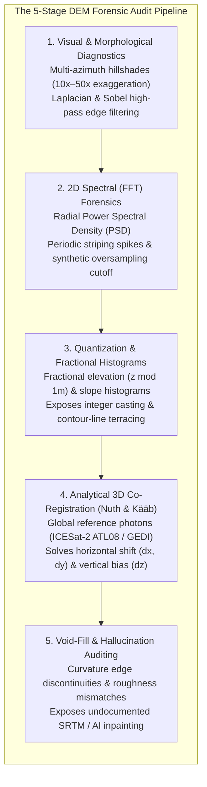
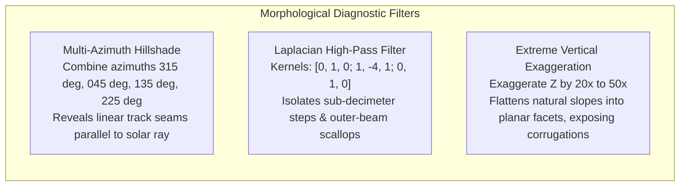
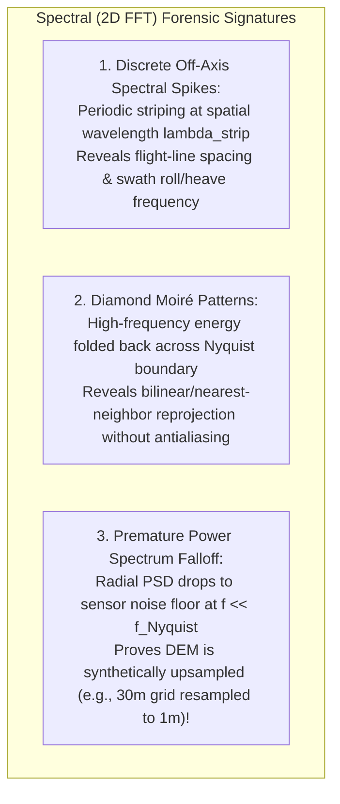
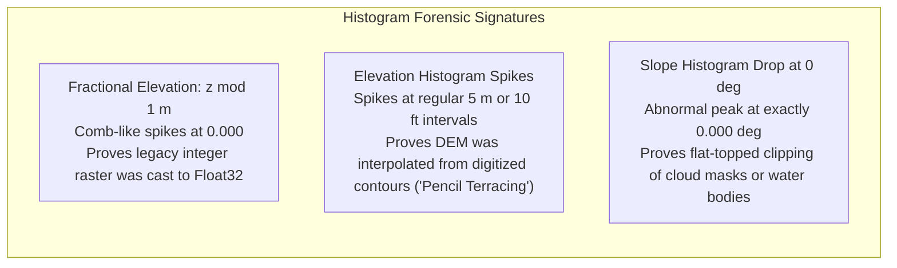
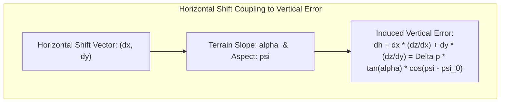
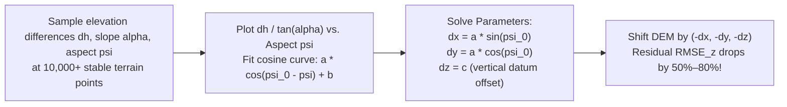

# Chapter 14: Error Theory, Total Propagated Uncertainty (TPU), and Forensic Evaluation of Third-Party DEMs

*Quantifying what we know, what we don't know, and how to audit someone else's DEM when you don't have the raw data or metadata.*

---

## 14.3 Forensic Evaluation: Auditing Third-Party DEMs Without Raw Telemetry

In practical geospatial engineering, practitioners rarely receive raw sensor telemetry, IMU logs, or calibration files. Instead, they are handed a compiled GeoTIFF or Cloud-Optimized GeoTIFF (COG), often accompanied by missing, conflicting, or overly optimistic metadata. Forensic evaluation is the science of reverse-engineering a digital elevation model's acquisition history, hidden blunders, processing artifacts, and geometric shifts using only the gridded surface itself and independent global references.

---

### 14.3.1 Visual and Morphological Diagnostics

The human visual cortex is an extraordinarily sensitive pattern detector when topography is illuminated dynamically:

1. **Multi-Azimuth Hillshading:** Standard single-direction hillshading (conventionally from the northwest at azimuth $315^\circ$) casts illumination parallel to features aligned northwest-southeast, rendering linear strip seams invisible. Multi-azimuth oblique illumination (or Principal Component Analysis of 16 illumination directions) highlights linear features regardless of orientation.
2. **Laplacian High-Pass Filtering:** Convolving the DEM with a $3 \times 3$ discrete Laplacian operator:
   $$\mathbf{K}_{\text{Laplacian}} = \begin{bmatrix} 0 & 1 & 0 \\ 1 & -4 & 1 \\ 0 & 1 & 0 \end{bmatrix}$$
   removes long-wavelength terrain slopes, leaving high-frequency surface discontinuities. Boresight roll errors appear as bright/dark line pairs along flight paths; multibeam refraction frowns appear as regular, scallop-shaped waves along swath boundaries.
3. **Extreme Vertical Exaggeration ($20\times\text{–}50\times$):** Viewing shallow marine shelves or flat alluvial plains at $30\times$ vertical exaggeration amplifies sub-decimeter surface corrugations, immediately exposing dredge drag marks, vessel heave artifacts, or interpolation triangular facets.

---

### 14.3.2 2D Spectral Forensics: Power Spectral Density and Synthetic Oversampling

Fourier transform analysis transforms the 2D elevation grid $z(x, y)$ into the spatial frequency domain:

$$Z(u, v) = \iint_{-\infty}^\infty z(x, y) \, e^{-i 2\pi (u x + v y)} \, dx \, dy$$

The **Power Spectral Density (PSD)** is the squared magnitude $|Z(u, v)|^2$:

#### Detecting Synthetic Oversampling
A common deceptive practice in third-party data distribution is taking a coarse $30\text{-meter}$ DEM (e.g., SRTM or ASTER GDEM), bicubic-spline interpolating it to a $1\text{-meter}$ grid, and advertising it as "1-meter High-Resolution DEM":
* Natural planetary topography follows a power-law scale invariance: the radially averaged Power Spectral Density decays smoothly as $\text{PSD}(f) \propto f^{-\beta}$, where $\beta \approx 2.0\text{–}2.5$ (fractal dimension $D = (7 - \beta)/2$).
* In a genuine high-resolution LiDAR DEM, high-frequency power persists all the way to the grid Nyquist frequency $f_{\text{Nyquist}} = \frac{1}{2\Delta x}$.
* In a synthetically oversampled DEM, the power spectrum exhibits a precipitous, unnatural cliff at the true original resolution (e.g., $f = 1/30\text{ m}^{-1}$), followed by a flat zero-power floor out to $f = 1/1\text{ m}^{-1}$. Computing the 2D FFT unmasks fake resolution instantly.

---

### 14.3.3 Histogram and Quantization Forensics

Plotting the discrete frequency distribution of elevation values and derivatives exposes underlying digitizing and processing history:

1. **The Fractional Elevation Histogram ($z \bmod 1\text{ m}$):** By calculating the modulo remainder $r = z - \lfloor z \rfloor \in [0, 1)$ for every pixel and plotting the distribution:
   * A continuous, modern float32 elevation model produces a completely uniform, flat horizontal distribution across $[0, 1)$.
   * If the histogram exhibits a massive spike at $r = 0.000$, the data was historically quantized as integer meters (or integer feet) and subsequently converted to floating-point numbers without adding precision.
2. **Contour-Line "Pencil Terracing":** Many regional DEMs in developing nations were created by scanning historic paper topographic maps, vectorizing contour lines, and running Delaunay or spline interpolation:
   * The resulting surface suffers from "terracing" (stair-stepping between contours).
   * A histogram of elevation $z$ plotted with fine bins ($0.1\text{-m}$ width) will display sharp, periodic spikes at exactly the contour interval (e.g., $10\text{ m}, 20\text{ m}, 30\text{ m}$ or $20\text{ ft}, 40\text{ ft}, 60\text{ ft}$), proving the surface is not a true continuous remote sensing product.

---

### 14.3.4 Analytical 3D Co-Registration: The Nuth & Kääb (2011) Method

When comparing a third-party DEM against independent reference data (such as spaceborne laser altimeter photons from NASA's ICESat-2 ATL08 or GEDI), direct vertical subtraction produces massive errors if the two surfaces are horizontally misaligned by even a fraction of a pixel.

#### The Universal Co-Registration Equation
Nuth and Kääb (2011) demonstrated that an unmodeled horizontal shift of magnitude $\Delta p = \sqrt{\Delta x^2 + \Delta y^2}$ along direction $\psi_0$, combined with a vertical datum bias $c$, produces a vertical difference $dh = z_{\text{DEM}} - z_{\text{ref}}$ that varies sinusoidally as a function of terrain aspect $\psi$ and slope $\alpha$:

$$\frac{dh}{\tan\alpha} = a \cos(\psi_0 - \psi) + \frac{c}{\tan\alpha}$$

where:
* $a = \Delta p = \sqrt{\Delta x^2 + \Delta y^2}$ is the horizontal displacement magnitude.
* $\psi_0 = \arctan2(\Delta x, \Delta y)$ is the compass direction of the horizontal misregistration.
* $c = \Delta z$ is the constant vertical datum offset (e.g., ellipsoidal-to-orthometric bias).
* $\alpha$ is terrain slope, and $\psi$ is terrain aspect.

By extracting slope and aspect at thousands of points over stable bedrock or non-glaciated, non-vegetated terrain and fitting this closed-form trigonometric relationship, an analyst can solve for sub-pixel horizontal shifts down to $0.05\text{ pixels}$ without needing ground control points!

---

### 14.3.5 Detecting Hallucinations and Undocumented Void Fills

In many commercial and public DEMs, voids caused by cloud obscuration, water bodies, or radar layover/shadow are filled ("void-filled") using external datasets or generative AI inpainting without documenting the patch boundaries in metadata.

#### Forensic Techniques for Unmasking Silent Fills
1. **Curvature Edge Discontinuities:** Computing the profile curvature $\nabla^2 z$ exposes razor-sharp, polygonal boundary seams where external data (e.g., $90\text{-m}$ SRTM) was patched into a $10\text{-m}$ national DEM.
2. **Roughness and Fractal Mismatch:** High-resolution LiDAR terrain exhibits a characteristic micro-roughness (standard deviation of residual elevation in a $5 \times 5$ window $\sigma_{\text{rough}} \approx 0.15\text{–}0.30\text{ m}$). An infilled patch derived from smoothed radar or spline interpolation will suddenly drop to $\sigma_{\text{rough}} < 0.02\text{ m}$, forming an unnaturally glassy, smooth polygon surrounded by textured terrain.
3. **Multi-Temporal Difference Maps against Global Laser Altimetry:** Differencing the DEM against ICESat-2 laser profiles across seasons exposes void-fill artifacts as localized, anomalous vertical steps.
