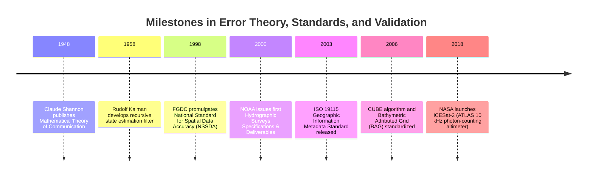
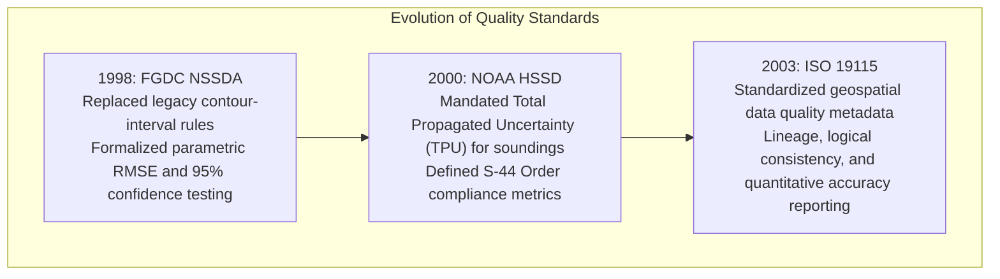

# Chapter 14: Error Theory, Total Propagated Uncertainty (TPU), and Forensic Evaluation of Third-Party DEMs

*Quantifying what we know, what we don't know, and how to audit someone else's DEM when you don't have the raw data or metadata.*

---

## 14.4 Historical Evolution of Error Theory, Geospatial Standards, and Uncertainty Modeling

The discipline of assessing, modeling, and validating elevation uncertainty transitioned across seven decades from abstract mathematical communications theory and aerospace filtering into modern standardized metadata formats and spaceborne photon-counting validation.

---

### 14.4.1 Information Theory and State Estimation (1948–1958)

#### 1948: Claude Shannon and Information Theory
In 1948, Claude Shannon published *A Mathematical Theory of Communication* in the *Bell System Technical Journal*. Shannon formalized the concepts of information entropy, signal-to-noise ratio (SNR), and channel capacity:

$$C = B \log_2\left(1 + \frac{S}{N}\right)$$

In digital elevation modeling, Shannon's sampling theorem established the theoretical limit of surface reconstruction: a continuous terrain profile containing spatial frequencies up to $f_{\max}$ can be reconstructed completely without aliasing if and only if it is sampled at a spatial frequency $f_s \ge 2 f_{\max}$ (the Nyquist rate). Shannon's work established that when a sensor rasterizes topography into discrete pixels or soundings, information lost to noise or sub-Nyquist undersampling can never be mathematically recovered without introducing artificial assumptions.

#### 1958: Rudolf Kálmán and the Kalman Filter
In 1958–1960, mathematician Rudolf E. Kálmán developed the **Kalman filter**—a recursive, linear minimum mean-square error algorithm for estimating the state of a dynamic system from a series of noisy measurements. 

Initially developed for aerospace navigation (powering the Apollo Lunar Module descent computer), the Kalman filter became the mathematical heart of direct sensor georeferencing:
* Fusing high-frequency, drifting accelerometer/gyroscope signals from an IMU with low-frequency, high-accuracy GNSS carrier-phase measurements.
* Propagating the system covariance matrix $\mathbf{P}_{k|k-1}$ through dynamic motion equations, establishing the theoretical framework for real-time Total Propagated Uncertainty (TPU) tracking on mobile mapping platforms.

---

### 14.4.2 Standardizing Spatial Data Accuracy (1998–2003)

#### 1998: FGDC National Standard for Spatial Data Accuracy (NSSDA)
Prior to 1998, elevation accuracy in the United States was governed by the 1947 National Map Accuracy Standards (NMAS), which stated that $90\%$ of tested points must fall within one-half the contour interval (e.g., within $\pm 10\text{ ft}$ for a $20\text{-ft}$ contour map). As digital elevation grids replaced paper contour maps, this metric became useless.

In 1998, the Federal Geographic Data Committee (FGDC) promulgated the **NSSDA** (FGDC-STD-007.3-1998). The NSSDA:
* Eliminated contour-interval dependencies, replacing them with statistical **Root Mean Square Error ($\text{RMSE}_z$)**.
* Standardized reporting at the **$95\%$ confidence level**, defining $\text{Accuracy}_z = 1.9600 \cdot \text{RMSE}_z$ under Gaussian error distributions.
* Mandated testing against an independent check survey of higher accuracy.

#### 2000: NOAA Hydrographic Surveys Specifications and Deliverables (HSSD)
In 2000, NOAA formalised the annual HSSD, translating the International Hydrographic Organization's S-44 accuracy standards into rigorous operational mandates. For the first time, hydrographic mapping contracts required that every single acoustic sounding in a digital delivery contain an explicit calculation of Total Horizontal Uncertainty (THU) and Total Vertical Uncertainty (TVU).

#### 2003: ISO 19115: Geographic Information — Metadata
In 2003, the International Organization for Standardization published **ISO 19115:2003**, establishing the international schema for geospatial metadata:
* Structured data quality into five formal elements: completeness, logical consistency, positional accuracy, temporal accuracy, and thematic accuracy.
* Required explicit **data lineage** tracing: logging every sensor model, transformation parameter, and geoid model used in the production of a digital elevation model.

---

### 14.4.3 Statistical Surface Modeling and Global Spaceborne Truth (2006–2018)

#### 2006: The CUBE Algorithm and the BAG Format
In 2006, the Open Navigation Surface (ONS) working group—a consortium of NOAA, the U.S. Navy, the Canadian Hydrographic Service, and academic institutions—standardized the **Bathymetric Attributed Grid (BAG)** format and integrated the **CUBE (Combined Uncertainty and Bathymetry Estimator)** algorithm:
* Developed by Brian Calder and Larry Mayer at CCOM/JHC, CUBE broke with traditional deterministic grid averaging. 
* CUBE treats each incoming sounding as a Gaussian probability distribution with known TPU. Using a recursive multi-hypothesis tracking engine, it dynamically tracks multiple potential seabed elevations at each grid node. When conflicting acoustic returns occur (e.g., from fish schools or multiple bounces), CUBE maintains parallel hypotheses until subsequent pings provide sufficient statistical weight to resolve the true surface.
* The BAG format enshrined this by storing two coupled raster layers inside an open HDF5 container: an **Elevation** grid and an identical, co-registered **Uncertainty** grid.

#### 2018: ICESat-2 and the Era of Global Photon Validation
On September 15, 2018, NASA launched the **Ice, Cloud, and land Elevation Satellite-2 (ICESat-2)**, carrying the Advanced Topographic Laser Altimeter System (ATLAS). 

ATLAS marked a revolution in global elevation validation:
* Operating at $532\text{ nm}$ (green) with a $10\text{ kHz}$ repetition rate, ATLAS fires six separate laser beams arranged in three pairs, measuring individual photon time-of-flight with picosecond precision ($<800\text{ ps}$).
* Generating laser footprints of approximately $11\text{ m}$ diameter spaced every $0.7\text{ m}$ along-track, ICESat-2 achieves an absolute vertical accuracy of **$<5\text{–}10\text{ cm}$** globally.
* Products like **ATL08 (Land and Vegetation Elevation)** and **ATL03 (Global Geolocated Photons)** provide an uncorrupted, globally accessible "spaceborne ground truth" network. For the first time in geospatial history, analysts auditing third-party DEMs anywhere on Earth can extract coincident ICESat-2 ground photons to compute absolute vertical datum offsets and verify terrain fidelity without setting foot in the field.
