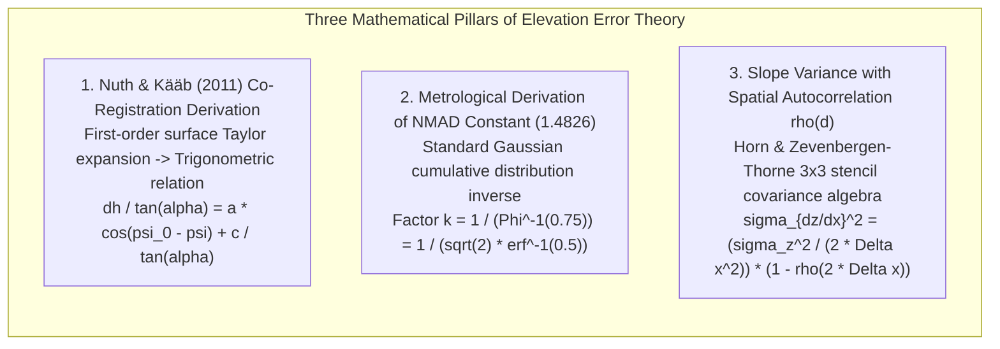
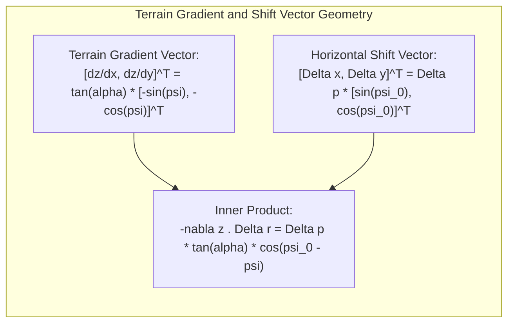
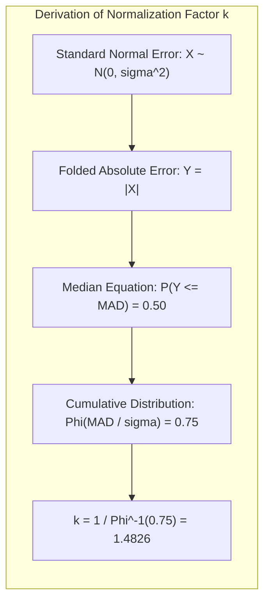
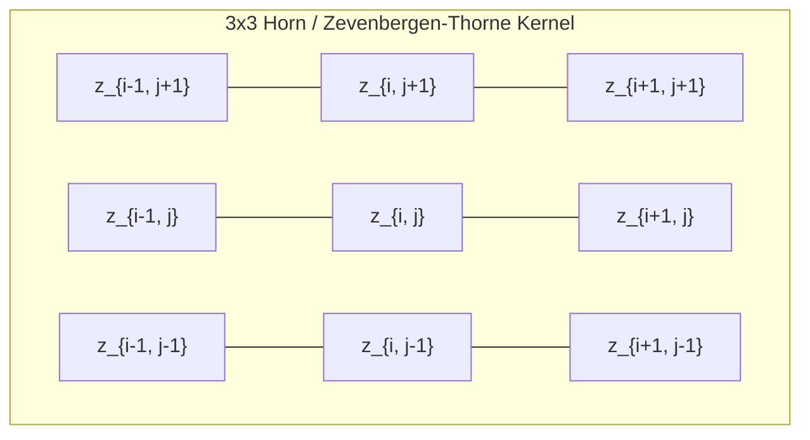

# Chapter 14: Error Theory, Total Propagated Uncertainty (TPU), and Forensic Evaluation of Third-Party DEMs

*Quantifying what we know, what we don't know, and how to audit someone else's DEM when you don't have the raw data or metadata.*

---

## 14.5 Mathematical Foundations of Elevation Error Analysis and Co-Registration

This section provides complete, closed-form derivations for three essential mathematical tools in elevation uncertainty modeling: the Nuth and Kääb (2011) analytical 3D co-registration equation, the statistical derivation of the $1.4826$ scaling constant in the Normalized Median Absolute Deviation (NMAD), and the derivation of slope error variance on finite-difference stencils under spatial autocorrelation.

---

### 14.5.1 Derivation of the Nuth & Kääb (2011) Co-Registration Equation

Consider a continuous physical terrain surface $z = f(x, y)$. Suppose an evaluated DEM $z_1(x, y)$ is displaced relative to a true reference elevation surface $z_0(x, y)$ by an unknown 3D vector: horizontal translation $(\Delta x, \Delta y)$ and vertical datum bias $\Delta z$:

$$z_1(x, y) = z_0(x - \Delta x, \, y - \Delta y) + \Delta z$$

#### Step 1: Taylor Series Expansion of the Terrain Surface
Expanding $z_0(x - \Delta x, y - \Delta y)$ in a first-order two-dimensional Taylor series about the point $(x, y)$:

$$z_0(x - \Delta x, \, y - \Delta y) \approx z_0(x, y) - \frac{\partial z}{\partial x} \Delta x - \frac{\partial z}{\partial y} \Delta y$$

Substituting this into the elevation difference equation $dh = z_1(x, y) - z_0(x, y)$:

$$dh \approx -\frac{\partial z}{\partial x} \Delta x - \frac{\partial z}{\partial y} \Delta y + \Delta z$$

#### Step 2: Conversion to Topographic Slope and Aspect
In geographic terrain analysis, the directional derivatives are defined by terrain slope angle $\alpha$ and aspect angle $\psi$ (measured clockwise from North):
* Slope magnitude: $\|\nabla z\| = \tan\alpha = \sqrt{\left(\frac{\partial z}{\partial x}\right)^2 + \left(\frac{\partial z}{\partial y}\right)^2}$
* Aspect $\psi$: The direction of steepest descent. The components of the spatial gradient are:
  $$\frac{\partial z}{\partial x} = -\tan\alpha \sin\psi, \quad \frac{\partial z}{\partial y} = -\tan\alpha \cos\psi$$

Similarly, parameterize the horizontal shift vector $(\Delta x, \Delta y)$ in polar coordinates with magnitude $\Delta p$ and azimuth $\psi_0$:

$$\Delta x = \Delta p \sin\psi_0, \quad \Delta y = \Delta p \cos\psi_0, \quad \text{where } \Delta p = \sqrt{\Delta x^2 + \Delta y^2}$$

#### Step 3: Algebraic Substitution and Trigonometric Reduction
Substitute the directional derivatives and shift coordinates into the elevation difference equation:

$$\begin{aligned}
dh &= -(-\tan\alpha \sin\psi)(\Delta p \sin\psi_0) - (-\tan\alpha \cos\psi)(\Delta p \cos\psi_0) + \Delta z \\
   &= \Delta p \tan\alpha \left( \sin\psi \sin\psi_0 + \cos\psi \cos\psi_0 \right) + \Delta z
\end{aligned}$$

Using the fundamental cosine angle subtraction identity $\cos(A - B) = \cos A \cos B + \sin A \sin B$:

$$dh = \Delta p \tan\alpha \cos(\psi_0 - \psi) + \Delta z$$

Dividing both sides by the slope factor $\tan\alpha$:

$$\frac{dh}{\tan\alpha} = \Delta p \cos(\psi_0 - \psi) + \frac{\Delta z}{\tan\alpha}$$

Defining $a = \Delta p$, $b = \psi_0$, and $c = \Delta z$, we obtain the **universal Nuth and Kääb co-registration equation**:

$$\frac{dh}{\tan\alpha} = a \cos(b - \psi) + \frac{c}{\tan\alpha}$$

This formulation normalizes the elevation difference by the local slope, decoupling steep-slope exaggeration and allowing a robust non-linear or multi-linear least-squares fit across all aspects $\psi \in [0, 2\pi)$.

---

### 14.5.2 Mathematical Derivation of the NMAD Scaling Factor ($1.4826$)

The **Normalized Median Absolute Deviation (NMAD)** is defined as:

$$\text{NMAD} = k \cdot \operatorname{median}\left( \left| \Delta z - m_{\Delta z} \right| \right)$$

where $m_{\Delta z}$ is the median of the errors $\Delta z$. We now derive why $k \approx 1.4826022185...$ is required to ensure asymptotic consistency with standard deviation $\sigma$ under a Gaussian normal distribution.

Let the elevation error $X \sim \mathcal{N}(0, \sigma^2)$ be a zero-mean normal random variable with probability density function $\phi(x) = \frac{1}{\sigma \sqrt{2\pi}} e^{-\frac{x^2}{2\sigma^2}}$ and cumulative distribution function $\Phi(x/\sigma)$.

Let $Y = |X|$ be the absolute error. By definition, the Median Absolute Deviation ($\text{MAD}$) is the value satisfying:

$$\mathbb{P}(Y \le \text{MAD}) = 0.50$$

Because $Y = |X|$, this probability is symmetric about zero:

$$\mathbb{P}(-\text{MAD} \le X \le \text{MAD}) = \Phi\left(\frac{\text{MAD}}{\sigma}\right) - \Phi\left(-\frac{\text{MAD}}{\sigma}\right) = 0.50$$

Using the symmetry property of the normal distribution $\Phi(-z) = 1 - \Phi(z)$:

$$\Phi\left(\frac{\text{MAD}}{\sigma}\right) - \left( 1 - \Phi\left(\frac{\text{MAD}}{\sigma}\right) \right) = 0.50 \implies 2 \Phi\left(\frac{\text{MAD}}{\sigma}\right) - 1 = 0.50$$

$$2 \Phi\left(\frac{\text{MAD}}{\sigma}\right) = 1.50 \implies \Phi\left(\frac{\text{MAD}}{\sigma}\right) = 0.75$$

Taking the inverse cumulative distribution function (probit function $\Phi^{-1}$):

$$\frac{\text{MAD}}{\sigma} = \Phi^{-1}(0.75)$$

In terms of the Gauss error function $\operatorname{erf}(x)$, where $\Phi(z) = \frac{1}{2} \left[ 1 + \operatorname{erf}\left(\frac{z}{\sqrt{2}}\right) \right]$:

$$\frac{1}{2} \left[ 1 + \operatorname{erf}\left(\frac{\text{MAD}}{\sigma \sqrt{2}}\right) \right] = 0.75 \implies \operatorname{erf}\left(\frac{\text{MAD}}{\sigma \sqrt{2}}\right) = 0.50$$

$$\frac{\text{MAD}}{\sigma \sqrt{2}} = \operatorname{erf}^{-1}(0.50) \implies \frac{\text{MAD}}{\sigma} = \sqrt{2} \, \operatorname{erf}^{-1}(0.50)$$

Evaluating the numerical value:

$$\Phi^{-1}(0.75) = \sqrt{2} \operatorname{erf}^{-1}(0.50) \approx 0.674489750196...$$

To make $\text{NMAD} = k \cdot \text{MAD} = \sigma$, the scaling factor $k$ is the exact reciprocal:

$$k = \frac{1}{\Phi^{-1}(0.75)} = \frac{1}{0.674489750196...} \approx 1.4826022185...$$

---

### 14.5.3 Slope Error Variance on Finite-Difference Stencils with Spatial Autocorrelation

Consider a regular grid with spacing $\Delta x$. Let the elevation error at grid node $(i, j)$ be denoted $\epsilon_{i, j}$, with variance $\operatorname{Var}(\epsilon_{i, j}) = \sigma_z^2$ and spatial autocorrelation function $\rho(d) = \operatorname{Corr}(\epsilon(\mathbf{x}), \epsilon(\mathbf{x} + \mathbf{d}))$.

#### Directional Gradient Formulation
On a standard $3 \times 3$ grid neighborhood, the East-West directional slope $p = \frac{\partial z}{\partial x}$ is computed using weighted finite differences:
* **Zevenbergen & Thorne (1987) Central Difference:**
  $$p = \frac{z_{i+1, j} - z_{i-1, j}}{2\Delta x}$$
* **Horn (1981) Weighted Smoothed Kernel:**
  $$p = \frac{(z_{i+1, j+1} + 2 z_{i+1, j} + z_{i+1, j-1}) - (z_{i-1, j+1} + 2 z_{i-1, j} + z_{i-1, j-1})}{8\Delta x}$$

#### Variance Derivation for Central Differences
Consider the central difference estimator $p = \frac{z_{i+1} - z_{i-1}}{2\Delta x}$. The error in slope is:

$$\epsilon_p = \frac{\epsilon_{i+1} - \epsilon_{i-1}}{2\Delta x}$$

Computing the statistical variance $\sigma_p^2 = \operatorname{Var}(\epsilon_p)$:

$$\sigma_p^2 = \operatorname{Var}\left( \frac{\epsilon_{i+1} - \epsilon_{i-1}}{2\Delta x} \right) = \frac{1}{4 \Delta x^2} \operatorname{Var}(\epsilon_{i+1} - \epsilon_{i-1})$$

Expanding the variance of the difference between two correlated random variables:

$$\operatorname{Var}(\epsilon_{i+1} - \epsilon_{i-1}) = \operatorname{Var}(\epsilon_{i+1}) + \operatorname{Var}(\epsilon_{i-1}) - 2 \operatorname{Cov}(\epsilon_{i+1}, \epsilon_{i-1})$$

The spatial distance between node $(i+1, j)$ and node $(i-1, j)$ is exactly $d = 2\Delta x$. By definition of covariance:

$$\operatorname{Cov}(\epsilon_{i+1}, \epsilon_{i-1}) = \sigma_z^2 \rho(2\Delta x)$$

Substituting this into the variance equation:

$$\operatorname{Var}(\epsilon_{i+1} - \epsilon_{i-1}) = \sigma_z^2 + \sigma_z^2 - 2 \sigma_z^2 \rho(2\Delta x) = 2 \sigma_z^2 \left( 1 - \rho(2\Delta x) \right)$$

Therefore, the variance of the directional slope is:

$$\sigma_p^2 = \frac{2 \sigma_z^2 \left( 1 - \rho(2\Delta x) \right)}{4 \Delta x^2} = \frac{\sigma_z^2}{2 \Delta x^2} \left( 1 - \rho(2\Delta x) \right)$$

By symmetry, the North-South directional slope $q = \frac{\partial z}{\partial y}$ has identical error variance:

$$\sigma_q^2 = \frac{\sigma_z^2}{2 \Delta x^2} \left( 1 - \rho(2\Delta y) \right)$$

For the gradient magnitude vector $\|\nabla z\|^2 = p^2 + q^2$, the combined slope error variance is:

$$\sigma_{\|\nabla z\|}^2 = \sigma_p^2 + \sigma_q^2 = \frac{\sigma_z^2}{\Delta x^2} \left( 1 - \rho(2\Delta x) \right)$$

#### Physical Implications of the Formula
1. **Uncorrelated Noise ($\rho(2\Delta x) = 0$):** If errors are uncorrelated white noise, $\sigma_{\|\nabla z\|}^2 = \frac{\sigma_z^2}{\Delta x^2}$. Slope error variance scales inversely with cell area $\Delta x^2$.
2. **Perfect Spatial Correlation ($\rho(2\Delta x) = 1$):** If adjacent cells share an identical vertical bias (e.g., a uniform datum shift), $1 - \rho = 0 \implies \sigma_{\|\nabla z\|}^2 = 0$. The slope is completely unaffected by datum biases.
3. **High Spatial Autocorrelation ($\rho(2\Delta x) \to 1$):** When sensor errors are smooth (e.g., thermal IMU drift or regional tidal shifts), high autocorrelation strongly suppresses derivative error, explaining why high-frequency filtering must be applied before computing slope or watershed networks.
