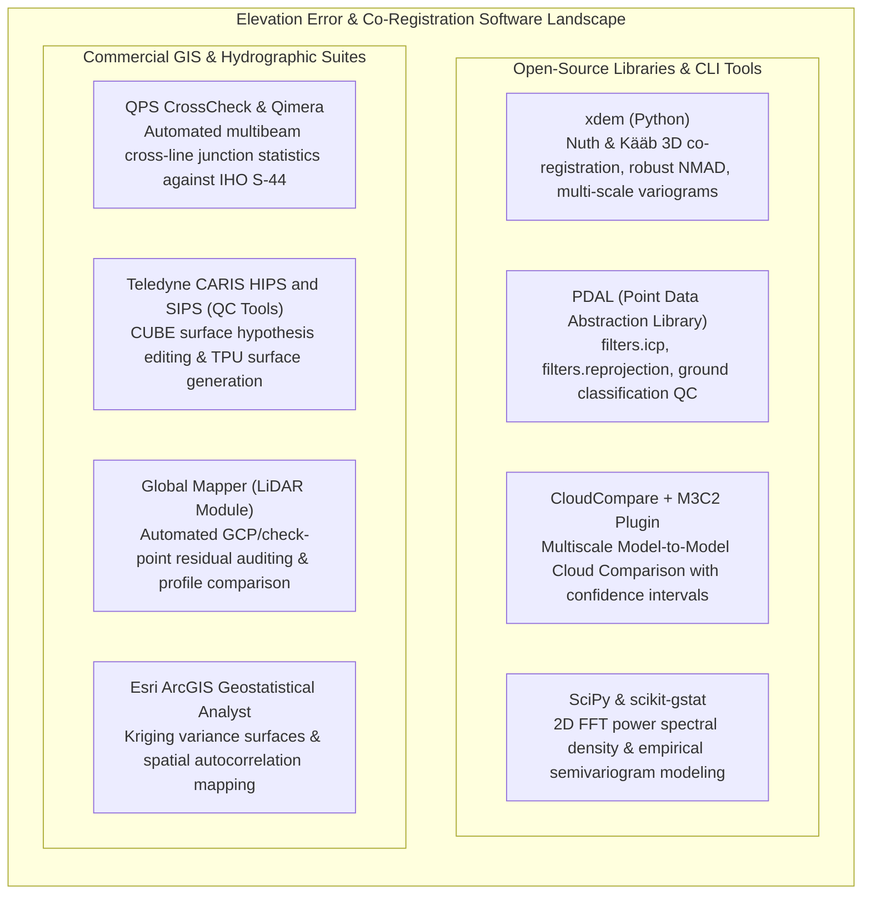
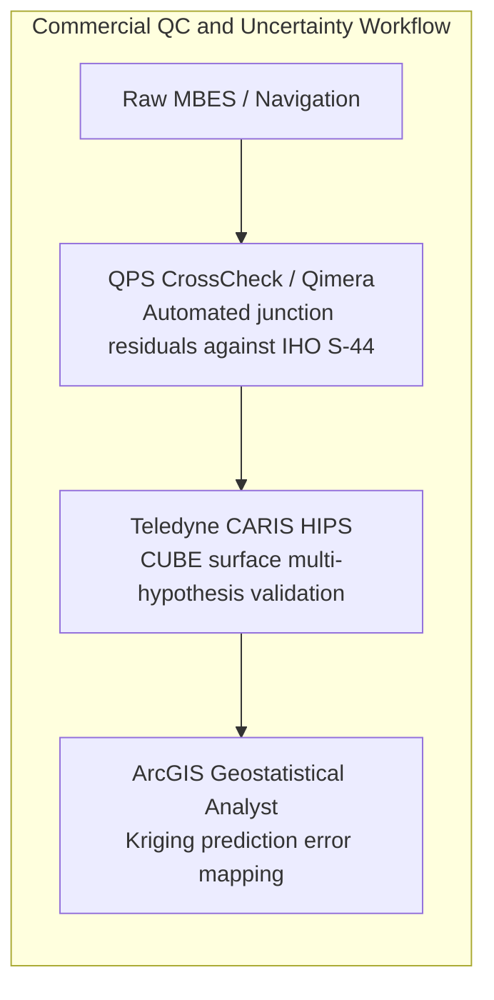

# Chapter 14: Error Theory, Total Propagated Uncertainty (TPU), and Forensic Evaluation of Third-Party DEMs

*Quantifying what we know, what we don't know, and how to audit someone else's DEM when you don't have the raw data or metadata.*

---

## 14.6 Software Ecosystem for Uncertainty Analysis, Co-Registration, and Quality Control

Auditing elevation models and propagating uncertainty requires specialized computational libraries capable of processing massive raster grids and dense 3D point clouds. This section details both the modern open-source Python/C++ ecosystem and closed-source commercial packages used to detect errors, perform 3D co-registration, and model spatial autocorrelation.



---

### 14.6.1 Open-Source Tools: `xdem`, CloudCompare, and Geostatistics

#### Automated 3D Co-Registration with `xdem`
The open-source Python library **`xdem`** (developed by the glaciology and remote sensing community) provides a high-level, NumPy/Rasterio-compatible API for universal DEM co-registration, bias correction, and spatial uncertainty modeling:

```python
"""Automated 3D DEM Co-Registration and Uncertainty Pipeline using xdem."""

import geoutils as gu
import numpy as np
import xdem

# 1. Load the unaligned target DEM and the reference DEM (e.g., Copernicus / ICESat-2)
dem_target = xdem.DEM("target_dem_unaligned.tif")
dem_ref = xdem.DEM("reference_dem_gold_standard.tif")

# 2. Reproject target to match reference grid geometry (bilinear or cubic spline)
dem_target_reprojected = dem_target.reproject(dem_ref)

# 3. Create a stable terrain mask (exclude glaciers, lakes, dense forest, clouds)
stable_mask = gu.Raster("stable_bedrock_mask.tif").data.astype(bool)

# 4. Instantiate and fit Nuth and Kääb (2011) 3D co-registration
nuth_kaab = xdem.coreg.NuthKaab()
nuth_kaab.fit(
    reference_elev=dem_ref,
    to_be_aligned_elev=dem_target_reprojected,
    inlier_mask=stable_mask,
)

# 5. Apply the solved 3D rigid transformation (dx, dy, dz)
dem_aligned = nuth_kaab.apply(dem_target_reprojected)

# 6. Extract robust statistical accuracy metrics on stable terrain
diff_before = (dem_target_reprojected - dem_ref).data[stable_mask]
diff_after = (dem_aligned - dem_ref).data[stable_mask]


def print_stats(name: str, diff: np.ndarray):
  diff_clean = diff[np.isfinite(diff)]
  med = np.median(diff_clean)
  nmad = 1.4826 * np.median(np.abs(diff_clean - med))
  rmse = np.sqrt(np.mean(diff_clean**2))
  print(f"--- {name} ---")
  print(f"  Median Bias (mu) : {med:+.3f} m")
  print(f"  Robust NMAD      : {nmad:.3f} m")
  print(f"  Parametric RMSE  : {rmse:.3f} m")


print_stats("Pre-Alignment", diff_before)
print_stats("Post-Alignment", diff_after)
```

#### Point Cloud Distance Analysis with CloudCompare and M3C2
When comparing ungridded 3D point clouds (e.g., repeat airborne LiDAR or terrestrial laser scans of a landslide), standard cloud-to-cloud nearest-neighbor distances are severely biased by point density and surface roughness. 
* **The M3C2 Plugin (Multiscale Model-to-Model Cloud Comparison):** Developed by Lague et al. (2013), M3C2 computes distances along local surface normal vectors $\hat{\mathbf{n}}$ defined across an operator-chosen scale $D$. 
* For each point, M3C2 projects a cylinder of radius $d/2$ into both clouds, calculating the mean distance between the two sub-populations along with an explicit **local level of detection at $95\%$ confidence ($\text{LOD}_{95\%}$)**:
  $$\text{LOD}_{95\%} = \pm 1.96 \left( \sqrt{\frac{\sigma_1^2}{n_1} + \frac{\sigma_2^2}{n_2}} + \Delta_{\text{reg}} \right)$$
  where $\sigma_1, \sigma_2$ are local surface roughness values, $n_1, n_2$ are point counts within the cylinder, and $\Delta_{\text{reg}}$ is rigid registration uncertainty.

#### Variogram Analysis with `scikit-gstat` and 2D FFT with `scipy.signal`
* **Empirical Semivariogram Fitting:** Using `scikit-gstat`, practitioners fit nested spherical or exponential variogram models to spatial elevation differences, quantifying the nugget variance $c_0$ (pure noise) and spatial correlation lengths $a_k$.
* **Spectral Analysis:** SciPy's `scipy.fft.fft2` and `scipy.signal.welch` compute the 2D Power Spectral Density (PSD), exposing directional striping frequencies and synthetic oversampling cliffs.

---

### 14.6.2 Commercial Suites: Hydrographic and GIS Platforms



#### QPS CrossCheck and Qimera
In hydrography, **QPS CrossCheck** is the industry standard for auditing cross-line junctions:
* Automatically computes all spatial intersections between production lines and cross-lines.
* Computes depth difference histograms and tests soundings against IHO S-44 Exclusive, Special, and Order 1a specifications.
* Outputs tabular pass/fail percentages (e.g., "$99.4\%$ of soundings satisfy Special Order TVU").

#### Teledyne CARIS HIPS and SIPS
CARIS HIPS is the dominant commercial hydrographic data cleaning suite:
* **CUBE Processing Engine:** Generates multi-hypothesis depth surfaces with integrated uncertainty layers.
* **QC Tools Integration:** Runs automated checks for feature invalidation, flier identification, and TPU consistency across overlapping swaths.

#### Global Mapper LiDAR Module
* Ingests surveyed ground control points and independent check points from CSV files.
* Automatically queries the underlying LiDAR point cloud or raster DEM, generating detailed accuracy reports with $\text{RMSE}_z$, mean bias, standard deviation, and ASPRS 2014/2024 compliance tables.

#### Esri ArcGIS Pro (Geostatistical Analyst)
* Provides Ordinary, Universal, and Empirical Bayesian Kriging (EBK) interpolation.
* Automatically outputs paired surfaces: a **Predicted Elevation Surface** alongside a **Prediction Standard Error Surface**, mapping where data sparsity or high terrain variance inflates vertical uncertainty.

---

### 14.6.3 Software Comparison Matrix

| Software / Library | License Model | Primary Data Format | Key Mathematical Capability | Primary Use Case |
| :--- | :--- | :--- | :--- | :--- |
| **`xdem`** | Open-Source (BSD-3) | GeoTIFF / Raster DEM | Nuth & Kääb 3D co-registration, robust NMAD, variograms | Python batch co-registration and geodetic change detection. |
| **PDAL** | Open-Source (BSD) | LAS / LAZ / EPT | Iterative Closest Point (ICP), transformation matrix | Automated point cloud strip alignment and check-point extraction. |
| **CloudCompare (M3C2)** | Open-Source (GPLv2) | LAS / PLY / ASCII | Multi-scale normal projection, local level of detection | Rigorous 3D point cloud change detection with confidence bounds. |
| **`scikit-gstat`** | Open-Source (MIT) | NumPy arrays | Variogram modeling (Spherical, Exponential, Gaussian) | Quantifying multi-scale spatial autocorrelation lengths. |
| **QPS CrossCheck** | Commercial (QPS) | GSF / QPD / BAG | Cross-line junction statistics against IHO S-44 | Contractual hydrographic survey compliance reporting. |
| **Teledyne CARIS** | Commercial (Teledyne) | HDCS / CSAR / BAG | CUBE multi-hypothesis tracking, Total Propagated Uncertainty | Hydrographic production and navigational chart compilation. |
| **Global Mapper** | Commercial (Blue Marble) | LAS / GeoTIFF / Vector | Control point residual extraction, ASPRS accuracy tables | Rapid elevation QA and contractor deliverable verification. |
| **ArcGIS Geostatistical Analyst**| Commercial (Esri) | Esri Grid / FileGDB | Empirical Bayesian Kriging, kriging variance mapping | Downstream spatial interpolation and uncertainty mapping. |
