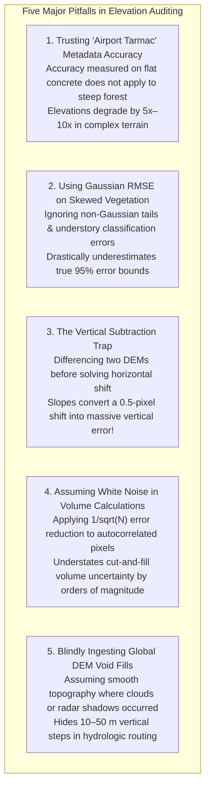

# Chapter 14: Error Theory, Total Propagated Uncertainty (TPU), and Forensic Evaluation of Third-Party DEMs

*Quantifying what we know, what we don't know, and how to audit someone else's DEM when you don't have the raw data or metadata.*

---

## 14.7 Common Pitfalls and Key Takeaways

Auditing digital elevation models and propagating uncertainty is filled with subtle statistical and geometric traps. An analyst who assumes normal distributions, ignores horizontal misregistration, or trusts advertised metadata without forensic verification risks drawing fundamentally false conclusions about earth surface processes, flood risks, and infrastructure safety.

---

### 14.7.1 Common Pitfalls in Elevation Uncertainty and Forensic Auditing

#### 1. Trusting "Airport Tarmac" Metadata Accuracy
Vendors frequently advertise an elevation dataset as having "$\text{RMSE}_z \le 5\text{ cm}$." In small print, however, this accuracy was evaluated exclusively on a flat, freshly paved airport runway with zero vegetation and zero slope:
* Over natural topography with $25^\circ$ slopes and dense tree canopies, the real vertical error degrades to $30\text{–}80\text{ cm}$.
* An engineering firm designing a mountain road or landslide retaining wall based on the advertised $5\text{-cm}$ tarmac accuracy will experience catastrophic construction volume overruns.
* Never accept a single global accuracy figure. Demand separate Non-Vegetated Vertical Accuracy (NVA) and Vegetated Vertical Accuracy (VVA) figures, stratified by slope class.

#### 2. The Gaussian Fallacy: Standard Deviation vs. Robust Non-Parametric Statistics
Applying classical Gaussian statistics (Mean and Standard Deviation) to digital elevation models over vegetated, coastal, or urban terrain is statistically invalid:
* Residual errors beneath tree canopies exhibit heavy, asymmetric positive skewness because near-ground returns are frequently misclassified low branches or understory brush.
* A single extreme outlier (e.g., a laser return from a bird or crane at $+50\text{ m}$) corrupts the mean and inflates the standard deviation, while masking systematic decimeter-level datum biases.
* Analysts must use **Median Error** for systematic datum bias, **NMAD** for robust scale, and **empirical 95th percentiles (VVA)** for compliance testing.

#### 3. The Vertical Subtraction Trap (Differencing Before Co-Registration)
When computing geodetic elevation change (e.g., glacier melt, coastal erosion, or tectonic displacement), analysts often directly subtract an older DEM from a newer DEM ($\Delta z = z_2 - z_1$):
* If the two DEMs have an undocumented horizontal misalignment of just half a pixel ($\Delta x = 0.5\text{ m}$ on a $1\text{-m}$ grid) over terrain with a $45^\circ$ slope ($\tan\alpha = 1.0$), this induces an artificial vertical error of:
  $$dh = \Delta x \tan\alpha = 0.5\text{ m} \times 1.0 = 50\text{ cm}$$
* The analyst observes massive "glacier thinning" on east-facing slopes and massive "glacier thickening" on west-facing slopes, mistaking a horizontal datum shift for climate change.
* Co-registration (using Nuth & Kääb or ICP) must always precede elevation differencing.

#### 4. The White Noise Delusion in Volumetric Analysis
When calculating the volume change $V = \sum_{i=1}^M \Delta z_i \Delta x^2$ over a reservoir, mine pit, or dredging channel containing $M = 1,000,000$ cells, naive analysts divide the sounding uncertainty by $\sqrt{M}$:
* $\sigma_V = \frac{\sigma_z}{\sqrt{M}} \approx \frac{0.15\text{ m}}{1000} = 0.00015\text{ m}$ (Completely False!).
* Because elevation errors share long spatial correlation lengths (thermal drift, tidal zoning, sensor roll, geoid ripples), errors do not cancel out across adjacent pixels.
* Volumetric uncertainty must be integrated using the spatial covariance semivariogram $\iint C(h) \, d\mathbf{x}_1 d\mathbf{x}_2$, which often yields an uncertainty hundreds of times larger than the naive white-noise formula.

#### 5. Silent Ingestion of Undocumented Void Fills
Many users download regional DEMs without realizing that persistent cloud decks or radar shadows were silently patched with low-resolution SRTM or interpolated splines:
* In hydrologic modeling, these smooth, artificial patches create phantom dams across river canyons, forcing digital streams to route over mountain ranges.
* Forensic inspection using profile curvature, shaded relief at high sun angles, and local surface roughness must be performed to identify and mask undocumented void-filled polygons.

---

### 14.7.2 Key Takeaways for Practitioners

1. **Perform Forensic Auditing on Every Ingested DEM:** Never incorporate an external elevation dataset into an engineering, flood-modeling, or scientific workflow without running the forensic trilogy:
   * A **fractional elevation histogram** ($z \bmod 1\text{ m}$) to check for integer quantization.
   * A **2D FFT Power Spectral Density** to detect artificial oversampling and striping.
   * A **multi-azimuth hillshade at $20\times\text{–}50\times$ exaggeration** to expose flight seams and void fills.
2. **Co-Register Before You Differ:** A horizontal shift manifests as slope-dependent vertical error. Always solve for $(\Delta x, \Delta y, \Delta z)$ simultaneously using the Nuth and Kääb formulation over stable bedrock before computing elevation change.
3. **Respect Non-Gaussian Error Tails:** Use robust statistics. When assessing accuracy in complex environments, report Median Error and NMAD alongside parametric RMSE, and report 95th percentile VVA for vegetated terrain.
4. **Spatial Autocorrelation Dictates Derivative and Volume Uncertainty:** Elevation errors are never i.i.d. Gaussian noise. Account for spatial covariance when differentiating surfaces (slope, curvature) or integrating over areas (volumes, flood storage).
5. **Leverage Global Spaceborne Truth:** Use NASA's ICESat-2 (ATL08/ATL03) photon profiles as a free, globally accessible, centimeter-accurate elevation benchmark to audit datum biases and striping in any terrestrial DEM worldwide.
