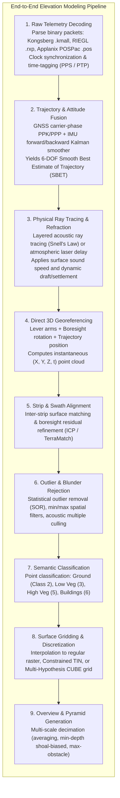

# Chapter 15: Point Clouds, Full Waveforms, Grids, TINs, Variable-Resolution Systems, and Overviews

*How raw sensor measurements are transformed, structured, and discretized into computational surface models.*

Before a digital elevation model can be queried in a GIS, analyzed in a hydraulic model, or rendered in a flight simulator, billions of unstructured physical measurements must undergo a multi-stage computational transformation. The raw outputs of physical sensors are not 3D spatial points; they are digitized voltage waveforms, nanosecond time intervals, and phase differences logged alongside asynchronous navigation telemetry. This chapter explores the mathematical representations, data structures, and spatial algorithms that transform raw sensor telemetry into structured point clouds, triangulated meshes, regular grids, variable-resolution hierarchies, and multi-scale pyramids.

---

## 15.1 From Raw Sensor Telemetry to Structured Products (The Processing Pipeline)

The generation of an elevation or bathymetric model follows an end-to-end processing pipeline that spans hardware signal decoding, kinematic trajectory fusion, physical propagation modeling, spatial cleaning, semantic classification, surface discretization, and multi-scale decimation.

---

### 15.1.1 Stage 1: Raw Telemetry Decoding and Clock Synchronization

Mapping platforms carry multiple independent hardware clocks. In an airborne LiDAR or multibeam survey:
* The GNSS receiver logs satellite carrier phases on GPS time.
* The IMU records gyro rates and accelerations at $200\text{–}1000\text{ Hz}$ on an internal quartz crystal clock.
* The laser scanner or multibeam transceiver logs detector pulses on a local field-programmable gate array (FPGA) timer.

The first stage parses vendor-specific raw binary packets (e.g., Kongsberg `.all`/`.kmall`, RIEGL `.rxp`, Leica `.scn`, Applanix `.pos`). Telemetry decoding aligns all sensor timestamps to a single geodetic time standard (GPS Time or UTC) using hardware **Pulse-Per-Second (PPS)** electrical pulses and **Precision Time Protocol (PTP, IEEE 1588)** or NMEA `$GPZDA` time-stamping. An uncorrected timing offset of just $1\text{ millisecond}$ at an aircraft speed of $75\text{ m/s}$ ($150\text{ knots}$) displaces the resulting point cloud by $7.5\text{ cm}$ along-track.

---

### 15.1.2 Stage 2: Trajectory and Attitude Fusion (The SBET)

Raw navigation data is processed post-mission using loosely coupled or tightly coupled inertial navigation algorithms. Kinematic GNSS carrier-phase processing (PPK or PPP) determines centimeter-level antenna positions. 

A bidirectional (forward and backward) **Extended Kalman Filter (EKF) and Rauch-Tung-Striebel (RTS) smoother** combines the high-frequency inertial angular rates and accelerations with the absolute GNSS positions:
* Computes the 6-Degrees-of-Freedom (6-DOF) **Smooth Best Estimate of Trajectory (SBET)**: position $(X(t), Y(t), Z(t))$ and attitude angles $(\phi(t), \theta(t), \psi(t))$ at $100\text{–}200\text{ Hz}$.
* Generates continuous variance-covariance time series quantifying trajectory position uncertainty ($\sigma_x, \sigma_y, \sigma_z$) and orientation uncertainty ($\sigma_\phi, \sigma_\theta, \sigma_\psi$).

---

### 15.1.3 Stages 3 & 4: Physical Wavefront Propagation and Direct Georeferencing

With the platform trajectory resolved, each individual measurement vector is projected into physical space:
* **Atmospheric / Acoustic Refraction:** In hydrography, Snell's law ray tracing integrates the sound velocity profile (SVP) through stratified oceanic layers, calculating circular-arc ray bending and two-way travel times. In airborne LiDAR, atmospheric pressure, temperature, and relative humidity corrections model the refractive index of air ($n \approx 1.00028$) and speed-of-light delays.
* **Direct Georeferencing Vector Summation:** The 3D target position in the local geodetic mapping frame is computed via:
  $$\mathbf{r}_{\text{target}}^m(t) = \mathbf{r}_{\text{nav}}^m(t) + \mathbf{R}_b^m(t) \left[ \mathbf{L}^b + \mathbf{R}_s^b (\Delta \boldsymbol{\theta}) \, \mathbf{r}^s(t) \right]$$
  producing millions of georeferenced $(X, Y, Z)$ points per second.

---

### 15.1.4 Stages 5 & 6: Strip Alignment and Outlier Rejection

* **Strip/Swath Matching:** Due to micro-machining tolerances and airborne turbulence, slight residual boresight offsets or trajectory biases produce vertical step offsets between adjacent overlapping swaths. Automated strip adjustment algorithms (e.g., TerraMatch, Iterative Closest Point [ICP]) match planar surfaces across swaths to optimize fine alignment.
* **Outlier Culling:** Environmental noise—clouds, low-flying birds, water spray, acoustic second-sweep multiples, and pelagic fish schools—is filtered using Statistical Outlier Removal (SOR, analyzing $k$-nearest-neighbor distance distributions) and local morphological gradient filters.

---

### 15.1.5 Stages 7, 8 & 9: Semantic Classification, Gridding, and Pyramids

* **Semantic Classification:** Point clouds are classified according to standard schemas (e.g., ASPRS LAS classes: Class 2 for bare ground, Classes 3–5 for vegetation, Class 6 for buildings, Class 9 for water). Ground classification algorithms (progressive TIN densification, cloth simulation filtering, or deep neural networks) separate mineral earth from surface objects.
* **Surface Discretization:** The irregular, classified point cloud is transformed into an explicit continuous surface: a regular raster grid via spatial interpolation (IDW, Spline, Kriging, CUBE) or a vector Triangulated Irregular Network (TIN).
* **Multi-Scale Pyramid Construction:** Finally, hierarchical downsampled overview rasters are generated for efficient storage, streaming, and display.
