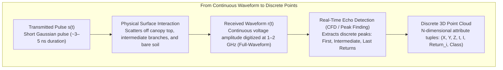
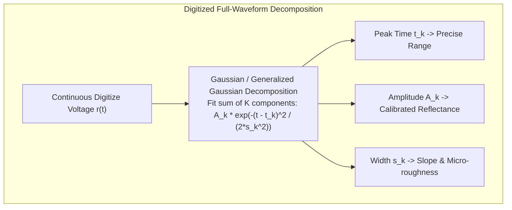
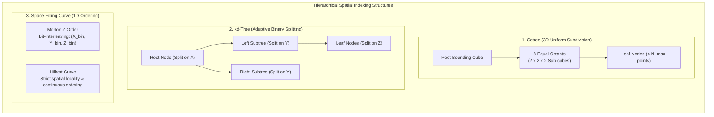

# Chapter 15: Point Clouds, Full Waveforms, Grids, TINs, Variable-Resolution Systems, and Overviews

*How raw sensor measurements are transformed, structured, and discretized into computational surface models.*

---

## 15.2 Point Clouds and Full Waveforms: Continuous Signals vs. Discrete Geometry

The fundamental raw spatial data structure generated by optical laser scanners and acoustic mapping systems is the point cloud. However, representing the Earth as discrete coordinates is itself an abstraction. The true physical interaction between an interrogating electromagnetic or acoustic pulse and the natural surface is a continuous time-varying signal: the **full waveform**.

---

### 15.2.1 Discrete Returns vs. Digitized Full Waveforms

#### Discrete Return Systems
In standard commercial LiDAR and multibeam systems, real-time hardware signal processors analyze the returning electrical signal using a **Constant Fraction Discriminator (CFD)** or peak-detection algorithm. When the returned signal amplitude crosses an adaptive threshold, the hardware logs a discrete time-of-flight:
1. **First Return:** The highest physical surface encountered by the pulse footprint (typically the top of the tree canopy or building roof).
2. **Intermediate Returns:** Internal vegetation layers, tree limbs, or suspended power lines.
3. **Last Return:** The deepest physical surface reached by the remaining pulse energy (typically the bare ground or seafloor, provided the canopy is not completely opaque).
4. **Single Return:** A pulse striking a solid, impermeable planar surface (e.g., bare asphalt or open rock) where the entire reflected energy returns in a single discrete echo.

While discrete return logging compresses data volume by orders of magnitude (enabling lightweight real-time storage), it discards critical physical information: pulse broadening caused by ground slope, weak understory echoes below the detection threshold, and surface roughness.

#### Full-Waveform Digitization
Full-waveform LiDAR systems (such as RIEGL LMS-Q series, Teledyne Optech Titan, and NASA's spaceborne GEDI) digitize the continuous backscattered optical power $P_{\text{rx}}(t)$ at ultra-high sampling rates ($1\text{–}2\text{ GHz}$, capturing voltage samples every $0.5\text{–}1.0\text{ ns}$):

$$P_{\text{rx}}(t) = P_{\text{tx}}(t) * \sigma(t) * h_{\text{sys}}(t) + N(t)$$

where $\sigma(t)$ is the vertical cross-section distribution of the target, $h_{\text{sys}}(t)$ is the system impulse response, and $N(t)$ is receiver noise.

By decomposing the continuous waveform post-mission using **non-linear Gaussian mixture fitting**, analysts extract:
* **Sub-Canopy Ground Detection:** Resolves weak ground returns that failed to trigger real-time discrete CFD thresholds.
* **Surface Roughness and Slope:** The pulse width $\sigma_k$ broadens proportionally to local terrain slope $\alpha$ and beam footprint radius $w_0$:
  $$\sigma_{\text{echo}}^2 \approx \sigma_{\text{laser}}^2 + \left( \frac{2 w_0 \tan\alpha}{c} \right)^2 + \left( \frac{2 \sigma_z}{c} \right)^2$$
  providing direct physical measurements of micro-roughness $\sigma_z$ and slope within a single footprint.

---

### 15.2.2 Point Cloud Attributes and Data Schemas

Modern elevation point clouds are not simple $(X, Y, Z)$ triplets; they are rich, multi-dimensional relational tuples. The ASPRS LAS specification (versions 1.2 through 1.4) standardizes point data records:

| Attribute Name | Data Type | Physical Meaning and Operational Role in DEM Production |
| :--- | :--- | :--- |
| **$X, Y, Z$** | 32-bit Scaled Int | Absolute 3D coordinates in project Coordinate Reference System (CRS). |
| **GPS Time** | 64-bit IEEE Float | Adjusted GPS week seconds ($>1\times 10^9\text{ s}$); ties points to flight trajectory and tide. |
| **Intensity** | 16-bit Unsigned Int | Calibrated optical or acoustic backscatter amplitude; separates wet vs. dry soil, asphalt vs. grass. |
| **Return Number ($n$)** | 4-bit Unsigned Int | Ordinal return number of this echo within the pulse ($1 \le n \le 15$). |
| **Number of Returns ($N$)**| 4-bit Unsigned Int | Total number of discrete returns detected from this specific pulse. |
| **Scan Angle Rank** | 16-bit Signed Int | Angle relative to nadir ($\pm 90^\circ$ at $0.006^\circ$ resolution); isolates edge-beam distortions. |
| **Point Source ID** | 16-bit Unsigned Int | Unique flightline or swath index; indispensable for inter-strip alignment and error tracing. |
| **Classification** | 8-bit Unsigned Int | ASPRS semantic class: 2=Ground, 3=Low Veg, 4=Med Veg, 5=High Veg, 6=Building, 9=Water. |
| **RGB / NIR** | $4 \times 16\text{-bit}$ Int | Co-registered camera radiometric values for photorealistic texturing and vegetation indices. |

---

### 15.2.3 Spatial Indexing: Octrees, kd-Trees, and Space-Filling Curves

A modern airborne LiDAR or mobile mapping project generates between $10^9$ and $10^{11}$ points (hundreds of gigabytes to terabytes). Storing these points in sequential, unstructured arrays makes spatial queries (e.g., "find all ground points within $5\text{ m}$ of coordinate $(X, Y)$") prohibitively slow, requiring full linear scans of $\mathcal{O}(N)$ computational complexity. Efficient spatial access requires hierarchical spatial indexing.

#### 1. Octrees (3D Hierarchical Cubes)
An octree recursively partitions a 3D bounding box into eight equal child cubes (octants). In modern point cloud streaming formats like **Cloud-Optimized Point Clouds (COPC)** and **Entwine Point Tile (EPT)**:
* Each octree node contains a subset of points downsampled to represent the entire spatial extent at that hierarchy level.
* Web viewers (e.g., Potree, Cesium) can stream and render low-resolution octree root nodes instantly over HTTP range requests, fetching finer child nodes only as the user zooms in.

#### 2. kd-Trees ($k$-Dimensional Trees)
A kd-tree is a binary search tree that recursively bisects points along orthogonal axes $(X \to Y \to Z \to X)$ at the median point coordinate. A balanced kd-tree reduces the computational complexity of $k$-nearest-neighbor ($k$-NN) and spherical range queries from $\mathcal{O}(N)$ to **$\mathcal{O}(\log N)$**, making it the optimal structure for normal estimation, surface curvature calculation, and ICP registration.

#### 3. Space-Filling Curves (Morton Z-Order and Hilbert Curves)
Space-filling curves map multi-dimensional coordinates $(X, Y, Z)$ to a single 1D scalar index while preserving spatial locality:
* **Morton Z-Order:** Formed by interleaving the binary bits of the quantized integer coordinates:
  $$\text{Morton}(X, Y) = \sum_{j=0}^{B-1} \left( x_j \cdot 2^{2j} + y_j \cdot 2^{2j+1} \right)$$
* **Hilbert Curve:** A continuous, fractal space-filling curve that eliminates the large spatial jumps present in Morton Z-order, maximizing 1D memory locality.
* By sorting billions of points along a Hilbert or Morton curve and storing them in linear disk blocks, 2D and 3D spatial range queries can be resolved using fast 1D range scans on B-trees, enabling cloud-native point cloud databases.
