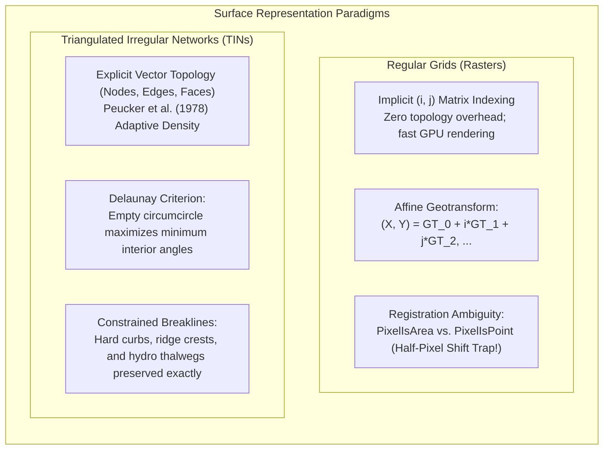
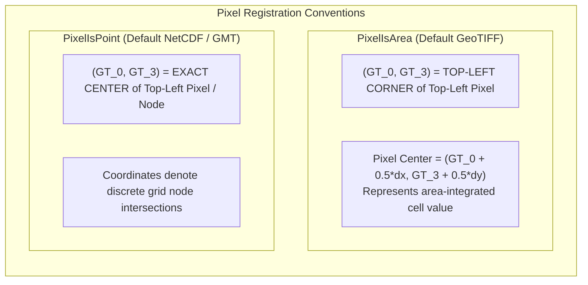
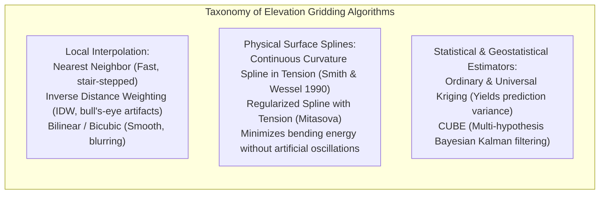
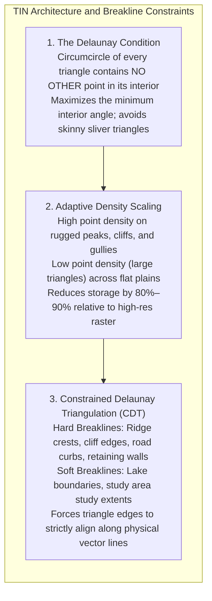

# Chapter 15: Point Clouds, Full Waveforms, Grids, TINs, Variable-Resolution Systems, and Overviews

*How raw sensor measurements are transformed, structured, and discretized into computational surface models.*

---

## 15.3 Regular Grids (Rasters) vs. Triangulated Irregular Networks (TINs)

Once an elevation point cloud has been cleaned and classified, it must be discretized into a continuous mathematical surface for terrain modeling, hydrologic simulation, or navigation. The two dominant paradigms for representing continuous 2.5D surfaces are **Regular Rectilinear Grids (Rasters)** and **Triangulated Irregular Networks (TINs)**. Choosing between them involves fundamental trade-offs between computational simplicity and geometric fidelity.

---

### 15.3.1 Regular Grids: Georeferencing and the Half-Pixel Registration Trap

A regular elevation grid structures space into a 2D matrix of $M \times N$ elevation values $Z[i, j]$. 

#### The Affine Geotransform
Spatial coordinates are mapped to matrix indices via the standard 6-parameter affine transformation:

$$\begin{bmatrix} X \\ Y \end{bmatrix} = \begin{bmatrix} \text{GT}_0 \\ \text{GT}_3 \end{bmatrix} + \begin{bmatrix} \text{GT}_1 & \text{GT}_2 \\ \text{GT}_4 & \text{GT}_5 \end{bmatrix} \begin{bmatrix} i \\ j \end{bmatrix}$$

where $\text{GT}_0, \text{GT}_3$ are the origin coordinates, $\text{GT}_1, \text{GT}_5$ are pixel width and height (with $\text{GT}_5 < 0$ for north-up rasters), and $\text{GT}_2, \text{GT}_4$ are rotational shearing terms (typically zero).

#### The Half-Pixel Registration Trap: `PixelIsArea` vs. `PixelIsPoint`
One of the most persistent, multi-meter error sources in geospatial analysis arises from the confusion between two conflicting pixel registration conventions:

* **`PixelIsArea` (Cell / Pixel Registered):** The coordinate $(\text{GT}_0, \text{GT}_3)$ defines the **top-left corner** of the upper-left bounding pixel. The elevation sample value is conceptually centered at $(X + \frac{1}{2}\Delta x, Y - \frac{1}{2}\Delta y)$. This is the default in GeoTIFF and GDAL.
* **`PixelIsPoint` (Grid-Node Registered):** The coordinate $(\text{GT}_0, \text{GT}_3)$ defines the **exact point location** of the top-left data sample. This is the default convention in GMT (Generic Mapping Tools) and many NetCDF climate/elevation models.

#### The Fatal Operational Trap
If an analyst converts a GeoTIFF (`PixelIsArea`) into a NetCDF grid (`PixelIsPoint`) without explicitly declaring or shifting the origin, the raster software misinterprets the bounding corner as the grid node center. 
* This silently shifts the entire digital elevation model horizontally by **exactly half a pixel** along both axes:
  $$\Delta X = +\frac{1}{2}\text{GSD}, \quad \Delta Y = -\frac{1}{2}\text{GSD}$$
* On a $30\text{-m}$ global DEM (e.g., SRTM or Copernicus-30), this induces an undocumented horizontal shift of **$15\text{–}21\text{ m}$**. On steep $30^\circ$ terrain, this half-pixel registration mismatch generates artificial vertical errors exceeding $12\text{ m}$!

---

### 15.3.2 Gridding and Spatial Interpolation Algorithms

Transforming irregular point clouds into regular rasters requires spatial interpolation. The mathematical formulation of the interpolation algorithm dictates the physical realism of the surface:

| Gridding Algorithm | Mathematical Formulation | Primary Advantages | Severe Artifacts / Failure Modes |
| :--- | :--- | :--- | :--- |
| **Nearest Neighbor** | $z(\mathbf{x}) = z(\mathbf{x}_k)$ where $\|\mathbf{x} - \mathbf{x}_k\| = \min$ | Ultra-fast; preserves original measured values without smoothing. | Discontinuous, blocky Voronoi facets; jagged contours and false slope steps. |
| **Inverse Distance Weighting (IDW)** | $z(\mathbf{x}) = \frac{\sum w_i z_i}{\sum w_i}, \quad w_i = d_i^{-p}$ | Computationally simple; bounded within $[\min(z_i), \max(z_i)]$. | Creates artificial circular "bull's-eyes" around data points; cannot extrapolate trends. |
| **Natural Neighbor (Sibson)** | $z(\mathbf{x}) = \sum \frac{\text{Area}(\text{overlap}_i)}{\text{Total Area}} z_i$ | Local Voronoi area weighting; smooth $C^1$ continuity; no user tuning parameters. | Computationally intensive; slow on massive point clouds $>10^8$ points. |
| **Spline in Tension (GMT `surface`)** | $(1 - T)\nabla^4 z - T \nabla^2 z = 0$ | Physical elastic plate analogy; continuous $C^2$ surface; excellent over smooth terrain. | Can produce severe "overshoots" and "undershoots" near steep cliffs if tension $T \approx 0$. |
| **Ordinary Kriging** | $\hat{z}(\mathbf{x}) = \sum \lambda_i z_i$ with $\sum \lambda_i = 1$ | Best Linear Unbiased Estimator (BLUE); provides exact spatial kriging variance surface $\sigma_{\text{krig}}^2$. | Requires stationary semivariogram; computationally expensive matrix inversions $\mathcal{O}(N^3)$. |
| **CUBE (Calder & Mayer 2003)** | Recursive Bayesian Kalman filter tracking multiple discrete depth hypotheses | Specifically engineered for hydrography; robust against acoustic multiples and fish. | Requires accurate input TPU covariance parameters for every sounding. |

---

### 15.3.3 Triangulated Irregular Networks (TINs) and Constrained Breaklines

First introduced to computerized terrain analysis by Thomas Peucker, R. J. Fowler, J. J. Little, and D. M. Mark in 1978, the **Triangulated Irregular Network (TIN)** represents topography as a contiguous vector mesh of non-overlapping triangular facets.

#### The Delaunay Triangulation Condition
A triangulation of point set $P$ in $\mathbb{R}^2$ is Delaunay if the circumcircle of any triangle $T(p_i, p_j, p_k)$ contains no other point of $P$ in its interior:

$$\operatorname{Interior}(\operatorname{Circumcircle}(p_i, p_j, p_k)) \cap P = \emptyset$$

The Delaunay criterion guarantees:
1. The triangulation is unique (assuming no four points are co-circular).
2. It maximizes the minimum interior angle of all triangles, preventing long, thin, needle-like "sliver" triangles that produce numerical instabilities in slope and hydrodynamic flow calculations.

#### Constrained Breaklines: Preserving Structural Topography
In regular rasters, linear features like road curbs ($15\text{ cm}$ vertical step), retaining walls, and stream channels (thalwegs) are blurred across grid cells unless the entire raster is oversampled at sub-decimeter resolution.

A **Constrained Delaunay Triangulation (CDT)** solves this by enforcing vector breaklines:
* **Hard Breaklines:** 3D vector polylines representing abrupt changes in surface slope (ridge lines, pavement edges, fault scarps, building footprints). Triangle edges are mathematically forced to coincide with the polyline segments, overriding the empty-circumcircle rule where necessary. Linear interpolation never crosses a hard breakline, perfectly preserving vertical steps and sharp drainage divides.
* **Soft Breaklines:** Enforce boundary definitions (e.g., clipping polygons, study areas) without introducing artificial slope discontinuities.
