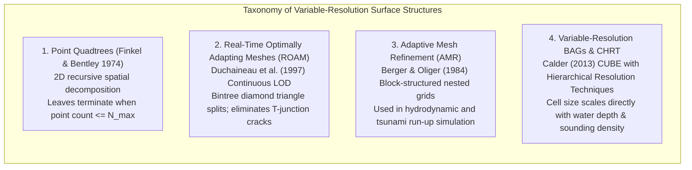
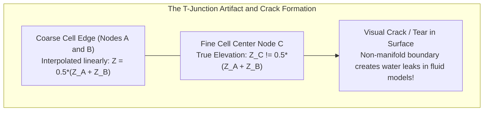
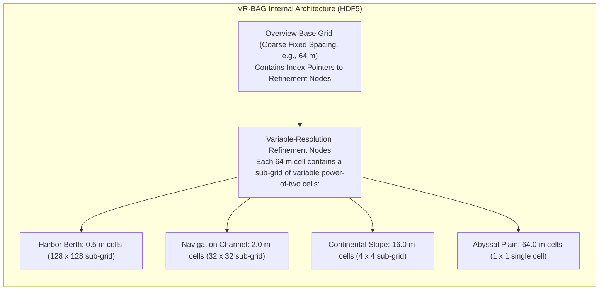

# Chapter 15: Point Clouds, Full Waveforms, Grids, TINs, Variable-Resolution Systems, and Overviews

*How raw sensor measurements are transformed, structured, and discretized into computational surface models.*

---

## 15.4 Variable-Resolution Systems and Multi-Resolution Hierarchies

A single survey project often spans radical variations in physical scale: a coastal survey vessel maps a shallow commercial harbor berth at $0.5\text{-meter}$ point spacing, navigates a shipping channel at $2\text{-meter}$ resolution, and surveys the outer continental shelf at depths of $1000\text{ m}$ where acoustic footprint spreading limits true spatial resolution to $30\text{–}50\text{ m}$. 

Forcing this dataset into a single, uniform regular raster forces a false, unacceptable compromise:
1. **The Oversampling Trap:** If the entire survey is gridded at $0.5\text{ m}$ to preserve harbor detail, the deep offshore areas are bloated by massive, redundant arrays of interpolated cells containing zero new information. File sizes explode from megabytes to hundreds of gigabytes.
2. **The Undersampling Trap:** If the survey is gridded at $30\text{ m}$ to match offshore depth, critical navigation hazards, harbor pilings, and shallow shoals are averaged into oblivion.

Variable-resolution data structures solve this dilemma by allowing spatial cell dimensions to adapt dynamically to local data density, terrain curvature, and physical sensor physics.

---

### 15.4.1 Quadtrees and Continuous Level-of-Detail (ROAM)

#### Point and Region Quadtrees
First formalized by Raphael Finkel and Jon Bentley in 1974, the **quadtree** is a hierarchical tree data structure in which every internal node has exactly four children: North-West (NW), North-East (NE), South-West (SW), and South-East (SE). 

In terrain modeling:
* Space is recursively subdivided into quadrants until each leaf node satisfies a termination threshold: either containing fewer than a threshold number of points ($N \le N_{\max}$), or exhibiting elevation variance below a target error tolerance ($\sigma_z^2 \le \epsilon^2$).
* Flat alluvial plains remain undivided as large root quadrants, while complex ravines and rocky coastlines are subdivided into deep, fine leaf nodes.

#### The "T-Junction" Crack Problem and ROAM
When rendering or modeling quadtree-based variable-resolution meshes, an adjacent fine quadtree cell sharing a boundary with a coarse quadtree cell creates a **T-junction** (where a vertex in the fine mesh lies along the continuous edge of a coarse triangle):

To eliminate T-junction tears without manual stitching, Mark Duchaineau et al. (1997) developed **ROAM (Real-Time Optimally Adapting Meshes)**:
* Uses binary triangle trees (bintrees) that split right-angled isosceles triangles along their hypotenuse.
* By enforcing a strict rule that no triangle may be split unless its neighbor across the hypotenuse is split simultaneously (forming a "diamond"), ROAM mathematically guarantees **crack-free, continuous $C^0$ surface topology** across arbitrary level-of-detail (LOD) transitions.

---

### 15.4.2 Variable-Resolution Bathymetric Attributed Grids (VR-BAG) and CHRT

In modern hydrographic production, the Open Navigation Surface (ONS) consortium standardized the **Variable-Resolution Bathymetric Attributed Grid (VR-BAG)** format, powered by the **CHRT (CUBE with Hierarchical Resolution Techniques)** algorithm developed by Brian Calder (2013).

#### How CHRT Adapts Cell Size
The CHRT engine calculates optimal cell resolution dynamically from the local physics of acoustic data collection:
1. **Depth-to-Resolution Scaling:** Acoustic footprint diameter expands linearly with depth $D$:
   $$\text{Footprint Diameter } W = 2 D \tan\left(\frac{\theta_{\text{beam}}}{2}\right)$$
   For a $1^\circ$ beam system at $1000\text{ m}$ depth, the footprint is $W \approx 17.5\text{ m}$. Attempting to grid this data at $1\text{-m}$ resolution produces artificial empty cells. CHRT scales the nominal cell size $\Delta x$ as a function of depth:
   $$\Delta x(D) = \max\left( \Delta x_{\min}, \, 2^{\lfloor \log_2(k \cdot D) \rfloor} \right)$$
2. **Sounding Density Feedback:** If an overlapping vessel line provides higher sounding density in deep water (e.g., over a shipwreck), CHRT detects the increased pulse density and automatically drops the cell size to a finer power-of-two level.
3. **Paired Elevation and Uncertainty Sub-Grids:** Inside the HDF5 structure, every variable-resolution node stores paired depth and uncertainty estimates derived from CUBE's multi-hypothesis Kalman filter, providing an audit trail for every node.

#### Operational Benefits of VR-BAG
* **$80\%\text{–}95\%$ Reduction in Storage:** Compared to a brute-force high-resolution raster, a VR-BAG eliminates billions of interpolated void cells while preserving sub-meter detail around critical navigational hazards.
* **Unified Single-File Distribution:** Eliminates the administrative nightmare of tiling a single coastal bay into dozens of separate, disconnected raster files of different resolutions.
