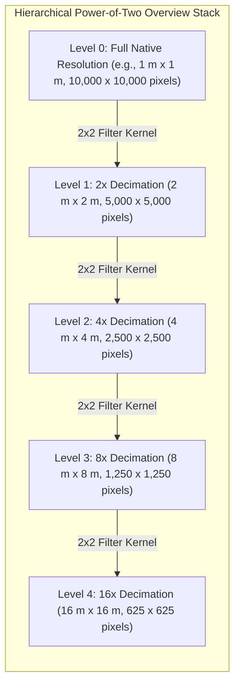
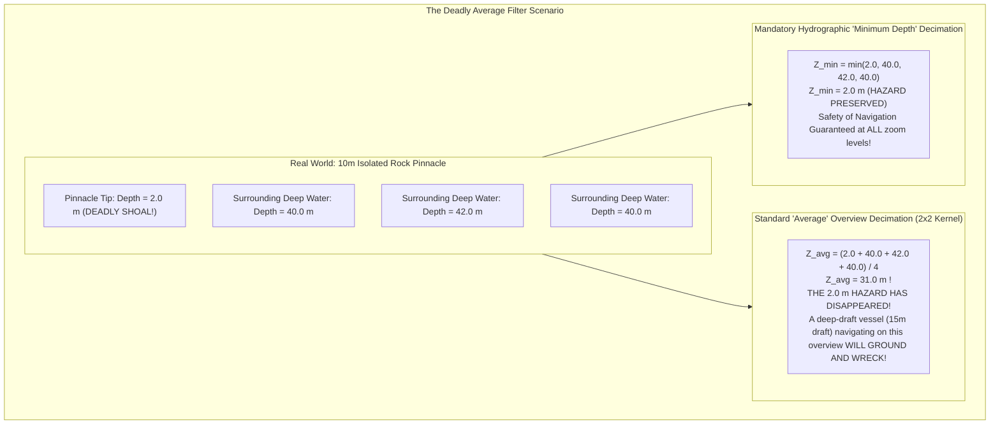
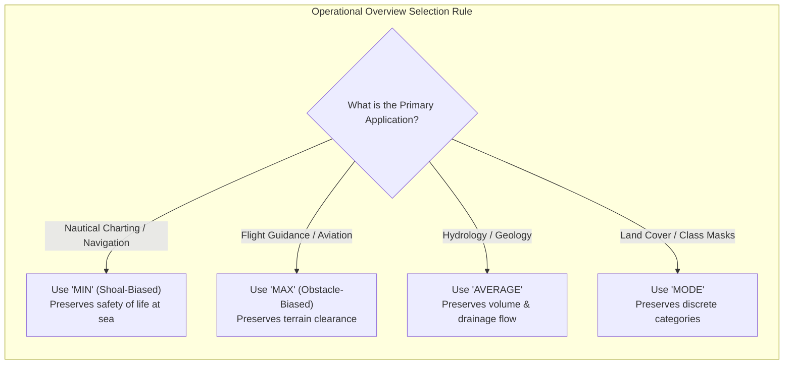

# Chapter 15: Point Clouds, Full Waveforms, Grids, TINs, Variable-Resolution Systems, and Overviews

*How raw sensor measurements are transformed, structured, and discretized into computational surface models.*

---

## 15.5 Overviews (Pyramids) and Multi-Scale Decimation: The Life-or-Death Decimation Trap

Digital elevation rasters frequently exceed dozens of gigabytes in size, containing hundreds of millions or billions of pixels. To enable fluid, interactive pan-and-zoom in web viewers, GIS software, and navigation systems, rasters are pre-computed with a hierarchical stack of downsampled overview images—commonly known as **pyramids** (or internal overviews in Cloud-Optimized GeoTIFFs [COGs]).

However, the mathematical decimation algorithm used to downsample a high-resolution grid into its overview hierarchy is not a trivial display choice: in safety-critical domains (maritime navigation, commercial aviation, and flood engineering), selecting the wrong decimation kernel can be fatal.



---

### 15.5.1 The Decimation Trap: Why Average Downsampling Kills Ships and Planes

By far the most common default resampling kernel in GIS software (including standard GDAL `gdaladdo` commands) is the **arithmetic average** (or bilinear/cubic filtering):

$$Z_{\text{parent}} = \frac{1}{4} \sum_{i=1}^2 \sum_{j=1}^2 Z_{\text{child}}[i, j]$$

While averaging produces visually smooth, aesthetically pleasing overviews for cartographic presentation, it acts as a low-pass spatial filter that completely extinguishes sharp, localized topographic extrema:



#### The Maritime Grounding Disaster
Consider a dangerous, isolated granite pinnacle rising to within $2.0\text{ m}$ of the sea surface in a coastal shipping fairway where the surrounding seafloor depth is $40.0\text{ m}$. In a $1\text{-meter}$ native bathymetric model, the pinnacle occupies a single cell surrounded by deep soundings.
* When downsampled to Level 1 ($2\times 2$ kernel) using an **Average** filter, the cell depth becomes:
  $$Z_{\text{avg}} = \frac{2.0 + 40.0 + 42.0 + 40.0}{4} = 31.0\text{ m}$$
* When downsampled to Level 2 ($4\times 4$ kernel), the pinnacle's signature is diluted across 16 cells:
  $$Z_{\text{avg}} \approx \frac{2.0 + 15 \times 40.0}{16} = 37.6\text{ m}$$
* In the zoomed-out overview display, the $2.0\text{-m}$ pinnacle has completely vanished! A commercial tanker with a $14\text{-meter}$ under-keel draft navigating on the overview display sees a seemingly safe $37\text{-meter}$ channel, proceeds forward, and tears its hull open on the rock.

#### The Aviation Obstacle Collision
The identical catastrophe occurs in aviation terrain models (e.g., FAA Digital Terrain Elevation Data [DTED] or helicopter emergency flight systems):
* A $300\text{-meter}$ communications tower or narrow volcanic knife-ridge rising above a flat valley floor is averaged out in higher overview pyramids.
* Terrain-avoidance flight guidance computers relying on an average-downsampled DEM will route aircraft directly into the unrepresented spire.

---

### 15.5.2 Purpose-Built Decimation Kernels

To prevent catastrophic loss of critical topographic features, geospatial engineers must select decimation algorithms aligned with operational intent:

| Overview Kernel | Mathematical Rule for $2 \times 2$ Block | Operational Domain | Critical Safety Justification |
| :--- | :--- | :--- | :--- |
| **Minimum (`min`)** | $Z_{\text{out}} = \min(z_1, z_2, z_3, z_4)$ | **Marine Hydrography / Nautical Charting** | **Shoal-Biased:** Preserves shallowest navigation hazard at every zoom level. |
| **Maximum (`max`)** | $Z_{\text{out}} = \max(z_1, z_2, z_3, z_4)$ | **Aviation / Drone Obstacle Avoidance** | **Tallest-Obstacle:** Guarantees no tower, ridge, or tree canopy is smoothed down. |
| **Average (`average`)** | $Z_{\text{out}} = \frac{1}{4} \sum z_i$ | **Hydrology / Cut-and-Fill Volumes** | Preserves unbiased regional mass and volumetric balances. |
| **Mode (`mode`)** | $Z_{\text{out}} = \operatorname{argmax}_c \sum \mathbb{I}(z_i = c)$ | **Semantic Land-Cover Classification** | Prevents creation of invalid non-integer classes in discrete rasters. |
| **Nearest Neighbor (`nearest`)** | $Z_{\text{out}} = z_1$ | **Categorical / Integer Rasters** | Fast, but creates severe spatial aliasing and dropouts of small features. |

---

### 15.5.3 Generating Safe Overviews with GDAL

When building pyramids using GDAL (`gdaladdo`), engineers must override the default average resampling method:

```bash
# 1. NAUTICAL CHARTING & HYDROGRAPHY: Force Minimum Depth (Shoal-Biased) Pyramids
# Guarantees that shallow shoals and rocks remain visible at all scale levels
gdaladdo -r min -ro bathymetry_survey.tif 2 4 8 16 32 64

# 2. AVIATION & TERRAIN AVOIDANCE: Force Maximum Elevation Pyramids
# Guarantees that towers, peaks, and terrain obstacles are never smoothed away
gdaladdo -r max -ro aviation_dted_elevation.tif 2 4 8 16 32 64

# 3. HYDROLOGY & GENERAL VISUALIZATION: Average Pyramids
# Preserves regional volumetric conservation and smooth hillshading
gdaladdo -r average -ro watershed_dem.tif 2 4 8 16 32 64

# 4. CLASSIFIED SURFACES: Mode (Majority Vote) Pyramids
# For ASPRS semantic class rasters (Ground, Vegetation, Buildings)
gdaladdo -r mode -ro classified_surface.tif 2 4 8 16 32 64
```


