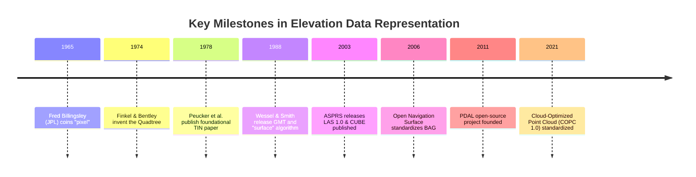
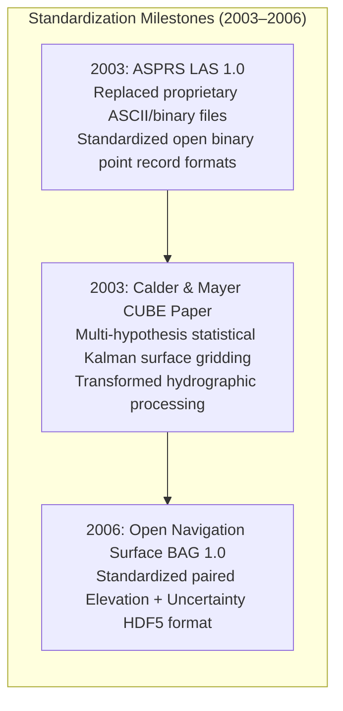

# Chapter 15: Point Clouds, Full Waveforms, Grids, TINs, Variable-Resolution Systems, and Overviews

*How raw sensor measurements are transformed, structured, and discretized into computational surface models.*

---

## 15.6 Historical Evolution of Digital Elevation Representations

The representation of continuous planetary topography in digital computers spans six decades of innovation: from coining the word "pixel" for planetary flyby imagery to cloud-optimized octrees streaming billions of LiDAR points over the web.

---

### 15.6.1 The Discretization of Space (1965–1978)

#### 1965: Fred Billingsley and the Birth of the "Pixel"
In 1965, Fred C. Billingsley, an engineer at NASA's Jet Propulsion Laboratory (JPL), was developing computerized image processing techniques for the Mariner 4 Mars flyby. While describing the discrete picture elements that composed digitized planetary television scans, Billingsley coined the portmanteau **"pixel"** (from *picture element*). Billingsley's formulation established the rectilinear grid of discrete values as the universal computational framework for remote sensing, directly giving birth to the regular elevation raster.

#### 1974: The Invention of the Quadtree
In 1974, computer scientists Raphael Finkel and Jon Bentley published *Quad Trees: A Data Structure for Retrieval on Composite Keys* in *Acta Informatica*. They formalized the recursive spatial decomposition of 2D space into hierarchical quadrants. The quadtree became the computational cornerstone of variable-resolution terrain modeling, multi-scale image pyramids, and spatial database indexing.

#### 1978: Peucker, Fowler, Little, and Mark: The Triangulated Irregular Network
In 1978, at the Digital Terrain Models Symposium of the American Society of Photogrammetry, Thomas K. Peucker, Robert J. Fowler, James J. Little, and David M. Mark published *The Triangulated Irregular Network*. 

The authors recognized a fundamental defect in regular rasters: uniform grids waste vast storage arrays sampling redundant, flat topography while inadequately sampling sharp ridge crests and fault lines. Peucker and his colleagues proposed the **TIN**:
* An irregular vector network of triangular facets with variable density adapting to surface complexity.
* Formalized the extraction of "very important points" (VIPs) along ridges and stream channels.
* Established the concept of breaklines, forever changing civil engineering, CAD, and topographical mapping.

---

### 15.6.2 Continuous Splines and Open Geophysics (1988)

#### 1988: Paul Wessel, Walter Smith, and the GMT `surface` Algorithm
In 1988, marine geophysicists Paul Wessel and Walter H. F. Smith released the **Generic Mapping Tools (GMT)**. Facing the challenge of gridding sparse ship bathymetry and satellite altimetry across vast oceanic basins, Smith and Wessel developed the **continuous curvature spline in tension** algorithm, implemented in GMT as the `surface` module (published in *Geophysics* in 1990). 

By introducing an adjustable tension parameter $T \in [0, 1]$ into the biharmonic plate equation, Wessel and Smith solved the infamous "spline overshoot" problem that had plagued geophysicists, allowing smooth interpolation between sparse tracklines without generating phantom abyssal trenches.

---

### 15.6.3 Point Cloud Standardization and Hydrographic Reform (2003–2006)

#### 2003: The ASPRS LAS Format
Prior to 2003, airborne LiDAR vendors delivered point clouds in massive, non-standard ASCII text files or encrypted, proprietary binary formats. A single project required custom scripts to parse coordinate fields, leading to frequent column-swapping errors. 
* In May 2003, the American Society for Photogrammetry and Remote Sensing (ASPRS) standardized **LAS 1.0**.
* LAS provided a compact, standardized binary structure with a fixed public header, variable length records (VLRs), and explicit scale-factor integers, creating the universal interchange standard for 3D point data.

#### 2003: The CUBE Algorithm
In 2003, Brian Calder and Larry Mayer published their landmark paper on the **Combined Uncertainty and Bathymetry Estimator (CUBE)**. CUBE replaced manual, subjective acoustic ping editing with a rigorous, automated Bayesian multi-hypothesis Kalman filter, cutting multibeam data processing times from weeks to hours while providing mathematical uncertainty surfaces.

#### 2006: The Bathymetric Attributed Grid (BAG)
In 2006, the Open Navigation Surface (ONS) consortium released the **BAG format (version 1.0)**. Built on open HDF5 architecture, BAG legally mandated that bathymetric grids must carry coupled elevation and uncertainty layers, establishing the modern standard for hydrographic hydro-health and navigation chart updates.

---

### 15.6.4 The Cloud-Native Revolution (2011–2021)

#### 2011: The Birth of PDAL
In 2011, Howard Butler and a consortium of geospatial developers founded the **Point Data Abstraction Library (PDAL)**. Modeled after GDAL, PDAL established an open-source, extensible C++ pipeline architecture for point cloud translation, filtering, reprojection, and gridding, uniting terrestrial, airborne, and mobile point cloud workflows under a single library.

#### 2021: Cloud-Optimized Point Cloud (COPC)
In 2021, Hobu, Inc. and the open-source community standardized the **Cloud-Optimized Point Cloud (COPC)** format (version 1.0). 
* COPC packages an Octree-structured point hierarchy directly inside a standard ASPRS LAS/LAZ 1.4 container.
* By arranging the internal LAZ chunks in a spatially indexed octree, cloud-native applications and web browsers can stream multi-gigabyte point clouds over HTTP range requests without downloading the entire file—mirroring the Cloud-Optimized GeoTIFF (COG) revolution for 3D point data.
