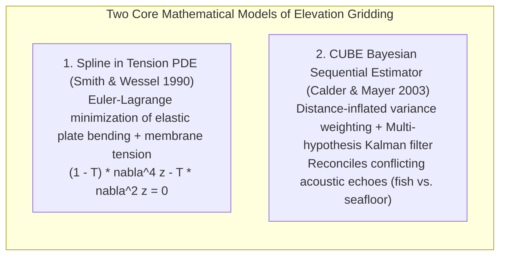
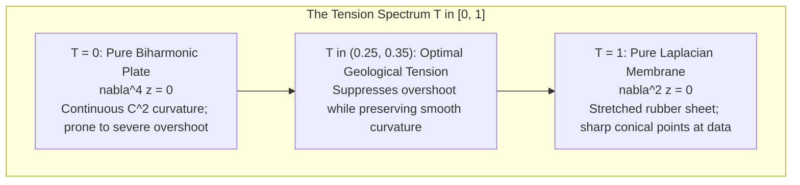
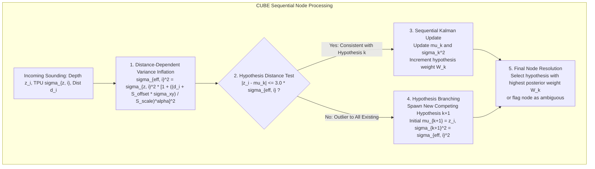

# Chapter 15: Point Clouds, Full Waveforms, Grids, TINs, Variable-Resolution Systems, and Overviews

*How raw sensor measurements are transformed, structured, and discretized into computational surface models.*

---

## 15.7 Mathematical Foundations of Surface Gridding and Hypothesis Estimation

Discretizing unstructured physical measurements into an elevation grid requires solving fundamental partial differential equations (PDEs) or evaluating sequential Bayesian estimators. This section derives the two foundational mathematical models of elevation gridding: the continuous curvature spline in tension partial differential equation, and the sequential Kalman updating equations governing hydrographic multi-hypothesis CUBE estimation.

---

### 15.7.1 The Continuous Curvature Spline in Tension PDE (Smith & Wessel 1990)

When interpolating sparse geoscientific observations, a classic cubic spline or biharmonic plate produces a smooth surface with continuous second derivatives ($C^2$). However, over rugged topography or steep ocean trenches, unconstrained biharmonic splines suffer from **spline overshoot**—the interpolated surface oscillates wildly beyond data points, generating phantom depressions or artificial ridges.

#### Step 1: Variational Formulation and Total Energy Functional
Wessel and Smith (1990) modeled the interpolated surface $z(x, y)$ as a physical thin elastic plate subjected to internal surface tension. The total energy functional $E[z]$ combines the bending energy of the plate (governed by the Laplacian $\nabla^2 z$) and the membrane stretching energy (governed by the gradient $\nabla z$):

$$E[z] = \iint_{\Omega} \left[ (1 - T) \left( \nabla^2 z \right)^2 + T \left( \|\nabla z\| \right)^2 \right] dx \, dy$$

where:
* $\nabla^2 z = \frac{\partial^2 z}{\partial x^2} + \frac{\partial^2 z}{\partial y^2}$ is the 2D Laplacian operator.
* $\|\nabla z\|^2 = \left(\frac{\partial z}{\partial x}\right)^2 + \left(\frac{\partial z}{\partial y}\right)^2$ is the squared surface gradient.
* $T \in [0, 1]$ is the non-dimensional **tension parameter**.

#### Step 2: Deriving the Euler-Lagrange Differential Equation
To find the surface $z(x, y)$ that minimizes the functional $E[z]$ subject to passing through the observation constraints $z(x_k, y_k) = z_k$, we apply the calculus of variations. 

Let $\delta z$ be an arbitrary smooth perturbation vanishing on the boundary $\partial\Omega$ and at all data points. The first variation $\delta E$ is:

$$\delta E = 2 \iint_{\Omega} \left[ (1 - T) (\nabla^2 z) \nabla^2 (\delta z) + T \nabla z \cdot \nabla(\delta z) \right] dx \, dy = 0$$

Applying Green's second identity to the bending term:

$$\iint_{\Omega} (\nabla^2 z) \nabla^2 (\delta z) \, dx \, dy = \iint_{\Omega} \left( \nabla^2 (\nabla^2 z) \right) \delta z \, dx \, dy + \oint_{\partial\Omega} \dots = \iint_{\Omega} (\nabla^4 z) \delta z \, dx \, dy$$

where $\nabla^4 z = \frac{\partial^4 z}{\partial x^4} + 2\frac{\partial^4 z}{\partial x^2 \partial y^2} + \frac{\partial^4 z}{\partial y^4}$ is the **biharmonic operator**.

Applying the divergence theorem to the tension term:

$$\iint_{\Omega} \nabla z \cdot \nabla(\delta z) \, dx \, dy = -\iint_{\Omega} (\nabla^2 z) \delta z \, dx \, dy + \oint_{\partial\Omega} \dots$$

Substituting these back into the variational equation:

$$\delta E = 2 \iint_{\Omega} \left[ (1 - T) \nabla^4 z - T \nabla^2 z \right] \delta z \, dx \, dy = 0$$

Because this integral must vanish for any arbitrary perturbation $\delta z$, the fundamental PDE governing the surface between observation points is:

$$(1 - T) \nabla^4 z - T \nabla^2 z = 0$$

#### Step 3: Finite Difference Discretization
On a square grid with spacing $h = \Delta x = \Delta y$, the biharmonic and Laplacian operators are discretized using 13-point and 5-point stencils:

$$\nabla^2 z_{i, j} \approx \frac{1}{h^2} \left[ z_{i+1, j} + z_{i-1, j} + z_{i, j+1} + z_{i, j-1} - 4 z_{i, j} \right]$$

$$\nabla^4 z_{i, j} \approx \frac{1}{h^4} \left[ 20 z_{i, j} - 8(z_{i+1, j} + \dots) + 2(z_{i+1, j+1} + \dots) + (z_{i+2, j} + \dots) \right]$$

The PDE is solved iteratively using Successive Over-Relaxation (SOR) with Chebyshev acceleration, forming the numerical engine of GMT's `surface`. Setting $T \approx 0.25\text{–}0.35$ eliminates artificial oscillations near steep scarps while maintaining smooth geomorphic transitions.

---

### 15.7.2 The CUBE Bayesian Multi-Hypothesis Estimator (Calder & Mayer 2003)

In acoustic bathymetry, gridding cannot assume that all soundings within a cell are noisy samples of a single physical surface. False echoes from fish schools, submerged cables, and acoustic multiples contaminate the data. The **Combined Uncertainty and Bathymetry Estimator (CUBE)** maintains multiple competing depth hypotheses at each grid node using sequential Bayesian updating.

#### Step 1: Distance-Dependent TPU Variance Inflation
Consider a grid node located at $(X_{\text{node}}, Y_{\text{node}})$. An incoming sounding $i$ has measured depth $z_i$, Total Vertical Uncertainty $\sigma_{z, i}$, Total Horizontal Uncertainty $\sigma_{xy, i}$, and horizontal Euclidean distance $d_i$ from the node:

$$d_i = \sqrt{(X_i - X_{\text{node}})^2 + (Y_i - Y_{\text{node}})^2}$$

Because a sounding located away from the node center is a less reliable estimate of node depth (due to unmodeled terrain slope), CUBE inflates its vertical variance:

$$\sigma_{\text{eff}, i}^2 = \sigma_{z, i}^2 \left[ 1 + \left( \frac{d_i + S_{\text{offset}} \sigma_{xy, i}}{S_{\text{scale}}} \right)^\alpha \right]^2$$

where $S_{\text{scale}}$ is a user-defined distance scale factor (typically half the grid spacing), $S_{\text{offset}}$ accounts for horizontal positioning error, and $\alpha \approx 2$ is an exponential penalty.

#### Step 2: Sequential Kalman Hypothesis Updating
At each node, CUBE maintains $M$ active hypotheses $H_k = (\mu_k, \sigma_k^2, W_k)$ for $k \in \{1, \dots, M\}$, where $\mu_k$ is the estimated depth, $\sigma_k^2$ is the posterior variance, and $W_k$ is the accumulated evidence weight.

When sounding $z_i$ arrives:
1. **Hypothesis Consistency Test:** The algorithm tests whether $z_i$ is statistically consistent with any existing hypothesis $H_k$ using a normalized Gaussian distance threshold (typically $3\sigma$):
   $$\frac{|z_i - \mu_k|}{\sqrt{\sigma_k^2 + \sigma_{\text{eff}, i}^2}} \le 3.0$$
2. **Kalman Update:** If consistent, the sounding is assimilated into hypothesis $H_k$:
   * **Kalman Gain ($K_i$):**
     $$K_i = \frac{\sigma_k^2}{\sigma_k^2 + \sigma_{\text{eff}, i}^2}$$
   * **Updated Mean Depth ($\mu_k$):**
     $$\mu_{k, \text{new}} = \mu_{k, \text{old}} + K_i \left( z_i - \mu_{k, \text{old}} \right)$$
   * **Updated Variance ($\sigma_k^2$):**
     $$\sigma_{k, \text{new}}^2 = (1 - K_i) \, \sigma_{k, \text{old}}^2$$
   * **Accumulated Evidence Weight ($W_k$):**
     $$W_{k, \text{new}} = W_{k, \text{old}} + \frac{1}{\sigma_{\text{eff}, i}^2}$$
3. **Hypothesis Branching:** If $z_i$ fails the consistency test for all existing hypotheses, CUBE creates a new competing hypothesis $H_{M+1}$ initialized with mean $\mu_{M+1} = z_i$ and variance $\sigma_{M+1}^2 = \sigma_{\text{eff}, i}^2$.

#### Step 3: Hypothesis Resolution and Ambiguity Flagging
At the conclusion of the survey, the node selects the hypothesis with the maximum accumulated weight $W_k$. If two competing hypotheses have comparable weights (e.g., dense acoustic returns from a submerged wreck sitting $5\text{ m}$ above the seafloor), CUBE flags the node as **Ambiguous**, alerting hydrographers to manually inspect the feature before updating nautical charts.
