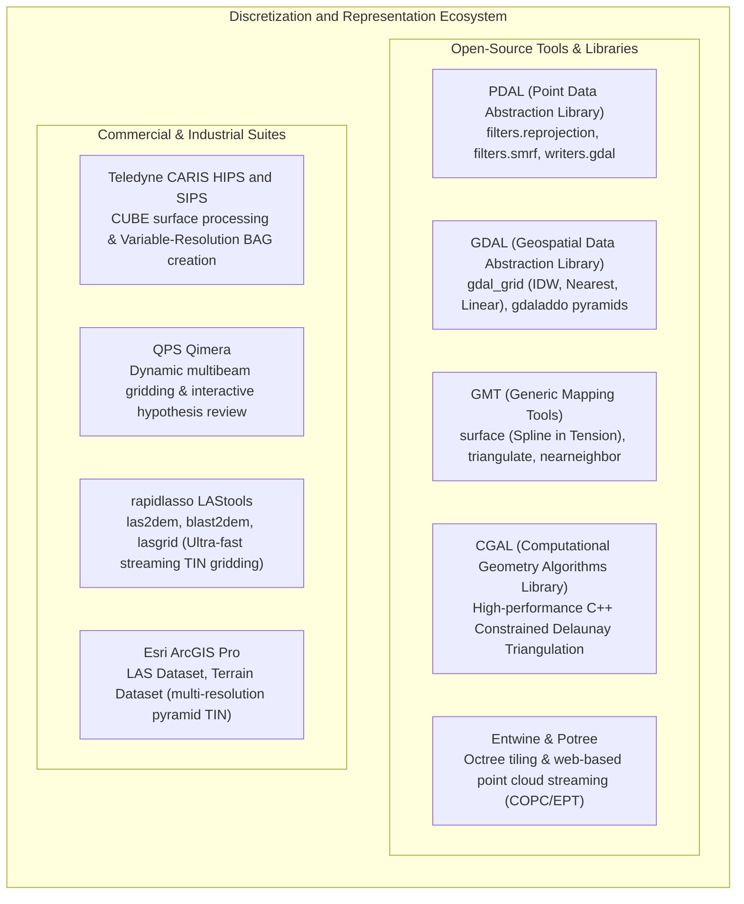

# Chapter 15: Point Clouds, Full Waveforms, Grids, TINs, Variable-Resolution Systems, and Overviews

*How raw sensor measurements are transformed, structured, and discretized into computational surface models.*

---

## 15.8 Software Ecosystem for Point Clouds, Meshes, and Raster Discretization

The transformation of raw spatial coordinates into continuous digital surface models is powered by an extensive ecosystem of command-line tools, computational geometry libraries, and proprietary hydrographic suites.



---

### 15.8.1 Open-Source Tools and Pipelines

#### PDAL: End-to-End Point Cloud Filtering and Gridding
PDAL provides declarative JSON pipelines that chain point cloud filtering, ground classification, and raster surface generation:

```json
{
  "pipeline": [
    {
      "type": "readers.copc",
      "filename": "https://s3.amazonaws.com/elevation-tiles-prod/copc/project_tile.copc.laz"
    },
    {
      "type": "filters.range",
      "limits": "Classification[2:2]"
    },
    {
      "type": "writers.gdal",
      "filename": "bare_earth_dtm.tif",
      "resolution": 1.0,
      "output_type": "min",
      "data_type": "float32",
      "gdalopts": "COMPRESS=DEFLATE,PREDICTOR=3,TILED=YES"
    }
  ]
}
```

* The pipeline streams points directly from a cloud-optimized COPC URL over HTTP.
* It filters exclusively for **Class 2 (Bare Earth)** ground returns.
* `writers.gdal` bins the points into a $1.0\text{-meter}$ raster, resolving cell elevations using the minimum return elevation (`output_type: "min"`), and writing a compressed GeoTIFF.

#### GMT: Rigorous Spline in Tension Gridding
To grid irregularly spaced geophysical or bathymetric soundings into a smooth surface using the Smith and Wessel (1990) biharmonic spline-in-tension PDE:

```bash
# 1. Pre-filter spatial soundings into block medians to prevent spatial aliasing
gmt blockmedian soundings.xyz -R-122.5/-122.0/37.5/38.0 -I100e -V > soundings_block.xyz

# 2. Fit continuous curvature spline in tension (T = 0.35)
gmt surface soundings_block.xyz -R-122.5/-122.0/37.5/38.0 -I100e -T0.35 -Gbathymetry_spline.nc -V

# 3. Compute directional gradient grid (slope illumination)
gmt grdgradient bathymetry_spline.nc -A315 -Ne0.8 -Ggradient_shade.nc
```

#### CGAL: Constrained Delaunay Triangulation
For high-performance vector surface modeling, the Computational Geometry Algorithms Library (**CGAL**) provides exact arithmetic 2D and 3D Constrained Delaunay Triangulation (CDT) kernels in C++:
* Guarantees robustness against floating-point precision round-off errors.
* Enforces hard breaklines (vector road edges, river thalwegs, building walls) without introducing topological cracks.

---

### 15.8.2 Commercial and Industrial Suites

#### Teledyne CARIS HIPS and SIPS
CARIS is the premier software suite used by national hydrographic offices (NOAA, UKHO, CHS):
* Native implementation of the CUBE algorithm and the Variable-Resolution Bathymetric Attributed Grid (VR-BAG).
* Allows hydrographers to navigate complex multi-hypothesis nodes, resolving ambiguous seabed features (such as thin mast structures on wrecks) with visual 3D slice tools.

#### QPS Qimera
QPS Qimera is designed for rapid multibeam bathymetric processing:
* **Dynamic Surface Engine:** Grids soundings on-the-fly during data ingestion.
* When soundings are cleaned or motion parameters are updated, Qimera updates only the affected surface tiles incrementally, eliminating full-project re-gridding bottlenecks.

#### rapidlasso LAStools (`las2dem` and `blast2dem`)
Developed by Martin Isenburg, LAStools is renowned for its streaming memory architecture:
* `las2dem` and `blast2dem` compute temporary Delaunay triangulations in streaming buffers, enabling users to grid billions of LiDAR points into seamless GeoTIFF rasters on low-memory laptop computers without crashing.

#### Esri ArcGIS Pro (Terrain Datasets)
Esri's **Terrain Dataset** is a multi-resolution, triangulated irregular network data structure stored inside an enterprise geodatabase:
* Constructs vector pyramids: fine triangles are simplified into generalized, coarser Delaunay facets at smaller display scales.
* Integrates 3D feature classes (curbs, water bodies, spot heights) directly as hard and soft breaklines.

---

### 15.8.3 Feature Comparison Matrix

| Software Suite | License Model | Primary Representations | Key Mathematical Engine | Best-Suited Application |
| :--- | :--- | :--- | :--- | :--- |
| **PDAL** | Open-Source (BSD) | Point Cloud, Mesh, Raster | Octrees, SMRF filtering, GDAL rasterization | Automated batch point cloud filtering and DTM generation. |
| **GDAL** | Open-Source (MIT/X) | Regular Raster (GeoTIFF/COG) | Moving-average, IDW, nearest, bicubic | Geotransform conversion, format translation, overview creation. |
| **GMT** | Open-Source (LGPLv3) | NetCDF Grids | Smith & Wessel biharmonic spline-in-tension | Regional geophysical, tectonic, and bathymetric gridding. |
| **CGAL** | Open-Source (GPL/LGPL) | Vector TINs / 3D Meshes | Exact arithmetic Constrained Delaunay Triangulation | High-precision computational geometry and CAD breakline modeling. |
| **Entwine / Potree** | Open-Source (MIT) | COPC / EPT Octrees | Hierarchical level-of-detail spatial indexing | Web browser streaming and visualization of billions of points. |
| **CARIS HIPS** | Commercial (Teledyne) | CUBE Grids, VR-BAG | Bayesian Kalman multi-hypothesis CUBE | Nautical charting, hydrographic compliance, and VR-BAG creation. |
| **QPS Qimera** | Commercial (QPS) | Dynamic Multi-Res Grids | CUBE + dynamic incremental surface updates | Vessel-board multibeam QA and rapid chart production. |
| **LAStools** | Commercial / Core Open | LAS / LAZ / GeoTIFF | Streaming buffer Delaunay TIN rasterization | High-throughput LiDAR point cloud gridding on modest hardware. |
| **Esri ArcGIS Pro** | Commercial (Esri) | Terrain Dataset, Raster | Triangulated vector pyramids with breaklines | Integrated GIS civil infrastructure and floodplain analysis. |
