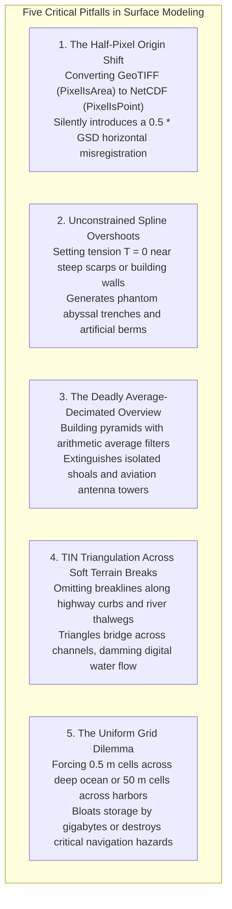

# Chapter 15: Point Clouds, Full Waveforms, Grids, TINs, Variable-Resolution Systems, and Overviews

*How raw sensor measurements are transformed, structured, and discretized into computational surface models.*

---

## 15.9 Common Pitfalls and Key Takeaways

Converting unstructured point observations into continuous surfaces and multi-scale pyramids is filled with subtle geometric, mathematical, and operational pitfalls. Understanding these failure modes prevents multi-meter georeferencing shifts, hazardous overview artifacts, and unphysical surface oscillations.

---

### 15.9.1 Common Pitfalls in Surface Representation and Gridding

#### 1. The Half-Pixel Origin Shift (`PixelIsArea` vs. `PixelIsPoint`)
Failing to track pixel registration metadata when converting between geospatial formats is one of the most common causes of undocumented horizontal misregistration:
* In GeoTIFF, the standard convention is `AREA_OR_POINT=Area`: the georeferenced origin $(X_{\text{origin}}, Y_{\text{origin}})$ defines the **outer top-left corner** of the cell.
* In NetCDF, GMT, and many scientific gridded formats, the standard convention is `PixelIsPoint` (or grid-node registration): the origin defines the **center of the first data sample**.
* Ingesting a `PixelIsArea` raster into software expecting `PixelIsPoint` shifts every data point half a pixel to the south and east ($\Delta X = +0.5\Delta x, \Delta Y = -0.5\Delta y$). On steep mountain slopes, this half-pixel registration error induces multi-meter vertical elevation discrepancies.

#### 2. Spline Overshoot and Ringing Artifacts
Interpolating sparse or abrupt topographic data using unconstrained minimum-curvature splines (such as a pure biharmonic plate with tension $T = 0$):
* At the base of a steep continental slope or near a sheer cliff edge, the mathematical spline bends sharply to match the steep gradient, overshooting below the true data points before recovering.
* This generates artificial "moats," "trenches," or depression sinks at the base of slopes, and artificial "berms" or ridges along plateau edges.
* Practitioners must inject non-zero tension ($T \approx 0.25\text{–}0.35$ in GMT `surface`) to suppress artificial ringing.

#### 3. Navigating on Average-Downsampled Overviews
Relying on standard arithmetic average or bilinear overview pyramids for navigation or flight planning:
* Averaging $2 \times 2$ or $4 \times 4$ cells dilutes isolated extrema. A dangerous $2\text{-m}$ submerged rock or $300\text{-m}$ radio tower is averaged with surrounding deep water or valley terrain, completely vanishing from coarse overview displays.
* Nautical charts must mandate **Minimum Depth (Shoal-Biased)** overviews; aviation systems must mandate **Maximum Elevation** overviews.

#### 4. Omission of Breaklines in TIN Meshes
Building a Triangulated Irregular Network directly from raw LiDAR ground points without enforcing vector breaklines:
* The Delaunay algorithm connects points based purely on 2D planar proximity, ignoring physical hydrology and civil engineering structures.
* Triangles bridge across narrow river channels (thalwegs) and drainage ditches, creating artificial triangular dams that block digital water flow in hydraulic models.
* Along highway corridors, triangles cut across vertical curbs, smoothing distinct $15\text{-cm}$ step edges into gentle $45^\circ$ ramps. Hard breaklines must be enforced in all engineering TINs.

#### 5. The Uniform-Resolution Compromise
Attempting to represent a multi-scale coastal or regional survey with a single fixed-resolution raster:
* Forcing a uniform $0.5\text{-m}$ cell size across an entire continental shelf creates multi-gigabyte files filled with redundant, interpolated cells.
* Forcing a coarse $20\text{-m}$ grid erases critical shallow features and harbor berths.
* Modern workflows should employ **Variable-Resolution BAGs (VR-BAG)** or **Constrained TINs** to adapt cell size dynamically to local data density.

---

### 15.9.2 Key Takeaways for Practitioners

1. **Gridding Is an Irreversible Filter:** Transforming an irregular point cloud into a regular grid is a lossy operation. The resulting surface reflects both the physical terrain and the mathematical assumptions of the interpolation kernel. Choose your gridding algorithm based on domain physics (CUBE for hydrography, splines in tension for smooth geophysics, TINs with breaklines for civil engineering).
2. **Explicitly Declare Pixel Registration:** Never export a raster without verifying whether its origin denotes the cell corner (`PixelIsArea`) or the cell center (`PixelIsPoint`). An unnoticed mismatch causes an immediate half-pixel horizontal displacement.
3. **Decimate with Purpose:** The algorithm used to generate overview pyramids must match the operational threat model: use `min` for navigation safety, `max` for obstacle avoidance, and `average` only for volumetric mass conservation.
4. **Preserve Structural Geometry with Breaklines:** When sharp slope breaks (cliffs, curbs, ridges, stream channels) govern surface behavior, regular rasters blur reality. Use Constrained Delaunay Triangulations to lock linear boundaries directly into the mesh topology.
5. **Embrace Hierarchical and Variable-Resolution Structures:** Cloud-Optimized Point Clouds (COPC) and Variable-Resolution BAGs eliminate the trade-off between massive data volume and localized spatial precision, allowing seamless streaming from harbor berths to abyssal plains.
