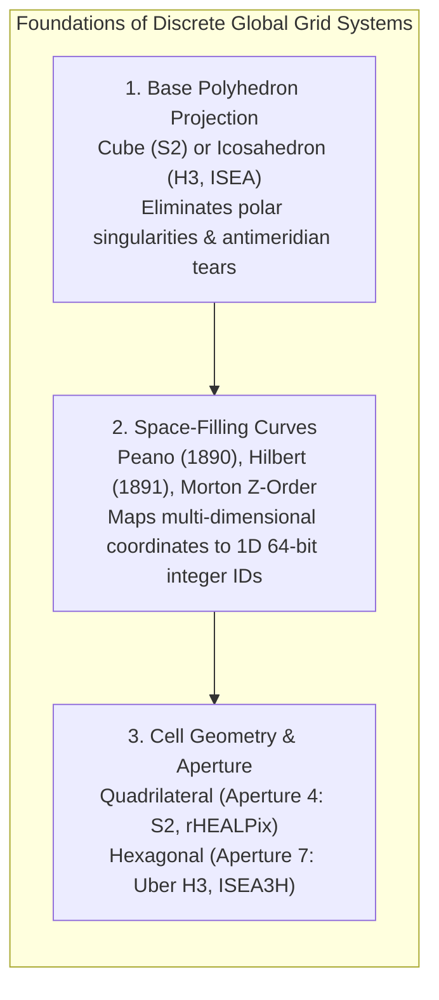
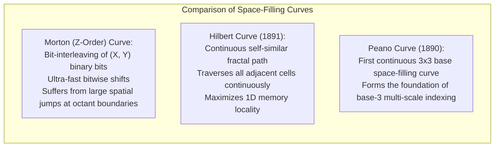
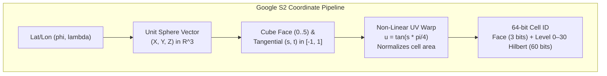
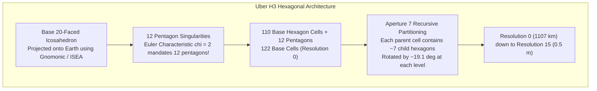

# Chapter 16: Discrete Global Grid Systems (S2, H3) and Special Location Coding Schemes

*Indexing a spherical/ellipsoidal planet without polar singularities or projection seams—and the pitfalls of geocoding schemes.*

Traditional digital elevation modeling relies on map projections (such as Universal Transverse Mercator [UTM] or Web Mercator) that flatten the curved Earth onto a 2D Euclidean plane. However, all planar map projections introduce geometric distortion: scale distortion, area distortion, tear seams along the $180^\circ$ antimeridian, and extreme singularities at the North and South Poles. When elevation models span continents, ocean basins, or planetary bodies, planar rasters become mathematically and computationally fragile.

To overcome these distortions, modern geospatial architectures increasingly represent topography directly on the sphere or ellipsoid using **Discrete Global Grid Systems (DGGS)**. Powered by fractal space-filling curves and polyhedral projections, DGGS frameworks partition the entire planetary surface into hierarchical, tessellated cells, transforming 2D spatial indexing into lightning-fast 64-bit integer queries.

---

## 16.1 Space-Filling Curves and Discrete Global Grid Systems (DGGS)

A Discrete Global Grid System (standardized by the Open Geospatial Consortium in OGC Topic 21 / ISO 19170-1) is a spatial reference system that uses a hierarchical tessellation of cells to partition and address the globe.

---

### 16.1.1 The Mathematics of Space-Filling Curves (Peano, Hilbert, Morton)

A space-filling curve is a continuous mathematical mapping from the unit interval $I = [0, 1]$ onto the higher-dimensional unit hypercube $I^n = [0, 1]^n$:

$$\gamma: [0, 1] \to [0, 1]^n \quad \text{such that } \gamma([0, 1]) = [0, 1]^n$$

#### 1. Giuseppe Peano (1890)
In 1890, Italian mathematician Giuseppe Peano discovered the first continuous space-filling curve. Peano constructed a surjective mapping using base-3 arithmetic that completely fills a 2D square, disproving the historical assumption that a 1D continuous curve could never have non-zero 2D area.

#### 2. David Hilbert (1891)
In 1891, David Hilbert developed a geometric, base-2 space-filling curve that eliminated Peano's coordinate inversions. The **Hilbert curve** is generated recursively by rotating and reflecting four quadrant sub-curves. Crucially, the Hilbert curve is **spatially continuous**: points that are adjacent along the 1D curve are guaranteed to be adjacent in 2D space, minimizing the bounding-box perimeter of contiguous 1D memory segments.

#### 3. Morton Z-Order
Guy Macdonald Morton (1966) introduced the **Z-order curve**, constructed by interleaving the binary bits of coordinate values:
$$\text{Morton}(X, Y) = \text{interleave}(\text{binary}(X), \, \text{binary}(Y))$$
While computationally trivial to evaluate using SIMD bit-manipulation instructions (e.g., `PEXT`/`PDEP` on modern x86 CPUs), the Z-order curve suffers from severe **discontinuities**: jumping across quadrant boundaries involves massive 1D index leaps between points that are immediate 2D neighbors.

---

### 16.1.2 Google S2 Geometry: Cube-Hilbert Quadtrees

The **Google S2 Geometry** library (released as open-source C++ in 2011) models the Earth as a sphere inscribed within a regular cube.

#### 1. Cube-to-Sphere Projection and Non-Linear Warping
The Earth is enclosed in a cube with 6 faces (numbered 0 to 5). Projecting points from the sphere center onto flat cube faces produces significant area distortion: corners of a cube face are $\sqrt{3} \approx 1.732$ times farther from the center than the face midpoint. 

To equalize cell areas across the sphere, S2 applies a non-linear coordinate transformation. Three warping models are available:
* **Linear projection:** $u = s$ (high area variance).
* **Tangent projection:** $u = \tan\left(\frac{\pi}{4} s\right)$ (minimizes maximum area distortion).
* **Quadratic projection:** $u = \frac{1}{2} s (1 + \frac{1}{3} s^2)$ (approximates tangent warp with ultra-fast polynomial floating-point operations).

#### 2. 64-Bit S2 Cell Hierarchy
Each cube face is recursively subdivided into an **Aperture 4 Quadtree** indexed by a 1D Hilbert curve:
* Level 0 consists of the 6 primary cube faces ($85,000,000\text{ km}^2$ per face).
* Each successive level subdivides cells by a factor of 4.
* Level 30 reaches a spatial cell size of approximately **$0.48\text{ cm} \times 0.70\text{ cm}$** ($<1\text{ cm}^2$).
* Every S2 cell is uniquely identified by a single **64-bit unsigned integer (`uint64`)**:
  * Bits 61–63: Cube face ($0\text{–}5$).
  * Bits 1–60: Hilbert curve trajectory (2 bits per level $\times 30$ levels).
  * Lowest 1-bit: Trailing sentinel marker encoding the resolution level.
* **Exact Containment:** Because S2 is a true quadtree, every child cell is mathematically and geometrically **$100\%$ contained** within its parent cell.

---

### 16.1.3 Uber H3: Icosahedral Hierarchical Hexagonal Grids

Developed by Uber and open-sourced in 2018, **H3** partitions the globe into a hierarchical hexagonal grid based on an **icosahedron** (a 20-faced regular polyhedron).

#### Why Hexagons?
1. **Isotropic Adjacency:** In a square grid, a cell has 4 edge-sharing orthogonal neighbors (distance $d = 1$) and 4 corner-sharing diagonal neighbors (distance $d = \sqrt{2}$). This anisotropic distance distortion corrupts gradient calculations and hydrologic flow routing. In a hexagonal grid, every cell has **exactly 6 equidistant neighbors** sharing identical edge lengths and center-to-center distances ($d = \text{constant}$).
2. **Minimal Perimeter-to-Area Ratio:** By the hexagonal honeycomb theorem (proved by Thomas Hales in 1999), a regular hexagonal tessellation minimizes the boundary perimeter for a given area, minimizing edge effects in spatial modeling.

#### The 12 Unavoidable Pentagons
A sphere cannot be tessellated purely with hexagons. By Euler's polyhedral formula ($V - E + F = 2$), any closed hexagonal spherical mesh must contain **exactly 12 pentagons** located at the vertices of the base icosahedron. In H3, these 12 pentagons are placed in remote oceanic or wilderness regions to minimize operational interference.

#### Aperture 7 Scaling and Non-Exact Containment
H3 scales across 16 resolution levels (Resolution 0 to 15) using an **Aperture 7** hierarchy:
* At each finer level, cell area decreases by a factor of 7 ($A_{k+1} = \frac{1}{7} A_k$).
* However, regular hexagons cannot be subdivided into smaller regular hexagons. Consequently, an H3 parent cell **does not strictly contain** its 7 child cells; child hexagons overlap parent boundaries, requiring probabilistic or centroid-based parent-child assignment.

---

### 16.1.4 Comparison of Global Grid Architectures

| Characteristic | Google S2 Geometry | Uber H3 | rHEALPix | Classical UTM Raster |
| :--- | :--- | :--- | :--- | :--- |
| **Base Polyhedron** | Cube (6 faces) | Icosahedron (20 faces) | Spherical Cube (6 faces) | Transverse Mercator Cylinder |
| **Cell Geometry** | Quadrilateral (Curved square) | **Hexagon** (+ 12 pentagons) | Rectangles & Squares | Square / Rectangular Pixels |
| **Neighbor Symmetry**| 4 edge + 4 diagonal (Anisotropic) | **6 Equidistant (Isotropic)** | 4 edge + 4 diagonal | 4 edge + 4 diagonal |
| **Aperture Ratio** | **Aperture 4** (Exact $1:4$) | **Aperture 7** ($\approx 1:7$) | **Aperture 9** (Exact $1:9$) | None (Planar tiles) |
| **Child Containment**| **100% Exact** (True Quadtree) | Overlapping / Approximate | **100% Exact** | Exact |
| **Area Distortion** | Low (via non-linear warp) | Very Low ($<1.5\%$) | **Strictly Equal-Area** | Extreme at swath margins |
| **Polar Behavior** | Continuous (no singularities) | Continuous (hexagons at poles)| Continuous | Fails ($>84^\circ\text{ N} / 80^\circ\text{ S}$) |
| **Primary Elevation Use**| Planetary quadtree DEM tiles | Isotropic hydrology & slope | Global climate & terrain rasters| Local high-res engineering |
