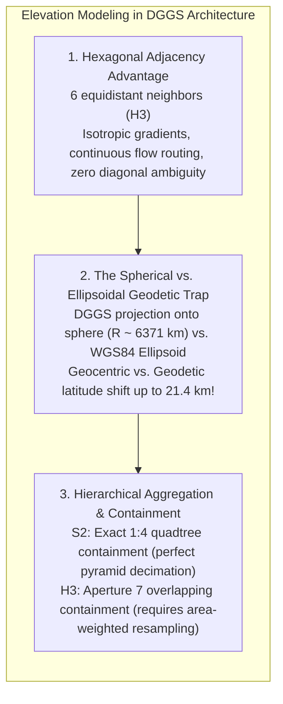
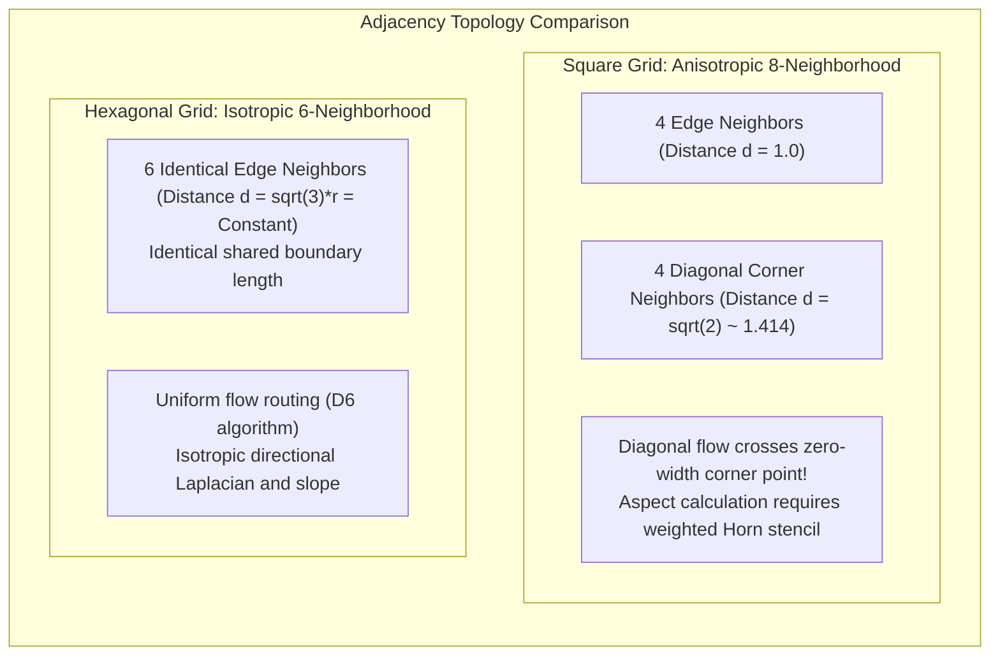
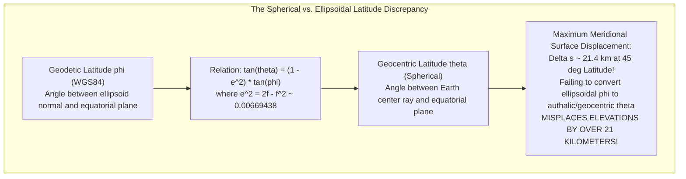
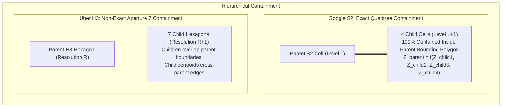

# Chapter 16: Discrete Global Grid Systems (S2, H3) and Special Location Coding Schemes

*Indexing a spherical/ellipsoidal planet without polar singularities or projection seams—and the pitfalls of geocoding schemes.*

---

## 16.2 Storing and Analyzing Elevation on S2 and H3 Cells

While Discrete Global Grid Systems (DGGS) were originally popularized for point geofencing, ride-hailing demand modeling, and satellite imagery indexing, their application to continuous elevation modeling offers profound analytical advantages—alongside unique geometric and computational challenges. Storing elevation on S2 or H3 cells requires addressing the fundamental trade-off between hexagonal isotropic symmetry and hierarchical containment, as well as bridging the mathematical gap between spherical DGGS coordinate models and the ellipsoidal Earth.

---

### 16.2.1 The Hexagonal Adjacency Advantage: Isotropic Gradients and Hydrology

In traditional square elevation rasters, spatial operators suffer from **directional anisotropy**:

#### Directional Slope and Curvature on H3
Because all six immediate neighbors in an H3 grid share identical center-to-center distances ($d$), spatial gradient and Laplacian operators are isotropic. 

Let $z_0$ denote the elevation of the central hexagon, and let $z_1, z_2, \dots, z_6$ denote the elevations of its six neighbors ordered sequentially by azimuth ($\theta_k = \frac{\pi}{3} k$). The discrete Laplacian $\nabla^2 z$ on a regular hexagonal grid is:

$$\nabla^2 z = \frac{2}{3 d^2} \sum_{k=1}^6 \left( z_k - z_0 \right)$$

This formula is completely invariant to grid rotation, eliminating the directional biases that plague square rasters (where slopes along diagonal axes are artificially dampened unless smoothed by multi-directional kernels). In hydrologic modeling, hexagonal grids eliminate the notorious "D8 diagonal routing ambiguity," where water is forced to jump across an infinitesimal point vertex between diagonally adjacent cells.

---

### 16.2.2 The Geodetic Trap: Spherical DGGS vs. The Ellipsoidal Earth

The most dangerous pitfall in ingesting high-precision elevation data into DGGS frameworks is the **Spherical vs. Ellipsoidal Latitude Discrepancy**.

Both Google S2 and Uber H3 project coordinates from an idealized **sphere** of mean Earth radius $R \approx 6,371,007.18\text{ m}$. However, real-world digital elevation models (LiDAR, photogrammetry, multibeam bathymetry) are referenced to the **GRS80 or WGS84 reference ellipsoid** ($a = 6,378,137.0\text{ m}, b \approx 6,356,752.314\text{ m}$, flattening $f \approx 1/298.257223563$).

#### The Mathematical Shift
The relationship between geodetic latitude $\phi$ (measured by GNSS) and geocentric spherical latitude $\theta$ is:

$$\tan\theta = (1 - e^2) \tan\phi = \left( \frac{b^2}{a^2} \right) \tan\phi$$

The difference $\Delta\phi = \phi - \theta$ reaches its maximum at $\phi = 45^\circ$:

$$\Delta\phi_{\max} \approx \frac{e^2}{2} \sin(2\phi) \approx \frac{0.00669438}{2} \sin(90^\circ) \approx 0.003347\text{ rad} \approx 11.5'\text{ (arcminutes)}$$

Multiplying this angular shift by the Earth's radius:

$$\Delta s = R \cdot \Delta\phi_{\max} \approx 6,371,000\text{ m} \times 0.003347\text{ rad} \approx \mathbf{21,324\text{ m} \quad (\approx 21.4\text{ km})}$$

#### Operational Solution
When ingesting elevation points into an H3 or S2 index:
1. Software must determine whether the specific DGGS library implementation expects **geodetic latitude** on the WGS84 ellipsoid (which H3's C library natively accepts, converting internally via authalic latitude mapping) or raw **geocentric spherical latitude**.
2. If raw spherical equations are used without ellipsoid conversion, an elevation value sampled at the summit of Mount Rainier will be indexed into an H3 cell located $21\text{ km}$ to the south!

---

### 15.2.3 Exact Quadtree Containment (S2) vs. Non-Exact Containment (H3)

Storing multi-resolution elevation pyramids highlights a fundamental structural divergence between S2 and H3:

#### S2: Perfect Hierarchical Pyramids
Because S2 is an Aperture 4 quadtree, hierarchical decimation is exact and lossless:
* Every parent cell at Level $L$ is the exact geometric union of its four child cells at Level $L+1$.
* Computing min-depth, max-obstacle, or mean elevation overviews is computationally trivial: each parent cell aggregates its four child cell values directly without spatial resampling or area weighting.

#### H3: The Aperture 7 Fractional Resampling Penalty
Regular hexagons cannot be partitioned into smaller regular hexagons. In an Aperture 7 hierarchy:
* A child hexagon at Resolution $R+1$ is rotated by $\approx 19.1^\circ$ relative to its Resolution $R$ parent.
* Only the central child hexagon is entirely contained within the parent; the six peripheral child hexagons straddle the boundaries of two or three adjacent parent hexagons.
* Consequently, aggregating high-resolution H3 elevation cells into coarse H3 cells requires **area-weighted intersection resampling**:
  $$Z_{\text{parent}} = \frac{\sum_{j} A(\text{Parent} \cap \text{Child}_j) \, Z_{\text{child}, j}}{\sum_j A(\text{Parent} \cap \text{Child}_j)}$$
  which is computationally expensive and introduces numerical smoothing across resolution boundaries.

---

### 16.2.4 GPU Hardware Limitations of DGGS Meshes

A major bottleneck preventing DGGS from replacing regular rasters in real-time simulation (e.g., flight simulators, game engines, and hydraulic solvers) is **GPU memory architecture**:
* Modern Graphics Processing Units (GPUs) contain dedicated hardware texture-mapping units (TMUs) specifically engineered to sample 2D rectilinear grids: hardware bilinear filtering, mipmapping, and caching are executed in single-clock cycles.
* Hexagonal H3 and cube-mapped S2 cells cannot be stored as contiguous 2D memory arrays without complex addressing logic or indirect lookup tables, sacrificing hardware texture filtering performance.
