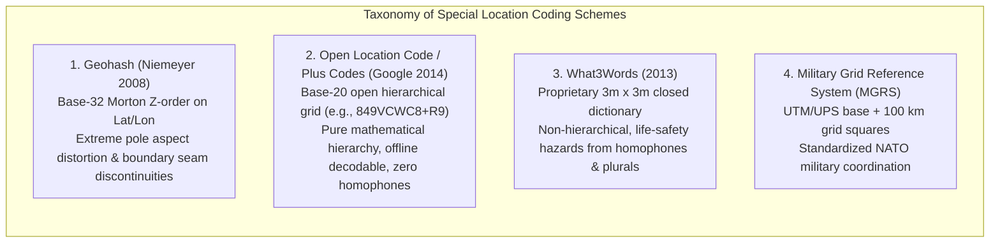
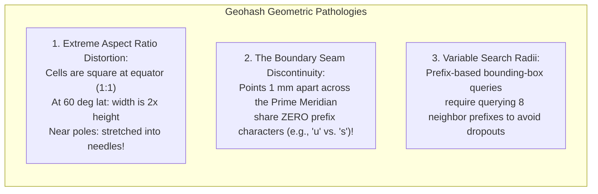
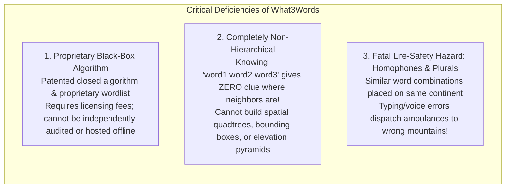

# Chapter 16: Discrete Global Grid Systems (S2, H3) and Special Location Coding Schemes

*Indexing a spherical/ellipsoidal planet without polar singularities or projection seams—and the pitfalls of geocoding schemes.*

---

## 16.3 Issues with Special Location Coding Schemes: Geohashes, Plus Codes, and Proprietary Word Grids

In parallel with mathematical Discrete Global Grid Systems (DGGS), the geospatial technology industry has developed numerous alphanumeric and linguistic location coding schemes designed to simplify coordinates for human communication, database indexing, and address geocoding. 

While schemes like **Geohash**, **Open Location Code (Plus Codes)**, and **What3Words** succeed in converting latitude and longitude into memorable strings, they introduce severe mathematical and operational pathologies when applied to digital elevation modeling, spatial analytics, or emergency dispatch.

---

### 16.3.1 Geohash: The Morton Z-Order Latitude/Longitude Trap

Invented by Gustavo Niemeyer in 2008, **Geohash** encodes latitude and longitude into an alphanumeric string using a base-32 character set (`0-9, b-z`, excluding `a, i, l, o` to avoid visual ambiguity). The encoding operates by interleaving bits of binary latitude and longitude in a 2D Morton Z-order curve.

While useful for simple key-value database queries, Geohash exhibits three fatal geometric flaws:

#### 1. Extreme Aspect Ratio Distortion
Because Geohash partitions geographic coordinates ($\phi, \lambda$) on an equirectangular projection, the physical east-west cell width scales with $\cos\phi$:
* At the equator ($\phi = 0^\circ$), a Level 6 Geohash is roughly $1.2\text{ km} \times 0.6\text{ km}$.
* At $60^\circ\text{ N}$ (e.g., Alaska or Norway), the physical width shrinks by half ($\cos 60^\circ = 0.5$).
* Near the poles ($\phi \to 90^\circ$), Geohash cells deform into infinitely thin, needle-like wedges, rendering spatial proximity queries and elevation slope calculations mathematically meaningless.

#### 2. The Boundary Seam Discontinuity
In Geohash, prefix matching does **not** imply spatial proximity:
* Two points located $1\text{ millimeter}$ apart on opposite sides of the Prime Meridian ($0^\circ$ longitude) or the Equator ($0^\circ$ latitude) share **zero common prefix characters** (e.g., `s000000` vs. `u000000`).
* A spatial database query filtering by `WHERE geohash LIKE 'u000%'` will completely miss points separated by inches across the boundary seam. To locate neighbors safely, software must compute the Geohash IDs of all eight surrounding bounding boxes.

---

### 16.3.2 Open Location Code (OLC / Plus Codes)

Introduced by Google's Zurich engineering team in 2014, **Open Location Code (OLC)**—commonly known as **Plus Codes**—was engineered as an open, royalty-free public utility to provide addresses for the estimated billions of people globally who live on unnamed roads or in informal settlements.

#### Key Engineering Features of Plus Codes
* **Open Standard & Offline Encoding:** OLC is defined by an open mathematical algorithm (Apache 2.0 license). Conversion between coordinates and Plus Codes requires zero database lookups and functions entirely offline inside embedded microcontrollers.
* **Base-20 Clean Alphabet:** Uses 20 characters (`23456789CFGHJMPQRVWX`), completely excluding vowels and easily confused characters (`1, l, I, 0, O`), making it impossible to form offensive words or suffer transcription errors.
* **Strict Hierarchical Containment:** A 10-character Plus Code (e.g., `849VCWC8+R9`) defines a bounding cell approximately $14\text{ m} \times 14\text{ m}$. Truncating the code to 8 characters (`849VCWC8+`) widens the bounding box to $275\text{ m} \times 275\text{ m}$, providing true spatial hierarchical zooming.

---

### 16.3.3 What3Words: Proprietary Locking and Life-Safety Hazards

Founded in 2013, **What3Words (W3W)** divides the entire globe into a regular grid of approximately 57 trillion $3\text{ m} \times 3\text{ m}$ squares, assigning each square a pseudo-random triplet of three dictionary words separated by dots (e.g., `filled.count.soap`). 

While heavily marketed to emergency services and consumer logistics, What3Words exhibits catastrophic architectural and safety deficiencies when audited from an engineering, geospatial, or emergency response perspective:

#### 1. Closed Proprietary Monopoly
Unlike latitude/longitude, UTM, S2, H3, and Plus Codes—all of which are open international standards—What3Words is a proprietary, closed-source system. The encoding algorithm and word-allocation database are patented trade secrets. Emergency services, mountain rescue teams, and GIS agencies that adopt W3W create a dangerous dependency on a single commercial entity, unable to perform spatial calculations if the company alters its licensing terms or ceases operations.

#### 2. Total Lack of Spatial Hierarchy
W3W is completely non-hierarchical:
* The three words assigned to a $3\text{-m}$ square provide **zero mathematical information** about the coordinates of adjacent squares.
* It is impossible to perform spatial range queries, calculate bounding boxes, compute terrain slope, or construct elevation pyramids using W3W strings. To perform any spatial operation, every three-word string must first be translated back into W3W's proprietary coordinate service.

#### 3. The Homophone and Plural Hazard in Emergency Dispatch
In emergency dispatch (e.g., reporting a hiker fallen off a mountain cliff or a vessel taking on water in heavy surf), voice communications over radio or cellular channels are degraded by wind, acoustic noise, panic, and local accents.

What3Words claims that similar-sounding word combinations are placed far apart (e.g., on different continents) so that operators can spot errors. However, investigative audits by mountain rescue teams and geospatial experts (e.g., Woods, 2021) revealed hundreds of pairs of **near-homophones, plurals, and common typos that resolve to locations within the same country or county**:
* For example, in the United Kingdom, `circle.coach.press` and `circles.coach.press` are separated by hundreds of miles. An emergency dispatcher mishearing an acoustic plural "s" over a noisy radio link risks sending a search-and-rescue helicopter to an entirely different national park.
* Mountain rescue teams (such as Mountain Rescue England and Wales) have issued official warnings urging dispatchers to demand raw GNSS coordinates rather than relying on proprietary word triplets.

---

### 16.3.4 Comparison of Special Coding Schemes

| Attribute | Geohash | Open Location Code (Plus Codes) | What3Words | Military Grid (MGRS) |
| :--- | :--- | :--- | :--- | :--- |
| **License / Status** | Open Domain | **Open Source (Apache 2.0)** | **Proprietary / Patented** | Open NATO Military Standard |
| **Underlying Geometry**| Morton Z-order on Lat/Lon | Hierarchical Quadtree-like | Arbitrary $3\text{ m} \times 3\text{ m}$ Grid | UTM / UPS Projection Grid |
| **Hierarchical?** | **Yes** (Prefix truncation) | **Yes** (Prefix truncation) | **No** (Zero spatial hierarchy)| **Yes** (Grid resolution digits) |
| **Offline Conversion** | Yes (Trivial math) | **Yes (Pure algorithm)** | No (Requires proprietary DB) | Yes (Standard map projection)|
| **Homophone Safe?** | Yes (No voice use) | **Yes (No vowels, clean base-20)**| **No (Severe homophone traps)**| Yes (Phonetic alphabet) |
| **Suitability for DEMs**| Poor (Aspect distortion)| Poor (Reference indexing only)| **Unusable** | Moderate (Local UTM tiles) |
