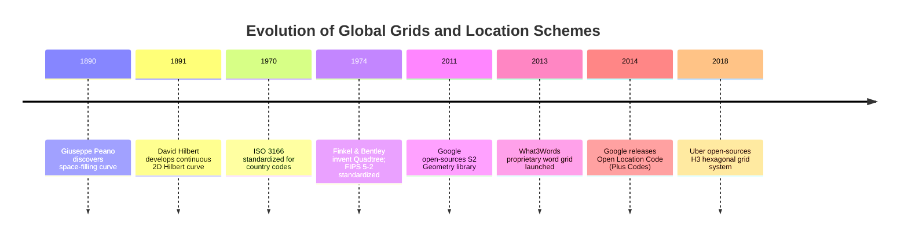
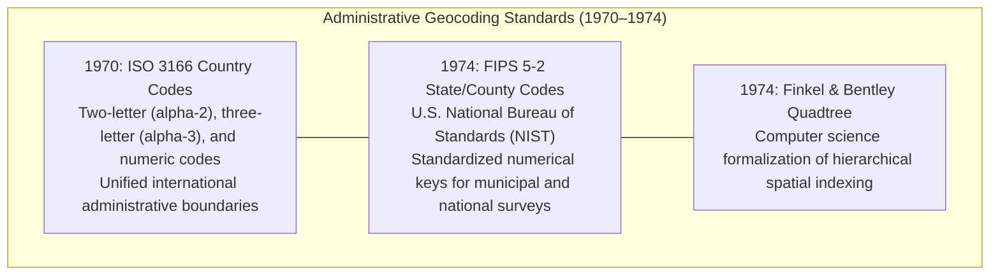

# Chapter 16: Discrete Global Grid Systems (S2, H3) and Special Location Coding Schemes

*Indexing a spherical/ellipsoidal planet without polar singularities or projection seams—and the pitfalls of geocoding schemes.*

---

## 16.4 Historical Evolution of Discrete Global Grids and Spatial Indexing

The emergence of Discrete Global Grid Systems and location codes represents a 130-year journey: originating as abstract mathematical puzzles in set theory, evolving through 20th-century geopolitical and administrative coding standards, and culminating in modern cloud-scale global indexing architectures.

---

### 16.4.1 The Pure Mathematical Foundations (1890–1891)

#### 1890: Giuseppe Peano and the First Space-Filling Curve
In 1890, Italian mathematician Giuseppe Peano published a short paper in *Mathematische Annalen* demonstrating a continuous mapping from the unit line segment $[0, 1]$ onto the unit square $[0, 1] \times [0, 1]$. Constructed purely analytically using ternary (base-3) arithmetic expansions, Peano's discovery challenged fundamental assumptions in mathematical analysis: it demonstrated that dimensionality is not preserved under continuous mappings.

#### 1891: David Hilbert and Geometric Locality
In 1891, David Hilbert recognized that Peano's construction could be visualized and generated geometrically. Hilbert introduced a recursive quadrant-subdivision curve using binary (base-2) reflections and rotations. 

Crucially, Hilbert's formulation possessed a unique property that Peano lacked: **optimal spatial locality**. Points that are close together in the 1D Hilbert index are almost always close together in 2D Euclidean space. Hilbert's 1891 curve became the direct mathematical foundation for spatial database clustering, modern point cloud indexing, and Google S2 Geometry.

---

### 16.4.2 Administrative and Geopolitical Standardization (1970–1974)

#### 1970: ISO 3166 Country Codes
In 1970, the International Organization for Standardization published **ISO 3166**, establishing standardized codes for the representation of names of countries and their subdivisions (ISO 3166-1 alpha-2, alpha-3, and numeric-3). This standard established the first globally unified alphanumeric keys for associating geospatial datasets, national boundaries, and administrative metadata.

#### 1974: FIPS 5-2 and Finkel & Bentley's Quadtree
* **FIPS 5-2 (1974):** The U.S. National Bureau of Standards (now NIST) established Federal Information Processing Standard **FIPS 5-2**, defining 2-digit state codes and 5-digit county FIPS codes. These codes became the universal administrative join keys for national elevation models (e.g., USGS 7.5-minute DEMs) and flood hazard mapping.
* **The Quadtree (1974):** In the same year, Raphael Finkel and Jon Bentley published the quadtree data structure in *Acta Informatica*, establishing the computational model that bridged pure mathematical space-filling curves with computer memory structures.

---

### 16.4.3 The Cloud-Native Global Grid Revolution (2011–2018)

#### 2011: Google S2 Geometry
In 2011, Google open-sourced the **S2 Geometry Library** in C++, written by Eric Veach and a team of Google software engineers. 
* Designed to power Google Maps, Earth, and internal distributed Bigtable databases, S2 solved the century-old problem of global spatial indexing.
* By projecting a cube onto the sphere and threading a 64-bit Hilbert curve through a 30-level quadtree hierarchy, S2 allowed engineers to execute spatial polygon intersections, range lookups, and elevation tile queries as simple integer range scans (`cell_id_start <= id <= cell_id_end`), eliminating expensive spherical trigonometry in web backends.

#### 2013: What3Words
In 2013, Chris Sheldrick and Jack Waley-Cohen launched **What3Words** as a commercial venture in the United Kingdom, dividing the globe into a proprietary grid of 57 trillion $3\text{ m} \times 3\text{ m}$ squares. While achieving widespread marketing adoption, the system sparked immediate criticism from the technical geospatial community for its proprietary lock-in, lack of hierarchy, and safety-critical homophone confusion.

#### 2014: Open Location Code (Plus Codes)
In response to the proprietary enclosure of spatial addressing, Doug Rinckes and the Google Zurich engineering team introduced **Open Location Code (OLC)** in 2014 under the Apache 2.0 open-source license. Standardized as "Plus Codes," OLC proved that a human-readable, alphanumeric global location code could be completely open, royalty-free, and mathematically decodable offline without proprietary databases.

#### 2018: Uber H3
In 2018, Isaac Brodsky and Uber's engineering team open-sourced **H3**, an icosahedral hierarchical hexagonal grid system:
* Developed internally at Uber to optimize ride-hailing marketplace dynamics, surge pricing, and driver-rider dispatch.
* H3 demonstrated the mathematical superiority of hexagonal cells for spatial aggregation, gradient calculation, and flow modeling, establishing the hexagonal DGGS standard across cloud data warehouses (Snowflake, BigQuery, DuckDB).
