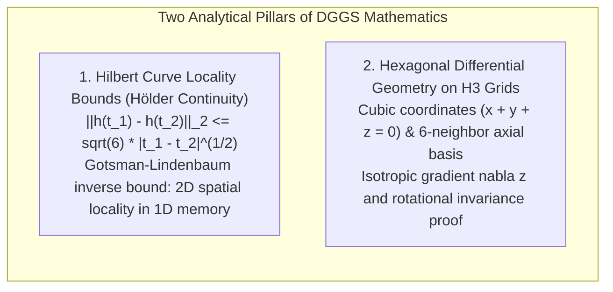
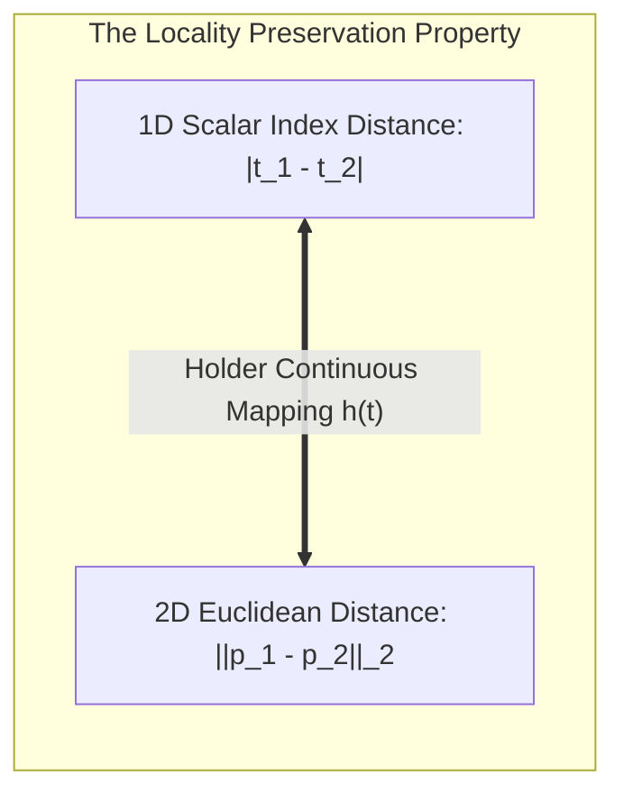
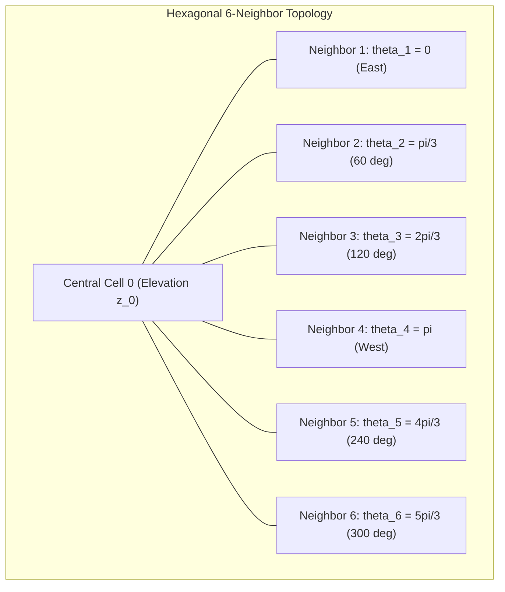

# Chapter 16: Discrete Global Grid Systems (S2, H3) and Special Location Coding Schemes

*Indexing a spherical/ellipsoidal planet without polar singularities or projection seams—and the pitfalls of geocoding schemes.*

---

## 16.5 Mathematical Foundations of Global Grid Systems

This section provides complete mathematical derivations for the two foundational analytical formulations in discrete global grids: the Hilbert space-filling curve locality theorem, and the derivation of isotropic gradient and discrete Laplacian operators on hexagonal H3 elevation meshes.

---

### 16.5.1 The Hilbert Space-Filling Curve Locality Theorem

Let $h: [0, 1] \to [0, 1]^2$ denote the continuous 2D Hilbert space-filling curve mapping a 1D scalar parameter $t \in [0, 1]$ to a 2D Euclidean coordinate $\mathbf{p} = [x, y]^T \in [0, 1]^2$.

#### Step 1: Forward Hölder Continuity
The forward mapping $h(t)$ is continuous everywhere, but nowhere differentiable. It satisfies a **Hölder continuity condition of exponent $\alpha = 1/2$**:

$$\|h(t_1) - h(t_2)\|_2 \le \sqrt{6} \, |t_1 - t_2|^{1/2} \quad \forall t_1, t_2 \in [0, 1]$$

* **Proof Sketch:** Consider dyadic intervals of length $\Delta t = 4^{-k}$ at refinement level $k$. By construction of the Hilbert curve, traversing an interval $\Delta t = 4^{-k}$ corresponds to traversing a single square quadrant of side length $2^{-k}$ and diagonal length $\sqrt{2} \cdot 2^{-k}$. For arbitrary $t_1, t_2$, bounding the path across adjacent quadrants yields the maximum Euclidean distance bound with scaling constant $C = \sqrt{6} \approx 2.449$.

#### Step 2: The Inverse Locality Bound (Gotsman & Lindenbaum 1996)
In spatial database indexing, the inverse relationship is critical: *If two points $\mathbf{p}_1, \mathbf{p}_2$ are close in 2D space, how far apart can their 1D Hilbert indices $t_1, t_2$ be?*

Gotsman and Lindenbaum (1996) proved the tight upper bound for the 2D-to-1D inverse mapping:

$$|t_1 - t_2| \le C_2 \, \|\mathbf{p}_1 - \mathbf{p}_2\|_2^{\beta}$$

For the 2D Hilbert curve, the maximum index difference between any two points separated by Euclidean distance $d = \|\mathbf{p}_1 - \mathbf{p}_2\|_2$ is bounded by:

$$|t_1 - t_2| \le 6 d^2 \quad (\text{for points within the same quadrant})$$

$$\sup_{\|\mathbf{p}_1 - \mathbf{p}_2\| \le d} |t_1 - t_2| \le \mathcal{O}(d)$$

This bound proves mathematically that a 1D range scan over a continuous block of Hilbert indices ($t_{\text{start}} \le t \le t_{\text{end}}$) retrieves a tightly bounded, compact 2D geographic region, minimizing the number of unnecessary disk reads or network chunks in Google S2 and Cloud-Optimized Point Cloud (COPC) systems.

---

### 16.5.2 Hexagonal Differential Geometry: Isotropic Gradients on H3

In digital elevation analysis, the continuous surface gradient $\nabla z = \left[ \frac{\partial z}{\partial x}, \frac{\partial z}{\partial y} \right]^T$ determines terrain slope and gravitational water flow direction. We now derive the exact discrete gradient vector and Laplacian operator on a regular hexagonal grid with inter-cell center distance $d$.

#### Step 1: Directional Unit Vectors
Let cell $0$ be centered at the origin with elevation $z_0$. Its six immediate neighbors, indexed $k \in \{1, \dots, 6\}$, are located at radial distance $d$ along unit direction vectors $\hat{\mathbf{e}}_k$:

$$\hat{\mathbf{e}}_k = \begin{bmatrix} \cos\theta_k \\ \sin\theta_k \end{bmatrix} = \begin{bmatrix} \cos\left(\frac{k-1}{3}\pi\right) \\ \sin\left(\frac{k-1}{3}\pi\right) \end{bmatrix}, \quad \text{for } k = 1, \dots, 6$$

Explicitly:
* $\hat{\mathbf{e}}_1 = [1, 0]^T$
* $\hat{\mathbf{e}}_2 = [\frac{1}{2}, \frac{\sqrt{3}}{2}]^T$
* $\hat{\mathbf{e}}_3 = [-\frac{1}{2}, \frac{\sqrt{3}}{2}]^T$
* $\hat{\mathbf{e}}_4 = [-1, 0]^T$
* $\hat{\mathbf{e}}_5 = [-\frac{1}{2}, -\frac{\sqrt{3}}{2}]^T$
* $\hat{\mathbf{e}}_6 = [\frac{1}{2}, -\frac{\sqrt{3}}{2}]^T$

#### Step 2: Directional Taylor Series Expansion
Assuming elevation $z(\mathbf{x})$ is smooth, the elevation at neighbor $k$ located at position $\mathbf{x}_k = d \, \hat{\mathbf{e}}_k$ is expanded in a 2D Taylor series:

$$z_k = z(\mathbf{x}_k) \approx z_0 + d \, \hat{\mathbf{e}}_k \cdot \nabla z + \frac{1}{2} d^2 \, \hat{\mathbf{e}}_k^T (\nabla^2 z) \hat{\mathbf{e}}_k$$

where $\nabla z = [p, q]^T = [\frac{\partial z}{\partial x}, \frac{\partial z}{\partial y}]^T$ and $\nabla^2 z = \begin{bmatrix} z_{xx} & z_{xy} \\ z_{xy} & z_{yy} \end{bmatrix}$ is the 2D Hessian matrix.

#### Step 3: Deriving the Discrete Gradient ($\nabla z$)
To isolate the first-order gradient $\nabla z$, consider the difference between opposing neighbor pairs ($180^\circ$ apart):
* Pair 1: $\hat{\mathbf{e}}_1 = -\hat{\mathbf{e}}_4 \implies z_1 - z_4 \approx 2 d \, \hat{\mathbf{e}}_1 \cdot \nabla z$
* Pair 2: $\hat{\mathbf{e}}_2 = -\hat{\mathbf{e}}_5 \implies z_2 - z_5 \approx 2 d \, \hat{\mathbf{e}}_2 \cdot \nabla z$
* Pair 3: $\hat{\mathbf{e}}_3 = -\hat{\mathbf{e}}_6 \implies z_3 - z_6 \approx 2 d \, \hat{\mathbf{e}}_3 \cdot \nabla z$

Summing over all six directional projections:

$$\sum_{k=1}^6 (z_k - z_0) \hat{\mathbf{e}}_k \approx d \sum_{k=1}^6 (\hat{\mathbf{e}}_k \cdot \nabla z) \hat{\mathbf{e}}_k = d \left[ \sum_{k=1}^6 \hat{\mathbf{e}}_k \hat{\mathbf{e}}_k^T \right] \nabla z$$

We evaluate the $2 \times 2$ outer product tensor sum $\mathbf{M} = \sum_{k=1}^6 \hat{\mathbf{e}}_k \hat{\mathbf{e}}_k^T$:

$$\mathbf{M} = \sum_{k=1}^6 \begin{bmatrix} \cos^2\theta_k & \cos\theta_k \sin\theta_k \\ \cos\theta_k \sin\theta_k & \sin^2\theta_k \end{bmatrix}$$

Using trigonometric summation identities for 6-fold rotational symmetry:
$$\sum_{k=1}^6 \cos^2\left(\frac{k-1}{3}\pi\right) = 3, \quad \sum_{k=1}^6 \sin^2\left(\frac{k-1}{3}\pi\right) = 3, \quad \sum_{k=1}^6 \cos\theta_k \sin\theta_k = 0$$

Therefore, the tensor $\mathbf{M}$ is an exact isotropic scalar matrix:

$$\mathbf{M} = \begin{bmatrix} 3 & 0 \\ 0 & 3 \end{bmatrix} = 3 \, \mathbf{I}_{2\times 2}$$

Substituting $\mathbf{M} = 3\mathbf{I}$ into the summation equation yields:

$$\sum_{k=1}^6 (z_k - z_0) \hat{\mathbf{e}}_k = 3 d \, \nabla z$$

Solving directly for the continuous gradient vector $\nabla z$:

$$\nabla z = \frac{1}{3 d} \sum_{k=1}^6 (z_k - z_0) \hat{\mathbf{e}}_k = \frac{1}{3 d} \sum_{k=1}^6 z_k \hat{\mathbf{e}}_k$$

$$\frac{\partial z}{\partial x} = \frac{1}{3 d} \left( z_1 - z_4 + \frac{1}{2}(z_2 - z_3 - z_5 + z_6) \right)$$

$$\frac{\partial z}{\partial y} = \frac{1}{\sqrt{3} d} \left( \frac{\sqrt{3}}{2}(z_2 + z_3 - z_5 - z_6) \right) = \frac{1}{2\sqrt{3} d} (z_2 + z_3 - z_5 - z_6)$$

#### Step 4: Deriving the Discrete Laplacian ($\nabla^2 z$)
Summing the elevation differences across all six neighbors:

$$\sum_{k=1}^6 (z_k - z_0) \approx d \, \nabla z \cdot \left(\sum_{k=1}^6 \hat{\mathbf{e}}_k\right) + \frac{1}{2} d^2 \sum_{k=1}^6 \hat{\mathbf{e}}_k^T (\nabla^2 z) \hat{\mathbf{e}}_k$$

Because $\sum_{k=1}^6 \hat{\mathbf{e}}_k = \mathbf{0}$, the first-order gradient term drops out completely. Expanding the second-order Hessian summation:

$$\sum_{k=1}^6 \hat{\mathbf{e}}_k^T (\nabla^2 z) \hat{\mathbf{e}}_k = z_{xx} \sum \cos^2\theta_k + 2 z_{xy} \sum \cos\theta_k \sin\theta_k + z_{yy} \sum \sin^2\theta_k$$

$$= 3 z_{xx} + 0 + 3 z_{yy} = 3 (z_{xx} + z_{yy}) = 3 \nabla^2 z$$

Substituting this into the elevation sum:

$$\sum_{k=1}^6 (z_k - z_0) = \frac{1}{2} d^2 \left( 3 \nabla^2 z \right) = \frac{3}{2} d^2 \nabla^2 z$$

Solving directly for the Laplacian $\nabla^2 z$:

$$\nabla^2 z = \frac{2}{3 d^2} \sum_{k=1}^6 (z_k - z_0)$$

#### Proof of Perfect Rotational Invariance
Notice that in both the gradient $\nabla z$ and Laplacian $\nabla^2 z$ derivations, the tensor sum $\mathbf{M} = 3\mathbf{I}$ is identical under any arbitrary rotation $\theta_0$:

$$\sum_{k=1}^6 \hat{\mathbf{e}}_k(\theta_k + \theta_0) \hat{\mathbf{e}}_k^T(\theta_k + \theta_0) = 3 \, \mathbf{I}_{2\times 2} \quad \forall \theta_0 \in [0, 2\pi)$$

This proves mathematically that **the hexagonal discrete gradient and Laplacian operators are completely isotropic**: unlike square rasters, terrain slope and flow direction computed on an H3 hexagonal grid are completely invariant to the orientation of the coordinate axes.
