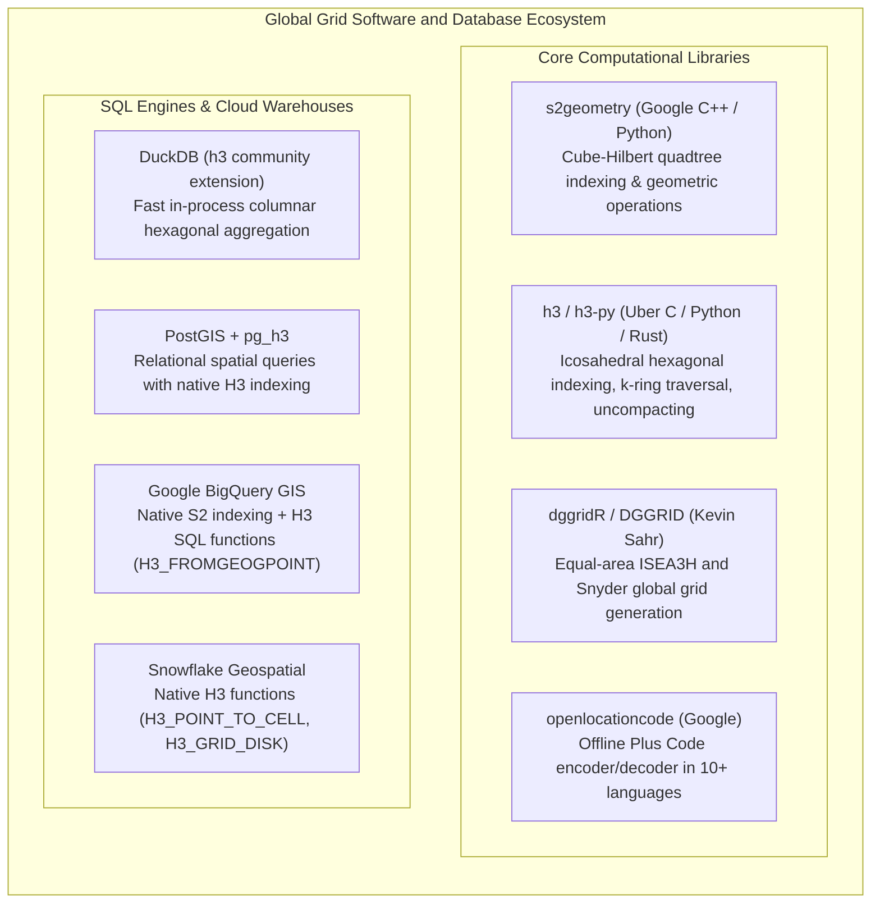

# Chapter 16: Discrete Global Grid Systems (S2, H3) and Special Location Coding Schemes

*Indexing a spherical/ellipsoidal planet without polar singularities or projection seams—and the pitfalls of geocoding schemes.*

---

## 16.6 Software Ecosystem for Global Grids, Spatial Indexing, and Cloud Databases

The adoption of Discrete Global Grid Systems has been driven by modern analytical databases and open-source libraries that replace complex spherical spatial joins with lightning-fast 64-bit integer hashing. This section explores the software ecosystem powering DGGS elevation indexing across Python, SQL databases, and cloud data warehouses.



---

### 16.6.1 Open-Source Core Libraries

#### Uber H3 in Python (`h3-py`): Indexing and Elevation Gradients
The `h3-py` library wraps Uber's optimized C core, providing direct access to hexagonal grid functions:

```python
"""Hexagonal Elevation Modeling and Gradient Calculation using h3-py."""

import h3
import numpy as np


def compute_h3_elevation_gradient(
    center_hex: str, elevation_db: dict[str, float]
) -> dict:
  """Computes isotropic surface gradient on an H3 hexagonal cell."""
  z0 = elevation_db.get(center_hex)
  if z0 is None:
    return {"status": "ERROR", "reason": "Center cell missing elevation"}

  # 1. Get the 6 immediate neighbors (k-ring distance 1)
  # h3.grid_ring returns neighbors in rotational ring order
  neighbors = list(h3.grid_ring(center_hex, 1))
  if len(neighbors) != 6:
    return {"status": "ERROR", "reason": "Pentagon cell detected"}

  # 2. Extract elevations for all 6 neighbors
  z_vals = [elevation_db.get(h) for h in neighbors]
  if any(v is None for v in z_vals):
    return {"status": "ERROR", "reason": "Missing neighbor elevations"}

  # 3. Get exact inter-cell center distance (meters) for this resolution
  res = h3.get_resolution(center_hex)
  # Mean edge length in meters at this resolution
  edge_m = h3.get_hexagon_edge_length_avg(res, unit="m")
  d = edge_m * np.sqrt(3)  # Center-to-center distance

  # 4. Compute isotropic directional gradient (dz/dx, dz/dy)
  # Neighbor angles theta_k = k * pi / 3
  dz_dx = (
      z_vals[0]
      - z_vals[3]
      + 0.5 * (z_vals[1] - z_vals[2] - z_vals[4] + z_vals[5])
  ) / (3.0 * d)
  dz_dy = (z_vals[1] + z_vals[2] - z_vals[4] - z_vals[5]) / (
      2.0 * np.sqrt(3.0) * d
  )

  # 5. Compute slope magnitude (radians and degrees) and aspect
  slope_rad = np.arctan(np.sqrt(dz_dx**2 + dz_dy**2))
  aspect_rad = (np.arctan2(-dz_dx, -dz_dy) + 2 * np.pi) % (2 * np.pi)

  # 6. Compute discrete Laplacian (curvature)
  laplacian = (2.0 / (3.0 * d**2)) * sum(zk - z0 for zk in z_vals)

  return {
      "status": "SUCCESS",
      "h3_index": center_hex,
      "resolution": res,
      "elevation_m": z0,
      "slope_deg": np.degrees(slope_rad),
      "aspect_deg": np.degrees(aspect_rad),
      "laplacian": laplacian,
  }
```

#### Google S2 Geometry (`s2geometry`)
In C++ and Python (`s2sphere` / `pywraps2`), S2 indexes points into 64-bit Hilbert integers:

```python
import s2sphere

# 1. Define a geodetic point (WGS84 lat, lon)
lat_lon = s2sphere.LatLng.from_degrees(46.8529, -121.7604)  # Mount Rainier

# 2. Project to 3D unit sphere vector
point = s2sphere.Point.from_lat_lng(lat_lon)

# 3. Create 64-bit S2 Cell ID at Level 14 (~100m cell size)
cell_id = s2sphere.CellId.from_point(point).parent(14)
print(f"S2 Cell ID (uint64): {cell_id.id()}")
print(f"S2 Cell Token (hex): {cell_id.to_token()}")
```

---

### 16.6.2 SQL Databases: DuckDB, PostGIS, and Cloud Warehouses

Modern spatial data warehouses leverage DGGS cell IDs to execute massive spatial joins at petabyte scale without running expensive polygon-in-polygon geometry algorithms:

#### DuckDB In-Process Hexagonal Aggregation
DuckDB includes an official `h3` community extension, allowing vectorized elevation aggregation over millions of LiDAR points in seconds:

```sql
-- Install and load DuckDB H3 extension
INSTALL h3;
LOAD h3;

-- Aggregate 100 million raw LiDAR points into Resolution 10 (~66 m) hexagonal cells
CREATE TABLE lidar_h3_summary AS
SELECT 
    h3_latlng_to_cell(lat, lon, 10) AS hex_id,
    COUNT(*) AS pulse_count,
    MIN(elevation) AS min_elevation,
    AVG(elevation) AS mean_elevation,
    MAX(elevation) AS max_elevation,
    STDDEV(elevation) AS canopy_roughness
FROM read_parquet('s3://lidar-bucket/state_points/*.parquet')
WHERE classification = 2 -- Bare Ground
GROUP BY hex_id;
```

#### Google BigQuery GIS and Snowflake
Both major cloud data warehouses provide native SQL functions for H3 and S2:
* **BigQuery:** Uses S2 internally for spatial clustering. Functions include `ST_GEOHASH`, `H3_FROMGEOGPOINT(geog, resolution)`, and `H3_TOCHILDREN`.
* **Snowflake:** Provides `H3_POINT_TO_CELL(lon, lat, res)`, `H3_GRID_DISK(cell, k)`, and `H3_CELL_TO_BOUNDARY` for native geospatial analytics.

---

### 16.6.3 Software Comparison Matrix

| Software / Tool | License Model | Primary Geometry | Programming Interfaces | Key Elevation Modeling Strengths |
| :--- | :--- | :--- | :--- | :--- |
| **`h3` / `h3-py`** | Open-Source (Apache 2.0) | Hexagonal (Aperture 7) | C, Python, JS, Rust, Go, R | Isotropic 6-neighbor flow routing and slope calculations. |
| **`s2geometry`** | Open-Source (Apache 2.0) | Quadrilateral (Aperture 4)| C++, Python, Java, Go | Exact quadtree hierarchical containment; lossless pyramids. |
| **`dggridR`** | Open-Source (GPLv3) | Hexagonal / Equal-Area | R, C++ | True equal-area global statistical sampling grids (ISEA3H). |
| **DuckDB (`h3`)** | Open-Source (MIT) | Hexagonal (H3) | SQL / Vectorized C++ | Lightning-fast in-memory aggregation of massive point clouds. |
| **PostGIS (`pg_h3`)** | Open-Source (GPLv2) | Hexagonal (H3) | SQL (PostgreSQL) | Enterprise spatial joins and relational elevation indexing. |
| **BigQuery GIS** | Commercial (Google Cloud)| S2 (Native) + H3 (SQL) | SQL | Multi-petabyte global spatial joins and satellite DEM indexing. |
| **Snowflake** | Commercial (Snowflake) | H3 (Native) | SQL | Cloud data warehouse analytics with native hexagonal clustering. |
