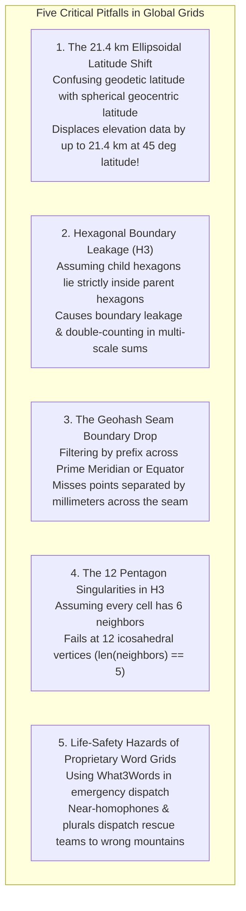

# Chapter 16: Discrete Global Grid Systems (S2, H3) and Special Location Coding Schemes

*Indexing a spherical/ellipsoidal planet without polar singularities or projection seams—and the pitfalls of geocoding schemes.*

---

## 16.7 Common Pitfalls and Key Takeaways

Discrete Global Grid Systems (DGGS) and location coding schemes offer powerful solutions to planetary indexing and cloud-scale spatial joins. However, bridging spherical geometry, hexagonal topology, and human language introduces subtle pitfalls that can corrupt spatial calculations or jeopardize life safety.

---

### 16.7.1 Common Pitfalls in Global Grids and Coding Schemes

#### 1. The 21.4 km Spherical vs. Ellipsoidal Latitude Shift
The single most catastrophic error when ingesting high-precision elevation models into DGGS frameworks is confusing **geodetic latitude** ($\phi$, on the WGS84 ellipsoid) with **geocentric spherical latitude** ($\theta$):
* Global grid algorithms (S2 and basic DGGS formulations) operate on a sphere.
* If an analyst passes geodetic latitude directly into spherical projection equations without ellipsoidal conversion, the computed cell location is displaced along the meridian by:
  $$\Delta s \approx \frac{R e^2}{2} \sin(2\phi)$$
* At $\phi = 45^\circ$, this displacement reaches **$21,324\text{ meters}$ ($21.4\text{ km}$)**. An elevation point from the summit of Mont Blanc or Mount Rainier is indexed into a valley miles to the south, corrupting regional terrain models.

#### 2. The Hexagonal Boundary Leakage Trap in H3
In quadtree systems (such as Google S2), parent-child containment is exact ($100\%$ containment). In hexagonal systems (Uber H3), regular hexagons cannot tessellate a larger regular hexagon:
* In an Aperture 7 hierarchy, the six peripheral child hexagons straddle the borders of adjacent parent hexagons.
* An analyst who aggregates point elevation data into Resolution 9 child hexagons and then attempts to sum or average them into Resolution 8 parent hexagons without area-weighted intersection calculations will double-count perimeter points or leak data across boundaries.

#### 3. The Geohash Boundary Seam Blind Spot
Developers often use Geohash prefixes for fast database bounding-box queries (e.g., `WHERE geohash LIKE 'u000%'`):
* Geohash is based on Morton Z-order bit interleaving.
* Two points separated by mere millimeters across the Prime Meridian ($0^\circ$ longitude) or the Equator ($0^\circ$ latitude) share zero common prefix characters.
* A prefix query completely ignores adjacent points across the boundary seam. To query spatial proximity in Geohash, software must explicitly compute and query the Geohash IDs of all eight surrounding neighbor cells.

#### 4. The 12 Pentagon Singularities in Hexagonal Grids
By Euler's polyhedral formula ($V - E + F = 2$), an icosahedron-based hexagonal grid cannot be closed without **exactly 12 pentagons**:
* Software written under the naive assumption that "every H3 cell has exactly 6 neighbors" will crash or throw index-out-of-bounds exceptions when evaluating one of the 12 pentagon cells (where `len(neighbors) == 5`).
* All gradient, slope, and neighborhood iteration code must include explicit exception handling for pentagon cells.

#### 5. Relying on Proprietary Word Grids (What3Words) for Emergency Safety
Marketing proprietary word triplets as "more accurate than GPS" has created life-threatening situations in emergency response:
* Mountain rescue teams and coastal lifeboats operate under high-stress, noisy acoustic environments.
* What3Words contains hundreds of similar-sounding words, plurals, and common spelling variants (e.g., `circle.coach.press` vs. `circles.coach.press`) that resolve to locations within the same country.
* Emergency dispatchers must never accept proprietary word grids as the primary location mechanism; they must demand raw GNSS coordinates, MGRS, or open alphanumeric Plus Codes.

---

### 16.7.2 Key Takeaways for Practitioners

1. **DGGS Eliminates Map Projection Seams:** For continental, polar, and planetary-scale elevation models, Discrete Global Grid Systems eliminate the distortion and singularities of planar map projections, providing continuous multi-scale surface representations.
2. **Hexagons for Analysis, Quadrilaterals for Pyramids:**
   * Choose **hexagonal grids (Uber H3)** when your primary task involves spatial analysis, isotropic slope calculation, continuous hydrodynamic flow routing, or radius-based neighborhood aggregation.
   * Choose **quadrilateral quadtrees (Google S2)** when your primary task involves hierarchical raster pyramids, exact parent-child area containment, or 2D quadtree rendering.
3. **Always Check the Geodetic Ellipsoid Interface:** Verify whether your DGGS library automatically handles ellipsoidal-to-spherical latitude conversions (e.g., via authalic latitude mapping). Never pass raw WGS84 geodetic latitude into uncorrected spherical equations.
4. **Beware the Pentagon Exception:** Always write defensive code when processing hexagonal grids to gracefully handle the 12 unavoidable pentagons at icosahedron vertices.
5. **Insist on Open, Algorithmic Standards:** Never build critical infrastructure or life-safety emergency workflows on proprietary, patented, closed-source spatial coding systems. Use open, royalty-free standards (Latitude/Longitude, MGRS, Open Location Code) that function offline without commercial gatekeepers.
