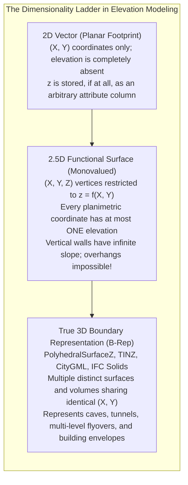
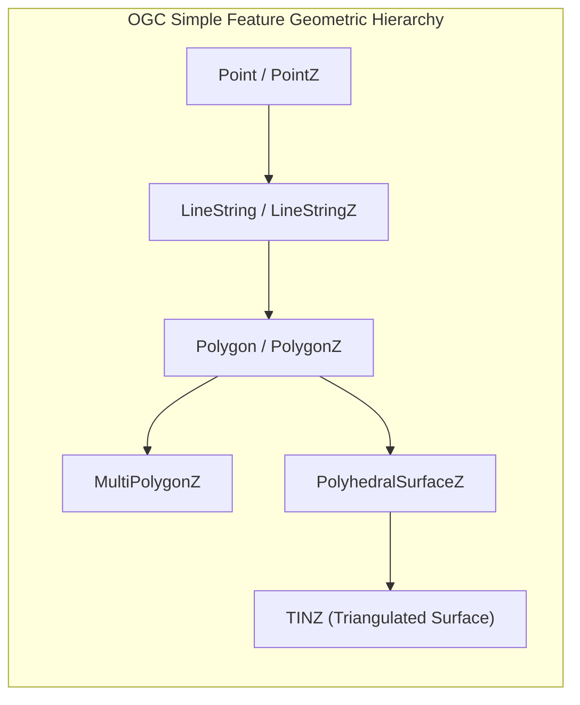
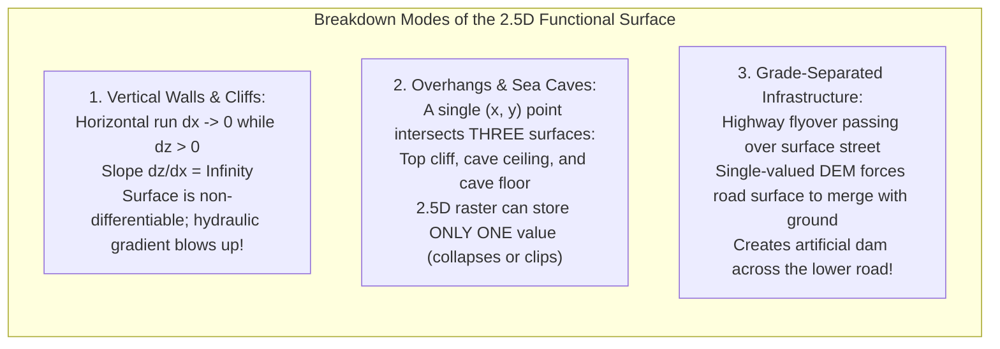
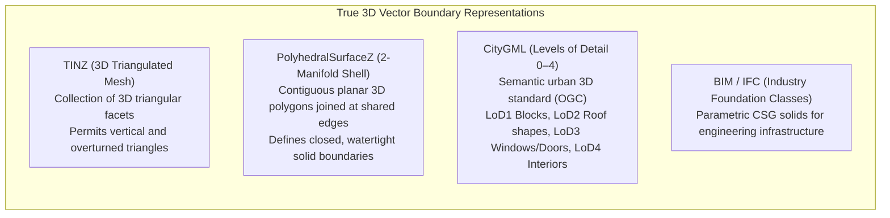

# Chapter 17: Vector Data Issues in Elevation Modeling

*Points, lines, polylines, polygons, multipolygons, breaklines, topology, and the breakdown of 2.5D assumptions when roads cross or pass under buildings.*

While digital elevation models are predominantly distributed as raster grids, the structural reality of the Earth's surface—and the human infrastructure built upon it—is fundamentally defined by vector geometry. Fault scarps, river thalwegs, drainage divides, road curbs, bridge decks, and building footprints are discrete geometric features whose linear and polygonal boundaries govern surface interpolation. However, integrating vector data with elevation modeling exposes the profound mathematical tension between single-valued "2.5D" functional surfaces and true three-dimensional geometry.

---

## 17.1 Vector Primitives and Dimensionality: 2D, 2.5D, and True 3D

In geographic information systems, vector data is defined by discrete vertices connected by linear or curvilinear segments. The dimensional handling of elevation within vector data structures dictates whether a feature can represent true 3D spatial reality or merely acts as a 2D footprint with an elevation attribute.

---

### 17.1.1 OGC Simple Features and Coordinate Dimensionality (`Z` and `M`)

The Open Geospatial Consortium (OGC) Simple Features Access standard (ISO 19125-1) formalizes vector primitives across 2D, 3D, and 4D coordinate spaces:

In the OGC specification, coordinates are extended beyond 2D $(X, Y)$ through two explicit optional dimensions:
1. **The `Z` Coordinate (Vertical Elevation):** Denotes the geometric vertical position in the declared vertical coordinate reference system (e.g., ellipsoidal height $h$ or orthometric height $H$):
   $$\mathbf{v} = [X, Y, Z]^T$$
2. **The `M` Coordinate (Measure):** A non-coordinate attribute embedded directly into vertex arrays. In elevation and hydrographic modeling, `M` is frequently used to store **Total Propagated Uncertainty (TPU)**, acquisition timestamp ($t$), or linear referencing stationing (e.g., highway mileage along a corridor):
   $$\mathbf{v} = [X, Y, Z, M]^T$$

#### Well-Known Text (WKT) Representations
* **2D Polygon:** `POLYGON ((0 0, 10 0, 10 10, 0 10, 0 0))`
* **3D Polygon with Elevation (`Z`):** `POLYGON Z ((0 0 15.2, 10 0 15.8, 10 10 18.1, 0 10 16.5, 0 0 15.2))`
* **4D LineString with Elevation and Uncertainty (`ZM`):** `LINESTRING ZM (0 0 10.5 0.08, 5 5 12.1 0.12, 10 5 14.3 0.09)`

---

### 17.1.2 The 2.5D Functional Surface Limitation ($z = f(x, y)$)

The vast majority of raster DEMs, TINs, and GIS terrain engines operate under the **2.5D functional surface assumption**:
> *Elevation is modeled as a single-valued, mathematical function of horizontal planar coordinates:*
> $$z = f(x, y)$$

While computationally efficient, the 2.5D formulation suffers from fatal physical and mathematical breakdowns in complex environments:

#### 1. Vertical Walls and Singular Slopes ($dz/dx \to \infty$)
In a 2.5D raster or TIN, a perfectly vertical retaining wall, building facade, or sheer canyon scarp cannot be represented directly. Because the horizontal distance between the top and bottom of the wall is zero ($\Delta x = 0$), the slope magnitude diverges to infinity:

$$\|\nabla z\| = \lim_{\Delta x \to 0} \frac{\Delta z}{\Delta x} = \infty$$

To prevent division-by-zero errors, GIS software is forced to introduce a slight horizontal tilt or "skirt" ($\Delta x \approx 1\text{–}5\text{ mm}$), transforming vertical walls into steep artificial ramps that misrepresent stormwater runoff velocities and structural loads.

#### 2. Multi-Valued Overhangs and Sea Caves
In coastal geomorphology and alpine terrain, wave action cuts deep sea caves into cliff bases, while tectonic folding creates overhanging cliffs. At an overhang, a vertical plumb line dropped from coordinate $(x_0, y_0)$ pierces the Earth's surface at multiple distinct elevations:
$$z_1 = \text{Cave Floor}, \quad z_2 = \text{Cave Ceiling}, \quad z_3 = \text{Cliff Top}$$
A 2.5D model is mathematically incapable of representing multi-valued relations. It must either discard the overhang (choosing the highest DSM surface) or carve away the roof (choosing the lowest DTM surface), misrepresenting both geotechnical stability and coastal cave habitats.

---

### 17.1.3 True 3D Vector Primitives: TINZ, PolyhedralSurfaces, and CityGML

To model true multi-valued geometry, geospatial databases employ true 3D vector representations:

1. **`TINZ`:** An OGC surface composed of triangular facets where each vertex has an independent $(x, y, z)$ coordinate. Unlike a 2.5D TIN, a `TINZ` mesh allows multiple triangles to overlap in the planimetric $(X, Y)$ plane, enabling the representation of folded geological strata, sea caves, and cliff overhangs.
2. **`PolyhedralSurfaceZ`:** A contiguous collection of planar polygonal facets sharing common boundary edges. When a `PolyhedralSurfaceZ` forms a closed, orientable, watertight 2-manifold shell ($\partial V$), it bounds a true 3D volumetric solid.
3. **CityGML (OGC Standard for 3D City Models):** Standardizes multi-scale semantic vector representations of the built environment across five **Levels of Detail (LoD)**:
   * **LoD 0:** Regional 2.5D terrain surface.
   * **LoD 1:** Extruded prismatic "building block" models with flat roofs.
   * **LoD 2:** Detailed 3D roof shapes (gabled, hipped, mansard) and attached building structures.
   * **LoD 3:** Architectural exterior models with detailed facade textures, window openings, and recessed doorways.
   * **LoD 4:** Full interior room topology, floor slabs, stairs, and structural pillars.
4. **BIM and IFC (Industry Foundation Classes):** In civil infrastructure and bridge engineering, models are defined not merely as boundary meshes, but as **Constructive Solid Geometry (CSG)** parametric solids (e.g., swept structural steel I-beams, reinforced concrete piers, and bored tunnel tubes), providing the physical basis for true 3D infrastructure modeling.
