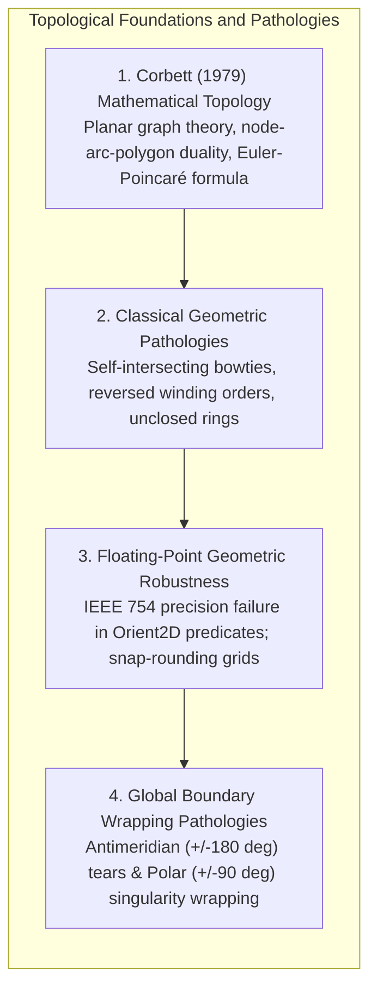
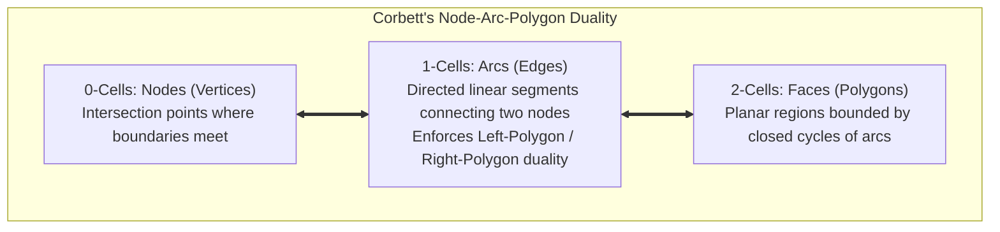
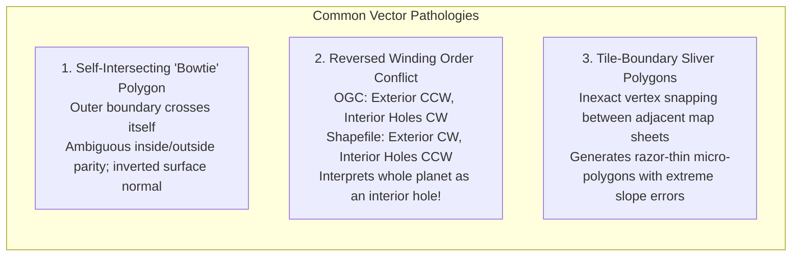
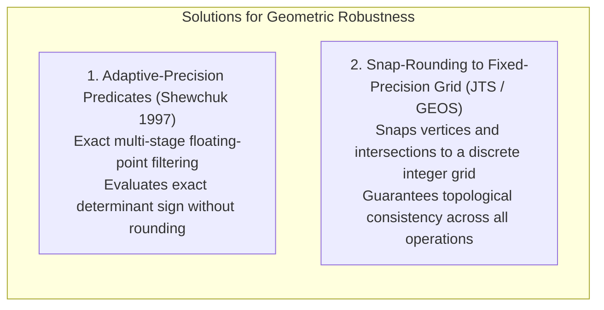
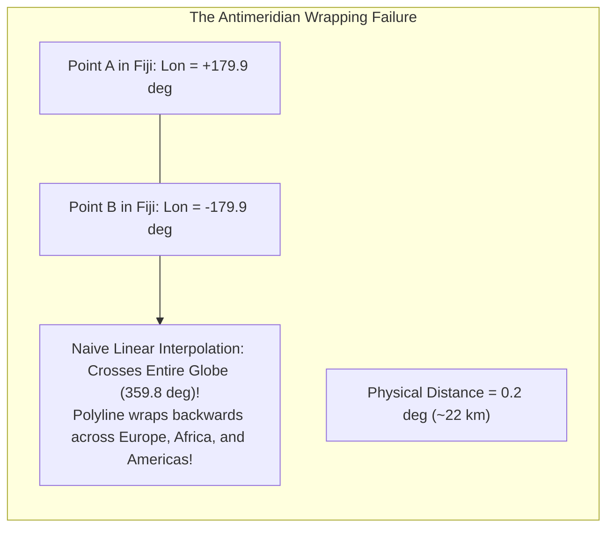

# Chapter 17: Vector Data Issues in Elevation Modeling

*Points, lines, polylines, polygons, multipolygons, breaklines, topology, and the breakdown of 2.5D assumptions when roads cross or pass under buildings.*

---

## 17.2 Topological Integrity and Vector Pathologies in Elevation Modeling

Vector features used in digital elevation modeling—such as lake boundary polygons, contour lines, building footprints, and highway breaklines—must adhere to strict mathematical rules of topology. When vector geometries suffer from topological defects (self-intersections, reversed winding orders, slivers, or floating-point round-off errors), surface interpolation algorithms produce severe anomalies: inverted triangles, corrupted drainage divides, and catastrophic computational crashes.

---

### 17.2.1 Corbett's Topological Principles in Cartography (1979)

In 1979, mathematician James P. Corbett of the U.S. Census Bureau published *Topological Principles in Cartography* (Census Bureau Technical Paper 48). Corbett established that a computer map is not merely a collection of geometric coordinates $(x, y)$; it is an **algebraic 2-manifold cellular complex** (a planar graph) that must satisfy exact topological invariants:

#### The Planar Graph Invariants
1. **No Edge Crossings:** Arcs (lines) may intersect only at shared nodes. If two breaklines or contour lines cross in the interior of a segment, the topology is invalid.
2. **Exhaustive Partitioning:** Every arc must bound exactly one polygon on its left and one polygon on its right (the Left/Right Polygon attribute).
3. **The Euler-Poincaré Characteristic:** For any valid planar cellular partition with $V$ vertices, $E$ edges, and $F$ faces (including the unbounded exterior face):
   $$V - E + F = 2$$

When vector boundaries are converted into Constrained Delaunay Triangulations (CDTs) or used to hydro-flatten elevation rasters, violating Corbett's topological invariants causes gridding engines to halt or generate non-orientable topological surfaces.

---

### 17.2.2 Vector Pathologies in Elevation Models

#### 1. Self-Intersecting "Bowtie" Polygons
A polygon whose linear boundary intersects itself (a "bowtie" or figure-eight loop) is topologically invalid under OGC Simple Features:
* The Jordan Curve Theorem, which guarantees that a simple closed curve partitions the plane into a well-defined "interior" and "exterior," breaks down.
* When gridding a lake or building footprint containing a bowtie self-intersection, the gridding engine calculates opposite surface normals across the crossover node, creating an inverted, twisted surface facet with corrupted volume calculations.

#### 2. The Winding Order (Orientation) Conflict
The direction in which vertices are listed in a polygon ring defines its spatial orientation (winding order):
* **OGC Simple Features / GeoJSON (Right-Hand Rule):**
  * Exterior boundary ring must be wound **Counter-Clockwise (CCW)**.
  * Interior hole boundary rings must be wound **Clockwise (CW)**.
* **Esri Shapefile Standard (1998):**
  * Exterior boundary rings must be wound **Clockwise (CW)**.
  * Interior hole boundary rings must be wound **Counter-Clockwise (CCW)**.

#### The Fatal Shapefile-to-OGC Inversion Trap
When software translates a Shapefile polygon into an OGC-compliant database (PostGIS, GeoJSON, or GeoParquet) without explicitly reversing vertex order, the database interprets the clockwise exterior ring as an **interior hole** inside an infinite, planet-spanning polygon! In elevation workflows, hydro-flattening algorithms inadvertently flatten the entire ocean and continent while leaving the lake untouched.

#### 3. Sliver Polygons and Gaps at Tile Seams
When vector breaklines or contour maps are digitized across adjacent quadrangle sheets or processed across distributed cloud workers, slight vertex misalignments ($1\text{–}5\text{ mm}$) along sheet edges create **sliver polygons** (razor-thin, elongated gaps or overlaps):
* When triangulated into a TIN, these sub-millimeter slivers produce acute needle-like triangles with aspect ratios exceeding $1000:1$.
* In hydraulic flood routing, these artificial needle triangles cause finite-element solvers (e.g., HEC-RAS, ANUGA) to suffer fatal numerical stiffness, crashing simulations.

---

### 17.2.3 Floating-Point Robustness and Snap-Rounding

Geometric algorithms—such as determining whether a point lies to the left or right of a line (`Orient2D`), or whether a point lies inside a triangle's circumcircle (`InCircle`)—rely on evaluating mathematical determinants.

#### The IEEE 754 Floating-Point Trap
In standard computer hardware, floating-point arithmetic obeys the IEEE 754 standard (using 53 bits of mantissa for 64-bit `Float64`). When three points $\mathbf{a}, \mathbf{b}, \mathbf{c}$ are nearly collinear:

$$\det \begin{bmatrix} a_x - c_x & a_y - c_y \\ b_x - c_x & b_y - c_y \end{bmatrix} \approx 0$$

Round-off errors can cause the floating-point determinant to flip sign! A point that mathematically lies to the left of a line is calculated as lying to the right, causing Delaunay triangulation algorithms to loop infinitely or create self-intersecting meshes.

Modern computational geometry engines (CGAL, GEOS, JTS) solve this using Jonathan Shewchuk's (1997) **adaptive-precision floating-point arithmetic**, falling back to exact multi-word integer arithmetic whenever standard floating-point evaluations are within machine epsilon $\epsilon$ of zero.

---

### 17.2.4 Antimeridian ($\pm 180^\circ$) and Polar Coordinate Wrapping

When vector breaklines, contour lines, or study polygons span across the **$180^\circ$ Antimeridian** (the International Date Line in the Pacific, traversing Fiji, Russia, and Alaska):

* **The Problem:** A survey line crossing from $+179.9^\circ$ to $-179.9^\circ$ spans a true physical distance of only $0.2^\circ$ ($\approx 22\text{ km}$). A naive vector engine connects these vertices by interpolating across the entire globe ($359.8^\circ$), creating an enormous vector strip that bisects the planet.
* **The Solution:** Vector engines must implement **antimeridian cutting** (e.g., using GDAL's `ogr2ogr -wrapdateline` or PostGIS's `ST_ShiftLongitude`), splitting lines and polygons into multi-geometries bounded at $\pm 180^\circ$.
