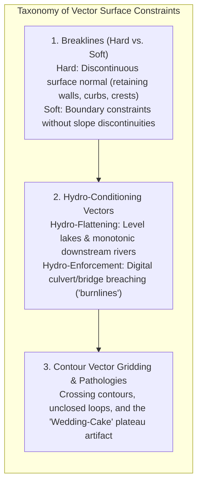
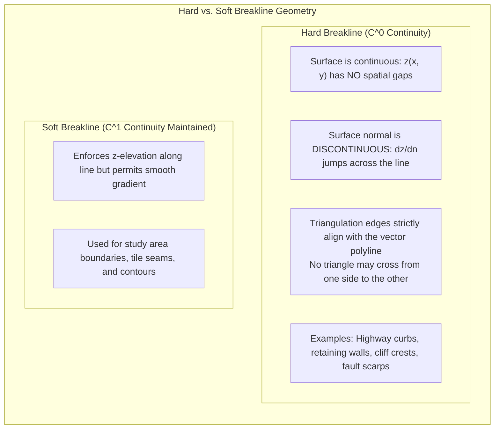
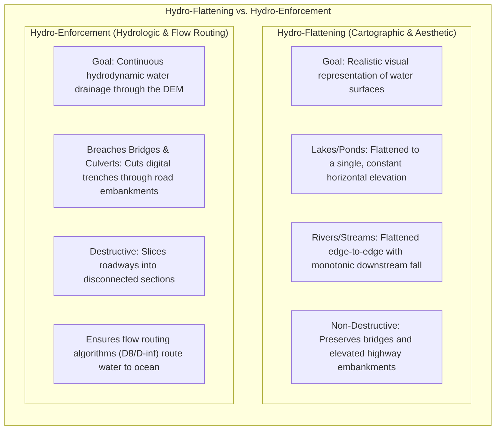
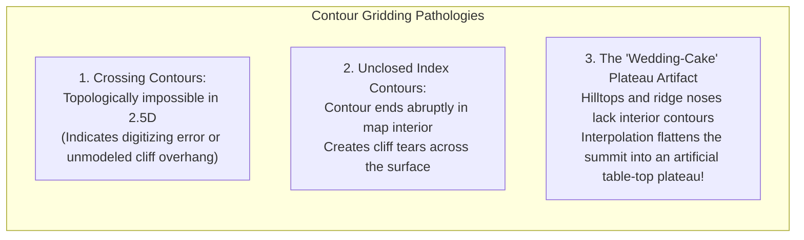

# Chapter 17: Vector Data Issues in Elevation Modeling

*Points, lines, polylines, polygons, multipolygons, breaklines, topology, and the breakdown of 2.5D assumptions when roads cross or pass under buildings.*

---

## 17.3 Breaklines, Contours, and Hydro-Enforcement Vectors

Vector constraints are the primary mechanism by which physical structural lines—drainage networks, road edges, lake perimeters, and retaining walls—are enforced during the generation of digital elevation models. Without vector constraints, raster interpolation algorithms blur distinct topographic steps into ramps and allow digital water to flow up hillslopes or pool behind artificial road embankments.

---

### 17.3.1 Hard Breaklines vs. Soft Breaklines

A breakline is a 3D polyline that controls the Delaunay triangulation or spline interpolation of a digital elevation surface:

#### Hard Breaklines
A **hard breakline** represents an abrupt, physical slope discontinuity across the landscape. Mathematically:
* The surface elevation $z(x, y)$ is continuous ($C^0$), but its directional spatial derivative across the breakline normal $\hat{\mathbf{n}}$ is **discontinuous**:
  $$\lim_{\epsilon \to 0^+} \nabla z(\mathbf{p} + \epsilon \hat{\mathbf{n}}) \ne \lim_{\epsilon \to 0^-} \nabla z(\mathbf{p} - \epsilon \hat{\mathbf{n}})$$
* In a Constrained Delaunay Triangulation (CDT), every segment of a hard breakline is forced to become a triangle edge. Linear interpolation is strictly prohibited from crossing a hard breakline, preventing the triangular smoothing of vertical curbs ($15\text{ cm}$), quarry benches, or structural retaining walls.

#### Soft Breaklines
A **soft breakline** adds elevation points and forces triangle edges along a line without creating an artificial slope break. Soft breaklines are used to define boundary clipping extents, survey project borders, or island perimeters without altering the natural curvature of adjacent terrain.

---

### 17.3.2 Hydro-Flattening vs. Hydro-Enforcement

In geospatial elevation processing, few concepts are as frequently confused as **hydro-flattening** and **hydro-enforcement**. They serve two completely different operational purposes:

| Operational Dimension | Hydro-Flattened DEM (e.g., USGS 3DEP Standard) | Hydro-Enforced DEM (e.g., FEMA / HEC-RAS Hydrologic) |
| :--- | :--- | :--- |
| **Primary Objective** | Cartographic realism; accurate bare-earth topography. | Digital water routing; flood inundation simulation. |
| **Lake Treatment** | Water surface forced to a single, constant elevation. | Level water surface, or drained to invert elevation. |
| **River Treatment** | Shoreline-to-shoreline flat; monotonic downstream gradient. | Carved channel thalweg ensuring continuous gravity flow. |
| **Bridge / Culvert Treatment**| **Bridges preserved** as solid elevated roadways in the DTM. | **Bridges & culverts breached** (cut down to stream invert). |
| **Hydraulic Flow Routing** | **Fails:** Digital water pools behind road embankments. | **Succeeds:** Water flows seamlessly through all infrastructure. |

#### Culvert Breaching and "Burnlines"
When an airborne LiDAR sensor scans a highway built on a $5\text{-meter}$ embankment over a stream culvert, the laser pulses measure the asphalt road surface, not the hidden underground concrete pipe:
* In a standard hydro-flattened DEM, the road embankment acts as an artificial dam. In hydrologic flow routing algorithms (e.g., D8 or D-infinity), runoff from the upstream watershed pools behind the embankment, filling an artificial depression sink rather than continuing down the valley.
* To create a **hydro-enforced DEM**, hydrologists ingest vector **burnlines** (stream centerlines with culvert locations) that digitally "carve" a narrow trench through the road embankment down to the stream bed elevation, allowing numerical water to pass unimpeded.

---

### 17.3.3 Contour Vector Pathologies and the "Wedding-Cake" Artifact

Prior to airborne LiDAR, national digital elevation models (such as USGS 30m and 10m DEMs) were generated by digitizing contour lines from paper topographic maps. Gridding elevation models directly from 2D contour vectors introduces severe geometric pathologies:

#### The "Wedding-Cake" (Plateau) Artifact
The most pervasive defect in contour-derived DEMs is the **wedding-cake artifact** (or terrace plateau effect):
* On a hilltop or ridge nose, the highest contour forms a closed loop (e.g., the $500\text{-m}$ contour). Within this loop, no further contour lines exist.
* Standard linear interpolation, Delaunay triangulation, or unconstrained splines have no information regarding the peak elevation. The triangulation creates flat horizontal triangles connecting the $500\text{-m}$ vertices to one another.
* The resulting digital terrain model truncates natural conical mountain summits and rounded hilltops into flat-topped, stepped mesas ("wedding cakes").
* To eliminate wedding-cake plateaus, contour-to-grid interpolation algorithms (such as Michael Hutchinson's **ANUDEM**, implemented in ArcGIS as `TopotoRaster`) require supplementary **spot heights** (isolated summit elevation points) and enforce drainage-enforced iterative finite-difference splines.
