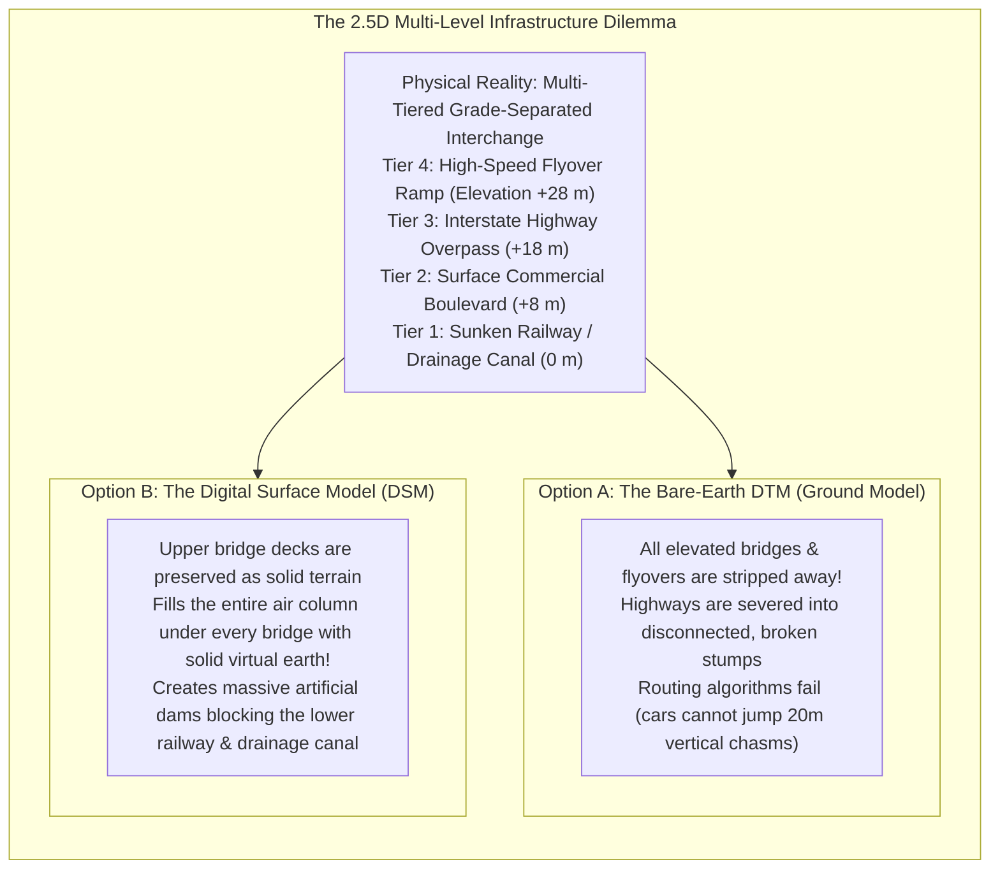
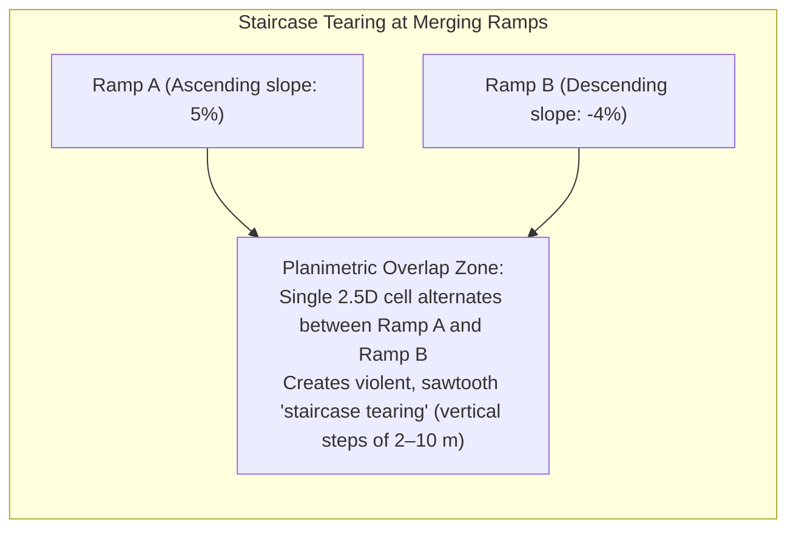
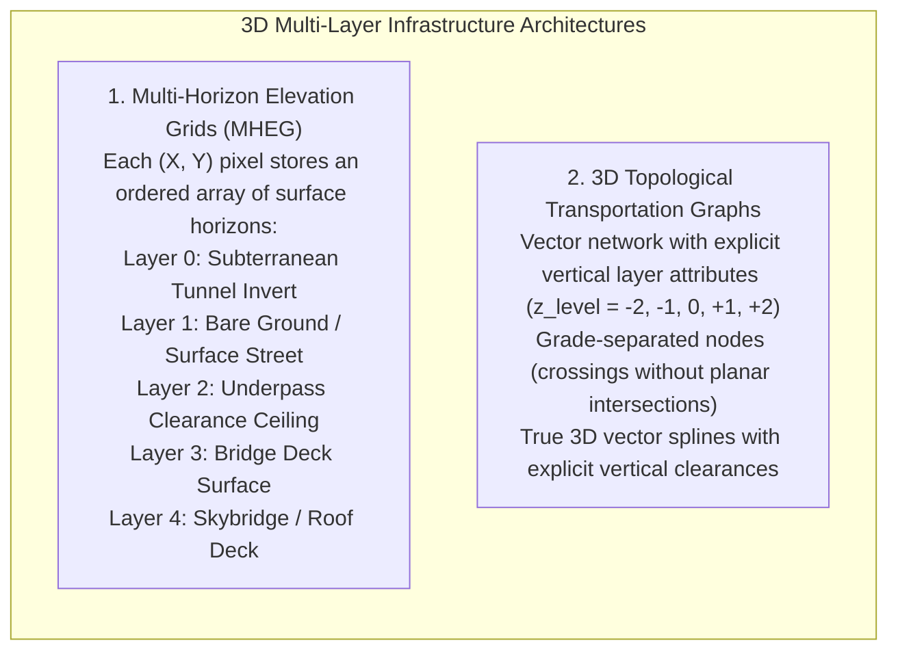

# Chapter 17: Vector Data Issues in Elevation Modeling

*Points, lines, polylines, polygons, multipolygons, breaklines, topology, and the breakdown of 2.5D assumptions when roads cross or pass under buildings.*

---

## 17.4 What Happens When Roads Cross or a Road Goes Under Buildings?

The ultimate failure mode of classical 2.5D elevation modeling occurs in complex urban built environments and multi-level transportation corridors. In a modern metropolitan interchange ("spaghetti junction"), three to five grade-separated highway flyovers, surface arterials, railway corridors, and pedestrian walkways cross directly above one another at the exact same planimetric $(X, Y)$ coordinate. Similarly, highways plunge into subterranean tunnels beneath skyscrapers, and pedestrian skybridges connect commercial towers over city avenues.

Forcing these multi-tiered, overlapping architectural realities into a single-valued 2.5D digital elevation model creates irreconcilable geometric paradoxes, destroying the utility of the model for both autonomous vehicular navigation and urban hydraulic flood routing.

---

### 17.4.1 The Dual Catastrophe of 2.5D Grids in Transportation Modeling

When a digital elevation model is generated over a multi-level interchange, the gridding pipeline is forced to choose which elevation to store in the single 2.5D cell:

#### Catastrophe 1: The Bare-Earth DTM Trap (Broken Networks)
In standard airborne LiDAR processing, bridge decks are classified as above-ground structural objects (often grouped with buildings or Class 17 in ASPRS LAS specifications). When creating a bare-earth DTM:
* The bridge decks and elevated viaducts are stripped out. The elevation raster records only the bare mineral ground beneath the bridges.
* **Impact on Autonomous Driving and Navigation:** A routing algorithm tracking a vehicle traveling on the Interstate flyover suddenly observes the highway roadbed drop $25\text{ m}$ into a railway ditch, and then spike $25\text{ m}$ back up on the other side. Trajectory guidance algorithms register an impossible vertical cliff, causing autonomous vehicle path-planning models to fail or trigger emergency stops.

#### Catastrophe 2: The Digital Surface Model Trap (Artificial Dams)
If the project instead preserves the elevated bridges (as in a Digital Surface Model [DSM] or photogrammetric drone mesh):
* The cell at coordinate $(X, Y)$ records the elevation of the uppermost bridge deck ($+28\text{ m}$).
* Because a 2.5D raster cannot represent the hollow open air space beneath the bridge, the space between the ground and the bridge deck is treated as **solid earth**.
* **Impact on Flood and Stormwater Modeling:** The sunken railway and surface boulevard passing under the flyover are completely blocked by a solid $28\text{-meter}$ wall of virtual dirt. During a storm simulation, numerical floodwaters flowing down the street cannot pass beneath the bridge. Water pools into a massive, artificial reservoir, falsely predicting catastrophic flooding of upstream neighborhoods while predicting zero water flow downstream.

---

### 17.4.2 Highways Under Buildings, Skybridges, and Cut-and-Cover Tunnels

Urban environments frequently feature roads and railways that dive beneath major architectural complexes:
* **The Trans-Manhattan Expressway (I-95) in New York:** A 12-lane depressed highway that passes directly beneath the four 32-story residential apartment towers of the Bridge Apartments.
* **The Big Dig (I-93 / Boston):** A multi-level cut-and-cover tunnel system running beneath city parks and office buildings.
* **Elevated Pedestrian Skybridges:** Glass and steel pedestrian tubes connecting towers across public streets at elevations of $15\text{–}30\text{ m}$ above traffic.

In these environments:
* A satellite radar or airborne LiDAR pulse reflects off the roof of the 32-story building ($+110\text{ m}$ elevation).
* The highway passing through the tunnel underneath sits at an elevation of $+5\text{ m}$.
* A 2.5D surface elevation model is fundamentally blind to the existence of the subterranean or sub-building transportation network.

---

### 17.4.3 Engineering Solutions: Multi-Horizon Stacks and 3D Topological Graphs

To resolve the breakdown of 2.5D models in built environments, modern infrastructure systems employ two advanced architectures:

#### 1. Multi-Horizon Elevation Grids (MHEG)
Rather than storing a single scalar $z$, advanced urban models store a 1D vertical array of paired elevation and semantic attributes for each cell $(i, j)$:

$$\mathbf{Z}[i, j] = \left\{ (z_0, \text{tunnel\_invert}), \, (z_1, \text{tunnel\_ceiling}), \, (z_2, \text{ground\_street}), \, (z_3, \text{bridge\_deck}) \right\}$$

Urban hydrodynamic models (e.g., modern dual-drainage 1D/2D coupled flood solvers) route subterranean pipe and tunnel flow along Layer 0, surface runoff along Layer 2, and bridge drainage along Layer 3 simultaneously, accurately simulating water flowing through an underpass while vehicles cross overhead on dry bridge decks.

#### 2. 3D Topological Transportation Networks
In navigation systems and OpenStreetMap (OSM):
* Road centrelines are stored as 3D vector polylines carrying an explicit integer `layer` or `level` attribute (e.g., `layer = -1` for a tunnel, `layer = 0` for ground level, `layer = +1` for an overpass, `layer = +2` for a high flyover).
* Two road segments that cross planimetrically in $(X, Y)$ at different `layer` values **do not create an intersection node**. The network topology recognizes them as grade-separated, preserving true vehicular routing connectivity without false turns.
* Each overpass edge carries explicit physical attributes: **Clearance Height** (e.g., $4.85\text{ m}$ minimum vertical clearance) and **Load Rating**, allowing oversized truck routing algorithms to safely navigate the 3D urban labyrinth.
