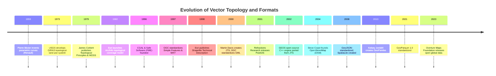
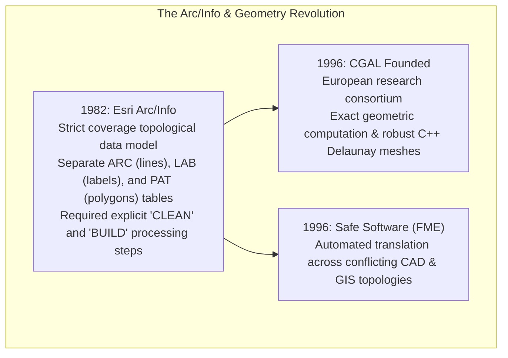
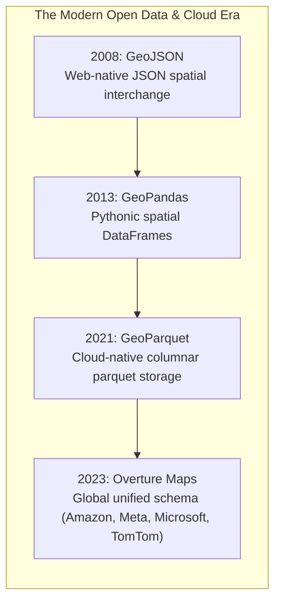

# Chapter 17: Vector Data Issues in Elevation Modeling

*Points, lines, polylines, polygons, multipolygons, breaklines, topology, and the breakdown of 2.5D assumptions when roads cross or pass under buildings.*

---

## 17.5 Historical Evolution of Vector Topologies and Geospatial Formats

The evolution of vector data structures reflects a 65-year struggle to balance geometric flexibility against topological rigor. From French automotive styling curves to cloud-native parquet columnar stores and global open mapping foundations, vector formats have continually adapted to represent terrain features, administrative boundaries, and 3D built infrastructure.

---

### 17.5.1 Parametric Curves and Early Digital Topology (1959–1979)

#### 1959: Pierre Bézier and Parametric Splines
In 1959, French mechanical engineer Pierre Bézier at Renault developed the mathematical formulation for **Bézier curves** to model sleek, aerodynamic automobile body panels. By defining smooth polynomial curves governed by intuitive control points, Bézier provided the mathematical foundation for computer-aided design (CAD), digital contour smoothing, and 3D vector splines.

#### 1973: USGS GIRAS (Geographic Information Retrieval and Analysis System)
In 1973, the U.S. Geological Survey developed **GIRAS** to map land use and land cover nationwide. GIRAS was the first large-scale federal GIS to reject unorganized "spaghetti" drafting lines, implementing explicit topological node-arc-polygon data structures with automated planar line-intersection detection and polygon closure verification.

#### 1979: James Corbett and MOSS
* **Corbett's Theoretical Blueprint (1979):** Mathematician James P. Corbett of the U.S. Census Bureau published *Topological Principles in Cartography* (Census Technical Paper 48). Corbett proved that digital cartography must be governed by planar graph theory, establishing the algebraic topological principles that eliminated boundary mismatches and unclosed polygons.
* **MOSS (1979):** The U.S. Fish and Wildlife Service, along with the Bureau of Land Management, deployed the **Map Overlay and Statistical System (MOSS)**—widely recognized as the world's first open-source, interactive vector GIS running on minicomputers (DEC VAX).

---

### 17.5.2 The Arc/Info Era and Computational Geometry (1982–1996)

#### 1982: Esri Arc/Info and the Coverage Model
In 1982, Jack and Laura Dangermond's Environmental Systems Research Institute (Esri) launched **Arc/Info**, which dominated digital mapping for two decades:
* Implemented Corbett's topological principles in the **Coverage** format.
* Space was modeled through relational tables linking Arcs, Nodes, and Polygons. Users could not simply draw a line across an existing polygon; they had to run the `CLEAN` and `BUILD` commands, which computationally dissolved boundaries and re-established planar topology.
* In elevation workflows, Arc/Info introduced the first commercial modules for generating TINs from digitized contour coverages.

#### 1996: CGAL and FME
* **CGAL (1996):** An international consortium of academic institutions in France, Germany, the Netherlands, and Israel founded the **Computational Geometry Algorithms Library (CGAL)**. CGAL pioneered exact geometric arithmetic, solving the IEEE 754 floating-point instability that had plagued commercial GIS algorithms.
* **FME (1996):** Safe Software founded the **Feature Manipulation Engine (FME)**, providing the geospatial industry's first universal extract-transform-load (ETL) platform capable of reconciling CAD drafting layers with GIS topological networks.

---

### 17.5.3 Simple Features, Open Standards, and Spatial Databases (1997–2004)

#### 1997: OGC Simple Features and Well-Known Text (WKT)
In 1997, the Open Geospatial Consortium published the **Simple Features Specification**, defining standard geometric primitives (`Point`, `LineString`, `Polygon`, `MultiPolygon`) and the universal text serialization **Well-Known Text (WKT)** and its binary equivalent (WKB).

#### 1998: The Esri Shapefile Technical Description
In July 1998, Esri published the open technical specification for the **Shapefile** (`.shp`, `.shx`, `.dbf`). The Shapefile radically lowered the computational barrier to GIS by abandoning Arc/Info's strict topological coverage model in favor of simple "spaghetti" vector records:
* Because Shapefiles required no topological processing (`CLEAN`/`BUILD`), datasets loaded instantaneously.
* However, abandoning topology introduced severe problems: overlapping polygons, slivers, unclosed rings, and reversed winding orders proliferated across global datasets.

#### 2000–2002: JTS, PostGIS, and GEOS
* **2000 (JTS):** Martin Davis at Vivid Solutions developed the **JTS Topology Suite** in Java, providing robust implementations of 2D spatial predicates and overlay operations using snap-rounding arithmetic.
* **2001 (PostGIS):** Paul Ramsey and Refractions Research released **PostGIS**, adding spatial data types, R-tree indexing, and SQL spatial functions to PostgreSQL.
* **2002 (GEOS):** The open-source community ported JTS to C++ as **GEOS (Geometry Engine Open Source)**, which became the underlying geometric calculation engine for GDAL, QGIS, PostGIS, Shapely, and GeoPandas.

#### 2004: OpenStreetMap (OSM)
In 2004, Steve Coast founded **OpenStreetMap (OSM)**, democratizing global vector mapping through crowd-sourcing:
* OSM rejected simple 2D polygons in favor of a flexible topological model: **Nodes** (points), **Ways** (ordered sequences of nodes forming lines or closed polygons), and **Relations** (logical groupings).
* OSM introduced the explicit `layer` tag (`layer = -1, 0, +1`), providing the first global crowd-sourced representation of multi-level grade-separated road interchanges and tunnels.

---

### 17.5.4 The Modern Cloud-Native and Open-Data Era (2008–2023)

* **2008 (GeoJSON & SpatiaLite):** Howard Butler and geospatial web developers formalized **GeoJSON** (later standardized as RFC 7946), making vector geometries native to JavaScript and web APIs. In the same year, Alessandro Furieri released **SpatiaLite**, embedding full spatial SQL capabilities inside lightweight SQLite files.
* **2013 (GeoPandas):** Kelsey Jordahl released **GeoPandas**, bridging Pandas DataFrames with Shapely/GEOS geometry, transforming spatial vector analysis in the Python data science ecosystem.
* **2021 (GeoParquet):** The Open Geospatial Consortium standardized **GeoParquet 1.0**, embedding standardized WKB vector geometry metadata directly into Apache Parquet columnar files. GeoParquet enabled sub-second SQL queries across billions of vector features stored in cloud object storage (Amazon S3, Google Cloud Storage).
* **2023 (Overture Maps Foundation):** Founded by Amazon Web Services (AWS), Meta, Microsoft, and TomTom, Overture Maps released its first global open map datasets structured in GeoParquet. Overture unified transportation, building footprints, and administrative boundaries under a globally consistent, multi-tiered 3D schema, establishing the modern vector foundation for next-generation digital elevation and city modeling.
