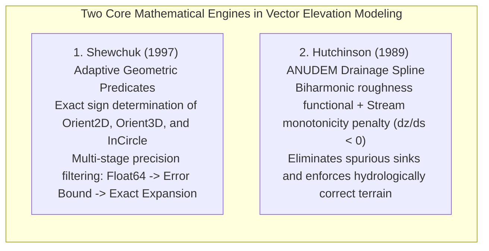
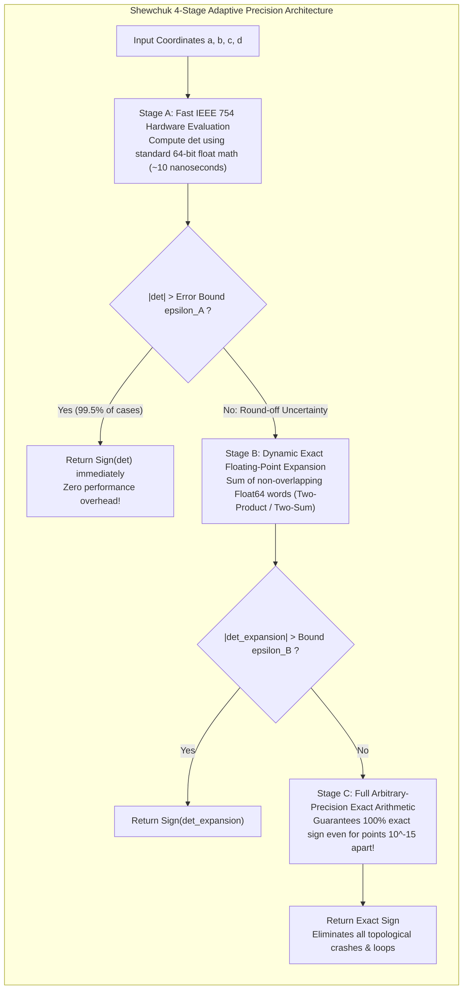
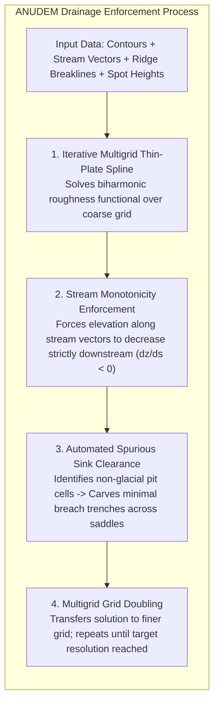

# Chapter 17: Vector Data Issues in Elevation Modeling

*Points, lines, polylines, polygons, multipolygons, breaklines, topology, and the breakdown of 2.5D assumptions when roads cross or pass under buildings.*

---

## 17.6 Mathematical Foundations of Geometric Predicates and Drainage-Enforced Splines

Integrating vector constraints into digital elevation models requires solving two foundational mathematical problems: determining the exact orientation and topological incidence of vector vertices without numerical failure, and enforcing hydrological flow continuity across rasterized stream networks. 

This section derives Jonathan Shewchuk's (1997) adaptive-precision floating-point geometric predicates and Michael Hutchinson's (1989) ANUDEM drainage-enforced spline optimization equations.

---

### 17.6.1 Shewchuk's Exact Geometric Predicates (1997)

Every computational geometry algorithm used in elevation modeling—Constrained Delaunay Triangulation (CDT), polygon clipping, point-in-polygon tests, and Voronoi diagram construction—relies on evaluating the **sign of a geometric determinant**.

#### 1. The 2D Orientation Predicate (`Orient2D`)
Given three 2D points $\mathbf{a} = [a_x, a_y]^T$, $\mathbf{b} = [b_x, b_y]^T$, and $\mathbf{c} = [c_x, c_y]^T$, the predicate $\text{Orient2D}(\mathbf{a}, \mathbf{b}, \mathbf{c})$ determines whether $\mathbf{c}$ lies to the left of, to the right of, or directly on the directed line from $\mathbf{a}$ to $\mathbf{b}$:

$$\text{Orient2D}(\mathbf{a}, \mathbf{b}, \mathbf{c}) = \det \begin{bmatrix} a_x - c_x & a_y - c_y \\ b_x - c_x & b_y - c_y \end{bmatrix} = (a_x - c_x)(b_y - c_y) - (a_y - c_y)(b_x - c_x)$$

* **$\text{Orient2D} > 0$:** $\mathbf{c}$ lies strictly to the left of the line $\mathbf{a} \to \mathbf{b}$ (counter-clockwise orientation).
* **$\text{Orient2D} < 0$:** $\mathbf{c}$ lies strictly to the right of the line $\mathbf{a} \to \mathbf{b}$ (clockwise orientation).
* **$\text{Orient2D} = 0$:** The three points $\mathbf{a}, \mathbf{b}, \mathbf{c}$ are **strictly collinear**.

#### 2. The 3D Orientation Predicate (`Orient3D`)
Given four 3D points $\mathbf{a}, \mathbf{b}, \mathbf{c}, \mathbf{d}$, the predicate $\text{Orient3D}(\mathbf{a}, \mathbf{b}, \mathbf{c}, \mathbf{d})$ determines whether $\mathbf{d}$ lies above or below the plane passing through $\mathbf{a}, \mathbf{b}, \mathbf{c}$:

$$\text{Orient3D}(\mathbf{a}, \mathbf{b}, \mathbf{c}, \mathbf{d}) = \det \begin{bmatrix} a_x - d_x & a_y - d_y & a_z - d_z \\ b_x - d_x & b_y - d_y & b_z - d_z \\ c_x - d_x & c_y - d_y & c_z - d_z \end{bmatrix}$$

#### 3. The 2D InCircle Predicate (`InCircle`)
In Delaunay triangulation, the empty-circumcircle criterion tests whether point $\mathbf{d}$ lies inside, outside, or on the circumcircle passing through the counter-clockwise triangle $\mathbf{a}, \mathbf{b}, \mathbf{c}$:

$$\text{InCircle}(\mathbf{a}, \mathbf{b}, \mathbf{c}, \mathbf{d}) = \det \begin{bmatrix} a_x - d_x & a_y - d_y & (a_x - d_x)^2 + (a_y - d_y)^2 \\ b_x - d_x & b_y - d_y & (b_x - d_x)^2 + (b_y - d_y)^2 \\ c_x - d_x & c_y - d_y & (c_x - d_x)^2 + (c_y - d_y)^2 \end{bmatrix}$$

* **$\text{InCircle} > 0$:** Point $\mathbf{d}$ lies **inside** the circumcircle (violating the Delaunay condition; triggers an edge flip).
* **$\text{InCircle} < 0$:** Point $\mathbf{d}$ lies strictly **outside** the circumcircle.
* **$\text{InCircle} = 0$:** The four points are **co-circular**.

#### Why Adaptive Precision Is Brilliant
Prior to Shewchuk (1997), geometric libraries either used naive floating-point math (crashing on near-collinear points) or slow arbitrary-precision rational arithmetic (slowing triangulations down by $100\times$). Shewchuk's adaptive filter executes fast hardware floating-point math in $99.5\%$ of cases, invoking exact multi-word expansions only when the points are so close to degenerate that floating-point round-off could flip the sign.

---

### 17.6.2 Hutchinson's ANUDEM Drainage-Enforced Spline (1989)

When digital elevation models are interpolated from digitized contour lines and stream vectors, standard minimum-curvature splines (like GMT `surface`) suffer from two severe hydrologic defects:
1. They create hundreds of artificial, closed depression "pits" or sinks along stream channels.
2. They allow streams to flow up hillsides or cross ridge noses instead of following natural valley thalwegs.

In 1989, Australian mathematician Michael F. Hutchinson developed the **ANUDEM** algorithm (Australian National University Digital Elevation Model, implemented in Esri software as `TopotoRaster`), which formulates elevation gridding as a constrained variational optimization problem.

#### Step 1: The Variational Roughness Functional
ANUDEM models the continuous elevation surface $z(x, y)$ by minimizing a modified thin-plate smoothing spline functional:

$$J[z] = \iint_{\Omega} \left[ \left(\frac{\partial^2 z}{\partial x^2}\right)^2 + 2\left(\frac{\partial^2 z}{\partial x \partial y}\right)^2 + \left(\frac{\partial^2 z}{\partial y^2}\right)^2 \right] dx \, dy + \iint_{\Omega} T \left( \|\nabla z\|^2 \right) dx \, dy + P_{\text{stream}}[z] + P_{\text{sink}}[z]$$

where the first integral represents the total bending curvature (roughness penalty), $T$ is the surface tension parameter, and $P_{\text{stream}}, P_{\text{sink}}$ are specialized hydrological penalty functionals.

#### Step 2: Stream Monotonicity Enforcement ($P_{\text{stream}}$)
Let $\mathbf{s}(t)$ denote a parameterized stream vector polyline oriented in the downstream direction (arc length $s$). Physical gravity dictates that water cannot flow uphill:

$$\frac{\partial z}{\partial s} < 0 \quad \text{along the entire streamline } \mathbf{s}(t)$$

If the unconstrained spline produces a localized flat spot or upward bump along a river segment:

$$\frac{\partial z}{\partial s} \ge 0$$

ANUDEM applies an asymmetric penalty function that forcefully lowers the downstream cell elevations and raises the upstream cell elevations:

$$P_{\text{stream}}[z] = w_s \int_{\text{Streams}} \max\left( 0, \, \frac{\partial z}{\partial s} + \delta \right)^2 ds$$

where $\delta > 0$ is a minimum downstream slope threshold and $w_s$ is a high penalty weight.

#### Step 3: Spurious Sink Removal Algorithm
A grid cell $z_{i, j}$ is a **sink (pit)** if all its surrounding eight neighbors have higher elevations:

$$z_{i, j} < \min_{k \in \text{Neighbors}} z_k$$

While natural closed depressions exist in karst limestone or glaciated kettles, $99\%$ of sinks in contour-derived DEMs are spurious interpolation artifacts. 

ANUDEM executes an automated clearance algorithm:
1. Detects all local minima that do not coincide with user-declared natural sinks.
2. Identifies the lowest drainage saddle point on the watershed perimeter surrounding the sink.
3. Carves a monotonic drainage path along the steepest descent line from the saddle back to the stream network, adjusting cell elevations by the minimum amount necessary ($\Delta z_{\min}$) to satisfy:
   $$\nabla z \cdot \hat{\mathbf{v}}_{\text{drainage}} > 0$$

By coupling multi-grid finite difference relaxation with active stream-vector constraints, ANUDEM produces digital elevation models that are **hydrologically correct at the moment of creation**, eliminating the need for post-hoc destructive "pit-filling" or arbitrary flow carving.
