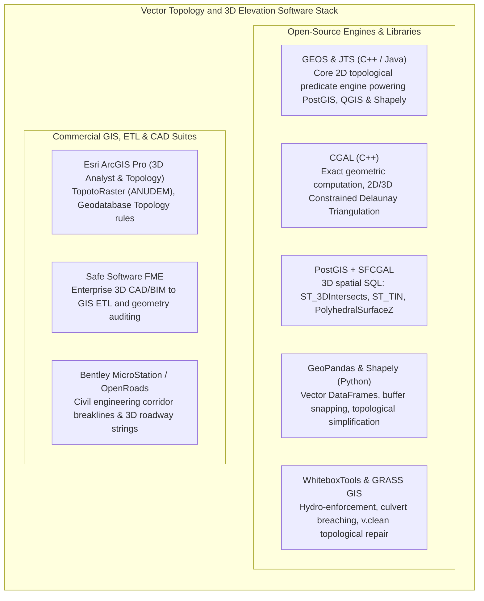

# Chapter 17: Vector Data Issues in Elevation Modeling

*Points, lines, polylines, polygons, multipolygons, breaklines, topology, and the breakdown of 2.5D assumptions when roads cross or pass under buildings.*

---

## 17.7 Software Ecosystem for Vector Processing, Topological Cleaning, and 3D Modeling

Vector operations in digital elevation modeling require a robust software pipeline capable of cleaning dirty drafting geometries, enforcing planar topology, evaluating exact predicates, and handling true 3D surfaces. This section details both the open-source and commercial software suites that manage vector breaklines, contours, and 3D solid geometry.



---

### 17.7.1 Open-Source Libraries and Vector Workflows

#### Topological Cleaning with GRASS GIS (`v.clean`)
When vector breaklines or contour lines are imported from CAD files or digitized shapefiles, they frequently contain topological defects: overshoots, undershoots, duplicate lines, and unclosed dangles. The `v.clean` module in GRASS GIS provides a sequence of topological repair operators:

```bash
# 1. Snap dangling nodes within a 0.25-meter tolerance
grass --exec v.clean input=raw_breaklines.shp output=breaklines_snapped.shp tool=snap thresh=0.25

# 2. Break lines at all real intersections (enforcing Corbett's planar graph rule)
grass --exec v.clean input=breaklines_snapped.shp output=breaklines_broken.shp tool=break

# 3. Remove duplicate lines and tiny dangles
grass --exec v.clean input=breaklines_broken.shp output=clean_breaklines.shp tool=rmdupl,rmdangle thresh=0,1.0
```

#### 3D Geometry and Surface Intersections in PostGIS and SFCGAL
While standard PostGIS uses GEOS for 2D operations, the `postgis_sfcgal` extension integrates CGAL's exact 3D computational geometry kernels directly into SQL:

```sql
-- Enable SFCGAL extension in PostgreSQL
CREATE EXTENSION postgis_sfcgal;

-- 1. Create a true 3D TIN surface from 3D vector points
CREATE TABLE project_tinz AS
SELECT ST_TIN(ST_Collect(geom_3d)) AS tin_geom
FROM surveyed_ground_points;

-- 2. Detect 3D spatial intersections between a proposed highway deck and terrain
-- Unlike ST_Intersects (which flattens to 2D), ST_3DIntersects tests true 3D spatial clash!
SELECT 
    b.bridge_id,
    t.terrain_id,
    ST_3DIntersects(b.deck_polyhedral_geom, t.tin_geom) AS is_subsurface_collision
FROM highway_bridges b, project_tinz t;
```

#### Hydro-Enforcement and Culvert Breaching with WhiteboxTools
**WhiteboxTools** (developed by John Lindsay in Rust with Python bindings) provides high-performance algorithms for hydro-enforcing digital elevation models using vector stream burnlines:

```python
"""Automated DEM Hydro-Enforcement using WhiteboxTools."""

import whitebox_workflows as wbw

# 1. Initialize the Whitebox Workflows engine
wbe = wbw.WbEnvironment()

# 2. Breach culverts and bridges through road embankments (destructive hydro-enforcement)
# Finds road embankments obstructing vector stream centerlines and carves digital trenches
wbe.breach_depressions_least_cost(
    dem="raw_lidar_dtm.tif",
    output="hydro_enforced_dem.tif",
    dist=100.0,  # Maximum breach distance (meters)
    max_cost=15.0,  # Maximum vertical excavation cost
    fill=False,  # Carve trenches instead of filling pits
)

# 3. Compute D8 hydrologic flow direction and accumulation across the enforced surface
wbe.d8_pointer(dem="hydro_enforced_dem.tif", output="d8_flow_dir.tif")
wbe.d8_flow_accumulation(
    input="d8_flow_dir.tif", output="flow_accumulation.tif"
)
```

---

### 17.7.2 Commercial and Industrial Suites

#### Esri ArcGIS Pro: Topology Rules and Topo to Raster
In enterprise GIS, Esri's **Geodatabase Topology** establishes rule-based geometric constraints:
* Enforces rules like *Must Not Have Gaps*, *Must Not Overlap*, and *Must Be Larger Than Cluster Tolerance*.
* **Topo to Raster:** The commercial implementation of Michael Hutchinson's ANUDEM algorithm, which ingests contour polylines, stream centerlines, lake boundaries, and spot heights to produce hydrologically sound drainage models.

#### Safe Software FME (Feature Manipulation Engine)
FME is the industry standard for reconciling CAD drafting layers (AutoCAD `.dwg`, MicroStation `.dgn`) with 3D GIS databases:
* **GeometryValidator Transformer:** Identifies self-intersections, bad winding orders, null geometries, and non-planar polygons.
* **SurfaceBuilder:** Constructs 3D TINs and calculates cut-and-fill volumes between multi-temporal vector surveys.

#### Bentley MicroStation and OpenRoads
In highway engineering and transportation:
* Engineers design 3D highway corridors using parametric vector "strings" (edge of pavement, curb line, median divide, ditch thalweg).
* These 3D vector alignments act as hard breaklines during corridor mesh generation, guaranteeing sub-centimeter alignment of civil road surfaces.

---

### 17.7.3 Software Comparison Matrix

| Software / Tool | License Model | Primary Geometric Domain | Key Mathematical Core | Best-Suited Role in Elevation Workflows |
| :--- | :--- | :--- | :--- | :--- |
| **GEOS / JTS** | Open-Source (LGPL) | 2D Vector Primitives | Snap-rounding, planar overlay, DE-9IM | Core 2D geometry engine for QGIS, PostGIS, Shapely. |
| **CGAL** | Open-Source (GPL/LGPL)| 2D/3D Meshes & Solids | Exact arithmetic predicates (Shewchuk) | Robust Constrained Delaunay Triangulation without crash. |
| **PostGIS / SFCGAL**| Open-Source (GPLv2) | 2D / 2.5D / True 3D | PostgreSQL SQL engine + CGAL 3D kernels | Enterprise 3D spatial queries, `PolyhedralSurfaceZ`. |
| **WhiteboxTools** | Open-Source (GPLv3) | Raster + Vector Hydro | Rust-optimized Least-Cost Breaching | Automated culvert breaching and DEM hydro-conditioning. |
| **GRASS GIS** | Open-Source (GPLv2) | 2D/3D Topological Vector | Corbett node-arc topology (`v.clean`) | CAD vector cleaning, intersection breaking, snapping. |
| **Esri ArcGIS Pro** | Commercial (Esri) | Raster, TIN, Geodatabase | ANUDEM (`TopotoRaster`), Rule Topology | National mapping, contour gridding, hydrologic modeling. |
| **Safe Software FME** | Commercial (Safe) | CAD / GIS / BIM 3D | Multi-format spatial ETL & validation | Transforming civil CAD drawings into 3D GIS breaklines. |
| **Bentley OpenRoads**| Commercial (Bentley) | 3D Civil Engineering | Parametric 3D corridor strings | Design-grade highway breakline modeling. |
