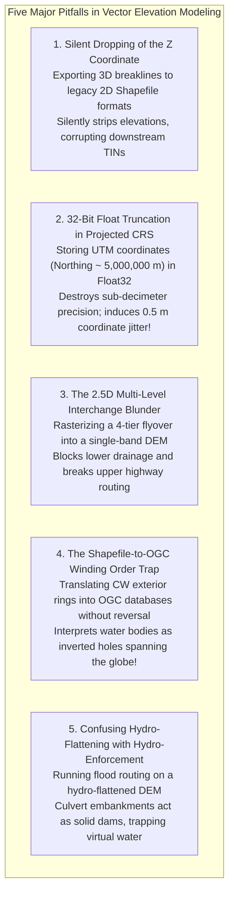

# Chapter 17: Vector Data Issues in Elevation Modeling

*Points, lines, polylines, polygons, multipolygons, breaklines, topology, and the breakdown of 2.5D assumptions when roads cross or pass under buildings.*

---

## 17.8 Common Pitfalls and Key Takeaways

Integrating vector geometries with digital elevation models requires navigating subtle coordinate representations, format limitations, and topological conventions. Misunderstanding these interactions leads to dropped elevations, inverted lakes, corrupted hydraulic simulations, and catastrophic crashes in computational geometry software.

---

### 17.8.1 Common Pitfalls in Vector Elevation Modeling

#### 1. Silent Dropping of the `Z` Coordinate in Legacy Formats
Engineers frequently export survey-grade 3D breaklines (road curbs, ditch inverts, retaining wall tops) from CAD or modern GIS software using default export settings:
* Older Shapefile drivers default to 2D `Point`, `PolyLine`, and `Polygon` rather than `PointZ`, `PolyLineZ`, and `PolygonZ`.
* The export software silently drops the third dimension, exporting the geometries as flat 2D lines.
* When the analyst attempts to build a Constrained Delaunay Triangulation, the software assigns an elevation of $0.00\text{ m}$ to all breaklines, plunging the entire road network into sea-level trenches! Always verify that output vector files explicitly declare `PointZ`, `LineStringZ`, or `PolygonZ` geometry types.

#### 2. The 32-Bit Float Precision Loss in Projected Coordinates
A standard IEEE 754 single-precision float (`Float32`) provides only 24 bits of mantissa, corresponding to approximately **7 significant decimal digits of precision**:
* In UTM or State Plane Coordinate Systems, coordinates frequently reach 7 or 8 digits (e.g., UTM Zone 10N Northing $Y = 5,234,567.89\text{ m}$).
* Storing UTM coordinates in `Float32` truncates coordinates to the nearest meter, inducing **$\pm 0.5\text{–}1.0\text{ m}$ of artificial coordinate jitter**:
  $$5,234,567.89\text{ m} \xrightarrow{\text{Float32}} 5,234,568.00\text{ m}$$
* When breaklines are snapped to these truncated coordinates, planar topology collapses, generating hundreds of false self-intersections and sliver triangles. Vector spatial coordinates must **always be stored as 64-bit double-precision floats (`Float64`)**.

#### 3. Rasterizing Stacked Highway Flyovers into 2.5D Grids
Attempting to evaluate flood risks or plan autonomous vehicle routes over a complex metropolitan interchange using a standard 2.5D raster DEM:
* If the bare-earth DTM is used, flyovers become severed $25\text{-meter}$ chasms.
* If the surface DSM is used, the space beneath the flyovers is filled with solid virtual earth, blocking underpass traffic and damming natural drainage.
* Urban modeling must preserve transportation corridors as **3D topological vector graphs** or multi-horizon elevation stacks.

#### 4. The Shapefile-to-OGC Winding Order Inversion Trap
Shapefiles mandate that exterior polygon rings run Clockwise (CW), whereas OGC Simple Features, GeoJSON, and modern spatial SQL standards mandate Counter-Clockwise (CCW):
* Ingesting Shapefiles directly into OGC databases without an automated winding-order repair utility causes the database to treat the boundary as an interior hole.
* Automated hydro-flattening scripts inadvertently assign the lake elevation to the entire surrounding continent, creating a planetary-scale flat surface while leaving the actual lake unflattened.

#### 5. Confusing Hydro-Flattening with Hydro-Enforcement
Using a standard USGS 3DEP hydro-flattened bare-earth DEM directly in hydraulic flow modeling (e.g., HEC-RAS or EPA-SWMM):
* Hydro-flattening preserves elevated road embankments over culverts for cartographic realism.
* In a flow routing simulation, the road embankment acts as an impenetrable dam. The model predicts that upstream neighborhoods will flood under $3\text{ m}$ of water, when in reality water flows safely through the underground culvert.
* Flood modeling requires a **hydro-enforced DEM** where culverts and bridges are digitally breached.

---

### 17.8.2 Key Takeaways for Practitioners

1. **2.5D Surfaces Are Not True 3D:** A single raster grid cell can store only one elevation value. In environments with vertical walls, overhangs, tunnels, or stacked flyovers, 2.5D models break down. Preserve true 3D vector primitives (`PolyhedralSurfaceZ`, `TINZ`, CityGML) whenever vertical clearance matters.
2. **Breaklines Are Essential for Structural Fidelity:** Gridding without hard breaklines turns structural vertical curbs, fault scarps, and retaining walls into smooth, artificial ramps. Always enforce 3D breaklines in civil engineering and urban elevation models.
3. **Always Store Vector Coordinates in Float64:** Never allow geospatial formats to truncate planar coordinates to 32-bit floats. Large projected coordinates (UTM, State Plane) require 64-bit precision to maintain millimeter accuracy and prevent topological collapse.
4. **Hydro-Flatten for Mapping, Hydro-Enforce for Modeling:**
   * Distribute **hydro-flattened DEMs** to cartographers, planners, and civil designers who need true bridge deck elevations.
   * Provide **hydro-enforced DEMs** (with breached culverts and carved stream channels) to hydrologists and flood modelers who need uninterrupted digital water flow.
5. **Enforce Exact Geometric Predicates:** Floating-point round-off errors in near-collinear orientation tests cause Delaunay triangulations to crash or loop infinitely. Always use robust geometric engines (CGAL, GEOS, JTS) that implement Shewchuk's adaptive-precision predicates.
