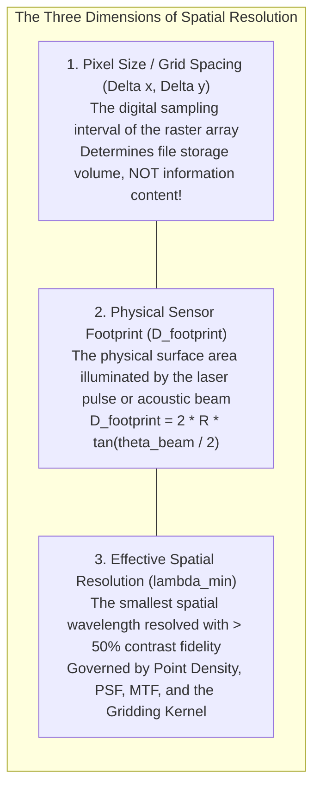
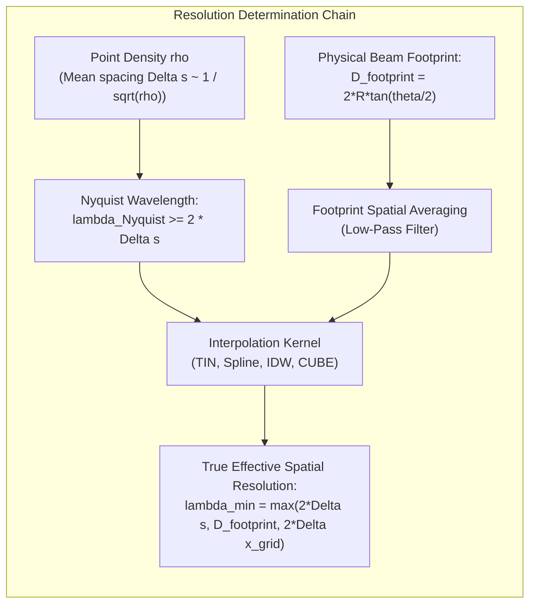
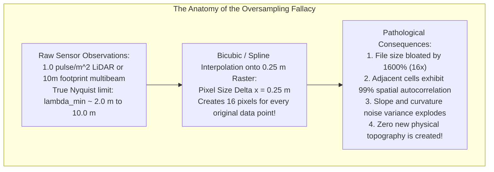

# Chapter 18: Resolution, Pixel Size, Oversampling, Precision, and Super-Resolution

*Why pixel size is not resolution, why more decimal places are not accuracy, and what happens when we push beyond the physical sensor limit.*

Among geospatial practitioners, no term is more frequently misunderstood, conflated, or commercialized than **resolution**. A raster dataset with $1.0\text{-meter}$ grid cell spacing is routinely described as a "1-meter resolution DEM," regardless of whether the underlying sensor was an optical camera resolving gravel pebbles, a high-altitude laser scanner with a $3\text{-meter}$ beam footprint, or a coarse spaceborne altimeter interpolated to a dense grid. Confusing the digital storage interval (pixel size) with physical resolving power (effective resolution) leads to catastrophic errors in hydrological modeling, hazard assessment, and earthwork quantification.

---

## 18.1 Resolution vs. Pixel Size vs. Effective Resolution

To establish scientific and metrological rigor, geospatial analysis must strictly decouple three fundamentally different quantities: **Pixel Size**, **Sensor Footprint**, and **Effective Spatial Resolution**.

---

### 18.1.1 Deconstructing the Terminology

#### 1. Pixel Size (Grid Spacing / Sampling Interval, $\Delta x, \Delta y$)
Pixel size represents the planimetric dimensions of a discrete cell in a raster matrix. A $1.0\text{-meter}$ pixel simply means that numerical elevation values are stored on a regular grid spaced every $1.0\text{ m}$ in the projected coordinate system. It is purely a digital container. Any digital array can be upsampled to $0.1\text{-m}$ pixels using bicubic interpolation without adding a single bit of new physical topography.

#### 2. Sensor Footprint (IFOV / Beamwidth)
The physical sensor footprint is the finite area on the Earth's surface illuminated during a single measurement:
* **Airborne LiDAR:** For a laser with divergence $\gamma$ (typically $0.25\text{–}0.5\text{ mrad}$) flown at altitude $H$:
  $$D_{\text{footprint}} = 2 H \tan\left(\frac{\gamma}{2}\right) \approx H \gamma$$
  At $H = 2000\text{ m}$ with $\gamma = 0.3\text{ mrad}$, the physical laser footprint is $D \approx 0.60\text{ m}$ across.
* **Multibeam Sonar:** For an acoustic sonar with along-track and across-track beamwidths $\theta_x, \theta_y$ operating at water depth $D$:
  $$D_{\text{footprint}} = 2 D \tan\left(\frac{\theta_{\text{beam}}}{2}\right)$$
  For a $1.0^\circ$ sonar at depth $D = 500\text{ m}$, the seabed footprint diameter is **$8.73\text{ meters}$**. The acoustic travel time returned to the hydrophone is a spatial convolution of all acoustic scatterers within that $8.7\text{-meter}$ circular patch.

#### 3. Effective Spatial Resolution ($\lambda_{\min}$)
Effective spatial resolution is the smallest spatial wavelength ($\lambda_{\min}$) or object size that can be separated and resolved from its background with adequate signal-to-noise ratio (typically defined by the Rayleigh criterion or the Modulation Transfer Function at $50\%$ contrast, $\text{MTF} \ge 0.50$). It is governed by three physical constraints:
1. **The Nyquist-Shannon Sampling Criterion:** A surface feature of spatial wavelength $\lambda$ can be reconstructed without aliasing if and only if it is sampled by at least two independent measurement points per wavelength:
   $$\lambda_{\text{Nyquist}} \ge 2 \Delta s_{\text{point}}$$
   For a point cloud with pulse density $\rho$ ($\text{pts/m}^2$), the nominal point spacing is $\Delta s \approx \frac{1}{\sqrt{\rho}}$. The minimum resolvable feature wavelength is therefore:
   $$\lambda_{\min} \ge \frac{2}{\sqrt{\rho}}$$
2. **Point Spread Function (PSF) Convolution:** The measurement acts as a low-pass spatial filter convolving the true terrain $z(x, y)$ with the finite footprint beam shape:
   $$z_{\text{measured}}(\mathbf{x}) = \iint z(\mathbf{x}') \, \text{PSF}(\mathbf{x} - \mathbf{x}') \, d\mathbf{x}'$$
   Terrain features significantly smaller than $D_{\text{footprint}}$ have their amplitudes attenuated and cannot be resolved regardless of sampling density.
3. **The Gridding Filter Kernel:** Moving-average, Gaussian, or spline interpolation kernels further smooth high frequencies, expanding the effective resolution beyond the raw point spacing.

---

### 18.1.2 The Oversampling Fallacy

The **Oversampling Fallacy** is the mistaken belief that interpolating low-density sensor data onto a fine-resolution grid increases the accuracy or informational content of the digital elevation model.

#### The Mathematical Proof of Information Deficit
Consider an airborne LiDAR dataset collected at a nominal pulse density of $\rho = 1.0\text{ pulse/m}^2$ (mean point spacing $\Delta s = 1.0\text{ m}$). By the Nyquist-Shannon sampling theorem, the maximum spatial frequency present in the point cloud is:

$$f_{\max} = \frac{1}{2 \Delta s} = 0.50\text{ cycles/m} \quad (\text{Wavelength } \lambda_{\min} = 2.0\text{ m})$$

If an analyst grids this point cloud onto a raster with pixel size $\Delta x = 0.25\text{ m}$, the grid's digital Nyquist limit is:

$$f_{\text{grid}} = \frac{1}{2 \Delta x} = 2.00\text{ cycles/m} \quad (\text{Wavelength } \lambda = 0.50\text{ m})$$

Between $f_{\max} = 0.50$ and $f_{\text{grid}} = 2.00$, the frequency spectrum contains **zero sensor signal**. All spatial variations within this frequency band are pure mathematical artifacts of the interpolation polynomial (spline ringing or IDW bull's-eyes). 

#### Pathological Impacts of Oversampling
1. **Severe Error Autocorrelation:** Adjacent $0.25\text{-m}$ pixels share virtually identical sensor errors, violating independent error assumptions and artificially inflating false confidence in engineering models.
2. **Derivative Noise Explosion:** Computing terrain slope on an oversampled raster amplifies high-frequency interpolation noise by $\frac{1}{\Delta x^2} = 16\times$, rendering slope maps speckled and noisy.
3. **Massive Storage and Compute Waste:** A $100\text{ km}^2$ project gridded at $1\text{-m}$ produces $100\text{ million}$ pixels ($400\text{ MB}$). Gridded at $0.25\text{-m}$, it expands to **$1.6\text{ billion}$ pixels ($6.4\text{ GB}$)** without adding a single rock, ditch, or ridge not already captured in the $1\text{-m}$ grid.

---

### 18.1.3 The Goldilocks Rule for Grid Spacing

To avoid both under-sampling (aliasing real topography) and over-sampling (bloating storage and auto-correlating noise), cartographic standards (such as USGS 3DEP and NOAA HSSD) mandate the **Goldilocks Rule for Grid Spacing**:

$$\Delta x_{\text{optimal}} \approx 1.5\text{ to } 2.0 \times \Delta s_{\text{point}} \approx \frac{1.5\text{ to } 2.0}{\sqrt{\rho}}$$

* For USGS QL1 LiDAR ($\rho \ge 8\text{ pts/m}^2 \implies \Delta s \approx 0.35\text{ m}$): Optimal grid spacing is **$0.5\text{ m}$**.
* For USGS QL2 LiDAR ($\rho \ge 2\text{ pts/m}^2 \implies \Delta s \approx 0.71\text{ m}$): Optimal grid spacing is **$1.0\text{ m}$**.
* For shallow multibeam sonar with sounding density $\rho \ge 4\text{ soundings/m}^2$: Optimal grid spacing is **$0.75\text{–}1.0\text{ m}$**.
* For deep multibeam sonar ($D = 1000\text{ m}$, beamwidth $1^\circ \implies D_{\text{footprint}} \approx 17.5\text{ m}$): Optimal grid spacing is **$16\text{–}32\text{ m}$**, regardless of how many overlapping vessel passes were run.
