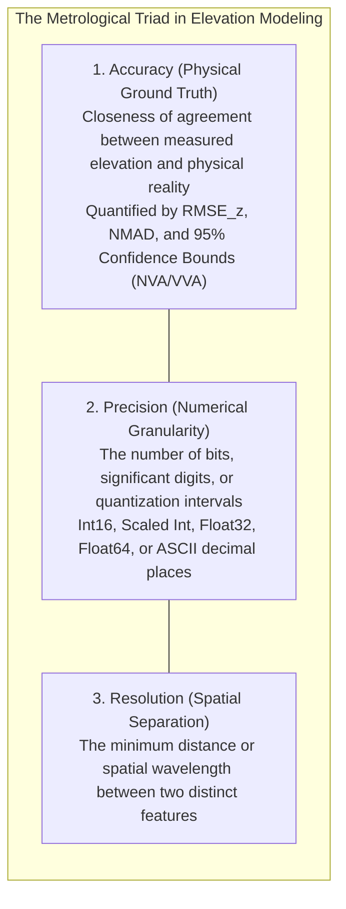
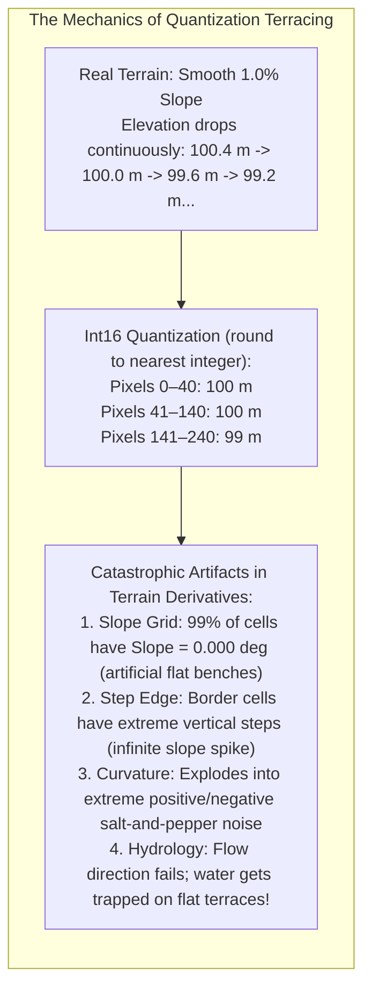
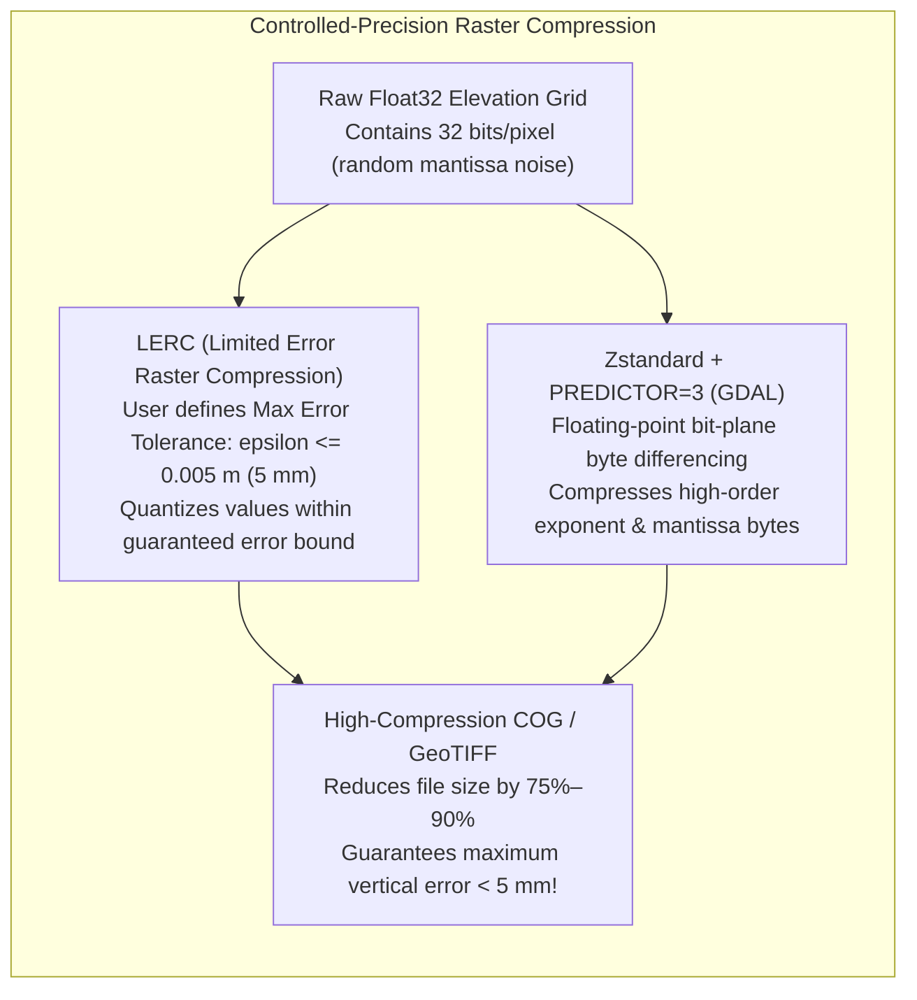

# Chapter 18: Resolution, Pixel Size, Oversampling, Precision, and Super-Resolution

*Why pixel size is not resolution, why more decimal places are not accuracy, and what happens when we push beyond the physical sensor limit.*

---

## 18.2 Resolution vs. Numerical Precision vs. Accuracy

Just as practitioners routinely conflate pixel size with spatial resolution, they frequently confuse **numerical precision** (the number of bits or decimal places used to store a value) with **measurement accuracy** (the degree of closeness to true physical reality). 

Storing an uncalibrated elevation model with 12 decimal places of floating-point precision does not make it accurate to the width of an atom; it simply stores random sensor noise and computational round-off to an absurd degree of granularity. Conversely, truncating floating-point elevation data into integers to save disk space introduces severe "terracing" quantization artifacts that ruin downstream slope and hydrologic modeling.



---

### 18.2.1 Numerical Data Types in Elevation Modeling

The binary data type selected to store elevation values dictates the dynamic vertical range, vertical quantization step size, and memory footprint of the dataset:

| Data Type | Bit Depth | Mantissa / Range | Quantization Step ($\Delta z$) | Memory per Pixel | Operational Hazards & Elevation Artifacts |
| :--- | :--- | :--- | :--- | :--- | :--- |
| **`Int16` (Raw)** | 16 bits | $[-32,768, \, +32,767]$ | **$1.0\text{ meter}$** | $2\text{ bytes}$ | **Severe Terracing:** Gentle slopes quantize into flat $1\text{-m}$ steps; slope drops to zero between steps. |
| **`Int16` (Scaled)** | 16 bits | Scale $= 0.01, \text{Offset} = z_0$ | **$0.01\text{ meter}$ ($1\text{ cm}$)** | $2\text{ bytes}$ | **Range Clipping:** Maximum vertical relief is restricted to $655.35\text{ m}$ ($2^{16} \times 0.01$). |
| **`Int32` (Scaled)** | 32 bits | Scale $= 0.001, \text{Offset} = 0$ | **$0.001\text{ meter}$ ($1\text{ mm}$)** | $4\text{ bytes}$ | Excellent for high-precision elevation; wide dynamic range ($\pm 2,147,483\text{ m}$). |
| **`Float32`** | 32 bits | 24-bit mantissa ($\approx 7$ digits) | Dynamic ($<0.001\text{ m}$ at Mount Everest) | $4\text{ bytes}$ | **The Modern Industry Standard:** Flawless vertical precision across planetary elevation scales. |
| **`Float64`** | 64 bits | 53-bit mantissa ($\approx 16$ digits)| $10^{-12}\text{ meters}$ | $8\text{ bytes}$ | **Wasteful for Elevation:** Wastes 50% memory storing sensor noise; mandatory only for horizontal coordinates. |

---

### 18.2.2 The `Int16` Quantization Terracing Disaster

In early digital cartography (and many legacy regional GIS repositories), raster DEMs were stored as raw 16-bit signed integers (`Int16`) where one unit equaled one meter. 



#### Why $1\text{-Meter}$ Quantization Destroys Slope and Aspect
Consider terrain on an alluvial coastal plain with a gentle slope of $S = 0.5\%$ ($1\text{ meter}$ fall over $200\text{ meters}$ horizontal distance). Gridded at $\Delta x = 1.0\text{ m}$:
* In a continuous `Float32` DEM, the slope is a uniform $0.286^\circ$ ($0.005\text{ rad}$), and aspect points smoothly toward the sea.
* In an unscaled `Int16` DEM, the elevation values remain identical ($z = 100\text{ m}$) for 200 consecutive pixels, and then abruptly step down to $z = 99\text{ m}$ at pixel 201.
* Across the 200 flat pixels, the directional slope is mathematically **$\|\nabla z\| = 0.000^\circ$**, and aspect is undefined (NaN). At the single transition pixel, the slope spikes to an artificial step.
* Hydrological flow routing models (D8/D-infinity) cannot route water across these quantized "staircases," causing digital rivers to dam into massive artificial flat swamps.

---

### 18.2.3 The False Precision Trap in ASCII and Text Formats

At the opposite extreme lies the **False Precision Trap**: exporting coordinates or elevations to text formats (GeoJSON, CSV, XYZ, or ASCII Grid) with full machine-precision floating-point expansions:

```
# Pathological False Precision in an ASCII Point Export:
-122.419415598124958, 37.774929548192847, 18.234857193857192
```

#### The Scale of Absurdity
* 1 decimal degree at the equator is $\approx 111,320\text{ meters}$.
* 6 decimal places: $0.000001^\circ \approx 0.111\text{ m}$ ($11\text{ cm}$) — roughly the width of a smartphone.
* 8 decimal places: $0.00000001^\circ \approx 1.1\text{ mm}$ — the thickness of a paperclip.
* 15 decimal places: $10^{-15\circ} \approx 0.11\text{ nanometers}$ — **the physical diameter of a single hydrogen atom!**

Exporting elevation points with 15 decimal places:
1. Implies that an airborne LiDAR scanner flying at $200\text{ km/h}$ through turbulent air can resolve atomic lattice vibrations on a tree leaf.
2. Bloats file sizes by **$400\%\text{–}600\%$**, flooding networks and databases with billions of useless ASCII characters representing pure pseudo-random floating-point noise.
3. Defeats modern columnar data compression algorithms.

---

### 18.2.4 Modern Controlled-Precision Compression: LERC and Bit-Plane Truncation

To optimize storage without sacrificing metrological accuracy, modern cloud-native formats utilize **controlled-precision lossy compression**:



#### 1. LERC (Limited Error Raster Compression)
Developed by Esri and open-sourced under the Apache 2.0 license, LERC is supported natively in GDAL (`COMPRESS=LERC`):
* The user declares a maximum tolerable vertical error $\epsilon_{\max}$ (e.g., $\epsilon_{\max} = 0.005\text{ m} = 5\text{ mm}$).
* LERC partitions the raster into $8 \times 8$ pixel blocks, identifies local plane trends, and quantizes residual values so that **no pixel ever deviates from its true floating-point value by more than $\epsilon_{\max}$**:
  $$\max_{i, j} |z_{\text{decompressed}}[i, j] - z_{\text{raw}}[i, j]| \le \epsilon_{\max}$$
* Achieves compression ratios of **$5:1$ to $15:1$** while guaranteeing metrological integrity.

#### 2. Zstandard with Floating-Point Predictor (`PREDICTOR=3`)
In standard DEFLATE or ZSTD compression, raw IEEE 754 floats compress poorly because the low-order mantissa bits are essentially random noise. Setting `PREDICTOR=3` in GDAL transposes the 4 bytes of each 32-bit float into separate bit-planes:
* All exponent bytes (which vary smoothly across terrain) are clustered together and compress to nearly zero size.
* Only the noisy least-significant mantissa bytes remain uncompressed, shrinking Cloud-Optimized GeoTIFF (COG) file sizes by $60\%\text{–}80\%$ with **zero loss of precision**.
