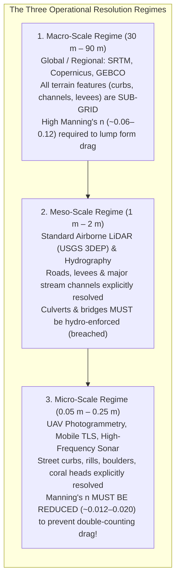
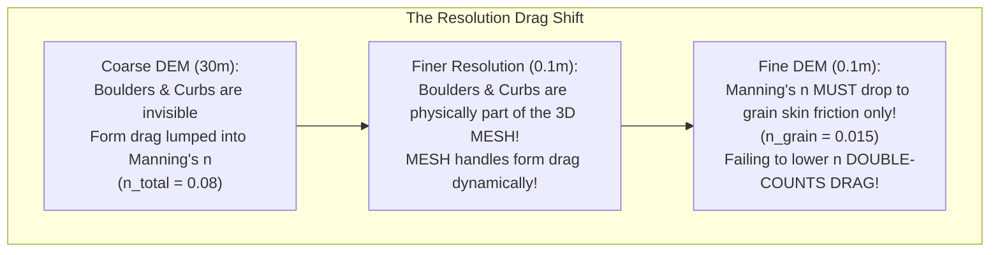
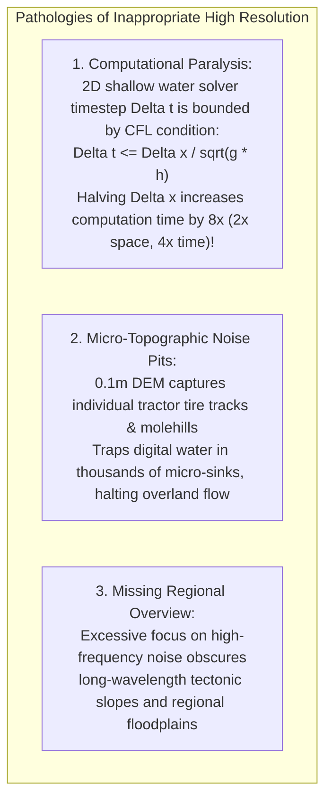

# Chapter 18: Resolution, Pixel Size, Oversampling, Precision, and Super-Resolution

*Why pixel size is not resolution, why more decimal places are not accuracy, and what happens when we push beyond the physical sensor limit.*

---

## 18.3 How the Resolution of the Resulting Product Changes What Is Appropriate

A digital elevation model does not exist in an abstract vacuum; its spatial resolution dictates which physical processes are explicitly resolved by the geometric mesh, and which processes must be parameterized as statistical sub-grid roughness. A computational physics model (such as a 2D hydrodynamic flood solver, a coastal storm-surge simulator, or an overland landslide run-out engine) calibrated on a $30\text{-meter}$ DEM will produce completely erroneous results if run on a $0.1\text{-meter}$ DEM without adjusting its physical governing parameters.

---

### 18.3.1 The Roughness Paradox: Scale-Dependent Manning's $n$

In hydraulic engineering and flood inundation modeling, water velocity $V$ is governed by the empirical Manning equation:

$$V = \frac{1}{n} R_h^{2/3} S_0^{1/2}$$

where $R_h$ is hydraulic radius, $S_0$ is bed slope, and $n$ is **Manning's roughness coefficient**.

#### Why Roughness Is Not an Invariant Surface Property
Practitioners often treat Manning's $n$ as a fixed material constant (e.g., "concrete is always $n = 0.015$, dense forest is always $n = 0.10$"). In computational terrain analysis, this assumption is false. Manning's $n$ is an effective lumped parameter that accounts for two distinct physical mechanisms:
1. **Skin Friction ($n_{\text{grain}}$):** Viscous shear stress against micro-scale soil particles, sand grains, and vegetation stems.
2. **Form Drag ($n_{\text{form}}$):** Pressure resistance caused by flow stagnation and turbulent wake separation behind macroscopic topographic obstacles (street curbs, road embankments, boulders, bridge piers, and tree trunks).

$$\text{Total Resistance } n_{\text{total}} = \sqrt{n_{\text{grain}}^2 + n_{\text{form}}^2}$$

#### The Double-Counting Drag Failure
* **On a $30\text{-meter}$ DEM:** Street curbs, roadside swales, and road crowns are entirely invisible within the coarse grid cell. To prevent simulated water from flowing unnaturally fast down the flat digital valley, the modeler must assign a high effective roughness ($n \approx 0.06\text{–}0.09$) to represent the unmodeled form drag of the city.
* **On a $0.1\text{-meter}$ DEM:** The $15\text{-cm}$ vertical face of every concrete street curb, the ditch banks, and the elevated roadway crowns are explicitly represented as physical 3D geometry in the mesh. The 2D hydrodynamic solver (e.g., HEC-RAS 2D or TUFLOW) directly computes the physical pressure drop, flow redirection, and momentum loss against the curb faces.
* **The Failure:** If the modeler retains the high coarse-grid roughness ($n = 0.08$) on the fine $0.1\text{-m}$ mesh, the hydraulic resistance is **double-counted**—once by the physical geometry of the mesh, and a second time by the empirical friction equation. Simulated floodwaters slow to an unphysical crawl, vastly overestimating water depths and misidentifying flood zones.

---

### 18.3.2 Scale-Dependent Hydrologic Flow Routing

The mathematical algorithm appropriate for routing water across an elevation surface changes fundamentally with spatial resolution:

| Spatial Resolution | Dominant Physical Scale | Channel Representation | Appropriate Flow Routing Algorithm | Required Hydrologic Vector Conditioning |
| :--- | :--- | :--- | :--- | :--- |
| **$30\text{ m} – 90\text{ m}$** | Regional Watersheds | **Sub-Grid:** Rivers are narrower than one cell. | **D8 / D-Infinity:** Multi-directional flow routing based on regional aspect. | Standard depression filling; sub-grid 1D channel reach coupling. |
| **$1\text{ m} – 5\text{ m}$** | Local Floodplains | **Partially Resolved:** Main river banks captured; culverts invisible. | **2D Diffusion-Wave / Shallow Water:** Solves kinematic momentum across cells. | **Mandatory Hydro-Enforcement:** Culverts and bridges must be breached using burnlines. |
| **$0.05\text{ m} – 0.5\text{ m}$** | Street Scale / Urban | **Fully Resolved:** Gutter curbs, curb inlets, ditches, rills explicit. | **Full 2D/3D Navier-Stokes / Saint-Venant:** Full momentum conservation with turbulence. | **Dual-Drainage Coupling:** Surface mesh coupled to subsurface 1D pipe storm-drain network. |

---

### 18.3.3 When High Resolution Is Harmful

Higher resolution is not always desirable. Deploying ultra-high-resolution DEMs in the wrong operational context introduces severe practical and physical pathologies:

#### The Courant-Friedrichs-Lewy (CFL) Computational Penalty
In explicit numerical hydrodynamic modeling, the maximum stable integration timestep $\Delta t$ is strictly limited by the **CFL stability criterion**:

$$\Delta t \le \frac{\Delta x}{\sqrt{g \, h} + |u|}$$

where $\Delta x$ is cell size, $g$ is gravity, $h$ is water depth, and $u$ is flow velocity:
* If an engineer replaces a $10\text{-m}$ flood model with a $0.5\text{-m}$ LiDAR DEM, cell spacing $\Delta x$ decreases by a factor of 20.
* The stable numerical timestep $\Delta t$ must be reduced by a factor of 20 (e.g., from $1.0\text{ second}$ to $0.05\text{ seconds}$).
* Because the number of grid cells expands by $20^2 = 400\times$, the total computational runtime explodes by:
  $$\text{Compute Scaling} = 400 \times 20 = \mathbf{8,000\times !}$$
* A model that took 10 minutes to run at $10\text{ m}$ requires **55 days** to run at $0.5\text{ m}$, bankrupting engineering project budgets without delivering meaningful improvements in flood hazard boundaries.
