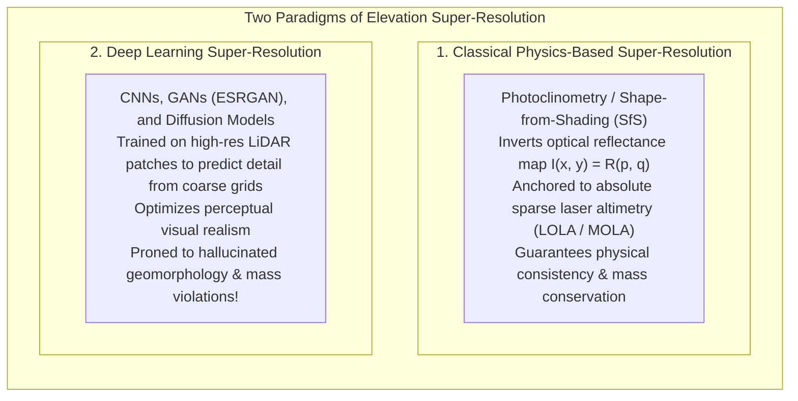
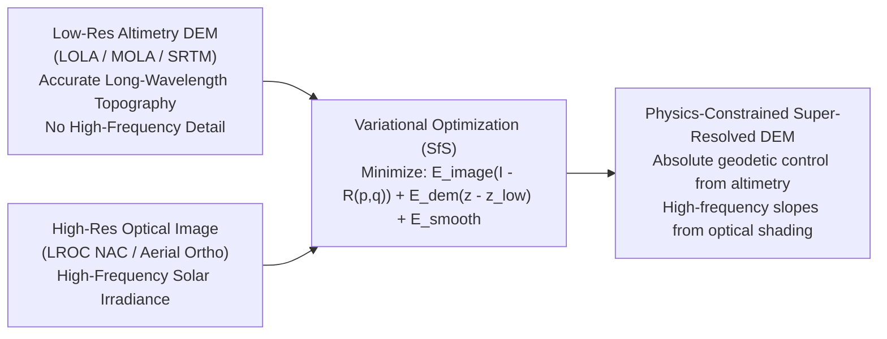
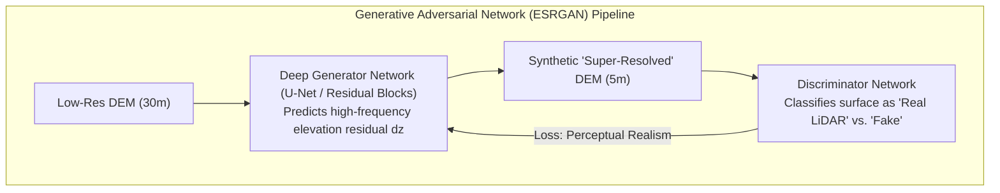
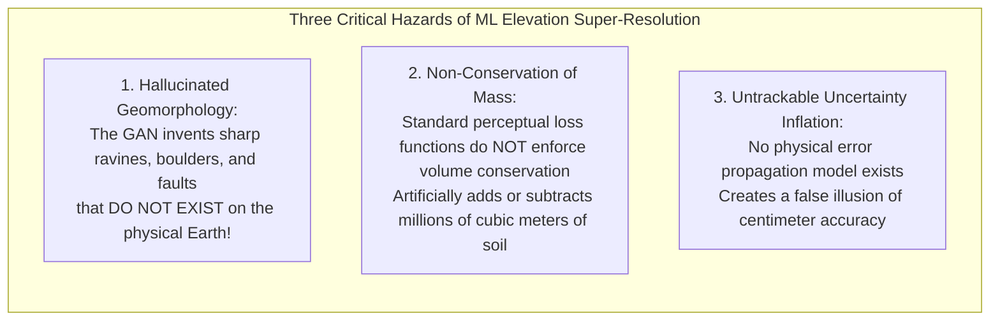

# Chapter 18: Resolution, Pixel Size, Oversampling, Precision, and Super-Resolution

*Why pixel size is not resolution, why more decimal places are not accuracy, and what happens when we push beyond the physical sensor limit.*

---

## 18.4 Super-Resolution of DEMs: Classical Physics vs. Machine Learning

When elevation data is physically constrained to low resolution—such as coarse $30\text{-meter}$ orbital radar topography or sparse planetary laser altimetry—scientists and engineers seek to enhance the surface through **super-resolution (SR)**. Super-resolution aims to reconstruct a high-resolution elevation model from one or more lower-resolution observations.

However, the methodology chosen to achieve super-resolution divides into two fundamentally opposed philosophies: **classical physics-based inverse modeling** (which enforces physical radiative transfer and photometric consistency) and **data-driven deep learning** (which hallucinates plausible high-frequency textures based on training priors).

---

### 18.4.1 Classical Physics-Based Super-Resolution: Shape-from-Shading (SfS)

In planetary science and terrestrial remote sensing, the primary physics-based technique for enhancing elevation resolution is **Shape-from-Shading (SfS)**—also known as **photoclinometry** (pioneered by Berthold Horn in 1975 and refined in the NASA Ames Stereo Pipeline [ASP]).

#### The Image Irradiance Equation
A high-resolution optical image records reflected solar radiance $I(x, y)$. Under the Lambertian or Lommel-Seeliger scattering law, the pixel brightness is a known mathematical function of the illumination vector $\hat{\mathbf{s}}$ and the local surface normal $\hat{\mathbf{n}}(p, q)$:

$$I(x, y) = R(p, q) = \rho_0 \frac{\hat{\mathbf{n}} \cdot \hat{\mathbf{s}}}{\hat{\mathbf{n}} \cdot \hat{\mathbf{v}} + \hat{\mathbf{n}} \cdot \hat{\mathbf{s}}}$$

where $p = \frac{\partial z}{\partial x}$, $q = \frac{\partial z}{\partial y}$ are the directional terrain slopes, $\hat{\mathbf{v}}$ is the viewing vector, and $\rho_0$ is surface albedo.

#### The Variational Optimization Formulation
Because inverting image brightness to slopes is mathematically ill-posed (many slope combinations yield identical brightness), modern SfS formulates super-resolution as a constrained variational PDE:

$$\min_{z(x, y)} \iint \left[ \underbrace{\left( I(x, y) - R\left(\frac{\partial z}{\partial x}, \frac{\partial z}{\partial y}\right) \right)^2}_{\text{Photometric Shading Consistency}} + \, \lambda_1 \underbrace{\left( z(x, y) - z_{\text{coarse}}(x, y) \right)^2}_{\text{Altimetry Datum Anchor}} + \, \lambda_2 \underbrace{\|\nabla^2 z\|^2}_{\text{Smoothness Regularizer}} \right] dx \, dy$$

* **The Low-Frequency Anchor:** The low-resolution altimetry grid ($z_{\text{coarse}}$) pins the long-wavelength elevation, preventing low-frequency drift.
* **The High-Frequency Enhancer:** The high-resolution camera image provides fine slope variations ($p, q$) at the camera pixel scale.
* **Physical Integrity:** Because the reconstructed surface is strictly constrained by real photons reflecting off physical terrain, **it cannot hallucinate non-existent valleys or craters**.

---

### 18.4.2 Deep Learning Super-Resolution: CNNs, GANs, and Diffusion Models

Over the past decade, computer vision researchers have trained deep convolutional neural networks (SRCNN, EDSR), Generative Adversarial Networks (SRGAN, ESRGAN), and Denoising Diffusion Probabilistic Models (DDPM) to upscale coarse elevation grids (e.g., $30\text{-m}$ SRTM to $5\text{-m}$ pseudo-LiDAR).

The generator network learns the conditional probability distribution $p(z_{\text{high}} \mid z_{\text{low}})$ from thousands of training pairs of coarse and high-resolution LiDAR patches. By penalizing the generator with an adversarial loss from a discriminator network, the model produces crisp, visually stunning terrain with sharp ridges, dendritic stream networks, and textured gullies.

---

### 18.4.3 The Critical Dangers of Machine Learning Super-Resolution

While deep learning produces visually convincing results, deploying ML-super-resolved DEMs in civil engineering, flood risk modeling, or geotechnical hazard analysis introduces severe, often life-threatening failure modes:

#### 1. Hallucinated Geomorphology
A Generative Adversarial Network or Diffusion Model does not measure the Earth; it samples from a learned prior. If the training dataset consisted primarily of alpine glaciated terrain in the Alps:
* When the model is deployed over a smooth alluvial fan in California, it will **hallucinate sharp glacial cirques, knife-edge aretes, and bedrock gullies** into the smooth sand.
* A civil engineer designing a pipeline will re-route the corridor around a massive "gully" that exists only inside the neural network's latent weights!

#### 2. Non-Conservation of Mass (Volumetric Corruption)
Physical erosion, sedimentation, and earthwork grading strictly obey the **conservation of mass**:

$$\iint_{\text{Region}} z_{\text{high}}(x, y) \, dx \, dy = \iint_{\text{Region}} z_{\text{low}}(x, y) \, dx \, dy$$

Standard computer vision loss functions (Mean Absolute Error $L_1$, Mean Squared Error $L_2$, or VGG perceptual loss) optimize pixel-level sharpness rather than global volume integrals. An ESRGAN upscaling an elevation model routinely adds or subtracts millions of cubic meters of virtual earth, completely invalidating reservoir storage curves and quarry excavation estimates.

#### 3. Metrological and Legal Invalidation
An elevation model produced by generative AI cannot carry an auditable Total Propagated Uncertainty (TPU). Because the fine-scale features are synthetic hallucinations rather than physical sensor measurements:
* The dataset violates ASPRS Positional Accuracy Standards and IHO S-44 survey orders.
* It cannot be legally admitted as evidence in property boundary disputes, floodplain insurance designations (FEMA NFIP), or maritime charting litigation.
* **The Iron Rule:** Machine learning super-resolution is a valuable tool for **visual rendering, video games, and flight simulator background scenery**, but must **never be utilized for structural engineering, safety of navigation, or flood hazard mitigation** without independent physical survey validation.
