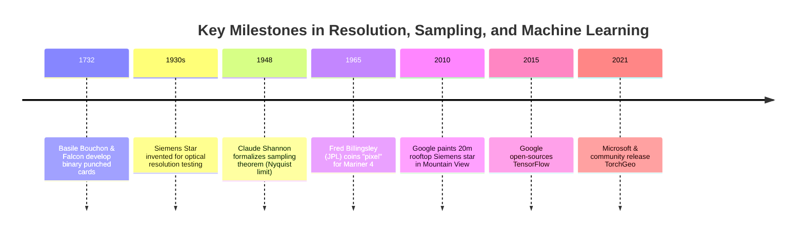
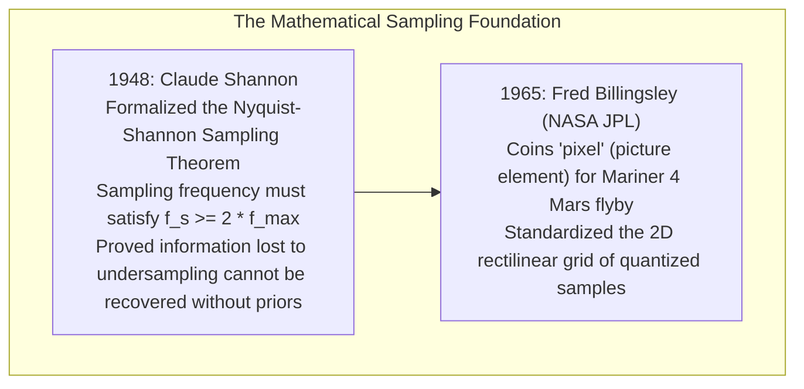

# Chapter 18: Resolution, Pixel Size, Oversampling, Precision, and Super-Resolution

*Why pixel size is not resolution, why more decimal places are not accuracy, and what happens when we push beyond the physical sensor limit.*

---

## 18.5 Historical Evolution of Spatial Resolution, Digital Sampling, and Super-Resolution

The journey to define, measure, and enhance spatial resolution spans nearly three centuries of information theory and computing: from 18th-century punched paper tapes to mathematical sampling bounds, physical optical targets, and GPU-accelerated deep learning.

---

### 18.5.1 Binary Discretization and Optical Resolution (1732–1930s)

#### 1732: Binary Discretization on Punched Cards
The fundamental concept of encoding spatial and mechanical patterns into discrete binary "bits" originated in 18th-century France. In 1725–1732, Basile Bouchon and Jean-Baptiste Falcon invented perforated paper tapes and punched cards to automate textile weaving looms (later perfected by Joseph Marie Jacquard in 1804). This established the foundational principle that continuous physical patterns could be completely discretized into binary information.

#### 1930s: The Siemens Star and Continuous Spatial Frequencies
In the 1930s, optical engineers at Siemens & Halske in Berlin developed the **Siemens star** (spoke target). Facing the challenge of quantifying the resolving power of complex aerial and cinema camera lenses, they realized that testing discrete parallel bars was insufficient. The Siemens star's radial spoke geometry continuously increased spatial frequency toward the center singularity, establishing the first standardized visual method for determining the Modulation Transfer Function (MTF) cutoff and optical astigmatism.

---

### 18.5.2 Information Theory and the Digital Sampling Revolution (1948–1965)

#### 1948: Claude Shannon and the Nyquist-Shannon Sampling Theorem
In 1948, Claude Shannon published *A Mathematical Theory of Communication*, synthesizing earlier work by Harry Nyquist (1928) and E. T. Whittaker (1915). Shannon proved that a continuous physical signal containing frequencies up to $f_{\max}$ can be reconstructed completely if and only if it is sampled at intervals:

$$\Delta t \le \frac{1}{2 f_{\max}} \implies f_s \ge 2 f_{\max}$$

In spatial terrain modeling, this theorem defined the absolute boundary between true physical resolution and spatial aliasing: any terrain feature narrower than twice the sampling interval ($2\Delta x$) is irrevocably lost to aliasing unless prior physical knowledge is introduced.

#### 1965: Fred Billingsley and the "Pixel"
In July 1965, NASA's Mariner 4 spacecraft executed the first successful flyby of Mars, transmitting 21 television images back to Earth over a 33.3-bit-per-second radio link. At NASA's Jet Propulsion Laboratory, engineer Fred C. Billingsley designed digital processing algorithms to de-noise and assemble the digitized scans. While documenting the discrete raster elements of the Martian craters, Billingsley coined the term **"pixel"**. The pixel became the universal atom of digital image processing and raster elevation modeling.

---

### 18.5.3 The Commercial Validation and Deep Learning Eras (2010–2021)

#### 2010: The Google Mountain View Rooftop Siemens Star
As commercial high-resolution Earth-imaging satellites (DigitalGlobe's WorldView-1/2, GeoEye-1) achieved ground sample distances under $0.5\text{ m}$, commercial mapping platforms required independent verification of sensor resolving power. In 2010, Google painted a giant 36-spoke, $20\text{-meter}$ diameter Siemens star onto the roof of Building 43 at its Mountain View, California headquarters. The target allowed calibration engineers to verify on-orbit Modulation Transfer Function (MTF) and Point Spread Function (PSF) parameters directly from satellite passes, ensuring that orthorectified imagery and stereo DEMs met sub-meter spatial fidelity standards.

#### 2015: Google TensorFlow and the Deep Learning Explosion
In November 2015, Google open-sourced **TensorFlow**, a distributed machine learning library. TensorFlow (and later PyTorch) accelerated the transition of computer vision from manual feature engineering to deep convolutional neural networks (CNNs). Within years, remote sensing researchers adapted image super-resolution architectures (SRCNN, ESRGAN) to digital elevation models, initiating the debate between data-driven neural hallucination and classical physics-based photoclinometry.

#### 2021: TorchGeo and Standardized Spatial Deep Learning
In 2021, Adam Stewart and researchers at Microsoft and academic institutions released **TorchGeo**, an open-source PyTorch library specifically engineered for geospatial machine learning:
* Integrated geospatial coordinate reference systems, bounding boxes, and multispectral/elevation rasters directly into deep learning tensors.
* Standardized spatial data loaders and sampling strategies (such as spatial block cross-validation), providing the framework for training, evaluating, and auditing neural elevation models while guarding against spatial data leakage.
