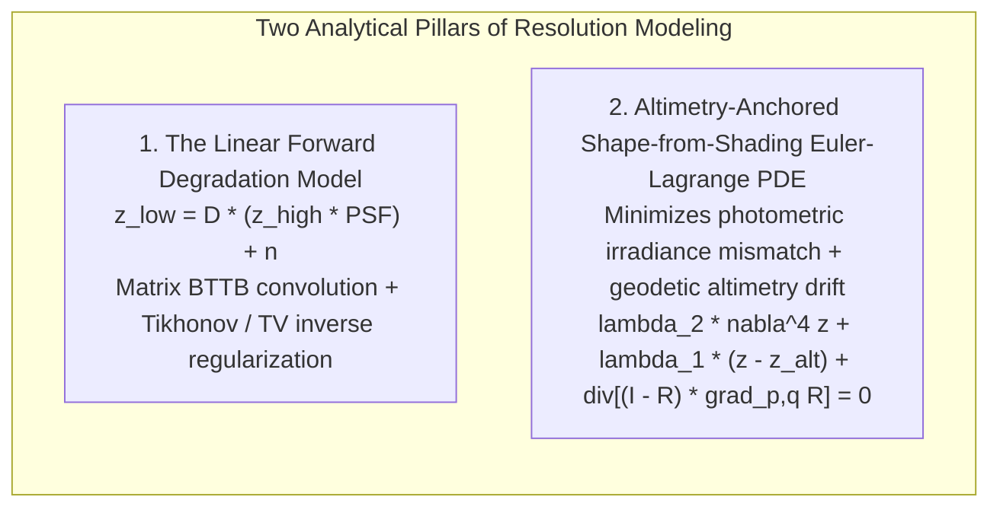
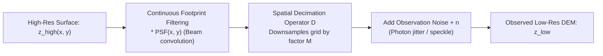
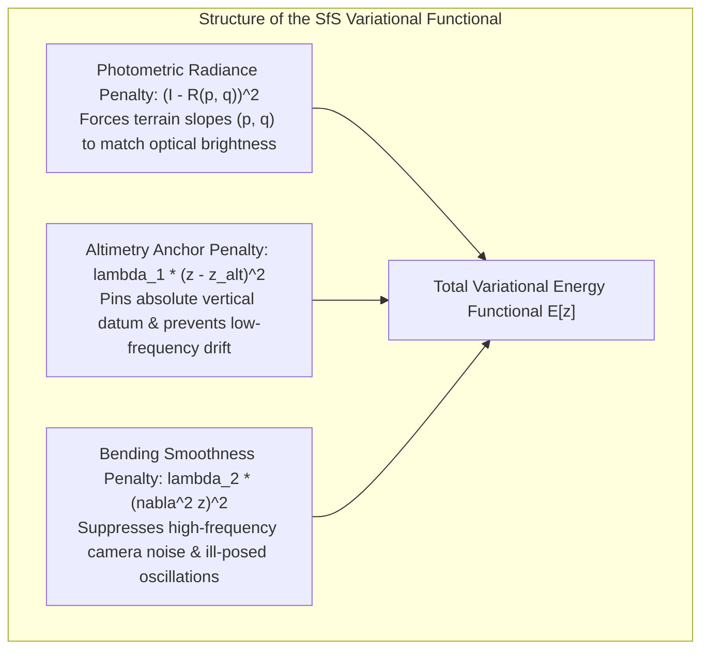

# Chapter 18: Resolution, Pixel Size, Oversampling, Precision, and Super-Resolution

*Why pixel size is not resolution, why more decimal places are not accuracy, and what happens when we push beyond the physical sensor limit.*

---

## 18.6 Mathematical Foundations of Forward Degradation and Shape-from-Shading

This section provides complete mathematical derivations for the two foundational analytical formulations in elevation resolution modeling: the forward degradation model combining Point Spread Function (PSF) convolution with decimation, and the Euler-Lagrange partial differential equation governing Shape-from-Shading (photoclinometry) anchored to low-resolution laser altimetry.

---

### 18.6.1 The Forward Degradation Model and Regularized Inversion

In remote sensing, a low-resolution digital elevation model $z_{\text{low}}(x, y)$ is the output of a physical degradation process acting upon the continuous, true Earth surface $z_{\text{true}}(x, y)$:

#### 1. Continuous Integral Formulation
$$z_{\text{low}}(\mathbf{x}_i) = \iint_{\Omega} z_{\text{true}}(\mathbf{x}') \, \text{PSF}(\mathbf{x}_i - \mathbf{x}') \, d\mathbf{x}' + n(\mathbf{x}_i)$$

where $\text{PSF}(\mathbf{x})$ is the spatial Point Spread Function (typically modeled as a 2D circularly symmetric Gaussian kernel $\text{PSF}(r) = \frac{1}{2\pi \sigma_b^2} e^{-\frac{r^2}{2\sigma_b^2}}$ representing beam divergence or antenna beamwidth), and $n(\mathbf{x}) \sim \mathcal{N}(0, \sigma_n^2)$ is additive sensor noise.

#### 2. Discrete Vector-Matrix Formulation
Discretizing the continuous high-resolution surface into a column vector $\mathbf{z}_{\text{high}} \in \mathbb{R}^{N}$ ($N = M_x \times M_y$) and the observed low-resolution grid into $\mathbf{z}_{\text{low}} \in \mathbb{R}^{K}$ ($K \ll N$):

$$\mathbf{z}_{\text{low}} = \mathbf{D} \, \mathbf{H} \, \mathbf{z}_{\text{high}} + \mathbf{n}$$

where:
* $\mathbf{H} \in \mathbb{R}^{N \times N}$ is the 2D spatial convolution matrix, possessing a **Block-Toeplitz-with-Toeplitz-Blocks (BTTB)** structure (diagonalized in the Fourier domain via 2D Fast Fourier Transforms).
* $\mathbf{D} \in \mathbb{R}^{K \times N}$ is the decimation (subsampling) matrix that extracts every $s$-th pixel along the coordinate axes.
* $\mathbf{n} \in \mathbb{R}^K$ is the noise vector with covariance matrix $\boldsymbol{\Sigma}_n = \sigma_n^2 \mathbf{I}$.

#### 3. Regularized Inverse Reconstruction (Tikhonov Regularization)
Direct inversion of $\mathbf{D}\mathbf{H}$ is severely ill-posed because $\mathbf{D}$ is rank-deficient ($K < N$) and high spatial frequencies lie in the null space. To reconstruct $\hat{\mathbf{z}}_{\text{high}}$, we formulate a regularized least-squares optimization problem:

$$\hat{\mathbf{z}}_{\text{high}} = \arg\min_{\mathbf{z}} \left[ \|\mathbf{z}_{\text{low}} - \mathbf{D}\mathbf{H}\mathbf{z}\|_2^2 + \lambda \|\mathbf{L}\mathbf{z}\|_2^2 \right]$$

where $\mathbf{L}$ is a high-pass regularization operator (e.g., discrete Laplacian $\nabla^2$) penalizing unphysical surface roughness, and $\lambda > 0$ is the regularization parameter. 

Taking the matrix derivative with respect to $\mathbf{z}$ and setting it to zero yields the normal equations:

$$\left( \mathbf{H}^T \mathbf{D}^T \mathbf{D} \mathbf{H} + \lambda \mathbf{L}^T \mathbf{L} \right) \hat{\mathbf{z}}_{\text{high}} = \mathbf{H}^T \mathbf{D}^T \mathbf{z}_{\text{low}}$$

$$\hat{\mathbf{z}}_{\text{high}} = \left( \mathbf{H}^T \mathbf{D}^T \mathbf{D} \mathbf{H} + \lambda \mathbf{L}^T \mathbf{L} \right)^{-1} \mathbf{H}^T \mathbf{D}^T \mathbf{z}_{\text{low}}$$

This system is solved efficiently using conjugate gradient methods or in the frequency domain using 2D FFTs.

---

### 18.6.2 Shape-from-Shading (SfS) Variational PDE Anchored to Altimetry

In planetary photoclinometry and optical DEM enhancement, fine-scale topography is reconstructed from high-resolution optical imagery $I(x, y)$ while anchoring long-wavelength elevation to low-resolution laser altimetry $z_{\text{alt}}(x, y)$.

#### Step 1: The Total Variational Energy Functional
Let $p = \frac{\partial z}{\partial x}$ and $q = \frac{\partial z}{\partial y}$ denote the directional terrain slopes. The surface $z(x, y)$ minimizes the global energy functional $E[z]$:

$$E[z] = \iint_{\Omega} \left[ \left( I(x, y) - R(p, q) \right)^2 + \lambda_1 \left( z(x, y) - z_{\text{alt}}(x, y) \right)^2 + \lambda_2 \left( \nabla^2 z \right)^2 \right] dx \, dy$$

where $R(p, q)$ is the non-linear reflectance map relating terrain slopes to predicted image brightness, and $\lambda_1, \lambda_2$ are weighting Lagrange multipliers.

#### Step 2: Deriving the Euler-Lagrange Partial Differential Equation
Let $\delta z$ be an arbitrary smooth test function vanishing on the boundary $\partial\Omega$. The first variation $\delta E$ with respect to $z$ is:

$$\delta E = 2 \iint_{\Omega} \left[ -(I - R) \delta R + \lambda_1 (z - z_{\text{alt}}) \delta z + \lambda_2 (\nabla^2 z) \nabla^2(\delta z) \right] dx \, dy$$

Applying the chain rule to the variation of the reflectance map $\delta R$:

$$\delta R = \frac{\partial R}{\partial p} \delta p + \frac{\partial R}{\partial q} \delta q = \frac{\partial R}{\partial p} \frac{\partial(\delta z)}{\partial x} + \frac{\partial R}{\partial q} \frac{\partial(\delta z)}{\partial y}$$

Substituting this into the first integral:

$$\iint_{\Omega} -(I - R) \left( \frac{\partial R}{\partial p} \frac{\partial(\delta z)}{\partial x} + \frac{\partial R}{\partial q} \frac{\partial(\delta z)}{\partial y} \right) dx \, dy$$

Applying integration by parts (Green's theorem) in 2D to transfer spatial derivatives from $\delta z$ onto the integrand:

$$= \iint_{\Omega} \left[ \frac{\partial}{\partial x} \left( (I - R) \frac{\partial R}{\partial p} \right) + \frac{\partial}{\partial y} \left( (I - R) \frac{\partial R}{\partial q} \right) \right] \delta z \, dx \, dy$$

Applying Green's second identity to the biharmonic bending term:

$$\iint_{\Omega} \lambda_2 (\nabla^2 z) \nabla^2(\delta z) \, dx \, dy = \iint_{\Omega} \lambda_2 (\nabla^4 z) \delta z \, dx \, dy$$

where $\nabla^4 z = \frac{\partial^4 z}{\partial x^4} + 2\frac{\partial^4 z}{\partial x^2 \partial y^2} + \frac{\partial^4 z}{\partial y^4}$ is the biharmonic operator.

Combining all terms into a single integrand factoring out $\delta z$:

$$\delta E = 2 \iint_{\Omega} \left[ \lambda_2 \nabla^4 z + \lambda_1 (z - z_{\text{alt}}) + \frac{\partial}{\partial x}\left( (I - R)\frac{\partial R}{\partial p} \right) + \frac{\partial}{\partial y}\left( (I - R)\frac{\partial R}{\partial q} \right) \right] \delta z \, dx \, dy = 0$$

Because $\delta z$ is arbitrary, the integrand must vanish identically everywhere in $\Omega$. This yields the **fundamental Euler-Lagrange PDE for altimetry-anchored Shape-from-Shading**:

$$\lambda_2 \nabla^4 z + \lambda_1 (z - z_{\text{alt}}) + \nabla \cdot \left[ (I - R(p, q)) \, \nabla_{p, q} R \right] = 0$$

where $\nabla_{p, q} R = \left[ \frac{\partial R}{\partial p}, \, \frac{\partial R}{\partial q} \right]^T$ is the gradient of the reflectance map in slope space, and $\nabla \cdot [\,]$ is the spatial 2D divergence operator.

#### Step 3: Iterative Numerical Solution
On a discrete grid, the biharmonic term $\nabla^4 z$ and divergence operator are discretized using finite-difference stencils. The non-linear PDE is solved iteratively using lagged-diffusivity Jacobi or Successive Over-Relaxation (SOR):

$$z^{(k+1)}_{i, j} = z^{(k)}_{i, j} - \omega \left[ \lambda_2 \nabla^4 z^{(k)} + \lambda_1 (z^{(k)} - z_{\text{alt}}) + \nabla \cdot \left( (I - R^{(k)}) \nabla_{p, q} R \right) \right]$$

where $\omega$ is the relaxation acceleration parameter. 

This mathematical framework powers the **NASA Ames Stereo Pipeline `sfs` tool**, enabling planetary scientists to enhance coarse $100\text{-meter}$ LOLA lunar altimetry into $1\text{-meter}$ super-resolved terrain models anchored to absolute geodetic truth.
