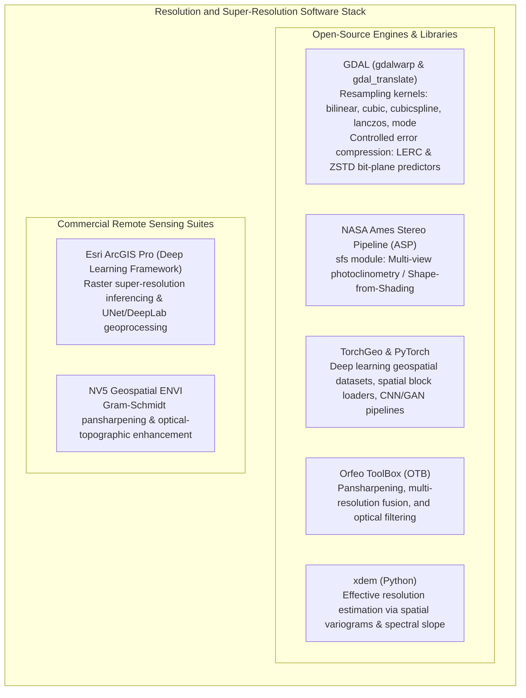

# Chapter 18: Resolution, Pixel Size, Oversampling, Precision, and Super-Resolution

*Why pixel size is not resolution, why more decimal places are not accuracy, and what happens when we push beyond the physical sensor limit.*

---

## 18.7 Software Ecosystem for Resolution Manipulation, Resampling, and Super-Resolution

Manipulating spatial resolution, executing controlled-error compression, and performing physics-based or deep learning super-resolution spans a spectrum of open-source CLI utilities, scientific planetary tools, and commercial image processing suites.



---

### 18.7.1 Open-Source Tools and Pipelines

#### GDAL: Advanced Resampling and Controlled-Error Compression
The `gdalwarp` and `gdal_translate` utilities provide fine-grained control over resampling filters and numerical precision:

```bash
# 1. High-Fidelity Resampling with Anti-Aliasing (Cubic Spline)
# Resample DEM while suppressing high-frequency Moiré aliasing
gdalwarp -r cubicspline -tr 2.0 2.0 \
    -co COMPRESS=ZSTD -co PREDICTOR=3 -co TILED=YES \
    native_1m_dem.tif resampled_2m_dem.tif

# 2. Controlled-Precision LERC Compression (Max Error <= 5 mm)
# Reduces file size by 85% while guaranteeing that no pixel deviates by > 0.005 m
gdal_translate -co COMPRESS=LERC -co MAX_Z_ERROR=0.005 \
    raw_float32_dem.tif compressed_lerc_dem.tif

# 3. Categorical Land-Cover Resampling (Majority Vote)
# Preserves discrete integer classes without creating non-existent intermediate values
gdalwarp -r mode -tr 10.0 10.0 \
    asprs_classified_1m.tif classified_10m.tif
```

#### NASA Ames Stereo Pipeline (ASP): The `sfs` Tool
The NASA Ames Stereo Pipeline provides the `sfs` command-line tool, implementing the altimetry-anchored Shape-from-Shading variational PDE:

```bash
# Enhance a coarse 30m orbital DEM using a 1m high-resolution optical image
sfs -i coarse_altimetry_dem.tif \
    -n high_res_camera_image.tif \
    --smoothness-weight 0.08 \
    --dem-weight 0.02 \
    --max-iterations 200 \
    --reflectance-type 1 \ # 1 = Lambertian, 2 = Lommel-Seeliger
    -o super_resolved_1m_dem.tif
```

* `sfs` uses the camera ephemeris and solar azimuth/elevation to compute the theoretical reflectance map $R(p, q)$.
* It optimizes the fine elevation grid iteratively, matching image highlights and shadows while remaining anchored to the low-resolution altimetry datum.

#### TorchGeo: Deep Learning Spatial Data Pipelines
TorchGeo bridges PyTorch tensors with real-world geospatial coordinate systems:

```python
"""Training a Super-Resolution Elevation Model using TorchGeo."""

import torch
from torchgeo.datasets import BoundingBox, RasterDataset
from torchgeo.samplers import GridGeoSampler


class HighResLiDARDataset(RasterDataset):

  filename_glob = "*_high.tif"
  is_image = False  # Elevation data, not RGB image


class CoarseSRTMDataset(RasterDataset):

  filename_glob = "*_coarse.tif"
  is_image = False


# 1. Instantiate datasets and index bounding boxes via R-tree
hr_data = HighResLiDARDataset("data/lidar/")
lr_data = CoarseSRTMDataset("data/srtm/")

# 2. Intersect spatial extents
dataset = hr_data & lr_data

# 3. Define a non-overlapping spatial block sampler to prevent data leakage
sampler = GridGeoSampler(dataset, size=512, stride=512)
```

---

### 18.7.2 Commercial Remote Sensing Suites

#### Esri ArcGIS Pro (Deep Learning Tools)
* Ingests trained deep learning packages (`.dlpk`, such as Super-Resolution ESRGAN models) via the `SuperResolveRaster` geoprocessing tool.
* Executes inferencing on GPU tensors across massive Cloud Raster Formats (CRF).
* **Limitation:** Visual quality is prioritized over mass conservation; users must apply post-processing volume checks to ensure hydrological validity.

#### NV5 Geospatial ENVI
* **Gram-Schmidt Pansharpening:** Merges low-resolution multispectral bands with high-resolution panchromatic bands while preserving spectral radiometric ratios.
* **Topographic Shading Inversion:** Tools for optical terrain enhancement using sun-angle ray tracing.

---

### 18.7.3 Software Comparison Matrix

| Software / Tool | License Model | Primary Mathematical Engine | Key Resolution Capability | Primary Operational Use Case |
| :--- | :--- | :--- | :--- | :--- |
| **GDAL** | Open-Source (MIT/X) | Polyphase filters (Bicubic, Lanczos) | LERC / ZSTD compression; multi-kernel resampling | Format translation, pyramid generation, precision control. |
| **NASA ASP (`sfs`)**| Open-Source (Apache 2.0) | Variational PDE Photoclinometry | Physical Shape-from-Shading with altimetry anchor | Planetary and lunar DEM super-resolution (LOLA/LROC). |
| **TorchGeo** | Open-Source (MIT) | PyTorch deep learning framework | Geospatial spatial samplers, CNN/Diffusion models | Research and development of ML elevation models. |
| **Orfeo ToolBox** | Open-Source (Apache 2.0) | Optical filtering & pansharpening | Multi-sensor resolution merging | Remote sensing image fusion and filtering. |
| **`xdem`** | Open-Source (BSD-3) | Semivariograms & Fourier PSD | Effective resolution & spatial correlation length | Empirical audit of true resolution vs. nominal pixel size. |
| **ArcGIS Pro** | Commercial (Esri) | PyTorch / TensorRT inference | `SuperResolveRaster` geoprocessing tool | Rapid GIS deep learning raster enhancement. |
| **NV5 ENVI** | Commercial (NV5) | Gram-Schmidt / Photometric models | High-fidelity spectral & topographic sharpening | Advanced aerospace and defense imagery enhancement. |
