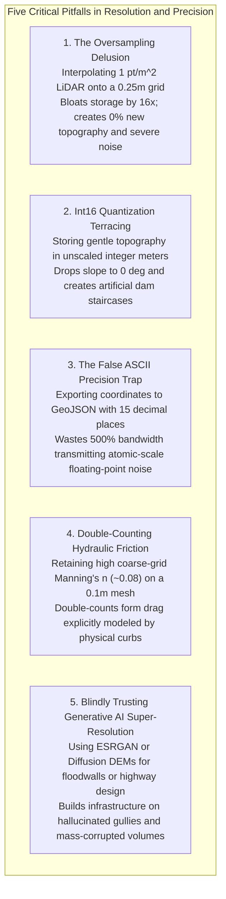

# Chapter 18: Resolution, Pixel Size, Oversampling, Precision, and Super-Resolution

*Why pixel size is not resolution, why more decimal places are not accuracy, and what happens when we push beyond the physical sensor limit.*

---

## 18.8 Common Pitfalls and Key Takeaways

Understanding the boundaries between digital sampling, physical resolution, numerical precision, and generative super-resolution is essential for maintaining scientific integrity in elevation modeling. Confusing these concepts leads to wasted storage, corrupted physical simulations, and dangerous engineering decisions.

---

### 18.8.1 Common Pitfalls in Elevation Resolution and Precision

#### 1. The Oversampling Delusion
Assuming that smaller pixels equal higher accuracy is the most widespread marketing myth in remote sensing:
* An analyst resamples a coarse $30\text{-meter}$ satellite radar DEM down to $1\text{-meter}$ pixels using bicubic splines and advertises it as a "high-resolution terrain model."
* In reality, the high-frequency spectrum contains zero physical signal; all fine variations are mathematical interpolation artifacts.
* Worse, derivative slope and curvature calculations amplify the interpolation noise, producing speckled, artificial terrain artifacts.
* **Remedy:** Obey the Goldilocks Rule: set grid spacing to $1.5\text{ to } 2.0 \times$ the mean point spacing ($\Delta x \approx 1.5/\sqrt{\rho}$).

#### 2. The `Int16` Terracing Catastrophe
Attempting to reduce raster file sizes by casting 32-bit floating-point elevations into unscaled 16-bit integers (`Int16`):
* On a $0.5\%$ floodplain slope, elevation values remain identical for 200 consecutive pixels before stepping down abruptly by $1.0\text{ m}$.
* Calculated terrain slope collapses to $0.000^\circ$ across the flat benches, while spiking to artificial cliffs at step boundaries.
* Hydraulic models cannot route water across these quantized terraces, causing digital streams to pool in phantom swamps.
* **Remedy:** Use `Float32` with Zstandard bit-plane compression (`PREDICTOR=3`) or controlled-precision LERC ($\epsilon_{\max} \le 5\text{ mm}$) instead of integer casting.

#### 3. The False ASCII Precision Trap
Exporting elevation points or breaklines to text formats (CSV, XYZ, GeoJSON) with default 16-digit floating-point expansions:
* A coordinate like `37.774929548192847` implies sub-angstrom positional certainty—smaller than the diameter of a hydrogen atom.
* This bloats ASCII file sizes by $400\%\text{–}600\%$ and floods web services with meaningless machine round-off noise.
* **Remedy:** Format ASCII coordinates to realistic physical precision (e.g., 6 decimal places for degrees $\approx 0.1\text{ m}$, or 3 decimal places for projected meters $\approx 1\text{ mm}$).

#### 4. Double-Counting Hydraulic Roughness
Failing to adjust Manning's roughness coefficient $n$ when moving from coarse regional models to ultra-high-resolution LiDAR meshes:
* On coarse $30\text{-m}$ grids, high Manning's $n$ values ($0.06\text{–}0.09$) are required to represent unmodeled form drag from street curbs, road embankments, and boulders.
* On fine $0.1\text{-m}$ meshes, street curbs and ditches are physically represented as explicit 3D geometry in the mesh, dynamically generating form drag in the 2D hydrodynamic solver.
* Retaining the high roughness value double-counts resistance, artificially choking water velocity and vastly exaggerating flood extents.
* **Remedy:** Reduce Manning's $n$ on high-resolution meshes to reflect pure grain skin friction ($n \approx 0.012\text{–}0.018$).

#### 5. Relying on Generative AI Super-Resolution for Civil Infrastructure
Using Generative Adversarial Networks (ESRGAN) or Diffusion Models to upscale digital elevation models for engineering design:
* Deep generative models optimize visual perceptual sharpness, not physical accuracy or conservation of mass.
* The neural network synthesizes plausible-looking ravines, boulders, and ridges out of learned training priors, inventing features that do not physically exist on the landscape.
* Furthermore, generative models violate mass conservation, altering cut-and-fill volume balances by millions of cubic meters.
* **Remedy:** Restrict ML super-resolution to visual gaming and rendering. In engineering, hazard modeling, and charting, use physical Shape-from-Shading anchored to absolute geodetic altimetry.

---

### 18.8.2 Key Takeaways for Practitioners

1. **Pixel Size Is a Container, Not a Measurement:** Never judge the quality of a digital elevation model by its pixel size alone. Effective spatial resolution is strictly bounded by the sensor footprint, point density, and the Nyquist-Shannon sampling limit ($2/\sqrt{\rho}$).
2. **Compress with Error Bounds, Not Truncation:** Do not truncate elevations to raw integer meters to save space. Use **LERC** (with guaranteed maximum error $\le 5\text{ mm}$) or **ZSTD with `PREDICTOR=3`** to achieve $80\%\text{–}90\%$ compression without introducing terracing artifacts.
3. **Roughness Scales with Mesh Resolution:** As mesh resolution increases, form drag transitions from an empirical friction parameter into explicit mesh geometry. Always recalibrate Manning's $n$ downward when deploying fine-resolution DEMs in hydraulic models.
4. **Demand Mass Conservation:** Any super-resolution or interpolation algorithm deployed for earthwork, hydrology, or coastal engineering must strictly conserve volumetric mass ($\iint z_{\text{high}} dx dy = \iint z_{\text{low}} dx dy$).
5. **Physical Photoclinometry vs. Neural Hallucination:** Shape-from-Shading reconstructs true physical slopes from real optical photons anchored to laser altimetry. Generative deep learning synthesizes visual plausibility. Know the difference before designing critical infrastructure.
