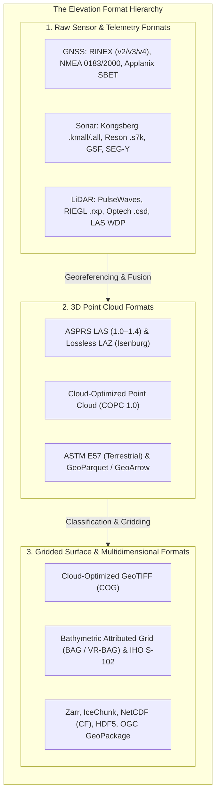
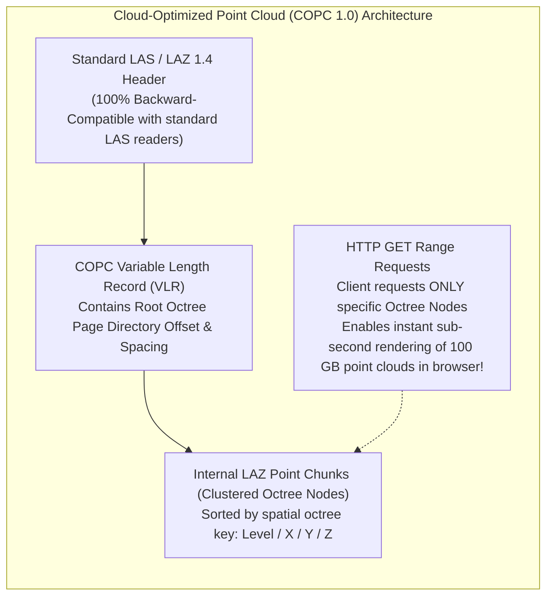
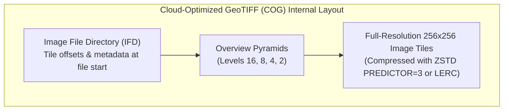

# Chapter 19: Key File Formats, Metadata, Archiving, and Data Discovery (STAC & Beyond)

*How elevation data is encoded on disk and in the cloud, documented for posterity, discovered via modern catalogs, and preserved across decades.*

Data formats are not passive containers; they are the computational contracts that govern how physical sensor measurements are stored, accessed, and interpreted. Over six decades of computing, the formats used in digital elevation and bathymetric modeling have evolved from hardware-specific binary bitstreams into open, self-describing, cloud-native arrays accessible over HTTP. Choosing an inappropriate file format can destroy vertical accuracy through integer truncation, strip spatial coordinate reference systems, corrupt multi-beam uncertainty bands, or render petabytes of uncompressed data unqueryable in the cloud.

---

## 19.1 Key File Formats for Sensors, Point Clouds, and Gridded Products

The elevation modeling data lifecycle transitions across three distinct format domains: **raw sensor telemetry**, **3D point clouds**, and **gridded/multidimensional surface rasters**.

---

### 19.1.1 Raw Sensor Telemetry and Navigation Formats

Raw telemetry formats capture direct, uncalibrated hardware outputs, providing the permanent legal and scientific record required for retrospective re-processing:

* **RINEX (Receiver Independent Exchange Format, 1989–present):** Standardized by the astronomical and geodetic community (current version 4.0), RINEX stores raw satellite carrier-phase, pseudorange, and Doppler observables across multi-GNSS constellations (GPS, GLONASS, Galileo, BeiDou). It is the universal input for post-processed kinematic (PPK) and Precise Point Positioning (PPP) trajectory solving.
* **NMEA 0183 / NMEA 2000:** Text-based (NMEA 0183) and Controller Area Network binary (NMEA 2000) streaming strings broadcast by shipboard and airborne instruments (`$GPGGA` for position, `$GPZDA` for time, `$INVTG` for velocity).
* **Applanix POSPac / SBET (Smooth Best Estimate of Trajectory):** The de facto industrial binary standard for 6-DOF blended GNSS/IMU trajectories, storing position, velocity, and roll/pitch/heading attitude at $100\text{–}200\text{ Hz}$ alongside full covariance matrices.
* **Kongsberg `.all` / `.kmall` & Teledyne Reson `.s7k`:** Proprietary multibeam sonar formats logging raw acoustic transceiver telemetry, beamforming phase differences, surface sound speed, water-column backscatter timeseries, and runtime installation parameters.
* **Generic Sensor Format (GSF, 1998):** Developed by Science Applications International Corporation (SAIC) for the U.S. Navy, GSF is an open, platform-independent binary format for storing processed multibeam bathymetry, beam angles, and total propagated uncertainty.
* **PulseWaves and LAS Waveform Data Packets (WDP):** Open, standardized formats for storing digitized full-waveform LiDAR profiles, linking raw electrical detector waveforms to 3D laser vector paths.

---

### 19.1.2 3D Point Cloud Formats: LAS, LAZ, and COPC

#### ASPRS LAS and Lossless LAZ
Standardized by the American Society for Photogrammetry and Remote Sensing in 2003, the **LAS format** is the universal standard for discrete 3D point cloud interchange:
* **Binary Structure:** Consists of a 375-byte Public Header Block, Variable Length Records (VLRs) encoding projection and georeferencing metadata, followed by tightly packed fixed-size binary Point Data Records (Formats 0 through 10 in LAS 1.4).
* **Coordinate Quantization:** Coordinates are stored as signed 32-bit integers scaled by user-defined factors ($X = X_{\text{int}} \times \text{Scale}_X + \text{Offset}_X$). Setting `Scale = 0.001` provides millimeter precision across regional extents.
* **LAZ Compression (Martin Isenburg):** The open-source `LASzip` compressor applies multi-stream context-based arithmetic coding. Because adjacent LiDAR points share highly correlated coordinates, timestamps, and scan angles, LAZ achieves **$7:1$ to $12:1$ lossless compression** without altering a single bit of point data.

#### Cloud-Optimized Point Cloud (COPC)
Standardized in 2021 by Hobu, Inc., **COPC 1.0** revolutionizes point cloud distribution:
* A COPC file is **simultaneously a valid LAZ 1.4 file** and a hierarchically indexed spatial octree.
* Legacy desktop software reads it as a standard sequential LAZ file.
* Cloud-native web applications and GIS platforms issue HTTP GET Range requests to stream coarse octree overview nodes first, fetching high-density leaf nodes on-demand as the camera zooms in, completely eliminating file download delays.

#### ASTM E57 and GeoParquet
* **ASTM E57 (ASTM E2807):** The standard XML/binary format for high-precision terrestrial laser scanning (TLS) and structured spherical mobile scans, supporting panoramic camera imagery and multi-scan coregistration.
* **GeoParquet and GeoArrow:** Columnar storage formats bringing spatial capabilities to Apache Parquet. By storing point attributes in separate columnar bit-streams (e.g., all $Z$ values compressed together), spatial SQL engines (DuckDB, Snowflake, BigQuery) filter and query billions of LiDAR points in milliseconds.

---

### 19.1.3 Gridded Surface Formats: GeoTIFF, COG, BAG, and Cloud Arrays

#### Cloud-Optimized GeoTIFF (COG)
The **Cloud-Optimized GeoTIFF (COG)** is the standard format for modern raster digital elevation models:
1. **Internal Tiling (`TILED=YES`):** Instead of organizing pixels into continuous horizontal scanlines, pixels are partitioned into rectangular blocks (typically $256 \times 256$ or $512 \times 512$ pixels).
2. **Internal Decimated Overviews:** Low-resolution overview pyramids (Level 2, 4, 8, 16...) are stored directly inside the same file, pre-computed with appropriate resampling kernels (`min` for bathymetry, `max` for aviation, `average` for volume).
3. **HTTP Range Header Layout:** All tile and overview directory pointers are written at the very beginning of the binary file, allowing cloud clients to fetch small rectangular spatial bounding boxes over HTTP without reading the entire raster.

#### Bathymetric Attributed Grid (BAG) and IHO S-102
Standardized by the Open Navigation Surface (ONS) consortium in 2006, the **BAG format** (built on open HDF5) is the global standard for hydrographic bathymetric products:
* **Coupled Elevation and Uncertainty:** Mandates two co-registered datasets: **Elevation** (depth positive down) and **Uncertainty** (Total Propagated Uncertainty at $95\%$ confidence).
* **Tracking List:** A relational table recording every individual sounding override, preserving an immutable audit trail when hydrographers manually validate navigation shoals.
* **IHO S-102:** The modern International Hydrographic Organization standard for high-resolution bathymetric surfaces in Electronic Chart Display and Information Systems (ECDIS), directly based on BAG architecture.

#### Cloud-Native Multidimensional Arrays: Zarr and IceChunk
* **Zarr (v2 / v3):** Represents multi-dimensional, n-ary raster arrays partitioned into compressed chunk files stored directly as objects on cloud storage (Amazon S3, Google Cloud Storage), widely adopted in climate modeling and oceanographic elevation grids.
* **IceChunk (2024):** A transactional, Git-like cloud-native array storage engine built on Zarr principles in Rust, providing zero-copy version control, time-travel queries, and concurrent multi-writer pipelines for petabyte-scale DEM arrays.
