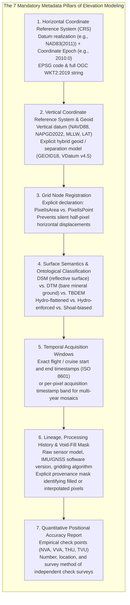
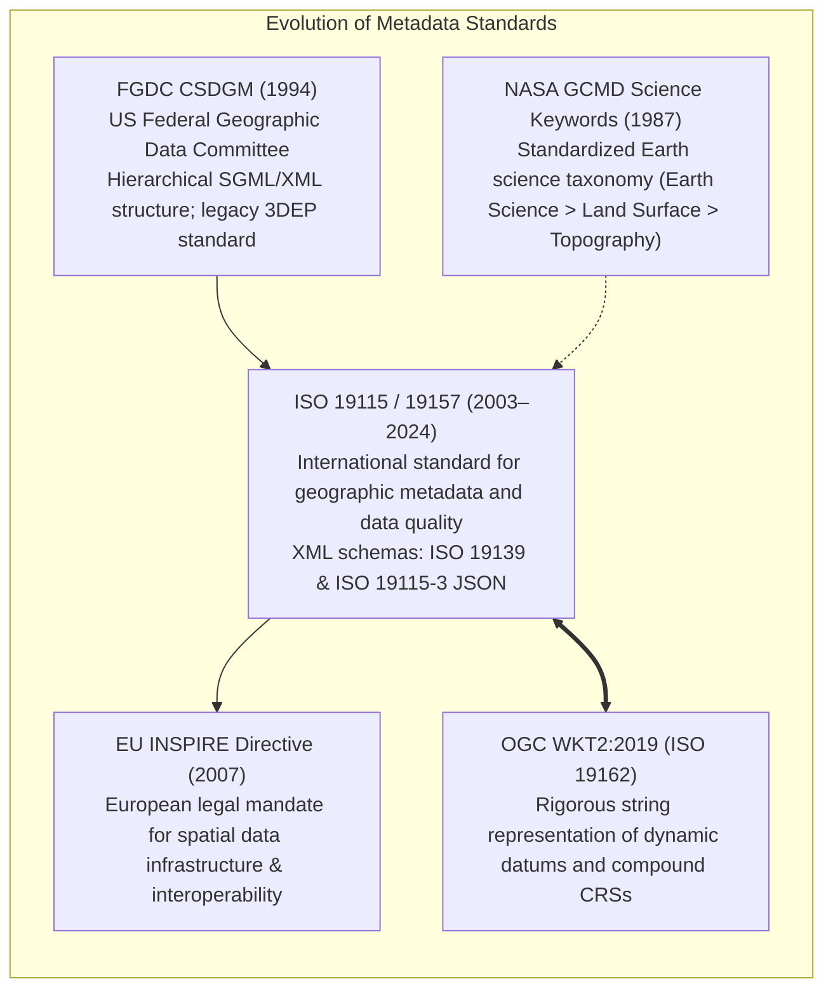

# Chapter 19: Key File Formats, Metadata, Archiving, and Data Discovery (STAC & Beyond)

*How elevation data is encoded on disk and in the cloud, documented for posterity, discovered via modern catalogs, and preserved across decades.*

---

## 19.2 Metadata: Making a DEM Usable, Auditable, and Legally Defensible

A raster digital elevation model without rigorous metadata is merely an anonymous, uncalibrated 2D array of floating-point numbers. It cannot be legally admitted into engineering contracts, cannot be safely used for navigational charting, and cannot be integrated into long-term climate change analysis. If an analyst cannot determine whether an elevation value denotes bare earth or tree canopy, whether vertical heights are referenced to the ellipsoid or sea level, or whether coordinates are shifted by half a pixel, the elevation model is scientifically useless.



---

### 19.2.1 The Seven Mandatory Metadata Pillars

Every elevation dataset produced by government agencies, commercial vendors, or research institutions must embed or accompany the **Seven Mandatory Metadata Pillars**:

#### Pillar 1: Horizontal Coordinate Reference System, Realization, and Epoch
It is insufficient to declare `"WGS84"` or `"NAD83"`. Because tectonic plates move at $2\text{–}10\text{ cm/year}$, a horizontal coordinate is ambiguous without its realization and temporal epoch:
* **Required Specification:** Name, EPSG identifier, tectonic plate model, datum realization, and realization epoch:
  * Example: `NAD83(2011) epoch 2010.0` or `ITRF2020 epoch 2024.5`.
* Must include the complete **OGC WKT2:2019 (ISO 19162)** string in the file header.

#### Pillar 2: Vertical Datum, Separation Model, and Tide Epoch
Vertical elevation $Z$ is meaningless without declaring the reference surface:
* **Terrestrial Orthometric:** Declare vertical datum and explicit hybrid geoid model (e.g., `NAVD88 height, GEOID18 model`).
* **Ellipsoidal Heights:** Declare ellipsoidal datum (e.g., `WGS84 (G1762) ellipsoidal height`).
* **Hydrographic Tidal Datums:** Declare tidal datum, National Tidal Datum Epoch (NTDE), and separation model (e.g., `Mean Lower Low Water (MLLW), 1983–2001 NTDE, NOAA VDatum v4.5`).

#### Pillar 3: Grid Node Registration
Must explicitly declare whether coordinates denote the bounding pixel corner or the sample node center:
* GeoTIFF tag: `GTRasterTypeGeoKey = RasterPixelIsArea` or `RasterPixelIsPoint`.
* In NetCDF/CF: `node_offset = 0` (point) or `1` (area).

#### Pillar 4: Surface Semantics and Conditioning
Must explicitly categorize the physical surface represented:
* **Product Type:** Digital Surface Model (DSM), Bare-Earth Digital Terrain Model (DTM), or Topo-Bathymetric Elevation Model (TBDEM).
* **Hydrologic Status:** Non-conditioned, Hydro-flattened (flat water bodies, preserving bridges), or Hydro-enforced (carved culverts/bridges).
* **Decimation Kernel:** Arithmetic Mean, Median, Shoal-Biased Minimum, or Maximum Obstacle.

#### Pillar 5: Temporal Windows and Per-Pixel Timestamp Masks
Topography changes continuously due to erosion, construction, landslides, and storms.
* Single surveys must record start/end acquisition dates in ISO 8601 format (`2024-03-15T14:22:00Z`).
* Regional or global mosaic products (e.g., USGS 3DEP 1m, Copernicus DEM) that combine surveys flown over different years must provide a **companion timestamp raster band** recording the exact acquisition epoch for every individual pixel.

#### Pillar 6: Lineage, Processing History, and Void-Fill Provenance
* Full list of raw sensors (e.g., *Riegl VQ-1560 II-S serial #2041*), flight altitudes, trajectory post-processing software (e.g., *Applanix POSPac MMS v8.7*), and gridding algorithms.
* **Provenance Mask:** A discrete categorical raster band identifying whether a pixel was directly measured from LiDAR/sonar returns, interpolated via spline, or void-filled using external data (e.g., SRTM or Copernicus).

#### Pillar 7: Quantitative Positional Accuracy Report
Metadata must never simply state "meets USGS specifications." It must report empirical statistical testing against surveyed check points:
* Non-Vegetated Vertical Accuracy (NVA) at $95\%$ confidence ($\text{NVA}_{95\%} = 1.96 \cdot \text{RMSE}_z$).
* Vegetated Vertical Accuracy (VVA) 95th percentile error.
* Total number of surveyed check points ($N_{\text{NVA}}, N_{\text{VVA}}$) and their survey methodology (e.g., static GNSS tied to NGS CORS).

---

### 19.2.2 Major Geospatial Metadata Standards



#### 1. FGDC CSDGM (1994)
The **Content Standard for Digital Geospatial Metadata (CSDGM)** was mandated by Executive Order 12906 across all U.S. federal agencies in 1994. While comprehensive, CSDGM predated modern web APIs and multi-dimensional compound datums, leading to its gradual replacement by international standards.

#### 2. ISO 19115, 19115-1, and ISO 19157 (Data Quality)
The modern international benchmark for geospatial metadata:
* **ISO 19115-1:2014:** Defines the core structural model (identification, constraints, lineage, distribution, and reference systems).
* **ISO 19115-2:** Extends metadata to imagery, gridded data, and sensor acquisition parameters.
* **ISO 19157:2013:** Focuses exclusively on **Data Quality**, establishing formal mathematical tests for positional accuracy, thematic classification accuracy, and temporal consistency.
* Serialized via **ISO 19139 XML** or modern **ISO 19115-3 JSON-LD**.

#### 3. NASA Global Change Master Directory (GCMD) Keywords
NASA's GCMD establishes a controlled hierarchical vocabulary to ensure planetary datasets can be discovered across multidisciplinary scientific engines:
```
EARTH SCIENCE > LAND SURFACE > TOPOGRAPHY > TERRAIN ELEVATION > DIGITAL ELEVATION MODEL (DEM)
```

#### 4. OGC WKT2:2019 (ISO 19162) Compound Coordinate Reference Systems
Older GIS formats stored coordinate systems as crude PROJ.4 projection strings (e.g., `+proj=utm +zone=10 +datum=WGS84`), which completely lacked vertical datum definitions. OGC WKT2:2019 allows the definition of true **Compound Coordinate Reference Systems (`COMPOUNDCRS`)** that bind horizontal and vertical datums into an unambiguous, human- and machine-readable text block:

```
COMPOUNDCRS["NAD83(2011) / UTM zone 10N + NAVD88 height",
  PROJCRS["NAD83(2011) / UTM zone 10N",
    BASEGEOGCRS["NAD83(2011)",
      DATUM["North American Datum 1983 (2011)",
        ELLIPSOID["GRS 1980",6378137,298.257222101]],
      ID["EPSG",6318]],
    CONVERSION["UTM zone 10N",
      METHOD["Transverse Mercator",ID["EPSG",9807]],
      PARAMETER["Latitude of natural origin",0],
      PARAMETER["Longitude of natural origin",-123],
      PARAMETER["Scale factor at natural origin",0.9996],
      PARAMETER["False easting",500000],
      PARAMETER["False northing",0]],
    CS[Cartesian,2],
      AXIS["easting (E)",east],
      AXIS["northing (N)",north],
      LENGTHUNIT["metre",1],
    ID["EPSG",6339]],
  VERTCRS["NAVD88 height",
    VDATUM["North American Vertical Datum 1988",ID["EPSG",5103]],
    CS[vertical,1],
      AXIS["gravity-related height (H)",up],
      LENGTHUNIT["metre",1],
    GEOIDMODEL["GEOID18",ID["EPSG",1051]],
    ID["EPSG",5703]]]
```
