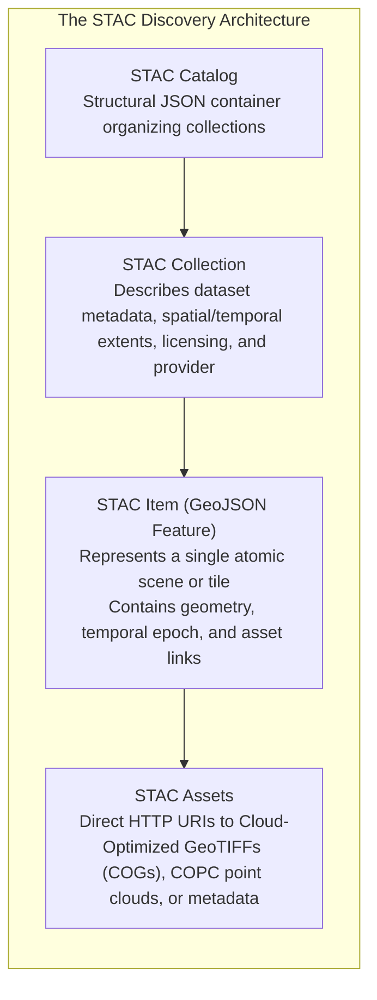
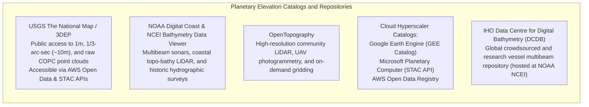

# Chapter 19: Key File Formats, Metadata, Archiving, and Data Discovery (STAC & Beyond)

*How elevation data is encoded on disk and in the cloud, documented for posterity, discovered via modern catalogs, and preserved across decades.*

---

## 19.3 Searching for the Right Data and Data Type: STAC and Modern Catalogs

Finding the correct digital elevation model for a specific engineering, scientific, or cartographic task has historically been an exercise in frustration: navigating fragmented agency clearinghouses, downloading hundreds of gigabytes of zipped raster tiles, only to discover that the downloaded data was a 1970s contour-derived integer DEM or a raw Digital Surface Model (DSM) unsuited for floodplain modeling.

The emergence of the **SpatioTemporal Asset Catalog (STAC)** specification and cloud-native geospatial catalogs has transformed spatial data discovery from manual web crawling into standardized, scriptable, and serverless API queries.



---

### 19.3.1 The SpatioTemporal Asset Catalog (STAC) Specification

Standardized by the Radiant Earth Foundation and the open-source community (version 1.0.0 in 2021, version 1.1.0 in 2024), **STAC** provides a common JSON language to describe geospatial assets:

#### 1. Core STAC Entities
* **STAC Item:** A standard GeoJSON Feature augmented with a `datetime` property, a `links` array, and an `assets` dictionary. In elevation modeling, a STAC Item represents a single LiDAR flight tile, a satellite radar elevation scene, or a hydrographic survey sheet.
* **STAC API:** A RESTful API standard (implementing OGC API - Features) enabling dynamic spatial, temporal, and property-based filtering:
  `GET /search?bbox=-122.5,37.5,-122.0,38.0&datetime=2020-01-01T00:00:00Z/..&collections=usgs-3dep-1m`

#### 2. Essential STAC Extensions for Elevation Data
Standard STAC metadata is augmented through formal modular extensions:
* **Projection Extension (`proj`):** Enforces explicit horizontal georeferencing, embedding EPSG codes, WKT2 strings, raster shapes (rows, columns), and the 6-parameter affine geotransform directly in the Item properties.
* **Raster Extension (`raster`):** Encodes band-level radiometric and numerical properties: data type (`float32`), physical unit (`meter`), nodata value (`-9999` or `NaN`), spatial resolution, and scale/offset factors.
* **Point Cloud Extension (`pointcloud`):** Designed for discrete LiDAR and sonar point clouds: records total point count, sensor platform type (`airborne`), spatial point density ($\text{pts/m}^2$), and the schema of embedded attributes (intensity, classification, return number).

```json
{
  "type": "Feature",
  "stac_version": "1.1.0",
  "id": "USGS_1M_10_x55y419_CA_NoCal_2019",
  "collection": "usgs-3dep-1m",
  "geometry": {
    "type": "Polygon",
    "coordinates": [[[-122.45, 37.80], [-122.40, 37.80], [-122.40, 37.85], [-122.45, 37.85], [-122.45, 37.80]]]
  },
  "properties": {
    "datetime": "2019-04-12T18:30:00Z",
    "proj:epsg": 6339,
    "proj:wkt2": "COMPOUNDCRS[\"NAD83(2011) / UTM zone 10N + NAVD88 height\"...]",
    "raster:bands": [
      {
        "data_type": "float32",
        "spatial_resolution": 1.0,
        "unit": "metre",
        "nodata": "nan"
      }
    ]
  },
  "assets": {
    "elevation": {
      "href": "https://storage.googleapis.com/usgs-3dep-cogs/USGS_1M_10_x55y419.tif",
      "type": "image/tiff; application=geotiff; profile=cloud-optimized",
      "roles": ["data", "elevation", "dtm"]
    }
  }
}
```

---

### 19.3.2 STAC GeoParquet: Serverless Querying of Billions of Tiles

While querying a RESTful STAC API works well for small regional bounding boxes, running global analysis across hundreds of millions of STAC Items introduces severe network API latency. 

In 2024, the geospatial community standardized **STAC GeoParquet**:
* The entire catalog of millions of JSON STAC Items is compiled into a single, highly compressed Apache Parquet columnar file.
* Using vectorized SQL query engines like **DuckDB**, analysts can execute complex spatial, temporal, and semantic filters over millions of global elevation tiles in milliseconds without running a dedicated web server:

```sql
-- Query millions of global elevation scenes directly from S3 using DuckDB
SELECT 
    id, 
    datetime, 
    assets->'elevation'->>'href' AS cog_url,
    "proj:epsg" AS epsg_code
FROM read_parquet('s3://stac-geoparquet-registry/planetary_elevation.parquet')
WHERE ST_Intersects(geometry, ST_MakeEnvelope(-122.5, 37.7, -122.3, 37.9))
  AND "raster:bands"[1]->>'spatial_resolution' <= '1.0'
  AND assets->'elevation'->'roles' @> '["dtm"]'; -- Enforce Bare-Earth DTM
```

---

### 19.3.3 Major Planetary Catalogs and Elevation Portals



---

### 19.3.4 How to Filter for the *Right* Product Type

When searching modern catalogs, analysts must apply strict semantic filters to avoid ingesting inappropriate elevation models:

| Operational Requirement | Essential Catalog Filters | Dangerous Datasets to Exclude |
| :--- | :--- | :--- |
| **Hydraulic Flood Modeling** | `roles: ["dtm"]`, `hydro: "enforced"`, `resolution <= 2.0` | **Exclude DSMs** (bridges act as dams) and unconditioned LiDAR DTMs (unbreached culverts). |
| **Solar / Telecom Line-of-Sight**| `roles: ["dsm"]`, `includes: ["buildings", "canopy"]` | **Exclude DTMs** (bare earth ignores signal-blocking trees and structures). |
| **Safety of Navigation (Charting)**| `roles: ["bathymetry"]`, `decimation: "shoal_biased"`, `datum: "MLLW"`| **Exclude Mean-decimated grids** (erases pinnacles) and ellipsoidal heights. |
| **Tectonic Fault Scarp Detection** | `roles: ["dtm"]`, `source: "lidar"`, `method: "bare_earth"` | **Exclude contour-derived DEMs** (wedding-cake terracing masks fine fault scarps). |
