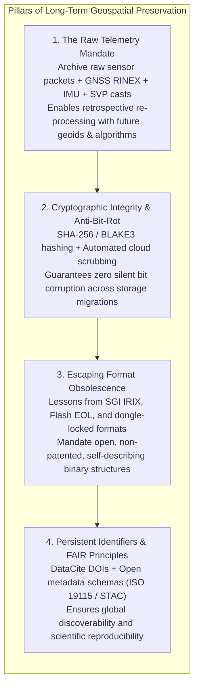
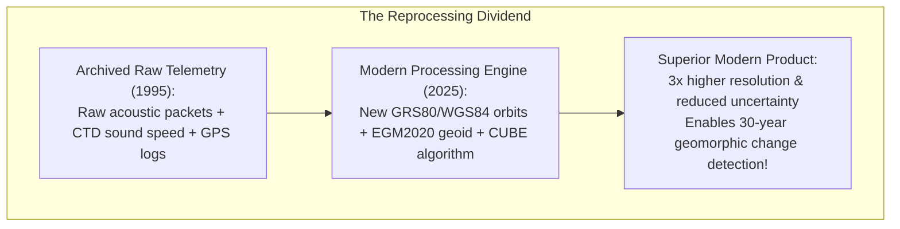
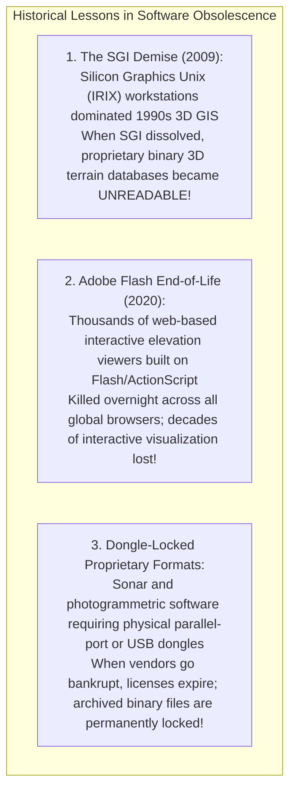

# Chapter 19: Key File Formats, Metadata, Archiving, and Data Discovery (STAC & Beyond)

*How elevation data is encoded on disk and in the cloud, documented for posterity, discovered via modern catalogs, and preserved across decades.*

---

## 19.4 Archiving, Long-Term Data Preservation, and the Battle Against Digital Obsolescence

Digital elevation data is an irreplaceable temporal record of the Earth's physical evolution. An airborne LiDAR survey of a barrier island captured days before a Category 5 hurricane, or a high-resolution multibeam survey of an active submarine volcano, can never be re-acquired. However, digital information is fragile. Left unmaintained, digital elevation datasets suffer from physical media decay ("bit rot"), organizational abandonment, and software obsolescence. Preserving elevation models across decades requires a proactive strategy that balances raw sensor archiving, cryptographic integrity, and strictly open format architectures.

---

### 19.4.1 What to Archive: The "Reprocessing Dividend"

A common mistake in government and municipal archiving is retaining only the final gridded product (e.g., a $1\text{-meter}$ bare-earth GeoTIFF) while deleting raw sensor packets and trajectory files to save storage costs. 

This practice discards the **Reprocessing Dividend**:
* In 1995, multibeam sonar data was processed using primitive single-sound-velocity profiles and crude manual cleaning, producing coarse, noisy bathymetric maps.
* Twenty years later, researchers ingested the original 1995 raw sensor packets (`.all` files, raw CTD casts, and navigation logs) into modern processing engines (CUBE, VDatum, and backscatter normalization tools). 
* The reprocessed 1995 survey yielded a bathymetric surface with **three times higher feature resolution and half the vertical uncertainty**, revealing subtle submarine fault scarps and shipwrecks that were completely invisible in the original 1995 deliverable.

#### Mandatory Raw Archival Package
To ensure retrospective reprocessability, an archival elevation package must preserve:
1. **Raw Sensor Streams:** Raw binary scanner packets (e.g., RIEGL `.rxp`, Kongsberg `.kmall`, PulseWaves).
2. **Raw Navigation Data:** Dual-frequency GNSS base and rover observables in RINEX format, raw IMU accelerometer and gyro data, and base station monument coordinates.
3. **Environmental Media Profiles:** In-situ sound velocity profiles (CTD casts) for sonar; atmospheric pressure, temperature, and relative humidity logs for LiDAR.
4. **Physical Installation Geometry:** Measured physical lever arms (antenna-to-IMU and IMU-to-scanner vectors) and pre-mission boresight calibration matrices.

---

### 19.4.2 Fighting Bit Rot and Media Decay

Physical storage media degrades over time:
* **Magnetic Tape (LTO):** High-density magnetic tapes suffer from binder breakdown, magnetic particle demagnetization, and mechanical tape-drive head obsolescence within $10\text{–}20\text{ years}$.
* **Optical Discs (CD-R, DVD-R):** Organic dye layers suffer chemical oxidation and delamination ("disc rot") within $5\text{–}10\text{ years}$.
* **Solid-State Flash Memory (NAND):** Unpowered SSDs suffer quantum electron leakage, losing data integrity within $1\text{–}3\text{ years}$ of cold storage.

#### Cryptographic Checksums and Scrubbing Daemons
To detect and survive silent data corruption:
* Every archived file must be paired with an immutable cryptographic hash (e.g., **SHA-256** or **BLAKE3**):
  `sha256sum usgs_lidar_swath_42.copc.laz > usgs_lidar_swath_42.copc.laz.sha256`
* Cloud repositories must utilize redundant object storage (e.g., AWS S3 Glacier Flexible Archive or Google Cloud Storage Archive) with automated background **integrity scrubbing daemons** that continuously verify parity blocks and automatically repair corrupted sectors across geographically separated data centers.

---

### 19.4.3 Format Obsolescence: Lessons from SGI, Flash, and Dongle-Locked Formats

The history of computing demonstrates that software ecosystems die far faster than physical media:

#### The Golden Rules of Archival Format Selection
To prevent elevation data from becoming unreadable digital hieroglyphics:
1. **Never Archive in Proprietary Binary Formats:** Never store archival deliverables in proprietary software databases that require a paid commercial license, a hardware dongle, or cloud activation servers to read.
2. **Mandate Open, Self-Describing Formats:** Archive exclusively in open, non-patented formats governed by international consensus standards: **Cloud-Optimized GeoTIFF (COG)**, **ASPRS LAZ / COPC**, **Bathymetric Attributed Grid (BAG)**, **NetCDF (CF-compliant)**, or **Zarr**.
3. **Embed the Geodetic CRS Internally:** The Coordinate Reference System must be embedded directly inside the file header as an explicit **WKT2:2019** string. Never rely on external companion files (such as `.tfw` world files or `.prj` text files), which inevitably become separated during data migrations.

---

### 19.4.4 Persistent Identifiers and FAIR Principles

To guarantee that elevation models remain discoverable and scientifically verifiable across generations, archives must comply with the **FAIR Data Principles**:
* **Findable:** Datasets must be assigned a persistent **Digital Object Identifier (DOI)** via DataCite or CrossRef, accompanied by rich, machine-readable STAC and ISO 19115 metadata.
* **Accessible:** Data must be retrievable via open, standard communication protocols (HTTPS) without proprietary gatekeepers.
* **Interoperable:** Data and metadata must use open standards (COG, COPC, GeoParquet, WKT2) with controlled vocabularies (EPSG, NASA GCMD).
* **Reusable:** Datasets must carry explicit, legally unambiguous open licenses (e.g., Creative Commons Zero [CC0], CC-BY, or U.S. Public Domain) with complete data lineage documentation.
