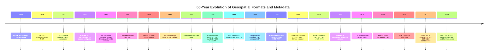
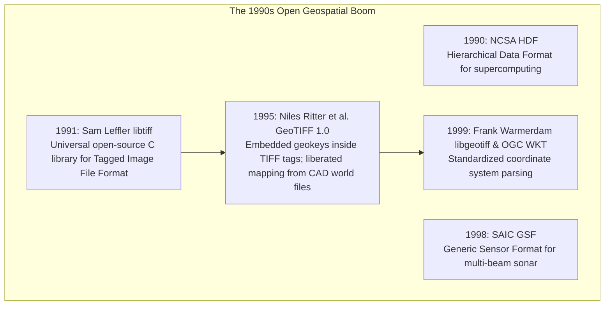
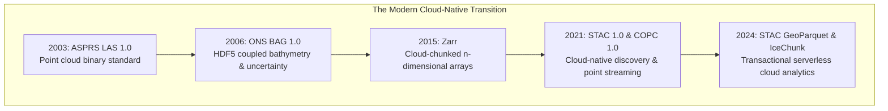

# Chapter 19: Key File Formats, Metadata, Archiving, and Data Discovery (STAC & Beyond)

*How elevation data is encoded on disk and in the cloud, documented for posterity, discovered via modern catalogs, and preserved across decades.*

---

## 19.5 Historical Evolution of Geospatial Formats, Metadata, and Catalogs

The evolution of geospatial file formats spans nearly six decades of computer science. Tracing this timeline reveals how the industry overcame proprietary fragmentation to build today's open, cloud-native geospatial infrastructure.

---

### 19.5.1 Early Planetary Imaging and Scientific Arrays (1966–1989)

#### 1966: NASA JPL VICAR
In 1966, researchers at NASA's Jet Propulsion Laboratory developed **VICAR** (Video Image Communication and Retrieval) to process robotic planetary television scans (Ranger, Surveyor, Mariner). VICAR introduced the concept of an ASCII system label prepended to binary image arrays, establishing the ancestor of self-describing raster formats.

#### 1981: FITS (Flexible Image Transport System)
In 1981, astronomers standardized **FITS** (Wells et al., 1981) to interchange radio, optical, and planetary digital arrays across international observatories. FITS formalized the decoupling of human-readable ASCII header cards from raw multidimensional binary arrays.

#### 1984: NMEA 0183
In 1984, the National Marine Electronics Association published **NMEA 0183**, defining standard comma-delimited ASCII strings broadcast over RS-232 serial cables ($4800\text{ baud}$). It remains the baseline data interface for maritime GPS and sonar telemetry.

#### 1988–1989: NetCDF and RINEX
* **NetCDF (1988):** Unidata developed the **Network Common Data Form (NetCDF)** to provide machine-independent array access for atmospheric, oceanographic, and climate modeling. Governed by Climate and Forecast (CF) conventions, NetCDF became the global benchmark for geophysical and ocean elevation grids.
* **RINEX (1989):** Werner Gurtner and Gerhard Mader developed **RINEX** (Receiver Independent Exchange Format) at the University of Bern, enabling researchers to process GPS carrier phase data across competing receiver hardware (Trimble, Leica, Ashtech, TI-4100).

---

### 19.5.2 The Digital Cartography and Open Standards Boom (1990–1999)

#### 1991: Sam Leffler and `libtiff`
In 1991, Silicon Graphics engineer Sam Leffler released **`libtiff`**, an open-source C library for reading and writing the Tagged Image File Format (TIFF). `libtiff` became the foundational raster substrate upon which all modern spatial imagery and elevation formats were built.

#### 1994: The OGC, FGDC Metadata, and NAVO `pfmabe`
* **Open Geospatial Consortium (1994):** Founded as the Open GIS Consortium, the OGC united commercial software vendors, government agencies, and academics to develop non-proprietary spatial standards.
* **FGDC CSDGM (1994):** Presidential Executive Order 12906 mandated federal metadata compliance, establishing the first standardized inventory of U.S. geospatial data assets.
* **NAVO `pfmabe` (1994):** The Naval Oceanographic Office created the **Pure File Magic (PFM)** format to manage gigabyte-scale multibeam bathymetry, introducing the concept of spatial binning and interactive ping editing.

#### 1995: Niles Ritter and the GeoTIFF 1.0 Standard
In 1995, Niles Ritter and an informal working group published the **GeoTIFF 1.0 specification**. By embedding georeferencing coordinate systems and map projection parameters directly inside private TIFF metadata tags (`GeoKeyDirectoryTag`, `ModelTiepointTag`, `ModelPixelScaleTag`), GeoTIFF eliminated the fragile practice of pairing naked images with separate `.tfw` world files.

#### 1998–1999: Shapefile, GSF, `libgeotiff`, and GDAL
* **1998 (Shapefile & GSF):** Esri published the open technical description for the Shapefile, while SAIC created the Generic Sensor Format (GSF) for hydrographic multibeam bathymetry.
* **1999 (`libgeotiff` & WKT):** Frank Warmerdam released `libgeotiff`, and the OGC standardized Well-Known Text (WKT).
* **2000 (GDAL):** Frank Warmerdam established the **Geospatial Data Abstraction Library (GDAL)**, which created a universal, open-source abstract data model for all raster formats, democratizing planetary elevation analysis.

---

### 19.5.3 Standardization and the Cloud-Native Revolution (2000–2024)

* **2003 (ASPRS LAS & ISO 19115):** ASPRS published LAS 1.0, and ISO standardized ISO 19115:2003 for international geographic metadata.
* **2006 (Bathymetric Attributed Grid):** Open Navigation Surface standardized BAG 1.0, mandating co-registered elevation and uncertainty grids for hydrography.
* **2014–2015 (GeoPackage & Zarr):** OGC standardized GeoPackage (an open SQLite container replacing Shapefiles), while Alistair Miles created **Zarr**, partitioning multidimensional arrays into compressed cloud objects.
* **2017–2021 (STAC, COPC, GeoParquet):** The cloud-native geospatial revolution culminated with the release of the SpatioTemporal Asset Catalog (**STAC 1.0.0**), the Cloud-Optimized Point Cloud (**COPC 1.0**), and **GeoParquet 1.0**.
* **2024 (STAC 1.1.0, STAC GeoParquet, IceChunk):** STAC 1.1.0 finalized core asset roles; STAC GeoParquet enabled serverless SQL querying over entire planetary catalogs via DuckDB; and **IceChunk** introduced transactional, ACID-compliant cloud storage for petabyte-scale geospatial arrays.
