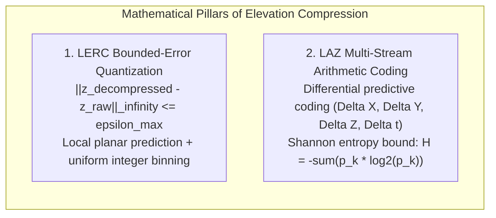
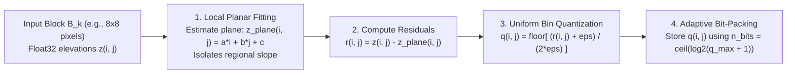
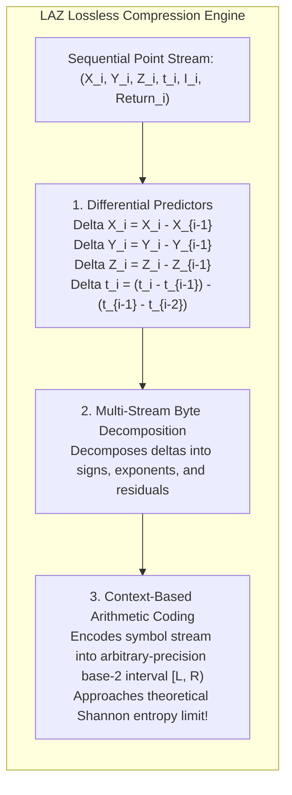

# Chapter 19: Key File Formats, Metadata, Archiving, and Data Discovery (STAC & Beyond)

*How elevation data is encoded on disk and in the cloud, documented for posterity, discovered via modern catalogs, and preserved across decades.*

---

## 19.6 Mathematical Foundations of Elevation Compression

Storing petabytes of high-resolution digital elevation models requires compression algorithms that minimize bit storage while guaranteeing metrological rigor. Standard image compression algorithms (such as JPEG) apply lossy Discrete Cosine Transforms that introduce high-frequency ringing and corrupt numerical elevation values. 

This section derives the two foundational mathematical models governing modern elevation compression: the bounded-error quantization model of LERC (Limited Error Raster Compression), and the multi-stream arithmetic coding entropy bound governing LAZ point cloud compression.

---

### 19.6.1 LERC: Bounded-Error Plane-Residual Quantization

Limited Error Raster Compression (**LERC**) is a controlled-precision lossy compression algorithm engineered specifically for floating-point and integer rasters. Unlike transform-based compressors, LERC provides a mathematical guarantee: **no decompressed pixel value will ever deviate from its original uncompressed value by more than a user-declared threshold $\epsilon_{\max}$**:

$$\|\hat{\mathbf{Z}} - \mathbf{Z}\|_\infty = \max_{i, j} |\hat{z}_{i, j} - z_{i, j}| \le \epsilon_{\max}$$

#### Step 1: Block Partitioning and Planar Estimation
LERC divides the raster into small rectangular blocks $B_k$ (typically $8 \times 8$ or $16 \times 16$ pixels). 
1. If all valid pixels in block $B_k$ are identical (within $\epsilon_{\max}$), LERC flags the block as **Constant** and stores only a single scalar value.
2. Otherwise, LERC fits a local least-squares reference plane:
   $$z_{\text{plane}}(i, j) = a \cdot i + b \cdot j + c$$
   which subtracts the macroscopic terrain slope, transforming elevations into zero-centered local residuals:
   $$r_{i, j} = z_{i, j} - z_{\text{plane}}(i, j)$$

#### Step 2: Bounded Uniform Quantization
Let $r_{\min} = \min_{(i, j) \in B_k} r_{i, j}$ denote the minimum residual in the block. To guarantee that maximum error never exceeds $\epsilon_{\max}$, the continuous residual is quantized into discrete non-negative integer bins of width $2 \epsilon_{\max}$:

$$q_{i, j} = \left\lfloor \frac{r_{i, j} - r_{\min}}{2 \epsilon_{\max}} + \frac{1}{2} \right\rfloor = \operatorname{round}\left( \frac{r_{i, j} - r_{\min}}{2 \epsilon_{\max}} \right)$$

where $\lfloor \cdot \rfloor$ denotes the floor function.

#### Step 3: Decompression and Mathematical Error Bound Proof
During decompression, the reconstructed elevation $\hat{z}_{i, j}$ is recovered via:

$$\hat{z}_{i, j} = z_{\text{plane}}(i, j) + r_{\min} + q_{i, j} \cdot (2 \epsilon_{\max})$$

#### Proof of the Error Bound
The error $e_{i, j}$ between the decompressed and true raw elevation is:

$$e_{i, j} = \hat{z}_{i, j} - z_{i, j} = \left( r_{\min} + q_{i, j} \cdot 2\epsilon_{\max} \right) - r_{i, j} = 2\epsilon_{\max} \left( q_{i, j} - \frac{r_{i, j} - r_{\min}}{2\epsilon_{\max}} \right)$$

By definition of the rounding function, for any real number $u \in \mathbb{R}$:

$$\left| \operatorname{round}(u) - u \right| \le \frac{1}{2}$$

Substituting $u = \frac{r_{i, j} - r_{\min}}{2\epsilon_{\max}}$:

$$|e_{i, j}| = 2\epsilon_{\max} \left| q_{i, j} - u \right| \le 2\epsilon_{\max} \left( \frac{1}{2} \right) = \epsilon_{\max}$$

Therefore:

$$\max_{i, j} |\hat{z}_{i, j} - z_{i, j}| \le \epsilon_{\max} \quad \text{(Q.E.D.)}$$

The reconstructed elevation is mathematically guaranteed to fall within the interval $[z_{i, j} - \epsilon_{\max}, \, z_{i, j} + \epsilon_{\max}]$. 

#### Step 4: Bit-Packing Compression Ratio
Let $q_{\max} = \max q_{i, j}$. The integer bins $q_{i, j}$ are packed into the minimum number of bits required:

$$b = \lceil \log_2 (q_{\max} + 1) \rceil \quad [\text{bits / pixel}]$$

If terrain within an $8 \times 8$ block has a residual spread of $0.08\text{ m}$ and $\epsilon_{\max} = 0.005\text{ m}$ ($5\text{ mm}$), then $q_{\max} = \frac{0.08}{0.010} = 8 \implies b = 4\text{ bits/pixel}$. The block achieves an immediate **$8:1$ compression ratio** ($32\text{ bits} \to 4\text{ bits}$).

---

### 19.6.2 LAZ: Multi-Stream Context-Based Arithmetic Coding

The **LAZ format** (Martin Isenburg's `LASzip`) achieves lossless compression of massive 3D point clouds by combining **differential predictive modeling** with **adaptive arithmetic coding**.

#### 1. Differential Predictors and Delta Modeling
Because LiDAR points are recorded sequentially along scanlines, adjacent points are separated by small spatial increments. LAZ computes first- and second-order differences:
* **Spatial Deltas:** $\Delta X_i = X_i - X_{i-1}, \quad \Delta Y_i = Y_i - Y_{i-1}, \quad \Delta Z_i = Z_i - Z_{i-1}$
* **Second-Order Timestamp Acceleration:** Because laser pulses fire at constant repetition rates ($100\text{–}1000\text{ kHz}$), GPS timestamps increment with nearly constant velocity. LAZ predicts timestamp $t_i^{\text{pred}} = 2 t_{i-1} - t_{i-2}$, encoding only the second-order residual:
  $$\Delta^2 t_i = t_i - (2 t_{i-1} - t_{i-2}) \approx 0$$

#### 2. The Shannon Entropy Bound
By Claude Shannon's source coding theorem (1948), the minimum theoretical average number of bits required to encode a discrete sequence of symbols $S = \{s_1, \dots, s_K\}$ with probability distribution $p(s_k)$ is the **Shannon Entropy $H(S)$**:

$$H(S) = -\sum_{k=1}^K p(s_k) \log_2 p(s_k) \quad [\text{bits / symbol}]$$

In raw LAS point clouds, coordinates have near-uniform bit distributions, yielding high entropy ($H \approx 28\text{–}32\text{ bits/coordinate}$). 

However, the differential delta streams $\Delta X, \Delta Y, \Delta Z$ follow a sharply peaked **Laplacian (double-exponential) distribution** centered at zero:

$$p(\Delta x) = \frac{1}{2b} \exp\left( -\frac{|\Delta x|}{b} \right)$$

The probability of zero residual $p(0)$ is extremely high ($\approx 0.70\text{–}0.90$). The entropy of the delta stream collapses to $H \approx 2\text{–}4\text{ bits/symbol}$.

#### 3. Adaptive Arithmetic Coding
Unlike Huffman coding (which must allocate an integer number of bits $\ge 1$ to every symbol), **arithmetic coding** encodes an entire sequence of symbols into a single arbitrary-precision floating-point sub-interval $[L, R) \subset [0, 1)$:
* The interval is initialized to $[0, 1)$.
* For each symbol $s_k$, the interval is narrowed proportionally to its cumulative probability:
  $$L_{\text{new}} = L_{\text{old}} + (R_{\text{old}} - L_{\text{old}}) \sum_{j < k} p(s_j)$$
  $$R_{\text{new}} = L_{\text{old}} + (R_{\text{old}} - L_{\text{old}}) \sum_{j \le k} p(s_j)$$
* By updating context-specific probability models dynamically as new points arrive, `LASzip` achieves an average bit-rate within $0.1\%$ of the theoretical Shannon entropy bound, compressing billions of LiDAR points by **$70\%\text{–}90\%$ without losing a single bit of information**.
