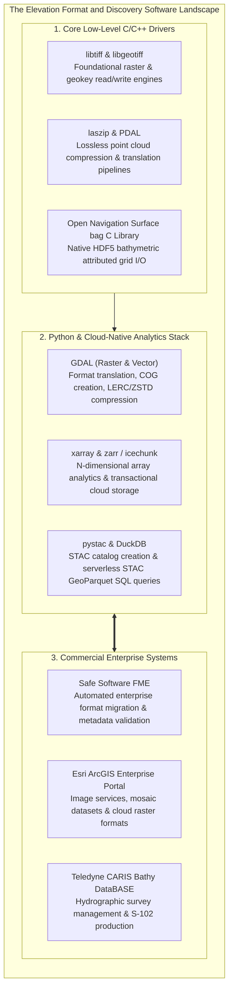

# Chapter 19: Key File Formats, Metadata, Archiving, and Data Discovery (STAC & Beyond)

*How elevation data is encoded on disk and in the cloud, documented for posterity, discovered via modern catalogs, and preserved across decades.*

---

## 19.7 Software Ecosystem for Formats, Discovery, and Archiving

The software ecosystem managing elevation data formats spans low-level C libraries, command-line translators, Python multidimensional array engines, and enterprise hydrographic database suites.



---

### 19.7.1 Open-Source Tools and Pipelines

#### Fast STAC GeoParquet Querying with DuckDB
With the standardization of STAC GeoParquet, searching millions of cloud-optimized elevation models across global cloud storage requires only a standard SQL client:

```python
"""Querying Global LiDAR and DEM Assets using DuckDB and STAC GeoParquet."""

import duckdb

# Connect to in-memory DuckDB database and install spatial extensions
conn = duckdb.connect()
conn.execute("INSTALL spatial; LOAD spatial;")
conn.execute("INSTALL httpfs; LOAD httpfs;")

# Query California 3DEP 1m COGs within a bounding box
query = """
SELECT 
    id, 
    datetime, 
    "proj:epsg" AS epsg,
    assets->'elevation'->>'href' AS s3_cog_url
FROM read_parquet('s3://stac-geoparquet-registry/usgs_3dep_national.parquet')
WHERE ST_Intersects(geometry, ST_MakeEnvelope(-122.50, 37.70, -122.35, 37.85))
  AND "raster:bands"[1]->>'spatial_resolution' = '1.0'
LIMIT 10;
"""

df_scenes = conn.execute(query).df()
for _, row in df_scenes.iterrows():
  print(f"Scene: {row['id']} | EPSG: {row['epsg']} | URL: {row['s3_cog_url']}")
```

#### Multidimensional Array Processing with `xarray` and `zarr`
For continental-scale elevation models (such as global Copernicus 30m or GEBCO ocean bathymetry), data is managed as chunked multidimensional arrays:

```python
"""Accessing and Processing Chunked Elevation Arrays using xarray and Zarr."""

import xarray as xr

# Open a cloud-native Zarr elevation store directly from cloud object storage
ds = xr.open_zarr(
    "s3://copernicus-dem-zarr/copernicus_30m.zarr", consolidated=True
)

# Extract an elevation slice and compute regional statistics lazily via Dask
subset = ds["elevation"].sel(latitude=slice(38.0, 37.0), longitude=slice(-122.5, -121.5))
mean_elev = subset.mean().compute()
print(f"Mean Regional Elevation: {mean_elev.values:.2f} meters")
```

#### Converting Point Clouds to Cloud-Optimized Point Clouds (COPC) with PDAL
Transforming legacy uncompressed LAS or raw ASCII files into streaming COPC format:

```bash
# Convert raw LAS into Cloud-Optimized Point Cloud (COPC 1.0) with LAZ compression
pdal translate raw_flight_strip.las output_cloud.copc.laz \
    --writers.copc.forward=all \
    --writers.copc.a_srs="EPSG:6339"
```

---

### 19.7.2 Commercial and Enterprise Systems

#### Safe Software FME (Feature Manipulation Engine)
FME is the industry-standard geospatial ETL platform:
* **Format Migration:** Translates between conflicting military, CAD, and GIS formats (e.g., converting MicroStation `.dgn` bridge breaklines and AutoCAD `.dwg` contours into an OGC GeoPackage with explicit 3D elevations).
* **Automated Metadata Validation:** Runs automated validation workflows ensuring that incoming contractor DEMs comply strictly with ISO 19115-1 and USGS 3DEP metadata standards before ingestion into enterprise databases.

#### Esri ArcGIS Enterprise Portal and Image Server
* **Mosaic Datasets:** Dynamic enterprise raster catalogs that catalog thousands of individual GeoTIFF/COG tiles, applying on-the-fly orthorectification, datum shifts, and hillshading without duplicating underlying pixels.
* **Cloud Raster Format (CRF):** Esri's internal multi-threaded, tiled raster storage format optimized for parallel GPU cluster processing and deep learning inferencing.

#### Teledyne CARIS Bathy DataBASE
The enterprise hydrographic data management platform deployed across national hydrographic offices (NOAA, UKHO, Australian Hydrographic Office):
* **S-102 and BAG Production:** Manages petabytes of validated multibeam bathymetry, tracking lists, and uncertainty surfaces.
* **Dynamic Surface Compilation:** Combines historical smooth sheets, modern high-density multibeam, and satellite-derived bathymetry (SDB) into seamless navigation surfaces with automated shoal deconfliction.

---

### 19.7.3 Software Comparison Matrix

| Software / Library | License Model | Primary Format Strengths | Execution Environment | Key Role in Elevation Pipelines |
| :--- | :--- | :--- | :--- | :--- |
| **GDAL** | Open-Source (MIT/X) | GeoTIFF, COG, BAG, NetCDF, GeoPackage | CLI / C++ / Python API | Universal translation, pyramid creation, compression. |
| **PDAL** | Open-Source (BSD) | LAS, LAZ, COPC, E57, EPT | CLI / C++ / Python API | 3D point cloud filtering, indexing, and COPC creation. |
| **DuckDB** | Open-Source (MIT) | STAC GeoParquet, Parquet, GeoPackage | In-process SQL engine | Fast spatial catalog querying across millions of scenes. |
| **`xarray` / `zarr`** | Open-Source (Apache/MIT)| Zarr, NetCDF, OpenND | Python / Dask | Distributed cloud-native multidimensional array analysis. |
| **IceChunk** | Open-Source (Apache 2.0)| Transactional Zarr Array Store | Rust / Python | ACID-compliant version control for massive DEM stores. |
| **Safe FME** | Commercial (Safe) | 450+ CAD/BIM/GIS formats | Desktop / Enterprise Server | Multi-format ETL, CAD-to-GIS breakline conversion. |
| **ArcGIS Enterprise** | Commercial (Esri) | CRF, Mosaic Dataset, COG | Enterprise Cloud Server | Dynamic image services, web mapping, geoprocessing. |
| **CARIS Bathy DataBASE**| Commercial (Teledyne) | BAG, VR-BAG, S-102, GSF | Enterprise Desktop / Server | Hydrographic data validation, S-102 chart compilation. |
