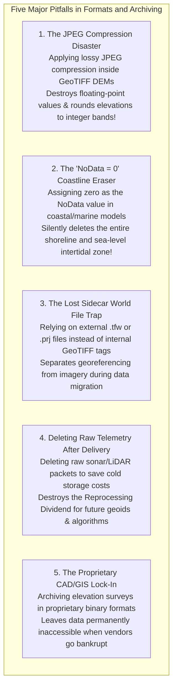

# Chapter 19: Key File Formats, Metadata, Archiving, and Data Discovery (STAC & Beyond)

*How elevation data is encoded on disk and in the cloud, documented for posterity, discovered via modern catalogs, and preserved across decades.*

---

## 19.8 Common Pitfalls and Key Takeaways

Formatting, archiving, and cataloging digital elevation models is full of traps that can silently corrupt elevation values, erase coastlines, or render multi-million-dollar datasets unreadable within a decade. Mastering these failure modes ensures that elevation data remains accurate, accessible, and durable.

---

### 19.8.1 Common Pitfalls in Formats, Metadata, and Archiving

#### 1. The JPEG Compression Disaster in Elevation Rasters
Applying JPEG compression inside a GeoTIFF container (e.g., using `gdal_translate -co COMPRESS=JPEG`):
* JPEG was designed exclusively for human visual perception of 8-bit photographic imagery. It only supports 8-bit or 12-bit unsigned integers.
* When applied to elevation data, GDAL is forced to truncate floating-point elevations into 256 discrete integer steps, completely destroying vertical precision.
* Worse, the lossy Discrete Cosine Transform (DCT) introduces high-frequency "mosquito noise" ringing artifacts around edges, creating false terraces and artificial elevation spikes.
* **Remedy:** **NEVER use JPEG compression for elevation data.** Always use lossless **DEFLATE**, **ZSTD (with `PREDICTOR=3`)**, or bounded-error **LERC**.

#### 2. The "NoData = 0" Coastline Eraser
A frequent blunder in coastal and bathymetric raster production is setting the null value to zero (`NoData = 0` or `NODATA = 0.0`):
* In coastal modeling, elevation $z = 0.00\text{ m}$ is the **most critical physical zone on the planet**: it defines the Mean Sea Level shoreline, the tidal intertidal boundary, and the zero contour!
* If `NoData = 0`, every GIS and web mapping application treats the real, measured shoreline as transparent missing data.
* Coastal dunes, barrier island beaches, and shallow mudflats vanish from the display.
* **Remedy:** Always assign standard, distinct out-of-range NoData values: **`-9999.0`** or IEEE 754 **`NaN`** (Not-a-Number) for `Float32` rasters.

#### 3. The Lost Sidecar File Trap (`.tfw` and `.prj`)
Relying on external "world files" (`.tfw`, `.jgw`) and projection text files (`.prj`) to georeference imagery:
* During cloud transfers, database migrations, or email attachments, sidecar files are routinely forgotten, renamed, or stripped.
* The GeoTIFF becomes an unreferenced, floating matrix of pixels located at $(0, 0)$.
* **Remedy:** Always embed projection, geotransform, and datum metadata **directly inside the TIFF file header tags** using `libgeotiff` and WKT2 strings.

#### 4. Discarding Raw Telemetry to Save Storage
Municipalities and engineering firms routinely delete raw LiDAR point packets or raw multibeam acoustic records once the final gridded bare-earth DEM is approved, attempting to cut cold storage fees:
* This permanently destroys the **Reprocessing Dividend**.
* When NOAA or NGS releases an improved geoid model (e.g., GEOID18 or NAPGD2022), or when new machine learning filters are developed to extract bare ground beneath dense rainforests, the final raster cannot be updated.
* The agency is forced to spend hundreds of thousands of dollars re-flying the entire region from scratch.
* **Remedy:** Archive raw sensor packets, GNSS base files, and calibration logs in low-cost cold cloud storage (AWS Glacier, Google Cloud Archive).

#### 5. Archiving in Dongle-Locked Proprietary Formats
Storing hydrographic or engineering surveys in proprietary binary formats that require active commercial desktop licenses, USB hardware dongles, or obsolete operating systems (e.g., SGI IRIX, Windows XP):
* When the vendor is acquired, abandons the software line, or goes bankrupt, the files become permanently inaccessible digital stone tablets.
* **Remedy:** Archive strictly in open, documented, non-patented international standards: **Cloud-Optimized GeoTIFF (COG)**, **ASPRS LAZ / COPC**, **Open Navigation Surface BAG**, and **GeoParquet**.

---

### 19.8.2 Key Takeaways for Practitioners

1. **Standardize on Cloud-Native Geospatial Formats:**
   * Distribute gridded elevation models as **Cloud-Optimized GeoTIFFs (COGs)** with `Float32` precision, tiled internally, and compressed with `ZSTD` (`PREDICTOR=3`) or `LERC`.
   * Distribute 3D point clouds as **Cloud-Optimized Point Clouds (COPC)** to enable instant web streaming.
   * Distribute hydrographic bathymetry as **Bathymetric Attributed Grids (BAG)** or **IHO S-102** with paired elevation and uncertainty layers.
2. **Never Use Zero for NoData:** Always use `NaN` or `-9999` to preserve valid zero-elevation sea-level shorelines.
3. **Embed the Geodetic Anchor Internally:** Embed complete **OGC WKT2:2019** compound coordinate reference strings directly inside file headers to prevent datum ambiguity.
4. **Preserve Raw Telemetry for Future Generations:** Raw sensor streams and trajectory logs are irreplaceable physical observations. Retaining raw data allows future scientists to re-process historical surveys with superior geodetic and filtering algorithms.
5. **Make Data Discoverable with STAC and GeoParquet:** Document every dataset with complete STAC metadata and compile catalogs into STAC GeoParquet for serverless, millisecond-fast spatial querying.
