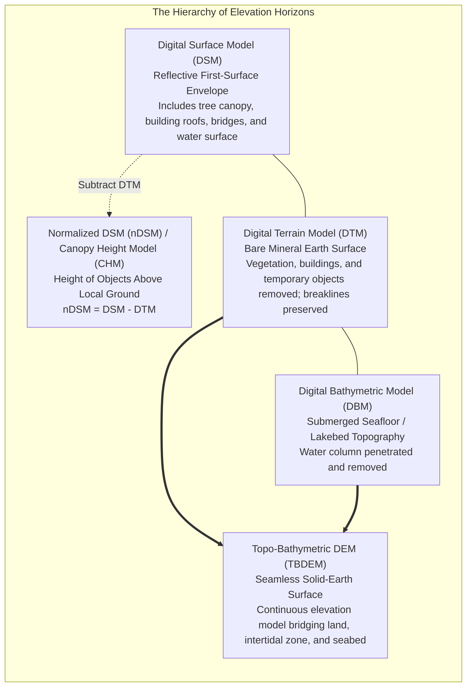
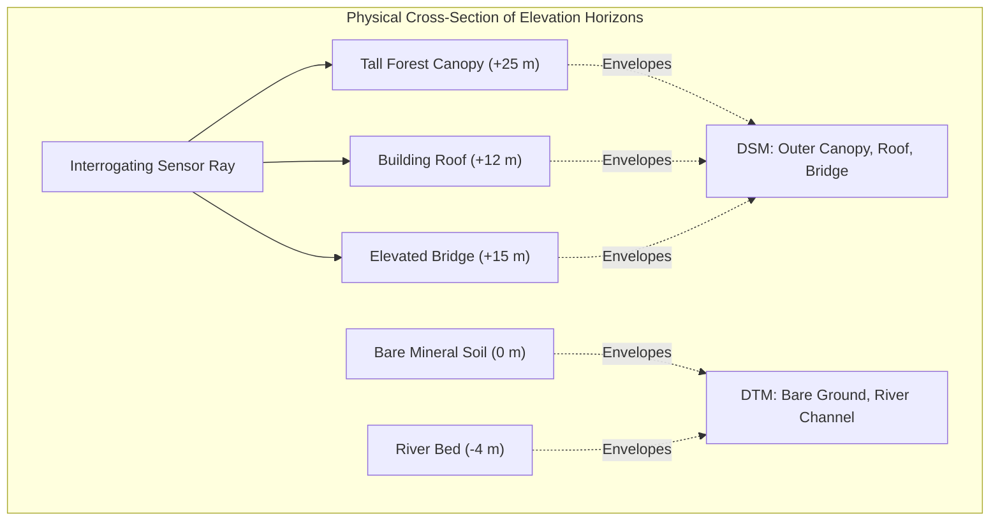

# Chapter 20: Naming, Ontologies, and the Confusing Definitions of Surface Objects

*What is "the ground"? What each DSM or DTM dataset includes or excludes, and the ontological grey zones of buildings, roads, bridges, pipes, wires, solar panels, and indoor space.*

Before an elevation model can be analyzed, users must understand what physical surface the numbers actually represent. In remote sensing and spatial modeling, the terminology surrounding elevation surfaces is plagued by conflicting definitions, shifting agency conventions, and semantic ambiguity. A dataset labeled simply as a "DEM" may represent the bare mineral earth, the outer canopy of an old-growth forest, the concrete decks of highway bridges, or an inconsistent mixture of all three. 

This chapter resolves the ontological confusion surrounding digital surface models, establishing formal definitions, classifying borderline structural objects, and exploring the breakdown of surface models when mapping complex infrastructure, powerlines, and subterranean spaces.

---

## 20.1 Naming and Definitions: The Alphabet Soup of Elevation Models

The geospatial profession uses an array of overlapping acronyms—DEM, DSM, DTM, nDSM, CHM, DBM, TBDEM—often assuming they are interchangeable synonyms. In reality, each term denotes a distinct physical horizon and mathematical surface model.

---

### 18.1.1 Deconstructing the Core Elevation Horizons

#### 1. DEM (Digital Elevation Model)
* **Generic International Usage:** The overarching umbrella term encompassing any digital, computer-based representation of topographic relief, whether structured as a regular raster grid, a Triangulated Irregular Network (TIN), or a point cloud.
* **Strict USGS / North American Convention:** In United States Geological Survey (USGS 3DEP) usage, a "DEM" refers specifically to a **regular raster grid of bare-earth elevations** (equivalent to a gridded DTM).

#### 2. DSM (Digital Surface Model)
The **Digital Surface Model (DSM)** captures the uppermost reflective envelope of the Earth's surface:
* Represents the first physical surface encountered by an interrogating sensor ray (the optical camera line of sight, the first return of an airborne LiDAR pulse, or the phase center of a high-frequency X-band InSAR radar beam).
* **Includes:** Tree canopy crowns, agricultural crops, residential and commercial building roofs, industrial storage tanks, electrical transmission towers, highway overpasses, bridges, moored ships, parked vehicles, and the instantaneous water surface.
* **Primary Applications:** Telecommunications radio-frequency line-of-sight analysis, aviation obstacle clearance, urban solar photovoltaic potential modeling, and True Orthophoto rectification.

#### 3. DTM (Digital Terrain Model)
The **Digital Terrain Model (DTM)** represents the bare mineral topography of the solid Earth:
* All vegetation (forests, orchards, brush, grass), human-made structures (houses, skyscrapers, bridges, storage tanks), and dynamic objects (vehicles, shipping containers) are completely filtered out and removed.
* **Breakline Augmentation:** In European and classical photogrammetric terminology, a DTM differs from a simple bare-earth raster because it explicitly incorporates **structural vector breaklines** (ridge crests, cliff edges, road curbs, and river thalwegs) to preserve sharp slope discontinuities.
* **Includes:** Bare mineral soil, rock outcrops, paved roads resting directly on ground grade, earthen levees, railway ballast, and riverbanks.
* **Primary Applications:** Civil infrastructure earthwork, geological fault scarp mapping, landslide hazard assessment, and hydrologic watershed delineation.

---

### 18.1.2 Derivative and Specialized Surface Models

#### 4. nDSM (Normalized DSM) / CHM (Canopy Height Model)
The **Normalized Digital Surface Model (nDSM)**—termed the **Canopy Height Model (CHM)** in forestry—isolates the height of above-ground surface objects above the local terrain:

$$\text{nDSM}(x, y) = \text{DSM}(x, y) - \text{DTM}(x, y)$$

* Where the Earth is bare mineral soil, $\text{nDSM} = 0.00\text{ m}$.
* Where a forest canopy exists, $\text{nDSM}$ directly measures tree height ($h_{\text{tree}}$).
* Where a skyscraper exists, $\text{nDSM}$ measures building height above street grade.
* **Forestry & Carbon Accounting:** Foresters integrate $\text{nDSM}$ grids with allometric biomass equations to estimate above-ground forest biomass and global carbon storage.

#### 5. DBM (Digital Bathymetric Model)
The **Digital Bathymetric Model (DBM)** represents the submerged topography of oceans, seas, estuaries, lakes, and rivers:
* The water column is penetrated (using green bathymetric LiDAR) or traversed (using acoustic multibeam sonars) and mathematically removed.
* **Sign Convention:** Historically in hydrography, bathymetry is recorded as **water depth positive downward** ($D \ge 0$). In modern unified geodetic systems, bathymetric elevations are expressed as negative values relative to the geodetic vertical datum ($Z \le 0$).

#### 6. TBDEM (Topo-Bathymetric Digital Elevation Model) / CUDEM
A **Topo-Bathymetric DEM (TBDEM)**—exemplified by NOAA's Continuously Updated Digital Elevation Model (CUDEM) program—is a seamless, unified elevation surface that spans the dynamic land-sea interface:
* Merges subaerial terrestrial LiDAR DTMs with submerged multibeam and topo-bathy green LiDAR bathymetry.
* Eliminates the historical "white ribbon" data gap across the intertidal zone.
* All elevations are transformed onto a single vertical datum (such as NAVD88 or the modern NAPGD2022 ellipsoid/geoid).
* **Primary Applications:** High-resolution storm surge modeling, tsunami inundation mapping, sea-level rise vulnerability analysis, and coastal sediment transport simulation.

---

### 18.1.3 Comparison Matrix of Elevation Products

| Elevation Model | Physical Surface Enveloped | Treatment of Buildings | Treatment of Trees | Treatment of Bridges | Vertical Reference |
| :--- | :--- | :--- | :--- | :--- | :--- |
| **DSM** | First-return reflective surface | **Preserved** (Roof elevation) | **Preserved** (Canopy top) | **Preserved** (Bridge deck) | Orthometric or Ellipsoidal |
| **DTM** | Bare mineral ground | **Removed** (Ground beneath) | **Removed** (Bare earth) | **Removed** (Ground beneath) | Orthometric or Ellipsoidal |
| **nDSM / CHM** | Relative object heights | **Building Height** | **Tree Canopy Height** | **Bridge Deck Height** | Relative Height ($z - z_{\text{ground}}$) |
| **DBM** | Submerged solid seabed/lakebed| N/A | Submerged Flora Filtered | Pier pilings preserved/removed| Hydrographic Chart Datum (MLLW/LAT) |
| **TBDEM** | Seamless Solid Earth across coast| **Removed** (Ground level) | **Removed** (Ground level) | Hydro-flattened / Breached | Unified Geodetic Datum (NAVD88/NAPGD2022) |
