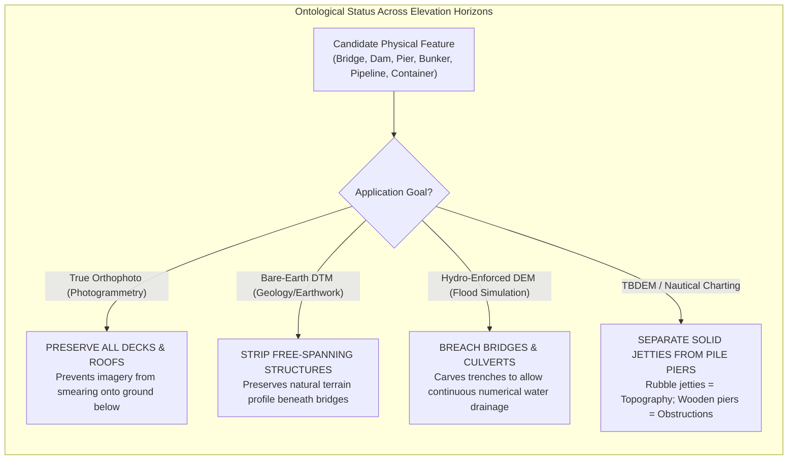
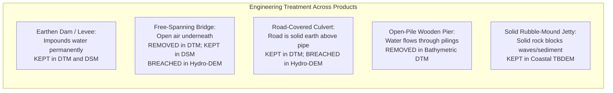

# Chapter 20: Naming, Ontologies, and the Confusing Definitions of Surface Objects

*What is "the ground"? What each DSM or DTM dataset includes or excludes, and the ontological grey zones of buildings, roads, bridges, pipes, wires, solar panels, and indoor space.*

---

## 20.2 The Confusing Definitions of Buildings, Roads, Bridges, and Civil Objects

When an automated algorithm or human technician classifies an elevation point cloud into "Ground" and "Non-Ground," they are making profound philosophical and engineering choices. What physical objects constitute "the ground"? Is a grassy sod roof on an underground bunker ground or building? Is an unpaved logging road across a bog ground? Is an elevated highway viaduct part of the bare earth? 

Failing to establish explicit ontological criteria across distinct applications—such as bare-earth DTMs, true orthophoto rectification, and flood modeling—creates severe dataset corruption.

---

### 20.2.1 What Is a "Building"? Ontological Grey Zones

In standard remote sensing textbooks, a building is defined as a permanent structure with walls and a roof. In the real world, built infrastructure spans a continuum of ambiguous structures:

| Candidate Structure | Physical Characteristics | DTM Treatment (Bare Earth) | DSM Treatment (Surface) | Rationale & Failure Mode |
| :--- | :--- | :--- | :--- | :--- |
| **Standard House / Skyscraper** | Solid exterior walls, permanent roof | **Removed** (Ground interpolated) | **Preserved** (Roof elevation) | Standard building classification. |
| **Sod-Roofed Bunker / Earth-Sheltered Home** | Soil and natural grass covering structural roof slab | **Ambiguous** (Often misclassified as ground) | **Preserved** (Top of sod) | If classified as ground, excavating for construction underestimates building presence. |
| **Greenhouses & Glass Atriums**| Transparent glass or polycarbonate panels | **Removed** (Ground beneath) | **Partial Dropout** | Infrared LiDAR ($1064\text{ nm}$) penetrates glass; returns reflect off internal floors/tables. |
| **Industrial Storage Tanks** | Cylindrical steel tanks on concrete pads | **Removed** | **Preserved** (Tank roof) | Critical for urban flood storage (tanks displace floodwater volume). |
| **Shipping Containers & Modular Trailers** | Movable steel cargo containers stacked $1\text{–}5$ high | **Removed** (Treated as non-ground) | **Preserved** | If classified as ground, temporary cargo stacks create phantom $15\text{-m}$ hills in port DEMs! |
| **Open Carports & Stadium Overhangs** | Cantilevered roofs supported by slender steel pillars | **Removed** (Pavement ground kept) | **Preserved** (Roof canopy) | 2.5D models cannot represent open parking bays underneath. |

---

### 20.2.2 What Is a "Road"?

Roadways represent the backbone of human mobility, but their physical construction dictates how they must be treated in elevation models:
* **At-Grade Paved Highways:** Paved directly on engineered subgrade. They are an integral part of the bare earth and are **KEPT in both DTM and DSM**.
* **Unpaved Logging Roads and Dirt Trails:** Cut into steep hillsides. They represent true topography (**KEPT in DTM**), but overhanging tree canopies often occlude the road surface from optical cameras, requiring high-density multi-return LiDAR to penetrate.
* **Elevated Causeways and Fill Embankments:** Earthen embankments built across wetlands. They are permanent earthen topography (**KEPT in DTM**), but act as artificial hydraulic dams unless culverts beneath them are hydro-enforced.
* **Multi-Deck Parking Garages:** Concrete structures with open levels. They are human-made structures (**REMOVED in DTM**, **KEPT in DSM**).

---

### 20.2.3 Bridges, Culverts, Dams, Pipes, and Coastal Structures

The classification of linear crossings, water-control barriers, and marine infrastructure requires strict operational rules:

#### 1. Earthen Dams and Levees
An earthen dam or flood-control levee is composed of compacted mineral earth, clay, and rock. It is a permanent geological feature that impounds water:
* **The Rule:** Dams and levees must be **strictly PRESERVED in both DTM and DSM**.
* **Failure Mode:** If an over-aggressive automated bare-earth filter mistakes a $10\text{-meter}$ levee for an artificial embankment and removes it, hydraulic flood models will falsely predict catastrophic levee breaches during low-flow river stages.

#### 2. Free-Spanning Bridges vs. Culverts
* **Free-Spanning Bridges:** Spans an open gap with a hollow air space between the deck and the valley/river floor.
  * In a **Bare-Earth DTM**, the bridge deck must be **REMOVED** so that continuous ground contours and natural stream valleys are mapped.
  * In a **True Orthophoto DSM**, the bridge deck must be **PRESERVED**; if removed, aerial imagery of the bridge deck will be warped and smeared across the riverbed below!
  * In a **Hydro-Enforced DEM**, the bridge deck must be **BREACHED** down to the river thalweg to allow numerical fluid to drain.
* **Culverts:** A rigid pipe or concrete box buried beneath a continuous earthen road embankment.
  * In a **Bare-Earth DTM**, the road embankment is physical ground and is **PRESERVED**.
  * In a **Hydro-Enforced DEM**, the embankment must be **BREACHED** (carving a virtual trench down to the culvert invert elevation) to prevent simulated water from damming into a phantom lake.

#### 3. Elevated Pipelines (e.g., Trans-Alaska Pipeline) and Industrial Racks
In oil refineries, chemical plants, and arctic permafrost pipelines:
* Pipelines are suspended $1\text{–}5\text{ m}$ above the ground on steel vertical support members (VSMs).
* **The Rule:** The pipeline must be classified as **Above-Ground Structure (REMOVED in DTM, PRESERVED in DSM)**. 
* If classified as ground, the pipeline appears as a continuous, narrow $3\text{-meter}$ ridge across hundreds of miles of wilderness, artificially blocking digital surface runoff.

#### 4. Coastal Piers vs. Solid-Fill Jetties
* **Open-Pile Piers:** Timber or concrete pilings driven into the seabed supporting an open wooden deck. Wave energy and tidal currents flow freely between the piles.
  * **The Rule:** In bathymetric surface models, open-pile piers must be **REMOVED** from the seabed DBM, but cataloged as navigation chart obstructions.
* **Solid-Fill Rubble-Mound Jetties and Breakwaters:** Massive barriers constructed from interlocking granite armor stones or concrete tetrapods.
  * **The Rule:** Solid jetties block sediment transport and water currents; they are an integral part of the coastal bathymetry and must be **PRESERVED in Topo-Bathymetric DEMs (TBDEM)**.
